cola Report for Hierarchical Partitioning - 'BuettnerESC'
==================

**Date**: 2021-07-26 10:30:35 CEST, **cola version**: 1.9.4

----------------------------------------------------------------

<style type='text/css'>

body, td, th {
   font-family: Arial,Helvetica,sans-serif;
   background-color: white;
   font-size: 13px;
  max-width: 800px;
  margin: auto;
  margin-left:210px;
  padding: 0px 10px 0px 10px;
  border-left: 1px solid #EEEEEE;
  line-height: 150%;
}

tt, code, pre {
   font-family: 'DejaVu Sans Mono', 'Droid Sans Mono', 'Lucida Console', Consolas, Monaco, 

monospace;
}

h1 {
   font-size:2.2em;
}

h2 {
   font-size:1.8em;
}

h3 {
   font-size:1.4em;
}

h4 {
   font-size:1.0em;
}

h5 {
   font-size:0.9em;
}

h6 {
   font-size:0.8em;
}

a {
  text-decoration: none;
  color: #0366d6;
}

a:hover {
  text-decoration: underline;
}

a:visited {
   color: #0366d6;
}

pre, img {
  max-width: 100%;
}
pre {
  overflow-x: auto;
}
pre code {
   display: block; padding: 0.5em;
}

code {
  font-size: 92%;
  border: 1px solid #ccc;
}

code[class] {
  background-color: #F8F8F8;
}

table, td, th {
  border: 1px solid #ccc;
}

blockquote {
   color:#666666;
   margin:0;
   padding-left: 1em;
   border-left: 0.5em #EEE solid;
}

hr {
   height: 0px;
   border-bottom: none;
   border-top-width: thin;
   border-top-style: dotted;
   border-top-color: #999999;
}

@media print {
   * {
      background: transparent !important;
      color: black !important;
      filter:none !important;
      -ms-filter: none !important;
   }

   body {
      font-size:12pt;
      max-width:100%;
   }

   a, a:visited {
      text-decoration: underline;
   }

   hr {
      visibility: hidden;
      page-break-before: always;
   }

   pre, blockquote {
      padding-right: 1em;
      page-break-inside: avoid;
   }

   tr, img {
      page-break-inside: avoid;
   }

   img {
      max-width: 100% !important;
   }

   @page :left {
      margin: 15mm 20mm 15mm 10mm;
   }

   @page :right {
      margin: 15mm 10mm 15mm 20mm;
   }

   p, h2, h3 {
      orphans: 3; widows: 3;
   }

   h2, h3 {
      page-break-after: avoid;
   }
}
</style>


## Summary


First the variable is renamed to `res_rh`.


```r
res_rh = rh
```


The partition hierarchy and all available functions which can be applied to `res_rh` object.


```r
res_rh
```

```
#> A 'HierarchicalPartition' object with 'ATC:skmeans' method.
#>   On a matrix with 15681 rows and 288 columns.
#>   Performed in total 2550 partitions.
#>   There are 10 groups under the following parameters:
#>     - min_samples: 6
#>     - mean_silhouette_cutoff: 0.9
#>     - min_n_signatures: 330 (signatures are selected based on:)
#>       - fdr_cutoff: 0.05
#>       - group_diff (scaled values): 0.5
#> 
#> Hierarchy of the partition:
#>   0, 288 cols
#>   |-- 01, 165 cols, 4525 signatures
#>   |   |-- 011, 64 cols, 696 signatures
#>   |   |   |-- 0111, 34 cols, 13 signatures (c)
#>   |   |   `-- 0112, 30 cols, 76 signatures (c)
#>   |   |-- 012, 63 cols, 441 signatures
#>   |   |   |-- 0121, 32 cols (a)
#>   |   |   `-- 0122, 31 cols, 4 signatures (c)
#>   |   `-- 013, 38 cols, 6 signatures (c)
#>   `-- 02, 123 cols, 10267 signatures
#>       |-- 021, 52 cols, 314 signatures (c)
#>       |-- 022, 33 cols, 5620 signatures
#>       |   |-- 0221, 15 cols, 2339 signatures
#>       |   |   |-- 02211, 9 cols (b)
#>       |   |   `-- 02212, 6 cols (b)
#>       |   `-- 0222, 18 cols (a)
#>       `-- 023, 38 cols, 80 signatures (c)
#> Stop reason:
#>   a) Mean silhouette score was too small
#>   b) Subgroup had too few columns.
#>   c) There were too few signatures.
#> 
#> Following methods can be applied to this 'HierarchicalPartition' object:
#>  [1] "all_leaves"            "all_nodes"             "cola_report"           "collect_classes"      
#>  [5] "colnames"              "compare_signatures"    "dimension_reduction"   "functional_enrichment"
#>  [9] "get_anno_col"          "get_anno"              "get_children_nodes"    "get_classes"          
#> [13] "get_matrix"            "get_signatures"        "is_leaf_node"          "max_depth"            
#> [17] "merge_node"            "ncol"                  "node_info"             "node_level"           
#> [21] "nrow"                  "rownames"              "show"                  "split_node"           
#> [25] "suggest_best_k"        "test_to_known_factors" "top_rows_heatmap"      "top_rows_overlap"     
#> 
#> You can get result for a single node by e.g. object["01"]
```

The call of `hierarchical_partition()` was:


```
#> hierarchical_partition(data = lt$mat, anno = lt$anno, subset = 500, cores = 4)
```

Dimension of the input matrix:


```r
mat = get_matrix(res_rh)
dim(mat)
```

```
#> [1] 15681   288
```

All the methods that were tried:


```r
res_rh@param$combination_method
```

```
#> [[1]]
#> [1] "ATC"     "skmeans"
```

### Density distribution

The density distribution for each sample is visualized as one column in the following heatmap.
The clustering is based on the distance which is the Kolmogorov-Smirnov statistic between two distributions.


```r
library(ComplexHeatmap)
densityHeatmap(mat, ylab = "value", cluster_columns = TRUE, show_column_names = FALSE,
    mc.cores = 1)
```

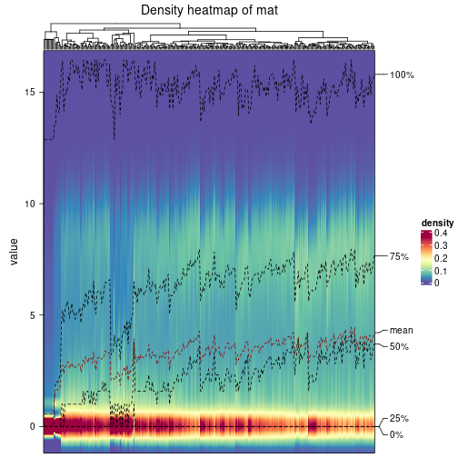


Some values about the hierarchy:


```r
all_nodes(res_rh)
```

```
#>  [1] "0"     "01"    "011"   "0111"  "0112"  "012"   "0121"  "0122"  "013"   "02"    "021"   "022"  
#> [13] "0221"  "02211" "02212" "0222"  "023"
```

```r
all_leaves(res_rh)
```

```
#>  [1] "0111"  "0112"  "0121"  "0122"  "013"   "021"   "02211" "02212" "0222"  "023"
```

```r
node_info(res_rh)
```

```
#>       id best_method depth best_k n_columns n_signatures p_signatures is_leaf
#> 1      0 ATC:skmeans     1      2       288         6601     0.420955   FALSE
#> 2     01 ATC:skmeans     2      3       165         4525     0.288566   FALSE
#> 3    011 ATC:skmeans     3      2        64          696     0.044385   FALSE
#> 4   0111 ATC:skmeans     4      2        34           13     0.000829    TRUE
#> 5   0112 ATC:skmeans     4      3        30           76     0.004847    TRUE
#> 6    012 ATC:skmeans     3      2        63          441     0.028123   FALSE
#> 7   0121 ATC:skmeans     4      2        32           NA           NA    TRUE
#> 8   0122 ATC:skmeans     4      2        31            4     0.000255    TRUE
#> 9    013 ATC:skmeans     3      2        38            6     0.000383    TRUE
#> 10    02 ATC:skmeans     2      3       123        10267     0.654741   FALSE
#> 11   021 ATC:skmeans     3      3        52          314     0.020024    TRUE
#> 12   022 ATC:skmeans     3      2        33         5620     0.358396   FALSE
#> 13  0221 ATC:skmeans     4      2        15         2339     0.149161   FALSE
#> 14 02211 not applied     5     NA         9           NA           NA    TRUE
#> 15 02212 not applied     5     NA         6           NA           NA    TRUE
#> 16  0222 ATC:skmeans     4      2        18           NA           NA    TRUE
#> 17   023 ATC:skmeans     3      3        38           80     0.005102    TRUE
```

In the output from `node_info()`, there are the following columns:

- `id`: The node id.
- `best_method`: The best method selected.
- `depth`: Depth of the node in the hierarchy.
- `best_k`: Best number of groups of the partition on that node.
- `n_columns`: Number of columns in the submatrix.
- `n_signatures`: Number of signatures with the `best_k`.
- `p_signatures`: Proportion of hte signatures in total number of rows in the matrix.
- `is_leaf`: Whether the node is a leaf.

Labels of nodes are encoded in a special way. The number of digits
correspond to the depth of the node in the hierarchy and the value of the
digits correspond to the index of the subgroup in the current node, E.g. a label
of “012” means the node is the second subgroup of the partition which is the
first subgroup of the root node.

### Suggest the best k


Following table shows the best `k` (number of partitions) for each node in the
partition hierarchy. Clicking on the node name in the table goes to the
corresponding section for the partitioning on that node.

[The cola vignette](https://jokergoo.github.io/cola_vignettes/cola.html#toc_13)
explains the definition of the metrics used for determining the best
number of partitions.


```r
suggest_best_k(res_rh)
```


|Node                  |Best method                                         |Is leaf   |Best k |1-PAC |Mean silhouette |Concordance | #samples|   |
|:---------------------|:---------------------------------------------------|:---------|:------|:-----|:---------------|:-----------|--------:|:--|
|[Node0](#Node0)       |ATC:skmeans                                         |          |2      |1.00  |0.98            |0.99        |      288|** |
|[Node01](#Node01)     |ATC:skmeans                                         |          |4      |0.93  |0.91            |0.96        |      165|*  |
|[Node011](#Node011)   |ATC:skmeans                                         |          |3      |0.90  |0.88            |0.95        |       64|*  |
|Node0111-leaf         |ATC:skmeans                                         |✓ (&#99;) |2      |0.88  |0.92            |0.97        |       34|   |
|Node0112-leaf         |ATC:skmeans                                         |✓ (&#99;) |3      |1.00  |0.96            |0.98        |       30|** |
|[Node012](#Node012)   |ATC:skmeans                                         |          |2      |1.00  |0.98            |0.99        |       63|** |
|Node0121-leaf         |ATC:skmeans                                         |✓ (a)     |2      |0.51  |0.87            |0.92        |       32|   |
|Node0122-leaf         |ATC:skmeans                                         |✓ (&#99;) |2      |1.00  |0.97            |0.99        |       31|** |
|Node013-leaf          |ATC:skmeans                                         |✓ (&#99;) |2      |1.00  |0.96            |0.98        |       38|** |
|[Node02](#Node02)     |ATC:skmeans                                         |          |3      |1.00  |1.00            |1.00        |      123|** |
|Node021-leaf          |ATC:skmeans                                         |✓ (&#99;) |3      |0.92  |0.91            |0.96        |       52|*  |
|[Node022](#Node022)   |ATC:skmeans                                         |          |3      |1.00  |0.95            |0.98        |       33|** |
|[Node0221](#Node0221) |ATC:skmeans                                         |          |2      |1.00  |1.00            |1.00        |       15|** |
|Node02211-leaf        |<span style='color:grey;'><i>not applied</i></span> |✓ (b)     |       |      |                |            |        9|   |
|Node02212-leaf        |<span style='color:grey;'><i>not applied</i></span> |✓ (b)     |       |      |                |            |        6|   |
|Node0222-leaf         |ATC:skmeans                                         |✓ (a)     |2      |0.63  |0.79            |0.91        |       18|   |
|Node023-leaf          |ATC:skmeans                                         |✓ (&#99;) |3      |1.00  |0.98            |0.99        |       38|** |


Stop reason: a) Mean silhouette score was too small b) Subgroup had too few columns. c) There were too few signatures. 

\*\*: 1-PAC > 0.95, \*: 1-PAC > 0.9


### Partition hierarchy

The nodes of the hierarchy can be merged by setting the `merge_node` parameters. Here we 
control the hierarchy with the `min_n_signatures` parameter. The value of `min_n_signatures` is
from `node_info()`.


<style type='text/css'>


.ui-helper-hidden {
	display: none;
}
.ui-helper-hidden-accessible {
	border: 0;
	clip: rect(0 0 0 0);
	height: 1px;
	margin: -1px;
	overflow: hidden;
	padding: 0;
	position: absolute;
	width: 1px;
}
.ui-helper-reset {
	margin: 0;
	padding: 0;
	border: 0;
	outline: 0;
	line-height: 1.3;
	text-decoration: none;
	font-size: 100%;
	list-style: none;
}
.ui-helper-clearfix:before,
.ui-helper-clearfix:after {
	content: "";
	display: table;
	border-collapse: collapse;
}
.ui-helper-clearfix:after {
	clear: both;
}
.ui-helper-zfix {
	width: 100%;
	height: 100%;
	top: 0;
	left: 0;
	position: absolute;
	opacity: 0;
	filter:Alpha(Opacity=0); 
}

.ui-front {
	z-index: 100;
}


.ui-state-disabled {
	cursor: default !important;
	pointer-events: none;
}


.ui-icon {
	display: inline-block;
	vertical-align: middle;
	margin-top: -.25em;
	position: relative;
	text-indent: -99999px;
	overflow: hidden;
	background-repeat: no-repeat;
}

.ui-widget-icon-block {
	left: 50%;
	margin-left: -8px;
	display: block;
}


.ui-widget-overlay {
	position: fixed;
	top: 0;
	left: 0;
	width: 100%;
	height: 100%;
}
.ui-accordion .ui-accordion-header {
	display: block;
	cursor: pointer;
	position: relative;
	margin: 2px 0 0 0;
	padding: .5em .5em .5em .7em;
	font-size: 100%;
}
.ui-accordion .ui-accordion-content {
	padding: 1em 2.2em;
	border-top: 0;
	overflow: auto;
}
.ui-autocomplete {
	position: absolute;
	top: 0;
	left: 0;
	cursor: default;
}
.ui-menu {
	list-style: none;
	padding: 0;
	margin: 0;
	display: block;
	outline: 0;
}
.ui-menu .ui-menu {
	position: absolute;
}
.ui-menu .ui-menu-item {
	margin: 0;
	cursor: pointer;
	
	list-style-image: url("data:image/gif;base64,R0lGODlhAQABAIAAAAAAAP///yH5BAEAAAAALAAAAAABAAEAAAIBRAA7");
}
.ui-menu .ui-menu-item-wrapper {
	position: relative;
	padding: 3px 1em 3px .4em;
}
.ui-menu .ui-menu-divider {
	margin: 5px 0;
	height: 0;
	font-size: 0;
	line-height: 0;
	border-width: 1px 0 0 0;
}
.ui-menu .ui-state-focus,
.ui-menu .ui-state-active {
	margin: -1px;
}


.ui-menu-icons {
	position: relative;
}
.ui-menu-icons .ui-menu-item-wrapper {
	padding-left: 2em;
}


.ui-menu .ui-icon {
	position: absolute;
	top: 0;
	bottom: 0;
	left: .2em;
	margin: auto 0;
}


.ui-menu .ui-menu-icon {
	left: auto;
	right: 0;
}
.ui-button {
	padding: .4em 1em;
	display: inline-block;
	position: relative;
	line-height: normal;
	margin-right: .1em;
	cursor: pointer;
	vertical-align: middle;
	text-align: center;
	-webkit-user-select: none;
	-moz-user-select: none;
	-ms-user-select: none;
	user-select: none;

	
	overflow: visible;
}

.ui-button,
.ui-button:link,
.ui-button:visited,
.ui-button:hover,
.ui-button:active {
	text-decoration: none;
}


.ui-button-icon-only {
	width: 2em;
	box-sizing: border-box;
	text-indent: -9999px;
	white-space: nowrap;
}


input.ui-button.ui-button-icon-only {
	text-indent: 0;
}


.ui-button-icon-only .ui-icon {
	position: absolute;
	top: 50%;
	left: 50%;
	margin-top: -8px;
	margin-left: -8px;
}

.ui-button.ui-icon-notext .ui-icon {
	padding: 0;
	width: 2.1em;
	height: 2.1em;
	text-indent: -9999px;
	white-space: nowrap;

}

input.ui-button.ui-icon-notext .ui-icon {
	width: auto;
	height: auto;
	text-indent: 0;
	white-space: normal;
	padding: .4em 1em;
}


input.ui-button::-moz-focus-inner,
button.ui-button::-moz-focus-inner {
	border: 0;
	padding: 0;
}
.ui-controlgroup {
	vertical-align: middle;
	display: inline-block;
}
.ui-controlgroup > .ui-controlgroup-item {
	float: left;
	margin-left: 0;
	margin-right: 0;
}
.ui-controlgroup > .ui-controlgroup-item:focus,
.ui-controlgroup > .ui-controlgroup-item.ui-visual-focus {
	z-index: 9999;
}
.ui-controlgroup-vertical > .ui-controlgroup-item {
	display: block;
	float: none;
	width: 100%;
	margin-top: 0;
	margin-bottom: 0;
	text-align: left;
}
.ui-controlgroup-vertical .ui-controlgroup-item {
	box-sizing: border-box;
}
.ui-controlgroup .ui-controlgroup-label {
	padding: .4em 1em;
}
.ui-controlgroup .ui-controlgroup-label span {
	font-size: 80%;
}
.ui-controlgroup-horizontal .ui-controlgroup-label + .ui-controlgroup-item {
	border-left: none;
}
.ui-controlgroup-vertical .ui-controlgroup-label + .ui-controlgroup-item {
	border-top: none;
}
.ui-controlgroup-horizontal .ui-controlgroup-label.ui-widget-content {
	border-right: none;
}
.ui-controlgroup-vertical .ui-controlgroup-label.ui-widget-content {
	border-bottom: none;
}


.ui-controlgroup-vertical .ui-spinner-input {

	
	width: 75%;
	width: calc( 100% - 2.4em );
}
.ui-controlgroup-vertical .ui-spinner .ui-spinner-up {
	border-top-style: solid;
}

.ui-checkboxradio-label .ui-icon-background {
	box-shadow: inset 1px 1px 1px #ccc;
	border-radius: .12em;
	border: none;
}
.ui-checkboxradio-radio-label .ui-icon-background {
	width: 16px;
	height: 16px;
	border-radius: 1em;
	overflow: visible;
	border: none;
}
.ui-checkboxradio-radio-label.ui-checkboxradio-checked .ui-icon,
.ui-checkboxradio-radio-label.ui-checkboxradio-checked:hover .ui-icon {
	background-image: none;
	width: 8px;
	height: 8px;
	border-width: 4px;
	border-style: solid;
}
.ui-checkboxradio-disabled {
	pointer-events: none;
}
.ui-datepicker {
	width: 17em;
	padding: .2em .2em 0;
	display: none;
}
.ui-datepicker .ui-datepicker-header {
	position: relative;
	padding: .2em 0;
}
.ui-datepicker .ui-datepicker-prev,
.ui-datepicker .ui-datepicker-next {
	position: absolute;
	top: 2px;
	width: 1.8em;
	height: 1.8em;
}
.ui-datepicker .ui-datepicker-prev-hover,
.ui-datepicker .ui-datepicker-next-hover {
	top: 1px;
}
.ui-datepicker .ui-datepicker-prev {
	left: 2px;
}
.ui-datepicker .ui-datepicker-next {
	right: 2px;
}
.ui-datepicker .ui-datepicker-prev-hover {
	left: 1px;
}
.ui-datepicker .ui-datepicker-next-hover {
	right: 1px;
}
.ui-datepicker .ui-datepicker-prev span,
.ui-datepicker .ui-datepicker-next span {
	display: block;
	position: absolute;
	left: 50%;
	margin-left: -8px;
	top: 50%;
	margin-top: -8px;
}
.ui-datepicker .ui-datepicker-title {
	margin: 0 2.3em;
	line-height: 1.8em;
	text-align: center;
}
.ui-datepicker .ui-datepicker-title select {
	font-size: 1em;
	margin: 1px 0;
}
.ui-datepicker select.ui-datepicker-month,
.ui-datepicker select.ui-datepicker-year {
	width: 45%;
}
.ui-datepicker table {
	width: 100%;
	font-size: .9em;
	border-collapse: collapse;
	margin: 0 0 .4em;
}
.ui-datepicker th {
	padding: .7em .3em;
	text-align: center;
	font-weight: bold;
	border: 0;
}
.ui-datepicker td {
	border: 0;
	padding: 1px;
}
.ui-datepicker td span,
.ui-datepicker td a {
	display: block;
	padding: .2em;
	text-align: right;
	text-decoration: none;
}
.ui-datepicker .ui-datepicker-buttonpane {
	background-image: none;
	margin: .7em 0 0 0;
	padding: 0 .2em;
	border-left: 0;
	border-right: 0;
	border-bottom: 0;
}
.ui-datepicker .ui-datepicker-buttonpane button {
	float: right;
	margin: .5em .2em .4em;
	cursor: pointer;
	padding: .2em .6em .3em .6em;
	width: auto;
	overflow: visible;
}
.ui-datepicker .ui-datepicker-buttonpane button.ui-datepicker-current {
	float: left;
}


.ui-datepicker.ui-datepicker-multi {
	width: auto;
}
.ui-datepicker-multi .ui-datepicker-group {
	float: left;
}
.ui-datepicker-multi .ui-datepicker-group table {
	width: 95%;
	margin: 0 auto .4em;
}
.ui-datepicker-multi-2 .ui-datepicker-group {
	width: 50%;
}
.ui-datepicker-multi-3 .ui-datepicker-group {
	width: 33.3%;
}
.ui-datepicker-multi-4 .ui-datepicker-group {
	width: 25%;
}
.ui-datepicker-multi .ui-datepicker-group-last .ui-datepicker-header,
.ui-datepicker-multi .ui-datepicker-group-middle .ui-datepicker-header {
	border-left-width: 0;
}
.ui-datepicker-multi .ui-datepicker-buttonpane {
	clear: left;
}
.ui-datepicker-row-break {
	clear: both;
	width: 100%;
	font-size: 0;
}


.ui-datepicker-rtl {
	direction: rtl;
}
.ui-datepicker-rtl .ui-datepicker-prev {
	right: 2px;
	left: auto;
}
.ui-datepicker-rtl .ui-datepicker-next {
	left: 2px;
	right: auto;
}
.ui-datepicker-rtl .ui-datepicker-prev:hover {
	right: 1px;
	left: auto;
}
.ui-datepicker-rtl .ui-datepicker-next:hover {
	left: 1px;
	right: auto;
}
.ui-datepicker-rtl .ui-datepicker-buttonpane {
	clear: right;
}
.ui-datepicker-rtl .ui-datepicker-buttonpane button {
	float: left;
}
.ui-datepicker-rtl .ui-datepicker-buttonpane button.ui-datepicker-current,
.ui-datepicker-rtl .ui-datepicker-group {
	float: right;
}
.ui-datepicker-rtl .ui-datepicker-group-last .ui-datepicker-header,
.ui-datepicker-rtl .ui-datepicker-group-middle .ui-datepicker-header {
	border-right-width: 0;
	border-left-width: 1px;
}


.ui-datepicker .ui-icon {
	display: block;
	text-indent: -99999px;
	overflow: hidden;
	background-repeat: no-repeat;
	left: .5em;
	top: .3em;
}
.ui-dialog {
	position: absolute;
	top: 0;
	left: 0;
	padding: .2em;
	outline: 0;
}
.ui-dialog .ui-dialog-titlebar {
	padding: .4em 1em;
	position: relative;
}
.ui-dialog .ui-dialog-title {
	float: left;
	margin: .1em 0;
	white-space: nowrap;
	width: 90%;
	overflow: hidden;
	text-overflow: ellipsis;
}
.ui-dialog .ui-dialog-titlebar-close {
	position: absolute;
	right: .3em;
	top: 50%;
	width: 20px;
	margin: -10px 0 0 0;
	padding: 1px;
	height: 20px;
}
.ui-dialog .ui-dialog-content {
	position: relative;
	border: 0;
	padding: .5em 1em;
	background: none;
	overflow: auto;
}
.ui-dialog .ui-dialog-buttonpane {
	text-align: left;
	border-width: 1px 0 0 0;
	background-image: none;
	margin-top: .5em;
	padding: .3em 1em .5em .4em;
}
.ui-dialog .ui-dialog-buttonpane .ui-dialog-buttonset {
	float: right;
}
.ui-dialog .ui-dialog-buttonpane button {
	margin: .5em .4em .5em 0;
	cursor: pointer;
}
.ui-dialog .ui-resizable-n {
	height: 2px;
	top: 0;
}
.ui-dialog .ui-resizable-e {
	width: 2px;
	right: 0;
}
.ui-dialog .ui-resizable-s {
	height: 2px;
	bottom: 0;
}
.ui-dialog .ui-resizable-w {
	width: 2px;
	left: 0;
}
.ui-dialog .ui-resizable-se,
.ui-dialog .ui-resizable-sw,
.ui-dialog .ui-resizable-ne,
.ui-dialog .ui-resizable-nw {
	width: 7px;
	height: 7px;
}
.ui-dialog .ui-resizable-se {
	right: 0;
	bottom: 0;
}
.ui-dialog .ui-resizable-sw {
	left: 0;
	bottom: 0;
}
.ui-dialog .ui-resizable-ne {
	right: 0;
	top: 0;
}
.ui-dialog .ui-resizable-nw {
	left: 0;
	top: 0;
}
.ui-draggable .ui-dialog-titlebar {
	cursor: move;
}
.ui-draggable-handle {
	-ms-touch-action: none;
	touch-action: none;
}
.ui-resizable {
	position: relative;
}
.ui-resizable-handle {
	position: absolute;
	font-size: 0.1px;
	display: block;
	-ms-touch-action: none;
	touch-action: none;
}
.ui-resizable-disabled .ui-resizable-handle,
.ui-resizable-autohide .ui-resizable-handle {
	display: none;
}
.ui-resizable-n {
	cursor: n-resize;
	height: 7px;
	width: 100%;
	top: -5px;
	left: 0;
}
.ui-resizable-s {
	cursor: s-resize;
	height: 7px;
	width: 100%;
	bottom: -5px;
	left: 0;
}
.ui-resizable-e {
	cursor: e-resize;
	width: 7px;
	right: -5px;
	top: 0;
	height: 100%;
}
.ui-resizable-w {
	cursor: w-resize;
	width: 7px;
	left: -5px;
	top: 0;
	height: 100%;
}
.ui-resizable-se {
	cursor: se-resize;
	width: 12px;
	height: 12px;
	right: 1px;
	bottom: 1px;
}
.ui-resizable-sw {
	cursor: sw-resize;
	width: 9px;
	height: 9px;
	left: -5px;
	bottom: -5px;
}
.ui-resizable-nw {
	cursor: nw-resize;
	width: 9px;
	height: 9px;
	left: -5px;
	top: -5px;
}
.ui-resizable-ne {
	cursor: ne-resize;
	width: 9px;
	height: 9px;
	right: -5px;
	top: -5px;
}
.ui-progressbar {
	height: 2em;
	text-align: left;
	overflow: hidden;
}
.ui-progressbar .ui-progressbar-value {
	margin: -1px;
	height: 100%;
}
.ui-progressbar .ui-progressbar-overlay {
	background: url("");
	height: 100%;
	filter: alpha(opacity=25); 
	opacity: 0.25;
}
.ui-progressbar-indeterminate .ui-progressbar-value {
	background-image: none;
}
.ui-selectable {
	-ms-touch-action: none;
	touch-action: none;
}
.ui-selectable-helper {
	position: absolute;
	z-index: 100;
	border: 1px dotted black;
}
.ui-selectmenu-menu {
	padding: 0;
	margin: 0;
	position: absolute;
	top: 0;
	left: 0;
	display: none;
}
.ui-selectmenu-menu .ui-menu {
	overflow: auto;
	overflow-x: hidden;
	padding-bottom: 1px;
}
.ui-selectmenu-menu .ui-menu .ui-selectmenu-optgroup {
	font-size: 1em;
	font-weight: bold;
	line-height: 1.5;
	padding: 2px 0.4em;
	margin: 0.5em 0 0 0;
	height: auto;
	border: 0;
}
.ui-selectmenu-open {
	display: block;
}
.ui-selectmenu-text {
	display: block;
	margin-right: 20px;
	overflow: hidden;
	text-overflow: ellipsis;
}
.ui-selectmenu-button.ui-button {
	text-align: left;
	white-space: nowrap;
	width: 14em;
}
.ui-selectmenu-icon.ui-icon {
	float: right;
	margin-top: 0;
}
.ui-slider {
	position: relative;
	text-align: left;
}
.ui-slider .ui-slider-handle {
	position: absolute;
	z-index: 2;
	width: 1.2em;
	height: 1.2em;
	cursor: default;
	-ms-touch-action: none;
	touch-action: none;
}
.ui-slider .ui-slider-range {
	position: absolute;
	z-index: 1;
	font-size: .7em;
	display: block;
	border: 0;
	background-position: 0 0;
}


.ui-slider.ui-state-disabled .ui-slider-handle,
.ui-slider.ui-state-disabled .ui-slider-range {
	filter: inherit;
}

.ui-slider-horizontal {
	height: .8em;
}
.ui-slider-horizontal .ui-slider-handle {
	top: -.3em;
	margin-left: -.6em;
}
.ui-slider-horizontal .ui-slider-range {
	top: 0;
	height: 100%;
}
.ui-slider-horizontal .ui-slider-range-min {
	left: 0;
}
.ui-slider-horizontal .ui-slider-range-max {
	right: 0;
}

.ui-slider-vertical {
	width: .8em;
	height: 100px;
}
.ui-slider-vertical .ui-slider-handle {
	left: -.3em;
	margin-left: 0;
	margin-bottom: -.6em;
}
.ui-slider-vertical .ui-slider-range {
	left: 0;
	width: 100%;
}
.ui-slider-vertical .ui-slider-range-min {
	bottom: 0;
}
.ui-slider-vertical .ui-slider-range-max {
	top: 0;
}
.ui-sortable-handle {
	-ms-touch-action: none;
	touch-action: none;
}
.ui-spinner {
	position: relative;
	display: inline-block;
	overflow: hidden;
	padding: 0;
	vertical-align: middle;
}
.ui-spinner-input {
	border: none;
	background: none;
	color: inherit;
	padding: .222em 0;
	margin: .2em 0;
	vertical-align: middle;
	margin-left: .4em;
	margin-right: 2em;
}
.ui-spinner-button {
	width: 1.6em;
	height: 50%;
	font-size: .5em;
	padding: 0;
	margin: 0;
	text-align: center;
	position: absolute;
	cursor: default;
	display: block;
	overflow: hidden;
	right: 0;
}

.ui-spinner a.ui-spinner-button {
	border-top-style: none;
	border-bottom-style: none;
	border-right-style: none;
}
.ui-spinner-up {
	top: 0;
}
.ui-spinner-down {
	bottom: 0;
}
.ui-tabs {
	position: relative;
	padding: .2em;
}
.ui-tabs .ui-tabs-nav {
	margin: 0;
	padding: .2em .2em 0;
}
.ui-tabs .ui-tabs-nav li {
	list-style: none;
	float: left;
	position: relative;
	top: 0;
	margin: 1px .2em 0 0;
	border-bottom-width: 0;
	padding: 0;
	white-space: nowrap;
}
.ui-tabs .ui-tabs-nav .ui-tabs-anchor {
	float: left;
	padding: .5em 1em;
	text-decoration: none;
}
.ui-tabs .ui-tabs-nav li.ui-tabs-active {
	margin-bottom: -1px;
	padding-bottom: 1px;
}
.ui-tabs .ui-tabs-nav li.ui-tabs-active .ui-tabs-anchor,
.ui-tabs .ui-tabs-nav li.ui-state-disabled .ui-tabs-anchor,
.ui-tabs .ui-tabs-nav li.ui-tabs-loading .ui-tabs-anchor {
	cursor: text;
}
.ui-tabs-collapsible .ui-tabs-nav li.ui-tabs-active .ui-tabs-anchor {
	cursor: pointer;
}
.ui-tabs .ui-tabs-panel {
	display: block;
	border-width: 0;
	padding: 1em 1.4em;
	background: none;
}
.ui-tooltip {
	padding: 8px;
	position: absolute;
	z-index: 9999;
	max-width: 300px;
}
body .ui-tooltip {
	border-width: 2px;
}

.ui-widget {
	font-family: Arial,Helvetica,sans-serif;
	font-size: 1em;
}
.ui-widget .ui-widget {
	font-size: 1em;
}
.ui-widget input,
.ui-widget select,
.ui-widget textarea,
.ui-widget button {
	font-family: Arial,Helvetica,sans-serif;
	font-size: 1em;
}
.ui-widget.ui-widget-content {
	border: 1px solid #c5c5c5;
}
.ui-widget-content {
	border: 1px solid #dddddd;
	background: #ffffff;
	color: #333333;
}
.ui-widget-content a {
	color: #333333;
}
.ui-widget-header {
	border: 1px solid #dddddd;
	background: #e9e9e9;
	color: #333333;
	font-weight: bold;
}
.ui-widget-header a {
	color: #333333;
}


.ui-state-default,
.ui-widget-content .ui-state-default,
.ui-widget-header .ui-state-default,
.ui-button,


html .ui-button.ui-state-disabled:hover,
html .ui-button.ui-state-disabled:active {
	border: 1px solid #c5c5c5;
	background: #f6f6f6;
	font-weight: normal;
	color: #454545;
}
.ui-state-default a,
.ui-state-default a:link,
.ui-state-default a:visited,
a.ui-button,
a:link.ui-button,
a:visited.ui-button,
.ui-button {
	color: #454545;
	text-decoration: none;
}
.ui-state-hover,
.ui-widget-content .ui-state-hover,
.ui-widget-header .ui-state-hover,
.ui-state-focus,
.ui-widget-content .ui-state-focus,
.ui-widget-header .ui-state-focus,
.ui-button:hover,
.ui-button:focus {
	border: 1px solid #cccccc;
	background: #ededed;
	font-weight: normal;
	color: #2b2b2b;
}
.ui-state-hover a,
.ui-state-hover a:hover,
.ui-state-hover a:link,
.ui-state-hover a:visited,
.ui-state-focus a,
.ui-state-focus a:hover,
.ui-state-focus a:link,
.ui-state-focus a:visited,
a.ui-button:hover,
a.ui-button:focus {
	color: #2b2b2b;
	text-decoration: none;
}

.ui-visual-focus {
	box-shadow: 0 0 3px 1px rgb(94, 158, 214);
}
.ui-state-active,
.ui-widget-content .ui-state-active,
.ui-widget-header .ui-state-active,
a.ui-button:active,
.ui-button:active,
.ui-button.ui-state-active:hover {
	border: 1px solid #003eff;
	background: #007fff;
	font-weight: normal;
	color: #ffffff;
}
.ui-icon-background,
.ui-state-active .ui-icon-background {
	border: #003eff;
	background-color: #ffffff;
}
.ui-state-active a,
.ui-state-active a:link,
.ui-state-active a:visited {
	color: #ffffff;
	text-decoration: none;
}


.ui-state-highlight,
.ui-widget-content .ui-state-highlight,
.ui-widget-header .ui-state-highlight {
	border: 1px solid #dad55e;
	background: #fffa90;
	color: #777620;
}
.ui-state-checked {
	border: 1px solid #dad55e;
	background: #fffa90;
}
.ui-state-highlight a,
.ui-widget-content .ui-state-highlight a,
.ui-widget-header .ui-state-highlight a {
	color: #777620;
}
.ui-state-error,
.ui-widget-content .ui-state-error,
.ui-widget-header .ui-state-error {
	border: 1px solid #f1a899;
	background: #fddfdf;
	color: #5f3f3f;
}
.ui-state-error a,
.ui-widget-content .ui-state-error a,
.ui-widget-header .ui-state-error a {
	color: #5f3f3f;
}
.ui-state-error-text,
.ui-widget-content .ui-state-error-text,
.ui-widget-header .ui-state-error-text {
	color: #5f3f3f;
}
.ui-priority-primary,
.ui-widget-content .ui-priority-primary,
.ui-widget-header .ui-priority-primary {
	font-weight: bold;
}
.ui-priority-secondary,
.ui-widget-content .ui-priority-secondary,
.ui-widget-header .ui-priority-secondary {
	opacity: .7;
	filter:Alpha(Opacity=70); 
	font-weight: normal;
}
.ui-state-disabled,
.ui-widget-content .ui-state-disabled,
.ui-widget-header .ui-state-disabled {
	opacity: .35;
	filter:Alpha(Opacity=35); 
	background-image: none;
}
.ui-state-disabled .ui-icon {
	filter:Alpha(Opacity=35); 
}


.ui-icon {
	width: 16px;
	height: 16px;
}
.ui-icon,
.ui-widget-content .ui-icon {
	background-image: url("images/ui-icons_444444_256x240.png");
}
.ui-widget-header .ui-icon {
	background-image: url("images/ui-icons_444444_256x240.png");
}
.ui-state-hover .ui-icon,
.ui-state-focus .ui-icon,
.ui-button:hover .ui-icon,
.ui-button:focus .ui-icon {
	background-image: url("images/ui-icons_555555_256x240.png");
}
.ui-state-active .ui-icon,
.ui-button:active .ui-icon {
	background-image: url("images/ui-icons_ffffff_256x240.png");
}
.ui-state-highlight .ui-icon,
.ui-button .ui-state-highlight.ui-icon {
	background-image: url("images/ui-icons_777620_256x240.png");
}
.ui-state-error .ui-icon,
.ui-state-error-text .ui-icon {
	background-image: url("images/ui-icons_cc0000_256x240.png");
}
.ui-button .ui-icon {
	background-image: url("images/ui-icons_777777_256x240.png");
}


.ui-icon-blank { background-position: 16px 16px; }
.ui-icon-caret-1-n { background-position: 0 0; }
.ui-icon-caret-1-ne { background-position: -16px 0; }
.ui-icon-caret-1-e { background-position: -32px 0; }
.ui-icon-caret-1-se { background-position: -48px 0; }
.ui-icon-caret-1-s { background-position: -65px 0; }
.ui-icon-caret-1-sw { background-position: -80px 0; }
.ui-icon-caret-1-w { background-position: -96px 0; }
.ui-icon-caret-1-nw { background-position: -112px 0; }
.ui-icon-caret-2-n-s { background-position: -128px 0; }
.ui-icon-caret-2-e-w { background-position: -144px 0; }
.ui-icon-triangle-1-n { background-position: 0 -16px; }
.ui-icon-triangle-1-ne { background-position: -16px -16px; }
.ui-icon-triangle-1-e { background-position: -32px -16px; }
.ui-icon-triangle-1-se { background-position: -48px -16px; }
.ui-icon-triangle-1-s { background-position: -65px -16px; }
.ui-icon-triangle-1-sw { background-position: -80px -16px; }
.ui-icon-triangle-1-w { background-position: -96px -16px; }
.ui-icon-triangle-1-nw { background-position: -112px -16px; }
.ui-icon-triangle-2-n-s { background-position: -128px -16px; }
.ui-icon-triangle-2-e-w { background-position: -144px -16px; }
.ui-icon-arrow-1-n { background-position: 0 -32px; }
.ui-icon-arrow-1-ne { background-position: -16px -32px; }
.ui-icon-arrow-1-e { background-position: -32px -32px; }
.ui-icon-arrow-1-se { background-position: -48px -32px; }
.ui-icon-arrow-1-s { background-position: -65px -32px; }
.ui-icon-arrow-1-sw { background-position: -80px -32px; }
.ui-icon-arrow-1-w { background-position: -96px -32px; }
.ui-icon-arrow-1-nw { background-position: -112px -32px; }
.ui-icon-arrow-2-n-s { background-position: -128px -32px; }
.ui-icon-arrow-2-ne-sw { background-position: -144px -32px; }
.ui-icon-arrow-2-e-w { background-position: -160px -32px; }
.ui-icon-arrow-2-se-nw { background-position: -176px -32px; }
.ui-icon-arrowstop-1-n { background-position: -192px -32px; }
.ui-icon-arrowstop-1-e { background-position: -208px -32px; }
.ui-icon-arrowstop-1-s { background-position: -224px -32px; }
.ui-icon-arrowstop-1-w { background-position: -240px -32px; }
.ui-icon-arrowthick-1-n { background-position: 1px -48px; }
.ui-icon-arrowthick-1-ne { background-position: -16px -48px; }
.ui-icon-arrowthick-1-e { background-position: -32px -48px; }
.ui-icon-arrowthick-1-se { background-position: -48px -48px; }
.ui-icon-arrowthick-1-s { background-position: -64px -48px; }
.ui-icon-arrowthick-1-sw { background-position: -80px -48px; }
.ui-icon-arrowthick-1-w { background-position: -96px -48px; }
.ui-icon-arrowthick-1-nw { background-position: -112px -48px; }
.ui-icon-arrowthick-2-n-s { background-position: -128px -48px; }
.ui-icon-arrowthick-2-ne-sw { background-position: -144px -48px; }
.ui-icon-arrowthick-2-e-w { background-position: -160px -48px; }
.ui-icon-arrowthick-2-se-nw { background-position: -176px -48px; }
.ui-icon-arrowthickstop-1-n { background-position: -192px -48px; }
.ui-icon-arrowthickstop-1-e { background-position: -208px -48px; }
.ui-icon-arrowthickstop-1-s { background-position: -224px -48px; }
.ui-icon-arrowthickstop-1-w { background-position: -240px -48px; }
.ui-icon-arrowreturnthick-1-w { background-position: 0 -64px; }
.ui-icon-arrowreturnthick-1-n { background-position: -16px -64px; }
.ui-icon-arrowreturnthick-1-e { background-position: -32px -64px; }
.ui-icon-arrowreturnthick-1-s { background-position: -48px -64px; }
.ui-icon-arrowreturn-1-w { background-position: -64px -64px; }
.ui-icon-arrowreturn-1-n { background-position: -80px -64px; }
.ui-icon-arrowreturn-1-e { background-position: -96px -64px; }
.ui-icon-arrowreturn-1-s { background-position: -112px -64px; }
.ui-icon-arrowrefresh-1-w { background-position: -128px -64px; }
.ui-icon-arrowrefresh-1-n { background-position: -144px -64px; }
.ui-icon-arrowrefresh-1-e { background-position: -160px -64px; }
.ui-icon-arrowrefresh-1-s { background-position: -176px -64px; }
.ui-icon-arrow-4 { background-position: 0 -80px; }
.ui-icon-arrow-4-diag { background-position: -16px -80px; }
.ui-icon-extlink { background-position: -32px -80px; }
.ui-icon-newwin { background-position: -48px -80px; }
.ui-icon-refresh { background-position: -64px -80px; }
.ui-icon-shuffle { background-position: -80px -80px; }
.ui-icon-transfer-e-w { background-position: -96px -80px; }
.ui-icon-transferthick-e-w { background-position: -112px -80px; }
.ui-icon-folder-collapsed { background-position: 0 -96px; }
.ui-icon-folder-open { background-position: -16px -96px; }
.ui-icon-document { background-position: -32px -96px; }
.ui-icon-document-b { background-position: -48px -96px; }
.ui-icon-note { background-position: -64px -96px; }
.ui-icon-mail-closed { background-position: -80px -96px; }
.ui-icon-mail-open { background-position: -96px -96px; }
.ui-icon-suitcase { background-position: -112px -96px; }
.ui-icon-comment { background-position: -128px -96px; }
.ui-icon-person { background-position: -144px -96px; }
.ui-icon-print { background-position: -160px -96px; }
.ui-icon-trash { background-position: -176px -96px; }
.ui-icon-locked { background-position: -192px -96px; }
.ui-icon-unlocked { background-position: -208px -96px; }
.ui-icon-bookmark { background-position: -224px -96px; }
.ui-icon-tag { background-position: -240px -96px; }
.ui-icon-home { background-position: 0 -112px; }
.ui-icon-flag { background-position: -16px -112px; }
.ui-icon-calendar { background-position: -32px -112px; }
.ui-icon-cart { background-position: -48px -112px; }
.ui-icon-pencil { background-position: -64px -112px; }
.ui-icon-clock { background-position: -80px -112px; }
.ui-icon-disk { background-position: -96px -112px; }
.ui-icon-calculator { background-position: -112px -112px; }
.ui-icon-zoomin { background-position: -128px -112px; }
.ui-icon-zoomout { background-position: -144px -112px; }
.ui-icon-search { background-position: -160px -112px; }
.ui-icon-wrench { background-position: -176px -112px; }
.ui-icon-gear { background-position: -192px -112px; }
.ui-icon-heart { background-position: -208px -112px; }
.ui-icon-star { background-position: -224px -112px; }
.ui-icon-link { background-position: -240px -112px; }
.ui-icon-cancel { background-position: 0 -128px; }
.ui-icon-plus { background-position: -16px -128px; }
.ui-icon-plusthick { background-position: -32px -128px; }
.ui-icon-minus { background-position: -48px -128px; }
.ui-icon-minusthick { background-position: -64px -128px; }
.ui-icon-close { background-position: -80px -128px; }
.ui-icon-closethick { background-position: -96px -128px; }
.ui-icon-key { background-position: -112px -128px; }
.ui-icon-lightbulb { background-position: -128px -128px; }
.ui-icon-scissors { background-position: -144px -128px; }
.ui-icon-clipboard { background-position: -160px -128px; }
.ui-icon-copy { background-position: -176px -128px; }
.ui-icon-contact { background-position: -192px -128px; }
.ui-icon-image { background-position: -208px -128px; }
.ui-icon-video { background-position: -224px -128px; }
.ui-icon-script { background-position: -240px -128px; }
.ui-icon-alert { background-position: 0 -144px; }
.ui-icon-info { background-position: -16px -144px; }
.ui-icon-notice { background-position: -32px -144px; }
.ui-icon-help { background-position: -48px -144px; }
.ui-icon-check { background-position: -64px -144px; }
.ui-icon-bullet { background-position: -80px -144px; }
.ui-icon-radio-on { background-position: -96px -144px; }
.ui-icon-radio-off { background-position: -112px -144px; }
.ui-icon-pin-w { background-position: -128px -144px; }
.ui-icon-pin-s { background-position: -144px -144px; }
.ui-icon-play { background-position: 0 -160px; }
.ui-icon-pause { background-position: -16px -160px; }
.ui-icon-seek-next { background-position: -32px -160px; }
.ui-icon-seek-prev { background-position: -48px -160px; }
.ui-icon-seek-end { background-position: -64px -160px; }
.ui-icon-seek-start { background-position: -80px -160px; }

.ui-icon-seek-first { background-position: -80px -160px; }
.ui-icon-stop { background-position: -96px -160px; }
.ui-icon-eject { background-position: -112px -160px; }
.ui-icon-volume-off { background-position: -128px -160px; }
.ui-icon-volume-on { background-position: -144px -160px; }
.ui-icon-power { background-position: 0 -176px; }
.ui-icon-signal-diag { background-position: -16px -176px; }
.ui-icon-signal { background-position: -32px -176px; }
.ui-icon-battery-0 { background-position: -48px -176px; }
.ui-icon-battery-1 { background-position: -64px -176px; }
.ui-icon-battery-2 { background-position: -80px -176px; }
.ui-icon-battery-3 { background-position: -96px -176px; }
.ui-icon-circle-plus { background-position: 0 -192px; }
.ui-icon-circle-minus { background-position: -16px -192px; }
.ui-icon-circle-close { background-position: -32px -192px; }
.ui-icon-circle-triangle-e { background-position: -48px -192px; }
.ui-icon-circle-triangle-s { background-position: -64px -192px; }
.ui-icon-circle-triangle-w { background-position: -80px -192px; }
.ui-icon-circle-triangle-n { background-position: -96px -192px; }
.ui-icon-circle-arrow-e { background-position: -112px -192px; }
.ui-icon-circle-arrow-s { background-position: -128px -192px; }
.ui-icon-circle-arrow-w { background-position: -144px -192px; }
.ui-icon-circle-arrow-n { background-position: -160px -192px; }
.ui-icon-circle-zoomin { background-position: -176px -192px; }
.ui-icon-circle-zoomout { background-position: -192px -192px; }
.ui-icon-circle-check { background-position: -208px -192px; }
.ui-icon-circlesmall-plus { background-position: 0 -208px; }
.ui-icon-circlesmall-minus { background-position: -16px -208px; }
.ui-icon-circlesmall-close { background-position: -32px -208px; }
.ui-icon-squaresmall-plus { background-position: -48px -208px; }
.ui-icon-squaresmall-minus { background-position: -64px -208px; }
.ui-icon-squaresmall-close { background-position: -80px -208px; }
.ui-icon-grip-dotted-vertical { background-position: 0 -224px; }
.ui-icon-grip-dotted-horizontal { background-position: -16px -224px; }
.ui-icon-grip-solid-vertical { background-position: -32px -224px; }
.ui-icon-grip-solid-horizontal { background-position: -48px -224px; }
.ui-icon-gripsmall-diagonal-se { background-position: -64px -224px; }
.ui-icon-grip-diagonal-se { background-position: -80px -224px; }


.ui-corner-all,
.ui-corner-top,
.ui-corner-left,
.ui-corner-tl {
	border-top-left-radius: 3px;
}
.ui-corner-all,
.ui-corner-top,
.ui-corner-right,
.ui-corner-tr {
	border-top-right-radius: 3px;
}
.ui-corner-all,
.ui-corner-bottom,
.ui-corner-left,
.ui-corner-bl {
	border-bottom-left-radius: 3px;
}
.ui-corner-all,
.ui-corner-bottom,
.ui-corner-right,
.ui-corner-br {
	border-bottom-right-radius: 3px;
}


.ui-widget-overlay {
	background: #aaaaaa;
	opacity: .3;
	filter: Alpha(Opacity=30); 
}
.ui-widget-shadow {
	-webkit-box-shadow: 0px 0px 5px #666666;
	box-shadow: 0px 0px 5px #666666;
} 
</style>
<script src='js/jquery-1.12.4.js'></script>
<script src='js/jquery-ui.js'></script>

<script>
$( function() {
	$( '#tabs-collect-classes-from-hierarchical-partition' ).tabs();
} );
</script>
<div id='tabs-collect-classes-from-hierarchical-partition'>
<ul>
<li><a href='#tab-collect-classes-from-hierarchical-partition-1'>n_signatures ≥ 441</a></li>
<li><a href='#tab-collect-classes-from-hierarchical-partition-2'>n_signatures ≥ 696</a></li>
<li><a href='#tab-collect-classes-from-hierarchical-partition-3'>n_signatures ≥ 2339</a></li>
<li><a href='#tab-collect-classes-from-hierarchical-partition-4'>n_signatures ≥ 4525</a></li>
<li><a href='#tab-collect-classes-from-hierarchical-partition-5'>n_signatures ≥ 5620</a></li>
<li><a href='#tab-collect-classes-from-hierarchical-partition-6'>n_signatures ≥ 6601</a></li>
<li><a href='#tab-collect-classes-from-hierarchical-partition-7'>n_signatures ≥ 10267</a></li>
</ul>
<div id='tab-collect-classes-from-hierarchical-partition-1'>
<pre><code class="r">collect_classes(res_rh, merge_node = merge_node_param(min_n_signatures = 441))
</code></pre>

<p>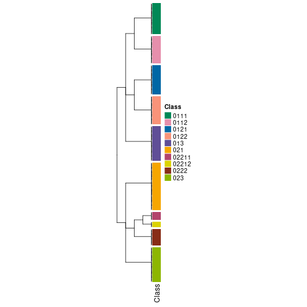</p>

</div>
<div id='tab-collect-classes-from-hierarchical-partition-2'>
<pre><code class="r">collect_classes(res_rh, merge_node = merge_node_param(min_n_signatures = 696))
</code></pre>

<p>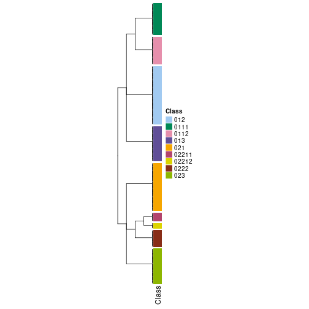</p>

</div>
<div id='tab-collect-classes-from-hierarchical-partition-3'>
<pre><code class="r">collect_classes(res_rh, merge_node = merge_node_param(min_n_signatures = 2339))
</code></pre>

<p>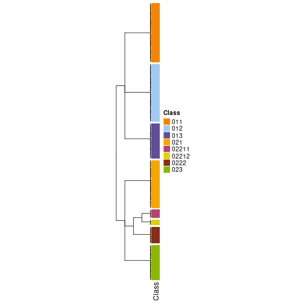</p>

</div>
<div id='tab-collect-classes-from-hierarchical-partition-4'>
<pre><code class="r">collect_classes(res_rh, merge_node = merge_node_param(min_n_signatures = 4525))
</code></pre>

<p>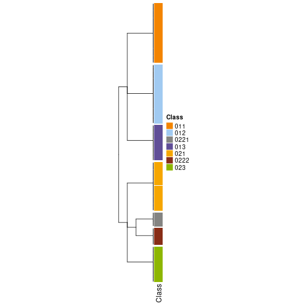</p>

</div>
<div id='tab-collect-classes-from-hierarchical-partition-5'>
<pre><code class="r">collect_classes(res_rh, merge_node = merge_node_param(min_n_signatures = 5620))
</code></pre>

<p>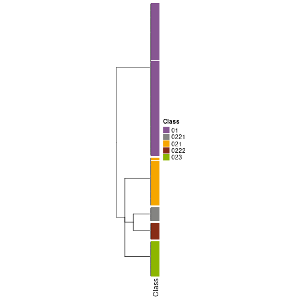</p>

</div>
<div id='tab-collect-classes-from-hierarchical-partition-6'>
<pre><code class="r">collect_classes(res_rh, merge_node = merge_node_param(min_n_signatures = 6601))
</code></pre>

<p>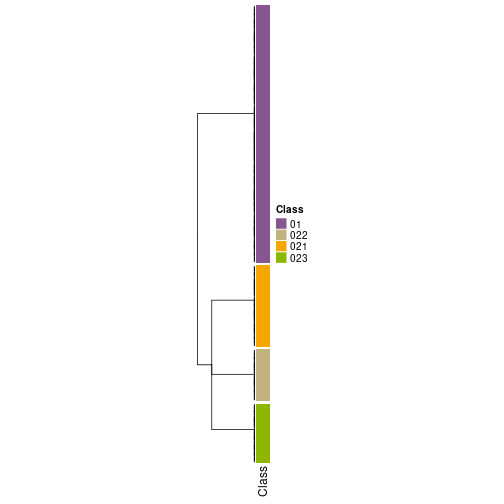</p>

</div>
<div id='tab-collect-classes-from-hierarchical-partition-7'>
<pre><code class="r">collect_classes(res_rh, merge_node = merge_node_param(min_n_signatures = 10267))
</code></pre>

<pre><code>#&gt; Error in max(children_height): invalid &#39;type&#39; (list) of argument
</code></pre>

</div>
</div>

Following shows the table of the partitions (You need to click the **show/hide
code output** link to see it).


<script>
$( function() {
	$( '#tabs-get-classes-from-hierarchical-partition' ).tabs();
} );
</script>
<div id='tabs-get-classes-from-hierarchical-partition'>
<ul>
<li><a href='#tab-get-classes-from-hierarchical-partition-1'>n_signatures ≥ 441</a></li>
<li><a href='#tab-get-classes-from-hierarchical-partition-2'>n_signatures ≥ 696</a></li>
<li><a href='#tab-get-classes-from-hierarchical-partition-3'>n_signatures ≥ 2339</a></li>
<li><a href='#tab-get-classes-from-hierarchical-partition-4'>n_signatures ≥ 4525</a></li>
<li><a href='#tab-get-classes-from-hierarchical-partition-5'>n_signatures ≥ 5620</a></li>
<li><a href='#tab-get-classes-from-hierarchical-partition-6'>n_signatures ≥ 6601</a></li>
<li><a href='#tab-get-classes-from-hierarchical-partition-7'>n_signatures ≥ 10267</a></li>
</ul>

<div id='tab-get-classes-from-hierarchical-partition-1'>
<p><a id='tab-get-classes-from-hierarchical-partition-1-a' style='color:#0366d6' href='#'>show/hide code output</a></p>
<pre><code class="r">get_classes(res_rh, merge_node = merge_node_param(min_n_signatures = 441))
</code></pre>

<pre><code>#&gt;   G1_cell1_count   G1_cell2_count   G1_cell3_count   G1_cell4_count   G1_cell5_count 
#&gt;            &quot;023&quot;            &quot;023&quot;            &quot;023&quot;           &quot;0222&quot;            &quot;023&quot; 
#&gt;   G1_cell6_count   G1_cell7_count   G1_cell8_count   G1_cell9_count  G1_cell10_count 
#&gt;            &quot;023&quot;            &quot;013&quot;            &quot;013&quot;           &quot;0112&quot;            &quot;021&quot; 
#&gt;  G1_cell11_count  G1_cell12_count  G1_cell13_count  G1_cell14_count  G1_cell15_count 
#&gt;            &quot;023&quot;            &quot;023&quot;           &quot;0112&quot;            &quot;023&quot;            &quot;013&quot; 
#&gt;  G1_cell16_count  G1_cell17_count  G1_cell18_count  G1_cell19_count  G1_cell20_count 
#&gt;            &quot;013&quot;            &quot;013&quot;            &quot;023&quot;            &quot;023&quot;            &quot;013&quot; 
#&gt;  G1_cell21_count  G1_cell22_count  G1_cell23_count  G1_cell24_count  G1_cell25_count 
#&gt;            &quot;021&quot;           &quot;0112&quot;            &quot;013&quot;            &quot;021&quot;            &quot;013&quot; 
#&gt;  G1_cell26_count  G1_cell27_count  G1_cell28_count  G1_cell29_count  G1_cell30_count 
#&gt;            &quot;013&quot;            &quot;023&quot;           &quot;0222&quot;            &quot;023&quot;            &quot;013&quot; 
#&gt;  G1_cell31_count  G1_cell32_count  G1_cell33_count  G1_cell34_count  G1_cell35_count 
#&gt;           &quot;0222&quot;            &quot;021&quot;            &quot;023&quot;            &quot;021&quot;           &quot;0222&quot; 
#&gt;  G1_cell36_count  G1_cell37_count  G1_cell38_count  G1_cell39_count  G1_cell40_count 
#&gt;           &quot;0112&quot;            &quot;021&quot;            &quot;023&quot;            &quot;013&quot;            &quot;023&quot; 
#&gt;  G1_cell41_count  G1_cell42_count  G1_cell43_count  G1_cell44_count  G1_cell45_count 
#&gt;            &quot;013&quot;           &quot;0111&quot;            &quot;013&quot;            &quot;013&quot;            &quot;023&quot; 
#&gt;  G1_cell46_count  G1_cell47_count  G1_cell48_count  G1_cell49_count  G1_cell50_count 
#&gt;            &quot;023&quot;            &quot;013&quot;           &quot;0222&quot;            &quot;013&quot;           &quot;0222&quot; 
#&gt;  G1_cell51_count  G1_cell52_count  G1_cell53_count  G1_cell54_count  G1_cell55_count 
#&gt;            &quot;023&quot;            &quot;023&quot;            &quot;023&quot;            &quot;013&quot;            &quot;013&quot; 
#&gt;  G1_cell56_count  G1_cell57_count  G1_cell58_count  G1_cell59_count  G1_cell60_count 
#&gt;           &quot;0222&quot;            &quot;013&quot;            &quot;023&quot;            &quot;023&quot;            &quot;013&quot; 
#&gt;  G1_cell61_count  G1_cell62_count  G1_cell63_count  G1_cell64_count  G1_cell65_count 
#&gt;            &quot;013&quot;           &quot;0112&quot;            &quot;021&quot;            &quot;013&quot;            &quot;013&quot; 
#&gt;  G1_cell66_count  G1_cell67_count  G1_cell68_count  G1_cell69_count  G1_cell70_count 
#&gt;            &quot;013&quot;            &quot;023&quot;            &quot;013&quot;            &quot;023&quot;           &quot;0111&quot; 
#&gt;  G1_cell71_count  G1_cell72_count  G1_cell73_count  G1_cell74_count  G1_cell75_count 
#&gt;            &quot;023&quot;            &quot;021&quot;            &quot;013&quot;           &quot;0121&quot;           &quot;0112&quot; 
#&gt;  G1_cell76_count  G1_cell77_count  G1_cell78_count  G1_cell79_count  G1_cell80_count 
#&gt;           &quot;0222&quot;            &quot;013&quot;            &quot;023&quot;            &quot;013&quot;           &quot;0122&quot; 
#&gt;  G1_cell81_count  G1_cell82_count  G1_cell83_count  G1_cell84_count  G1_cell85_count 
#&gt;            &quot;013&quot;            &quot;023&quot;            &quot;013&quot;            &quot;013&quot;            &quot;023&quot; 
#&gt;  G1_cell86_count  G1_cell87_count  G1_cell88_count  G1_cell89_count  G1_cell90_count 
#&gt;            &quot;013&quot;           &quot;0112&quot;          &quot;02211&quot;            &quot;021&quot;            &quot;021&quot; 
#&gt;  G1_cell91_count  G1_cell92_count  G1_cell93_count  G1_cell94_count  G1_cell95_count 
#&gt;           &quot;0111&quot;            &quot;023&quot;            &quot;013&quot;           &quot;0122&quot;            &quot;013&quot; 
#&gt;  G1_cell96_count    S_cell1_count    S_cell2_count    S_cell3_count    S_cell4_count 
#&gt;           &quot;0112&quot;          &quot;02211&quot;           &quot;0121&quot;           &quot;0111&quot;           &quot;0121&quot; 
#&gt;    S_cell5_count    S_cell6_count    S_cell7_count    S_cell8_count    S_cell9_count 
#&gt;          &quot;02211&quot;           &quot;0121&quot;           &quot;0121&quot;           &quot;0111&quot;           &quot;0111&quot; 
#&gt;   S_cell10_count   S_cell11_count   S_cell12_count   S_cell13_count   S_cell14_count 
#&gt;           &quot;0111&quot;           &quot;0121&quot;            &quot;021&quot;           &quot;0111&quot;            &quot;013&quot; 
#&gt;   S_cell15_count   S_cell16_count   S_cell17_count   S_cell18_count   S_cell19_count 
#&gt;           &quot;0111&quot;           &quot;0111&quot;           &quot;0112&quot;          &quot;02211&quot;           &quot;0121&quot; 
#&gt;   S_cell20_count   S_cell21_count   S_cell22_count   S_cell23_count   S_cell24_count 
#&gt;           &quot;0121&quot;            &quot;021&quot;           &quot;0111&quot;            &quot;021&quot;           &quot;0111&quot; 
#&gt;   S_cell25_count   S_cell26_count   S_cell27_count   S_cell28_count   S_cell29_count 
#&gt;            &quot;021&quot;           &quot;0112&quot;           &quot;0111&quot;           &quot;0111&quot;           &quot;0111&quot; 
#&gt;   S_cell30_count   S_cell31_count   S_cell32_count   S_cell33_count   S_cell34_count 
#&gt;           &quot;0112&quot;          &quot;02211&quot;           &quot;0121&quot;           &quot;0121&quot;           &quot;0222&quot; 
#&gt;   S_cell35_count   S_cell36_count   S_cell37_count   S_cell38_count   S_cell39_count 
#&gt;           &quot;0121&quot;           &quot;0122&quot;           &quot;0111&quot;            &quot;021&quot;           &quot;0121&quot; 
#&gt;   S_cell40_count   S_cell41_count   S_cell42_count   S_cell43_count   S_cell44_count 
#&gt;           &quot;0111&quot;           &quot;0121&quot;           &quot;0111&quot;           &quot;0111&quot;          &quot;02211&quot; 
#&gt;   S_cell45_count   S_cell46_count   S_cell47_count   S_cell48_count   S_cell49_count 
#&gt;           &quot;0121&quot;            &quot;013&quot;           &quot;0121&quot;           &quot;0121&quot;           &quot;0121&quot; 
#&gt;   S_cell50_count   S_cell51_count   S_cell52_count   S_cell53_count   S_cell54_count 
#&gt;           &quot;0111&quot;            &quot;021&quot;           &quot;0111&quot;           &quot;0111&quot;           &quot;0121&quot; 
#&gt;   S_cell55_count   S_cell56_count   S_cell57_count   S_cell58_count   S_cell59_count 
#&gt;           &quot;0111&quot;            &quot;021&quot;           &quot;0112&quot;          &quot;02211&quot;           &quot;0121&quot; 
#&gt;   S_cell60_count   S_cell61_count   S_cell62_count   S_cell63_count   S_cell64_count 
#&gt;           &quot;0121&quot;           &quot;0121&quot;           &quot;0121&quot;           &quot;0111&quot;            &quot;021&quot; 
#&gt;   S_cell65_count   S_cell66_count   S_cell67_count   S_cell68_count   S_cell69_count 
#&gt;            &quot;021&quot;           &quot;0121&quot;            &quot;021&quot;           &quot;0121&quot;           &quot;0121&quot; 
#&gt;   S_cell70_count   S_cell71_count   S_cell72_count   S_cell73_count   S_cell74_count 
#&gt;           &quot;0112&quot;          &quot;02211&quot;           &quot;0121&quot;           &quot;0121&quot;           &quot;0222&quot; 
#&gt;   S_cell75_count   S_cell76_count   S_cell77_count   S_cell78_count   S_cell79_count 
#&gt;            &quot;021&quot;           &quot;0122&quot;            &quot;021&quot;           &quot;0222&quot;           &quot;0111&quot; 
#&gt;   S_cell80_count   S_cell81_count   S_cell82_count   S_cell83_count   S_cell84_count 
#&gt;           &quot;0121&quot;          &quot;02212&quot;           &quot;0121&quot;           &quot;0112&quot;          &quot;02211&quot; 
#&gt;   S_cell85_count   S_cell86_count   S_cell87_count   S_cell88_count   S_cell89_count 
#&gt;            &quot;013&quot;           &quot;0121&quot;            &quot;021&quot;          &quot;02212&quot;           &quot;0121&quot; 
#&gt;   S_cell90_count   S_cell91_count   S_cell92_count   S_cell93_count   S_cell94_count 
#&gt;          &quot;02212&quot;            &quot;021&quot;           &quot;0111&quot;           &quot;0121&quot;          &quot;02212&quot; 
#&gt;   S_cell95_count   S_cell96_count  G2M_cell1_count  G2M_cell2_count  G2M_cell3_count 
#&gt;          &quot;02212&quot;          &quot;02212&quot;            &quot;023&quot;            &quot;021&quot;            &quot;021&quot; 
#&gt;  G2M_cell4_count  G2M_cell5_count  G2M_cell6_count  G2M_cell7_count  G2M_cell8_count 
#&gt;           &quot;0222&quot;           &quot;0111&quot;            &quot;023&quot;           &quot;0112&quot;           &quot;0111&quot; 
#&gt;  G2M_cell9_count G2M_cell10_count G2M_cell11_count G2M_cell12_count G2M_cell13_count 
#&gt;           &quot;0122&quot;           &quot;0122&quot;           &quot;0122&quot;           &quot;0122&quot;           &quot;0122&quot; 
#&gt; G2M_cell14_count G2M_cell15_count G2M_cell16_count G2M_cell17_count G2M_cell18_count 
#&gt;            &quot;021&quot;            &quot;021&quot;            &quot;023&quot;           &quot;0122&quot;           &quot;0112&quot; 
#&gt; G2M_cell19_count G2M_cell20_count G2M_cell21_count G2M_cell22_count G2M_cell23_count 
#&gt;           &quot;0111&quot;           &quot;0112&quot;           &quot;0122&quot;           &quot;0222&quot;           &quot;0112&quot; 
#&gt; G2M_cell24_count G2M_cell25_count G2M_cell26_count G2M_cell27_count G2M_cell28_count 
#&gt;            &quot;021&quot;           &quot;0122&quot;           &quot;0222&quot;            &quot;023&quot;            &quot;021&quot; 
#&gt; G2M_cell29_count G2M_cell30_count G2M_cell31_count G2M_cell32_count G2M_cell33_count 
#&gt;            &quot;023&quot;           &quot;0222&quot;            &quot;023&quot;           &quot;0111&quot;           &quot;0112&quot; 
#&gt; G2M_cell34_count G2M_cell35_count G2M_cell36_count G2M_cell37_count G2M_cell38_count 
#&gt;           &quot;0122&quot;            &quot;013&quot;            &quot;021&quot;           &quot;0122&quot;            &quot;021&quot; 
#&gt; G2M_cell39_count G2M_cell40_count G2M_cell41_count G2M_cell42_count G2M_cell43_count 
#&gt;            &quot;021&quot;            &quot;021&quot;           &quot;0122&quot;            &quot;021&quot;            &quot;021&quot; 
#&gt; G2M_cell44_count G2M_cell45_count G2M_cell46_count G2M_cell47_count G2M_cell48_count 
#&gt;           &quot;0112&quot;           &quot;0122&quot;            &quot;021&quot;           &quot;0112&quot;           &quot;0112&quot; 
#&gt; G2M_cell49_count G2M_cell50_count G2M_cell51_count G2M_cell52_count G2M_cell53_count 
#&gt;           &quot;0122&quot;           &quot;0122&quot;            &quot;021&quot;            &quot;021&quot;            &quot;021&quot; 
#&gt; G2M_cell54_count G2M_cell55_count G2M_cell56_count G2M_cell57_count G2M_cell58_count 
#&gt;            &quot;021&quot;           &quot;0122&quot;            &quot;021&quot;           &quot;0122&quot;           &quot;0112&quot; 
#&gt; G2M_cell59_count G2M_cell60_count G2M_cell61_count G2M_cell62_count G2M_cell63_count 
#&gt;           &quot;0111&quot;           &quot;0112&quot;           &quot;0112&quot;           &quot;0122&quot;           &quot;0122&quot; 
#&gt; G2M_cell64_count G2M_cell65_count G2M_cell66_count G2M_cell67_count G2M_cell68_count 
#&gt;            &quot;023&quot;           &quot;0122&quot;            &quot;021&quot;           &quot;0222&quot;           &quot;0112&quot; 
#&gt; G2M_cell69_count G2M_cell70_count G2M_cell71_count G2M_cell72_count G2M_cell73_count 
#&gt;           &quot;0111&quot;            &quot;023&quot;           &quot;0112&quot;            &quot;023&quot;           &quot;0111&quot; 
#&gt; G2M_cell74_count G2M_cell75_count G2M_cell76_count G2M_cell77_count G2M_cell78_count 
#&gt;           &quot;0112&quot;           &quot;0122&quot;           &quot;0122&quot;           &quot;0222&quot;            &quot;021&quot; 
#&gt; G2M_cell79_count G2M_cell80_count G2M_cell81_count G2M_cell82_count G2M_cell83_count 
#&gt;           &quot;0122&quot;           &quot;0122&quot;            &quot;021&quot;           &quot;0222&quot;           &quot;0122&quot; 
#&gt; G2M_cell84_count G2M_cell85_count G2M_cell86_count G2M_cell87_count G2M_cell88_count 
#&gt;           &quot;0111&quot;            &quot;021&quot;           &quot;0112&quot;           &quot;0122&quot;           &quot;0122&quot; 
#&gt; G2M_cell89_count G2M_cell90_count G2M_cell91_count G2M_cell92_count G2M_cell93_count 
#&gt;            &quot;021&quot;           &quot;0122&quot;           &quot;0112&quot;            &quot;021&quot;            &quot;021&quot; 
#&gt; G2M_cell94_count G2M_cell95_count G2M_cell96_count 
#&gt;            &quot;021&quot;            &quot;021&quot;            &quot;021&quot;
</code></pre>

<script>
$('#tab-get-classes-from-hierarchical-partition-1-a').parent().next().next().hide();
$('#tab-get-classes-from-hierarchical-partition-1-a').click(function(){
  $('#tab-get-classes-from-hierarchical-partition-1-a').parent().next().next().toggle();
  return(false);
});
</script>
</div>

<div id='tab-get-classes-from-hierarchical-partition-2'>
<p><a id='tab-get-classes-from-hierarchical-partition-2-a' style='color:#0366d6' href='#'>show/hide code output</a></p>
<pre><code class="r">get_classes(res_rh, merge_node = merge_node_param(min_n_signatures = 696))
</code></pre>

<pre><code>#&gt;   G1_cell1_count   G1_cell2_count   G1_cell3_count   G1_cell4_count   G1_cell5_count 
#&gt;            &quot;023&quot;            &quot;023&quot;            &quot;023&quot;           &quot;0222&quot;            &quot;023&quot; 
#&gt;   G1_cell6_count   G1_cell7_count   G1_cell8_count   G1_cell9_count  G1_cell10_count 
#&gt;            &quot;023&quot;            &quot;013&quot;            &quot;013&quot;           &quot;0112&quot;            &quot;021&quot; 
#&gt;  G1_cell11_count  G1_cell12_count  G1_cell13_count  G1_cell14_count  G1_cell15_count 
#&gt;            &quot;023&quot;            &quot;023&quot;           &quot;0112&quot;            &quot;023&quot;            &quot;013&quot; 
#&gt;  G1_cell16_count  G1_cell17_count  G1_cell18_count  G1_cell19_count  G1_cell20_count 
#&gt;            &quot;013&quot;            &quot;013&quot;            &quot;023&quot;            &quot;023&quot;            &quot;013&quot; 
#&gt;  G1_cell21_count  G1_cell22_count  G1_cell23_count  G1_cell24_count  G1_cell25_count 
#&gt;            &quot;021&quot;           &quot;0112&quot;            &quot;013&quot;            &quot;021&quot;            &quot;013&quot; 
#&gt;  G1_cell26_count  G1_cell27_count  G1_cell28_count  G1_cell29_count  G1_cell30_count 
#&gt;            &quot;013&quot;            &quot;023&quot;           &quot;0222&quot;            &quot;023&quot;            &quot;013&quot; 
#&gt;  G1_cell31_count  G1_cell32_count  G1_cell33_count  G1_cell34_count  G1_cell35_count 
#&gt;           &quot;0222&quot;            &quot;021&quot;            &quot;023&quot;            &quot;021&quot;           &quot;0222&quot; 
#&gt;  G1_cell36_count  G1_cell37_count  G1_cell38_count  G1_cell39_count  G1_cell40_count 
#&gt;           &quot;0112&quot;            &quot;021&quot;            &quot;023&quot;            &quot;013&quot;            &quot;023&quot; 
#&gt;  G1_cell41_count  G1_cell42_count  G1_cell43_count  G1_cell44_count  G1_cell45_count 
#&gt;            &quot;013&quot;           &quot;0111&quot;            &quot;013&quot;            &quot;013&quot;            &quot;023&quot; 
#&gt;  G1_cell46_count  G1_cell47_count  G1_cell48_count  G1_cell49_count  G1_cell50_count 
#&gt;            &quot;023&quot;            &quot;013&quot;           &quot;0222&quot;            &quot;013&quot;           &quot;0222&quot; 
#&gt;  G1_cell51_count  G1_cell52_count  G1_cell53_count  G1_cell54_count  G1_cell55_count 
#&gt;            &quot;023&quot;            &quot;023&quot;            &quot;023&quot;            &quot;013&quot;            &quot;013&quot; 
#&gt;  G1_cell56_count  G1_cell57_count  G1_cell58_count  G1_cell59_count  G1_cell60_count 
#&gt;           &quot;0222&quot;            &quot;013&quot;            &quot;023&quot;            &quot;023&quot;            &quot;013&quot; 
#&gt;  G1_cell61_count  G1_cell62_count  G1_cell63_count  G1_cell64_count  G1_cell65_count 
#&gt;            &quot;013&quot;           &quot;0112&quot;            &quot;021&quot;            &quot;013&quot;            &quot;013&quot; 
#&gt;  G1_cell66_count  G1_cell67_count  G1_cell68_count  G1_cell69_count  G1_cell70_count 
#&gt;            &quot;013&quot;            &quot;023&quot;            &quot;013&quot;            &quot;023&quot;           &quot;0111&quot; 
#&gt;  G1_cell71_count  G1_cell72_count  G1_cell73_count  G1_cell74_count  G1_cell75_count 
#&gt;            &quot;023&quot;            &quot;021&quot;            &quot;013&quot;            &quot;012&quot;           &quot;0112&quot; 
#&gt;  G1_cell76_count  G1_cell77_count  G1_cell78_count  G1_cell79_count  G1_cell80_count 
#&gt;           &quot;0222&quot;            &quot;013&quot;            &quot;023&quot;            &quot;013&quot;            &quot;012&quot; 
#&gt;  G1_cell81_count  G1_cell82_count  G1_cell83_count  G1_cell84_count  G1_cell85_count 
#&gt;            &quot;013&quot;            &quot;023&quot;            &quot;013&quot;            &quot;013&quot;            &quot;023&quot; 
#&gt;  G1_cell86_count  G1_cell87_count  G1_cell88_count  G1_cell89_count  G1_cell90_count 
#&gt;            &quot;013&quot;           &quot;0112&quot;          &quot;02211&quot;            &quot;021&quot;            &quot;021&quot; 
#&gt;  G1_cell91_count  G1_cell92_count  G1_cell93_count  G1_cell94_count  G1_cell95_count 
#&gt;           &quot;0111&quot;            &quot;023&quot;            &quot;013&quot;            &quot;012&quot;            &quot;013&quot; 
#&gt;  G1_cell96_count    S_cell1_count    S_cell2_count    S_cell3_count    S_cell4_count 
#&gt;           &quot;0112&quot;          &quot;02211&quot;            &quot;012&quot;           &quot;0111&quot;            &quot;012&quot; 
#&gt;    S_cell5_count    S_cell6_count    S_cell7_count    S_cell8_count    S_cell9_count 
#&gt;          &quot;02211&quot;            &quot;012&quot;            &quot;012&quot;           &quot;0111&quot;           &quot;0111&quot; 
#&gt;   S_cell10_count   S_cell11_count   S_cell12_count   S_cell13_count   S_cell14_count 
#&gt;           &quot;0111&quot;            &quot;012&quot;            &quot;021&quot;           &quot;0111&quot;            &quot;013&quot; 
#&gt;   S_cell15_count   S_cell16_count   S_cell17_count   S_cell18_count   S_cell19_count 
#&gt;           &quot;0111&quot;           &quot;0111&quot;           &quot;0112&quot;          &quot;02211&quot;            &quot;012&quot; 
#&gt;   S_cell20_count   S_cell21_count   S_cell22_count   S_cell23_count   S_cell24_count 
#&gt;            &quot;012&quot;            &quot;021&quot;           &quot;0111&quot;            &quot;021&quot;           &quot;0111&quot; 
#&gt;   S_cell25_count   S_cell26_count   S_cell27_count   S_cell28_count   S_cell29_count 
#&gt;            &quot;021&quot;           &quot;0112&quot;           &quot;0111&quot;           &quot;0111&quot;           &quot;0111&quot; 
#&gt;   S_cell30_count   S_cell31_count   S_cell32_count   S_cell33_count   S_cell34_count 
#&gt;           &quot;0112&quot;          &quot;02211&quot;            &quot;012&quot;            &quot;012&quot;           &quot;0222&quot; 
#&gt;   S_cell35_count   S_cell36_count   S_cell37_count   S_cell38_count   S_cell39_count 
#&gt;            &quot;012&quot;            &quot;012&quot;           &quot;0111&quot;            &quot;021&quot;            &quot;012&quot; 
#&gt;   S_cell40_count   S_cell41_count   S_cell42_count   S_cell43_count   S_cell44_count 
#&gt;           &quot;0111&quot;            &quot;012&quot;           &quot;0111&quot;           &quot;0111&quot;          &quot;02211&quot; 
#&gt;   S_cell45_count   S_cell46_count   S_cell47_count   S_cell48_count   S_cell49_count 
#&gt;            &quot;012&quot;            &quot;013&quot;            &quot;012&quot;            &quot;012&quot;            &quot;012&quot; 
#&gt;   S_cell50_count   S_cell51_count   S_cell52_count   S_cell53_count   S_cell54_count 
#&gt;           &quot;0111&quot;            &quot;021&quot;           &quot;0111&quot;           &quot;0111&quot;            &quot;012&quot; 
#&gt;   S_cell55_count   S_cell56_count   S_cell57_count   S_cell58_count   S_cell59_count 
#&gt;           &quot;0111&quot;            &quot;021&quot;           &quot;0112&quot;          &quot;02211&quot;            &quot;012&quot; 
#&gt;   S_cell60_count   S_cell61_count   S_cell62_count   S_cell63_count   S_cell64_count 
#&gt;            &quot;012&quot;            &quot;012&quot;            &quot;012&quot;           &quot;0111&quot;            &quot;021&quot; 
#&gt;   S_cell65_count   S_cell66_count   S_cell67_count   S_cell68_count   S_cell69_count 
#&gt;            &quot;021&quot;            &quot;012&quot;            &quot;021&quot;            &quot;012&quot;            &quot;012&quot; 
#&gt;   S_cell70_count   S_cell71_count   S_cell72_count   S_cell73_count   S_cell74_count 
#&gt;           &quot;0112&quot;          &quot;02211&quot;            &quot;012&quot;            &quot;012&quot;           &quot;0222&quot; 
#&gt;   S_cell75_count   S_cell76_count   S_cell77_count   S_cell78_count   S_cell79_count 
#&gt;            &quot;021&quot;            &quot;012&quot;            &quot;021&quot;           &quot;0222&quot;           &quot;0111&quot; 
#&gt;   S_cell80_count   S_cell81_count   S_cell82_count   S_cell83_count   S_cell84_count 
#&gt;            &quot;012&quot;          &quot;02212&quot;            &quot;012&quot;           &quot;0112&quot;          &quot;02211&quot; 
#&gt;   S_cell85_count   S_cell86_count   S_cell87_count   S_cell88_count   S_cell89_count 
#&gt;            &quot;013&quot;            &quot;012&quot;            &quot;021&quot;          &quot;02212&quot;            &quot;012&quot; 
#&gt;   S_cell90_count   S_cell91_count   S_cell92_count   S_cell93_count   S_cell94_count 
#&gt;          &quot;02212&quot;            &quot;021&quot;           &quot;0111&quot;            &quot;012&quot;          &quot;02212&quot; 
#&gt;   S_cell95_count   S_cell96_count  G2M_cell1_count  G2M_cell2_count  G2M_cell3_count 
#&gt;          &quot;02212&quot;          &quot;02212&quot;            &quot;023&quot;            &quot;021&quot;            &quot;021&quot; 
#&gt;  G2M_cell4_count  G2M_cell5_count  G2M_cell6_count  G2M_cell7_count  G2M_cell8_count 
#&gt;           &quot;0222&quot;           &quot;0111&quot;            &quot;023&quot;           &quot;0112&quot;           &quot;0111&quot; 
#&gt;  G2M_cell9_count G2M_cell10_count G2M_cell11_count G2M_cell12_count G2M_cell13_count 
#&gt;            &quot;012&quot;            &quot;012&quot;            &quot;012&quot;            &quot;012&quot;            &quot;012&quot; 
#&gt; G2M_cell14_count G2M_cell15_count G2M_cell16_count G2M_cell17_count G2M_cell18_count 
#&gt;            &quot;021&quot;            &quot;021&quot;            &quot;023&quot;            &quot;012&quot;           &quot;0112&quot; 
#&gt; G2M_cell19_count G2M_cell20_count G2M_cell21_count G2M_cell22_count G2M_cell23_count 
#&gt;           &quot;0111&quot;           &quot;0112&quot;            &quot;012&quot;           &quot;0222&quot;           &quot;0112&quot; 
#&gt; G2M_cell24_count G2M_cell25_count G2M_cell26_count G2M_cell27_count G2M_cell28_count 
#&gt;            &quot;021&quot;            &quot;012&quot;           &quot;0222&quot;            &quot;023&quot;            &quot;021&quot; 
#&gt; G2M_cell29_count G2M_cell30_count G2M_cell31_count G2M_cell32_count G2M_cell33_count 
#&gt;            &quot;023&quot;           &quot;0222&quot;            &quot;023&quot;           &quot;0111&quot;           &quot;0112&quot; 
#&gt; G2M_cell34_count G2M_cell35_count G2M_cell36_count G2M_cell37_count G2M_cell38_count 
#&gt;            &quot;012&quot;            &quot;013&quot;            &quot;021&quot;            &quot;012&quot;            &quot;021&quot; 
#&gt; G2M_cell39_count G2M_cell40_count G2M_cell41_count G2M_cell42_count G2M_cell43_count 
#&gt;            &quot;021&quot;            &quot;021&quot;            &quot;012&quot;            &quot;021&quot;            &quot;021&quot; 
#&gt; G2M_cell44_count G2M_cell45_count G2M_cell46_count G2M_cell47_count G2M_cell48_count 
#&gt;           &quot;0112&quot;            &quot;012&quot;            &quot;021&quot;           &quot;0112&quot;           &quot;0112&quot; 
#&gt; G2M_cell49_count G2M_cell50_count G2M_cell51_count G2M_cell52_count G2M_cell53_count 
#&gt;            &quot;012&quot;            &quot;012&quot;            &quot;021&quot;            &quot;021&quot;            &quot;021&quot; 
#&gt; G2M_cell54_count G2M_cell55_count G2M_cell56_count G2M_cell57_count G2M_cell58_count 
#&gt;            &quot;021&quot;            &quot;012&quot;            &quot;021&quot;            &quot;012&quot;           &quot;0112&quot; 
#&gt; G2M_cell59_count G2M_cell60_count G2M_cell61_count G2M_cell62_count G2M_cell63_count 
#&gt;           &quot;0111&quot;           &quot;0112&quot;           &quot;0112&quot;            &quot;012&quot;            &quot;012&quot; 
#&gt; G2M_cell64_count G2M_cell65_count G2M_cell66_count G2M_cell67_count G2M_cell68_count 
#&gt;            &quot;023&quot;            &quot;012&quot;            &quot;021&quot;           &quot;0222&quot;           &quot;0112&quot; 
#&gt; G2M_cell69_count G2M_cell70_count G2M_cell71_count G2M_cell72_count G2M_cell73_count 
#&gt;           &quot;0111&quot;            &quot;023&quot;           &quot;0112&quot;            &quot;023&quot;           &quot;0111&quot; 
#&gt; G2M_cell74_count G2M_cell75_count G2M_cell76_count G2M_cell77_count G2M_cell78_count 
#&gt;           &quot;0112&quot;            &quot;012&quot;            &quot;012&quot;           &quot;0222&quot;            &quot;021&quot; 
#&gt; G2M_cell79_count G2M_cell80_count G2M_cell81_count G2M_cell82_count G2M_cell83_count 
#&gt;            &quot;012&quot;            &quot;012&quot;            &quot;021&quot;           &quot;0222&quot;            &quot;012&quot; 
#&gt; G2M_cell84_count G2M_cell85_count G2M_cell86_count G2M_cell87_count G2M_cell88_count 
#&gt;           &quot;0111&quot;            &quot;021&quot;           &quot;0112&quot;            &quot;012&quot;            &quot;012&quot; 
#&gt; G2M_cell89_count G2M_cell90_count G2M_cell91_count G2M_cell92_count G2M_cell93_count 
#&gt;            &quot;021&quot;            &quot;012&quot;           &quot;0112&quot;            &quot;021&quot;            &quot;021&quot; 
#&gt; G2M_cell94_count G2M_cell95_count G2M_cell96_count 
#&gt;            &quot;021&quot;            &quot;021&quot;            &quot;021&quot;
</code></pre>

<script>
$('#tab-get-classes-from-hierarchical-partition-2-a').parent().next().next().hide();
$('#tab-get-classes-from-hierarchical-partition-2-a').click(function(){
  $('#tab-get-classes-from-hierarchical-partition-2-a').parent().next().next().toggle();
  return(false);
});
</script>
</div>

<div id='tab-get-classes-from-hierarchical-partition-3'>
<p><a id='tab-get-classes-from-hierarchical-partition-3-a' style='color:#0366d6' href='#'>show/hide code output</a></p>
<pre><code class="r">get_classes(res_rh, merge_node = merge_node_param(min_n_signatures = 2339))
</code></pre>

<pre><code>#&gt;   G1_cell1_count   G1_cell2_count   G1_cell3_count   G1_cell4_count   G1_cell5_count 
#&gt;            &quot;023&quot;            &quot;023&quot;            &quot;023&quot;           &quot;0222&quot;            &quot;023&quot; 
#&gt;   G1_cell6_count   G1_cell7_count   G1_cell8_count   G1_cell9_count  G1_cell10_count 
#&gt;            &quot;023&quot;            &quot;013&quot;            &quot;013&quot;            &quot;011&quot;            &quot;021&quot; 
#&gt;  G1_cell11_count  G1_cell12_count  G1_cell13_count  G1_cell14_count  G1_cell15_count 
#&gt;            &quot;023&quot;            &quot;023&quot;            &quot;011&quot;            &quot;023&quot;            &quot;013&quot; 
#&gt;  G1_cell16_count  G1_cell17_count  G1_cell18_count  G1_cell19_count  G1_cell20_count 
#&gt;            &quot;013&quot;            &quot;013&quot;            &quot;023&quot;            &quot;023&quot;            &quot;013&quot; 
#&gt;  G1_cell21_count  G1_cell22_count  G1_cell23_count  G1_cell24_count  G1_cell25_count 
#&gt;            &quot;021&quot;            &quot;011&quot;            &quot;013&quot;            &quot;021&quot;            &quot;013&quot; 
#&gt;  G1_cell26_count  G1_cell27_count  G1_cell28_count  G1_cell29_count  G1_cell30_count 
#&gt;            &quot;013&quot;            &quot;023&quot;           &quot;0222&quot;            &quot;023&quot;            &quot;013&quot; 
#&gt;  G1_cell31_count  G1_cell32_count  G1_cell33_count  G1_cell34_count  G1_cell35_count 
#&gt;           &quot;0222&quot;            &quot;021&quot;            &quot;023&quot;            &quot;021&quot;           &quot;0222&quot; 
#&gt;  G1_cell36_count  G1_cell37_count  G1_cell38_count  G1_cell39_count  G1_cell40_count 
#&gt;            &quot;011&quot;            &quot;021&quot;            &quot;023&quot;            &quot;013&quot;            &quot;023&quot; 
#&gt;  G1_cell41_count  G1_cell42_count  G1_cell43_count  G1_cell44_count  G1_cell45_count 
#&gt;            &quot;013&quot;            &quot;011&quot;            &quot;013&quot;            &quot;013&quot;            &quot;023&quot; 
#&gt;  G1_cell46_count  G1_cell47_count  G1_cell48_count  G1_cell49_count  G1_cell50_count 
#&gt;            &quot;023&quot;            &quot;013&quot;           &quot;0222&quot;            &quot;013&quot;           &quot;0222&quot; 
#&gt;  G1_cell51_count  G1_cell52_count  G1_cell53_count  G1_cell54_count  G1_cell55_count 
#&gt;            &quot;023&quot;            &quot;023&quot;            &quot;023&quot;            &quot;013&quot;            &quot;013&quot; 
#&gt;  G1_cell56_count  G1_cell57_count  G1_cell58_count  G1_cell59_count  G1_cell60_count 
#&gt;           &quot;0222&quot;            &quot;013&quot;            &quot;023&quot;            &quot;023&quot;            &quot;013&quot; 
#&gt;  G1_cell61_count  G1_cell62_count  G1_cell63_count  G1_cell64_count  G1_cell65_count 
#&gt;            &quot;013&quot;            &quot;011&quot;            &quot;021&quot;            &quot;013&quot;            &quot;013&quot; 
#&gt;  G1_cell66_count  G1_cell67_count  G1_cell68_count  G1_cell69_count  G1_cell70_count 
#&gt;            &quot;013&quot;            &quot;023&quot;            &quot;013&quot;            &quot;023&quot;            &quot;011&quot; 
#&gt;  G1_cell71_count  G1_cell72_count  G1_cell73_count  G1_cell74_count  G1_cell75_count 
#&gt;            &quot;023&quot;            &quot;021&quot;            &quot;013&quot;            &quot;012&quot;            &quot;011&quot; 
#&gt;  G1_cell76_count  G1_cell77_count  G1_cell78_count  G1_cell79_count  G1_cell80_count 
#&gt;           &quot;0222&quot;            &quot;013&quot;            &quot;023&quot;            &quot;013&quot;            &quot;012&quot; 
#&gt;  G1_cell81_count  G1_cell82_count  G1_cell83_count  G1_cell84_count  G1_cell85_count 
#&gt;            &quot;013&quot;            &quot;023&quot;            &quot;013&quot;            &quot;013&quot;            &quot;023&quot; 
#&gt;  G1_cell86_count  G1_cell87_count  G1_cell88_count  G1_cell89_count  G1_cell90_count 
#&gt;            &quot;013&quot;            &quot;011&quot;          &quot;02211&quot;            &quot;021&quot;            &quot;021&quot; 
#&gt;  G1_cell91_count  G1_cell92_count  G1_cell93_count  G1_cell94_count  G1_cell95_count 
#&gt;            &quot;011&quot;            &quot;023&quot;            &quot;013&quot;            &quot;012&quot;            &quot;013&quot; 
#&gt;  G1_cell96_count    S_cell1_count    S_cell2_count    S_cell3_count    S_cell4_count 
#&gt;            &quot;011&quot;          &quot;02211&quot;            &quot;012&quot;            &quot;011&quot;            &quot;012&quot; 
#&gt;    S_cell5_count    S_cell6_count    S_cell7_count    S_cell8_count    S_cell9_count 
#&gt;          &quot;02211&quot;            &quot;012&quot;            &quot;012&quot;            &quot;011&quot;            &quot;011&quot; 
#&gt;   S_cell10_count   S_cell11_count   S_cell12_count   S_cell13_count   S_cell14_count 
#&gt;            &quot;011&quot;            &quot;012&quot;            &quot;021&quot;            &quot;011&quot;            &quot;013&quot; 
#&gt;   S_cell15_count   S_cell16_count   S_cell17_count   S_cell18_count   S_cell19_count 
#&gt;            &quot;011&quot;            &quot;011&quot;            &quot;011&quot;          &quot;02211&quot;            &quot;012&quot; 
#&gt;   S_cell20_count   S_cell21_count   S_cell22_count   S_cell23_count   S_cell24_count 
#&gt;            &quot;012&quot;            &quot;021&quot;            &quot;011&quot;            &quot;021&quot;            &quot;011&quot; 
#&gt;   S_cell25_count   S_cell26_count   S_cell27_count   S_cell28_count   S_cell29_count 
#&gt;            &quot;021&quot;            &quot;011&quot;            &quot;011&quot;            &quot;011&quot;            &quot;011&quot; 
#&gt;   S_cell30_count   S_cell31_count   S_cell32_count   S_cell33_count   S_cell34_count 
#&gt;            &quot;011&quot;          &quot;02211&quot;            &quot;012&quot;            &quot;012&quot;           &quot;0222&quot; 
#&gt;   S_cell35_count   S_cell36_count   S_cell37_count   S_cell38_count   S_cell39_count 
#&gt;            &quot;012&quot;            &quot;012&quot;            &quot;011&quot;            &quot;021&quot;            &quot;012&quot; 
#&gt;   S_cell40_count   S_cell41_count   S_cell42_count   S_cell43_count   S_cell44_count 
#&gt;            &quot;011&quot;            &quot;012&quot;            &quot;011&quot;            &quot;011&quot;          &quot;02211&quot; 
#&gt;   S_cell45_count   S_cell46_count   S_cell47_count   S_cell48_count   S_cell49_count 
#&gt;            &quot;012&quot;            &quot;013&quot;            &quot;012&quot;            &quot;012&quot;            &quot;012&quot; 
#&gt;   S_cell50_count   S_cell51_count   S_cell52_count   S_cell53_count   S_cell54_count 
#&gt;            &quot;011&quot;            &quot;021&quot;            &quot;011&quot;            &quot;011&quot;            &quot;012&quot; 
#&gt;   S_cell55_count   S_cell56_count   S_cell57_count   S_cell58_count   S_cell59_count 
#&gt;            &quot;011&quot;            &quot;021&quot;            &quot;011&quot;          &quot;02211&quot;            &quot;012&quot; 
#&gt;   S_cell60_count   S_cell61_count   S_cell62_count   S_cell63_count   S_cell64_count 
#&gt;            &quot;012&quot;            &quot;012&quot;            &quot;012&quot;            &quot;011&quot;            &quot;021&quot; 
#&gt;   S_cell65_count   S_cell66_count   S_cell67_count   S_cell68_count   S_cell69_count 
#&gt;            &quot;021&quot;            &quot;012&quot;            &quot;021&quot;            &quot;012&quot;            &quot;012&quot; 
#&gt;   S_cell70_count   S_cell71_count   S_cell72_count   S_cell73_count   S_cell74_count 
#&gt;            &quot;011&quot;          &quot;02211&quot;            &quot;012&quot;            &quot;012&quot;           &quot;0222&quot; 
#&gt;   S_cell75_count   S_cell76_count   S_cell77_count   S_cell78_count   S_cell79_count 
#&gt;            &quot;021&quot;            &quot;012&quot;            &quot;021&quot;           &quot;0222&quot;            &quot;011&quot; 
#&gt;   S_cell80_count   S_cell81_count   S_cell82_count   S_cell83_count   S_cell84_count 
#&gt;            &quot;012&quot;          &quot;02212&quot;            &quot;012&quot;            &quot;011&quot;          &quot;02211&quot; 
#&gt;   S_cell85_count   S_cell86_count   S_cell87_count   S_cell88_count   S_cell89_count 
#&gt;            &quot;013&quot;            &quot;012&quot;            &quot;021&quot;          &quot;02212&quot;            &quot;012&quot; 
#&gt;   S_cell90_count   S_cell91_count   S_cell92_count   S_cell93_count   S_cell94_count 
#&gt;          &quot;02212&quot;            &quot;021&quot;            &quot;011&quot;            &quot;012&quot;          &quot;02212&quot; 
#&gt;   S_cell95_count   S_cell96_count  G2M_cell1_count  G2M_cell2_count  G2M_cell3_count 
#&gt;          &quot;02212&quot;          &quot;02212&quot;            &quot;023&quot;            &quot;021&quot;            &quot;021&quot; 
#&gt;  G2M_cell4_count  G2M_cell5_count  G2M_cell6_count  G2M_cell7_count  G2M_cell8_count 
#&gt;           &quot;0222&quot;            &quot;011&quot;            &quot;023&quot;            &quot;011&quot;            &quot;011&quot; 
#&gt;  G2M_cell9_count G2M_cell10_count G2M_cell11_count G2M_cell12_count G2M_cell13_count 
#&gt;            &quot;012&quot;            &quot;012&quot;            &quot;012&quot;            &quot;012&quot;            &quot;012&quot; 
#&gt; G2M_cell14_count G2M_cell15_count G2M_cell16_count G2M_cell17_count G2M_cell18_count 
#&gt;            &quot;021&quot;            &quot;021&quot;            &quot;023&quot;            &quot;012&quot;            &quot;011&quot; 
#&gt; G2M_cell19_count G2M_cell20_count G2M_cell21_count G2M_cell22_count G2M_cell23_count 
#&gt;            &quot;011&quot;            &quot;011&quot;            &quot;012&quot;           &quot;0222&quot;            &quot;011&quot; 
#&gt; G2M_cell24_count G2M_cell25_count G2M_cell26_count G2M_cell27_count G2M_cell28_count 
#&gt;            &quot;021&quot;            &quot;012&quot;           &quot;0222&quot;            &quot;023&quot;            &quot;021&quot; 
#&gt; G2M_cell29_count G2M_cell30_count G2M_cell31_count G2M_cell32_count G2M_cell33_count 
#&gt;            &quot;023&quot;           &quot;0222&quot;            &quot;023&quot;            &quot;011&quot;            &quot;011&quot; 
#&gt; G2M_cell34_count G2M_cell35_count G2M_cell36_count G2M_cell37_count G2M_cell38_count 
#&gt;            &quot;012&quot;            &quot;013&quot;            &quot;021&quot;            &quot;012&quot;            &quot;021&quot; 
#&gt; G2M_cell39_count G2M_cell40_count G2M_cell41_count G2M_cell42_count G2M_cell43_count 
#&gt;            &quot;021&quot;            &quot;021&quot;            &quot;012&quot;            &quot;021&quot;            &quot;021&quot; 
#&gt; G2M_cell44_count G2M_cell45_count G2M_cell46_count G2M_cell47_count G2M_cell48_count 
#&gt;            &quot;011&quot;            &quot;012&quot;            &quot;021&quot;            &quot;011&quot;            &quot;011&quot; 
#&gt; G2M_cell49_count G2M_cell50_count G2M_cell51_count G2M_cell52_count G2M_cell53_count 
#&gt;            &quot;012&quot;            &quot;012&quot;            &quot;021&quot;            &quot;021&quot;            &quot;021&quot; 
#&gt; G2M_cell54_count G2M_cell55_count G2M_cell56_count G2M_cell57_count G2M_cell58_count 
#&gt;            &quot;021&quot;            &quot;012&quot;            &quot;021&quot;            &quot;012&quot;            &quot;011&quot; 
#&gt; G2M_cell59_count G2M_cell60_count G2M_cell61_count G2M_cell62_count G2M_cell63_count 
#&gt;            &quot;011&quot;            &quot;011&quot;            &quot;011&quot;            &quot;012&quot;            &quot;012&quot; 
#&gt; G2M_cell64_count G2M_cell65_count G2M_cell66_count G2M_cell67_count G2M_cell68_count 
#&gt;            &quot;023&quot;            &quot;012&quot;            &quot;021&quot;           &quot;0222&quot;            &quot;011&quot; 
#&gt; G2M_cell69_count G2M_cell70_count G2M_cell71_count G2M_cell72_count G2M_cell73_count 
#&gt;            &quot;011&quot;            &quot;023&quot;            &quot;011&quot;            &quot;023&quot;            &quot;011&quot; 
#&gt; G2M_cell74_count G2M_cell75_count G2M_cell76_count G2M_cell77_count G2M_cell78_count 
#&gt;            &quot;011&quot;            &quot;012&quot;            &quot;012&quot;           &quot;0222&quot;            &quot;021&quot; 
#&gt; G2M_cell79_count G2M_cell80_count G2M_cell81_count G2M_cell82_count G2M_cell83_count 
#&gt;            &quot;012&quot;            &quot;012&quot;            &quot;021&quot;           &quot;0222&quot;            &quot;012&quot; 
#&gt; G2M_cell84_count G2M_cell85_count G2M_cell86_count G2M_cell87_count G2M_cell88_count 
#&gt;            &quot;011&quot;            &quot;021&quot;            &quot;011&quot;            &quot;012&quot;            &quot;012&quot; 
#&gt; G2M_cell89_count G2M_cell90_count G2M_cell91_count G2M_cell92_count G2M_cell93_count 
#&gt;            &quot;021&quot;            &quot;012&quot;            &quot;011&quot;            &quot;021&quot;            &quot;021&quot; 
#&gt; G2M_cell94_count G2M_cell95_count G2M_cell96_count 
#&gt;            &quot;021&quot;            &quot;021&quot;            &quot;021&quot;
</code></pre>

<script>
$('#tab-get-classes-from-hierarchical-partition-3-a').parent().next().next().hide();
$('#tab-get-classes-from-hierarchical-partition-3-a').click(function(){
  $('#tab-get-classes-from-hierarchical-partition-3-a').parent().next().next().toggle();
  return(false);
});
</script>
</div>

<div id='tab-get-classes-from-hierarchical-partition-4'>
<p><a id='tab-get-classes-from-hierarchical-partition-4-a' style='color:#0366d6' href='#'>show/hide code output</a></p>
<pre><code class="r">get_classes(res_rh, merge_node = merge_node_param(min_n_signatures = 4525))
</code></pre>

<pre><code>#&gt;   G1_cell1_count   G1_cell2_count   G1_cell3_count   G1_cell4_count   G1_cell5_count 
#&gt;            &quot;023&quot;            &quot;023&quot;            &quot;023&quot;           &quot;0222&quot;            &quot;023&quot; 
#&gt;   G1_cell6_count   G1_cell7_count   G1_cell8_count   G1_cell9_count  G1_cell10_count 
#&gt;            &quot;023&quot;            &quot;013&quot;            &quot;013&quot;            &quot;011&quot;            &quot;021&quot; 
#&gt;  G1_cell11_count  G1_cell12_count  G1_cell13_count  G1_cell14_count  G1_cell15_count 
#&gt;            &quot;023&quot;            &quot;023&quot;            &quot;011&quot;            &quot;023&quot;            &quot;013&quot; 
#&gt;  G1_cell16_count  G1_cell17_count  G1_cell18_count  G1_cell19_count  G1_cell20_count 
#&gt;            &quot;013&quot;            &quot;013&quot;            &quot;023&quot;            &quot;023&quot;            &quot;013&quot; 
#&gt;  G1_cell21_count  G1_cell22_count  G1_cell23_count  G1_cell24_count  G1_cell25_count 
#&gt;            &quot;021&quot;            &quot;011&quot;            &quot;013&quot;            &quot;021&quot;            &quot;013&quot; 
#&gt;  G1_cell26_count  G1_cell27_count  G1_cell28_count  G1_cell29_count  G1_cell30_count 
#&gt;            &quot;013&quot;            &quot;023&quot;           &quot;0222&quot;            &quot;023&quot;            &quot;013&quot; 
#&gt;  G1_cell31_count  G1_cell32_count  G1_cell33_count  G1_cell34_count  G1_cell35_count 
#&gt;           &quot;0222&quot;            &quot;021&quot;            &quot;023&quot;            &quot;021&quot;           &quot;0222&quot; 
#&gt;  G1_cell36_count  G1_cell37_count  G1_cell38_count  G1_cell39_count  G1_cell40_count 
#&gt;            &quot;011&quot;            &quot;021&quot;            &quot;023&quot;            &quot;013&quot;            &quot;023&quot; 
#&gt;  G1_cell41_count  G1_cell42_count  G1_cell43_count  G1_cell44_count  G1_cell45_count 
#&gt;            &quot;013&quot;            &quot;011&quot;            &quot;013&quot;            &quot;013&quot;            &quot;023&quot; 
#&gt;  G1_cell46_count  G1_cell47_count  G1_cell48_count  G1_cell49_count  G1_cell50_count 
#&gt;            &quot;023&quot;            &quot;013&quot;           &quot;0222&quot;            &quot;013&quot;           &quot;0222&quot; 
#&gt;  G1_cell51_count  G1_cell52_count  G1_cell53_count  G1_cell54_count  G1_cell55_count 
#&gt;            &quot;023&quot;            &quot;023&quot;            &quot;023&quot;            &quot;013&quot;            &quot;013&quot; 
#&gt;  G1_cell56_count  G1_cell57_count  G1_cell58_count  G1_cell59_count  G1_cell60_count 
#&gt;           &quot;0222&quot;            &quot;013&quot;            &quot;023&quot;            &quot;023&quot;            &quot;013&quot; 
#&gt;  G1_cell61_count  G1_cell62_count  G1_cell63_count  G1_cell64_count  G1_cell65_count 
#&gt;            &quot;013&quot;            &quot;011&quot;            &quot;021&quot;            &quot;013&quot;            &quot;013&quot; 
#&gt;  G1_cell66_count  G1_cell67_count  G1_cell68_count  G1_cell69_count  G1_cell70_count 
#&gt;            &quot;013&quot;            &quot;023&quot;            &quot;013&quot;            &quot;023&quot;            &quot;011&quot; 
#&gt;  G1_cell71_count  G1_cell72_count  G1_cell73_count  G1_cell74_count  G1_cell75_count 
#&gt;            &quot;023&quot;            &quot;021&quot;            &quot;013&quot;            &quot;012&quot;            &quot;011&quot; 
#&gt;  G1_cell76_count  G1_cell77_count  G1_cell78_count  G1_cell79_count  G1_cell80_count 
#&gt;           &quot;0222&quot;            &quot;013&quot;            &quot;023&quot;            &quot;013&quot;            &quot;012&quot; 
#&gt;  G1_cell81_count  G1_cell82_count  G1_cell83_count  G1_cell84_count  G1_cell85_count 
#&gt;            &quot;013&quot;            &quot;023&quot;            &quot;013&quot;            &quot;013&quot;            &quot;023&quot; 
#&gt;  G1_cell86_count  G1_cell87_count  G1_cell88_count  G1_cell89_count  G1_cell90_count 
#&gt;            &quot;013&quot;            &quot;011&quot;           &quot;0221&quot;            &quot;021&quot;            &quot;021&quot; 
#&gt;  G1_cell91_count  G1_cell92_count  G1_cell93_count  G1_cell94_count  G1_cell95_count 
#&gt;            &quot;011&quot;            &quot;023&quot;            &quot;013&quot;            &quot;012&quot;            &quot;013&quot; 
#&gt;  G1_cell96_count    S_cell1_count    S_cell2_count    S_cell3_count    S_cell4_count 
#&gt;            &quot;011&quot;           &quot;0221&quot;            &quot;012&quot;            &quot;011&quot;            &quot;012&quot; 
#&gt;    S_cell5_count    S_cell6_count    S_cell7_count    S_cell8_count    S_cell9_count 
#&gt;           &quot;0221&quot;            &quot;012&quot;            &quot;012&quot;            &quot;011&quot;            &quot;011&quot; 
#&gt;   S_cell10_count   S_cell11_count   S_cell12_count   S_cell13_count   S_cell14_count 
#&gt;            &quot;011&quot;            &quot;012&quot;            &quot;021&quot;            &quot;011&quot;            &quot;013&quot; 
#&gt;   S_cell15_count   S_cell16_count   S_cell17_count   S_cell18_count   S_cell19_count 
#&gt;            &quot;011&quot;            &quot;011&quot;            &quot;011&quot;           &quot;0221&quot;            &quot;012&quot; 
#&gt;   S_cell20_count   S_cell21_count   S_cell22_count   S_cell23_count   S_cell24_count 
#&gt;            &quot;012&quot;            &quot;021&quot;            &quot;011&quot;            &quot;021&quot;            &quot;011&quot; 
#&gt;   S_cell25_count   S_cell26_count   S_cell27_count   S_cell28_count   S_cell29_count 
#&gt;            &quot;021&quot;            &quot;011&quot;            &quot;011&quot;            &quot;011&quot;            &quot;011&quot; 
#&gt;   S_cell30_count   S_cell31_count   S_cell32_count   S_cell33_count   S_cell34_count 
#&gt;            &quot;011&quot;           &quot;0221&quot;            &quot;012&quot;            &quot;012&quot;           &quot;0222&quot; 
#&gt;   S_cell35_count   S_cell36_count   S_cell37_count   S_cell38_count   S_cell39_count 
#&gt;            &quot;012&quot;            &quot;012&quot;            &quot;011&quot;            &quot;021&quot;            &quot;012&quot; 
#&gt;   S_cell40_count   S_cell41_count   S_cell42_count   S_cell43_count   S_cell44_count 
#&gt;            &quot;011&quot;            &quot;012&quot;            &quot;011&quot;            &quot;011&quot;           &quot;0221&quot; 
#&gt;   S_cell45_count   S_cell46_count   S_cell47_count   S_cell48_count   S_cell49_count 
#&gt;            &quot;012&quot;            &quot;013&quot;            &quot;012&quot;            &quot;012&quot;            &quot;012&quot; 
#&gt;   S_cell50_count   S_cell51_count   S_cell52_count   S_cell53_count   S_cell54_count 
#&gt;            &quot;011&quot;            &quot;021&quot;            &quot;011&quot;            &quot;011&quot;            &quot;012&quot; 
#&gt;   S_cell55_count   S_cell56_count   S_cell57_count   S_cell58_count   S_cell59_count 
#&gt;            &quot;011&quot;            &quot;021&quot;            &quot;011&quot;           &quot;0221&quot;            &quot;012&quot; 
#&gt;   S_cell60_count   S_cell61_count   S_cell62_count   S_cell63_count   S_cell64_count 
#&gt;            &quot;012&quot;            &quot;012&quot;            &quot;012&quot;            &quot;011&quot;            &quot;021&quot; 
#&gt;   S_cell65_count   S_cell66_count   S_cell67_count   S_cell68_count   S_cell69_count 
#&gt;            &quot;021&quot;            &quot;012&quot;            &quot;021&quot;            &quot;012&quot;            &quot;012&quot; 
#&gt;   S_cell70_count   S_cell71_count   S_cell72_count   S_cell73_count   S_cell74_count 
#&gt;            &quot;011&quot;           &quot;0221&quot;            &quot;012&quot;            &quot;012&quot;           &quot;0222&quot; 
#&gt;   S_cell75_count   S_cell76_count   S_cell77_count   S_cell78_count   S_cell79_count 
#&gt;            &quot;021&quot;            &quot;012&quot;            &quot;021&quot;           &quot;0222&quot;            &quot;011&quot; 
#&gt;   S_cell80_count   S_cell81_count   S_cell82_count   S_cell83_count   S_cell84_count 
#&gt;            &quot;012&quot;           &quot;0221&quot;            &quot;012&quot;            &quot;011&quot;           &quot;0221&quot; 
#&gt;   S_cell85_count   S_cell86_count   S_cell87_count   S_cell88_count   S_cell89_count 
#&gt;            &quot;013&quot;            &quot;012&quot;            &quot;021&quot;           &quot;0221&quot;            &quot;012&quot; 
#&gt;   S_cell90_count   S_cell91_count   S_cell92_count   S_cell93_count   S_cell94_count 
#&gt;           &quot;0221&quot;            &quot;021&quot;            &quot;011&quot;            &quot;012&quot;           &quot;0221&quot; 
#&gt;   S_cell95_count   S_cell96_count  G2M_cell1_count  G2M_cell2_count  G2M_cell3_count 
#&gt;           &quot;0221&quot;           &quot;0221&quot;            &quot;023&quot;            &quot;021&quot;            &quot;021&quot; 
#&gt;  G2M_cell4_count  G2M_cell5_count  G2M_cell6_count  G2M_cell7_count  G2M_cell8_count 
#&gt;           &quot;0222&quot;            &quot;011&quot;            &quot;023&quot;            &quot;011&quot;            &quot;011&quot; 
#&gt;  G2M_cell9_count G2M_cell10_count G2M_cell11_count G2M_cell12_count G2M_cell13_count 
#&gt;            &quot;012&quot;            &quot;012&quot;            &quot;012&quot;            &quot;012&quot;            &quot;012&quot; 
#&gt; G2M_cell14_count G2M_cell15_count G2M_cell16_count G2M_cell17_count G2M_cell18_count 
#&gt;            &quot;021&quot;            &quot;021&quot;            &quot;023&quot;            &quot;012&quot;            &quot;011&quot; 
#&gt; G2M_cell19_count G2M_cell20_count G2M_cell21_count G2M_cell22_count G2M_cell23_count 
#&gt;            &quot;011&quot;            &quot;011&quot;            &quot;012&quot;           &quot;0222&quot;            &quot;011&quot; 
#&gt; G2M_cell24_count G2M_cell25_count G2M_cell26_count G2M_cell27_count G2M_cell28_count 
#&gt;            &quot;021&quot;            &quot;012&quot;           &quot;0222&quot;            &quot;023&quot;            &quot;021&quot; 
#&gt; G2M_cell29_count G2M_cell30_count G2M_cell31_count G2M_cell32_count G2M_cell33_count 
#&gt;            &quot;023&quot;           &quot;0222&quot;            &quot;023&quot;            &quot;011&quot;            &quot;011&quot; 
#&gt; G2M_cell34_count G2M_cell35_count G2M_cell36_count G2M_cell37_count G2M_cell38_count 
#&gt;            &quot;012&quot;            &quot;013&quot;            &quot;021&quot;            &quot;012&quot;            &quot;021&quot; 
#&gt; G2M_cell39_count G2M_cell40_count G2M_cell41_count G2M_cell42_count G2M_cell43_count 
#&gt;            &quot;021&quot;            &quot;021&quot;            &quot;012&quot;            &quot;021&quot;            &quot;021&quot; 
#&gt; G2M_cell44_count G2M_cell45_count G2M_cell46_count G2M_cell47_count G2M_cell48_count 
#&gt;            &quot;011&quot;            &quot;012&quot;            &quot;021&quot;            &quot;011&quot;            &quot;011&quot; 
#&gt; G2M_cell49_count G2M_cell50_count G2M_cell51_count G2M_cell52_count G2M_cell53_count 
#&gt;            &quot;012&quot;            &quot;012&quot;            &quot;021&quot;            &quot;021&quot;            &quot;021&quot; 
#&gt; G2M_cell54_count G2M_cell55_count G2M_cell56_count G2M_cell57_count G2M_cell58_count 
#&gt;            &quot;021&quot;            &quot;012&quot;            &quot;021&quot;            &quot;012&quot;            &quot;011&quot; 
#&gt; G2M_cell59_count G2M_cell60_count G2M_cell61_count G2M_cell62_count G2M_cell63_count 
#&gt;            &quot;011&quot;            &quot;011&quot;            &quot;011&quot;            &quot;012&quot;            &quot;012&quot; 
#&gt; G2M_cell64_count G2M_cell65_count G2M_cell66_count G2M_cell67_count G2M_cell68_count 
#&gt;            &quot;023&quot;            &quot;012&quot;            &quot;021&quot;           &quot;0222&quot;            &quot;011&quot; 
#&gt; G2M_cell69_count G2M_cell70_count G2M_cell71_count G2M_cell72_count G2M_cell73_count 
#&gt;            &quot;011&quot;            &quot;023&quot;            &quot;011&quot;            &quot;023&quot;            &quot;011&quot; 
#&gt; G2M_cell74_count G2M_cell75_count G2M_cell76_count G2M_cell77_count G2M_cell78_count 
#&gt;            &quot;011&quot;            &quot;012&quot;            &quot;012&quot;           &quot;0222&quot;            &quot;021&quot; 
#&gt; G2M_cell79_count G2M_cell80_count G2M_cell81_count G2M_cell82_count G2M_cell83_count 
#&gt;            &quot;012&quot;            &quot;012&quot;            &quot;021&quot;           &quot;0222&quot;            &quot;012&quot; 
#&gt; G2M_cell84_count G2M_cell85_count G2M_cell86_count G2M_cell87_count G2M_cell88_count 
#&gt;            &quot;011&quot;            &quot;021&quot;            &quot;011&quot;            &quot;012&quot;            &quot;012&quot; 
#&gt; G2M_cell89_count G2M_cell90_count G2M_cell91_count G2M_cell92_count G2M_cell93_count 
#&gt;            &quot;021&quot;            &quot;012&quot;            &quot;011&quot;            &quot;021&quot;            &quot;021&quot; 
#&gt; G2M_cell94_count G2M_cell95_count G2M_cell96_count 
#&gt;            &quot;021&quot;            &quot;021&quot;            &quot;021&quot;
</code></pre>

<script>
$('#tab-get-classes-from-hierarchical-partition-4-a').parent().next().next().hide();
$('#tab-get-classes-from-hierarchical-partition-4-a').click(function(){
  $('#tab-get-classes-from-hierarchical-partition-4-a').parent().next().next().toggle();
  return(false);
});
</script>
</div>

<div id='tab-get-classes-from-hierarchical-partition-5'>
<p><a id='tab-get-classes-from-hierarchical-partition-5-a' style='color:#0366d6' href='#'>show/hide code output</a></p>
<pre><code class="r">get_classes(res_rh, merge_node = merge_node_param(min_n_signatures = 5620))
</code></pre>

<pre><code>#&gt;   G1_cell1_count   G1_cell2_count   G1_cell3_count   G1_cell4_count   G1_cell5_count 
#&gt;            &quot;023&quot;            &quot;023&quot;            &quot;023&quot;           &quot;0222&quot;            &quot;023&quot; 
#&gt;   G1_cell6_count   G1_cell7_count   G1_cell8_count   G1_cell9_count  G1_cell10_count 
#&gt;            &quot;023&quot;             &quot;01&quot;             &quot;01&quot;             &quot;01&quot;            &quot;021&quot; 
#&gt;  G1_cell11_count  G1_cell12_count  G1_cell13_count  G1_cell14_count  G1_cell15_count 
#&gt;            &quot;023&quot;            &quot;023&quot;             &quot;01&quot;            &quot;023&quot;             &quot;01&quot; 
#&gt;  G1_cell16_count  G1_cell17_count  G1_cell18_count  G1_cell19_count  G1_cell20_count 
#&gt;             &quot;01&quot;             &quot;01&quot;            &quot;023&quot;            &quot;023&quot;             &quot;01&quot; 
#&gt;  G1_cell21_count  G1_cell22_count  G1_cell23_count  G1_cell24_count  G1_cell25_count 
#&gt;            &quot;021&quot;             &quot;01&quot;             &quot;01&quot;            &quot;021&quot;             &quot;01&quot; 
#&gt;  G1_cell26_count  G1_cell27_count  G1_cell28_count  G1_cell29_count  G1_cell30_count 
#&gt;             &quot;01&quot;            &quot;023&quot;           &quot;0222&quot;            &quot;023&quot;             &quot;01&quot; 
#&gt;  G1_cell31_count  G1_cell32_count  G1_cell33_count  G1_cell34_count  G1_cell35_count 
#&gt;           &quot;0222&quot;            &quot;021&quot;            &quot;023&quot;            &quot;021&quot;           &quot;0222&quot; 
#&gt;  G1_cell36_count  G1_cell37_count  G1_cell38_count  G1_cell39_count  G1_cell40_count 
#&gt;             &quot;01&quot;            &quot;021&quot;            &quot;023&quot;             &quot;01&quot;            &quot;023&quot; 
#&gt;  G1_cell41_count  G1_cell42_count  G1_cell43_count  G1_cell44_count  G1_cell45_count 
#&gt;             &quot;01&quot;             &quot;01&quot;             &quot;01&quot;             &quot;01&quot;            &quot;023&quot; 
#&gt;  G1_cell46_count  G1_cell47_count  G1_cell48_count  G1_cell49_count  G1_cell50_count 
#&gt;            &quot;023&quot;             &quot;01&quot;           &quot;0222&quot;             &quot;01&quot;           &quot;0222&quot; 
#&gt;  G1_cell51_count  G1_cell52_count  G1_cell53_count  G1_cell54_count  G1_cell55_count 
#&gt;            &quot;023&quot;            &quot;023&quot;            &quot;023&quot;             &quot;01&quot;             &quot;01&quot; 
#&gt;  G1_cell56_count  G1_cell57_count  G1_cell58_count  G1_cell59_count  G1_cell60_count 
#&gt;           &quot;0222&quot;             &quot;01&quot;            &quot;023&quot;            &quot;023&quot;             &quot;01&quot; 
#&gt;  G1_cell61_count  G1_cell62_count  G1_cell63_count  G1_cell64_count  G1_cell65_count 
#&gt;             &quot;01&quot;             &quot;01&quot;            &quot;021&quot;             &quot;01&quot;             &quot;01&quot; 
#&gt;  G1_cell66_count  G1_cell67_count  G1_cell68_count  G1_cell69_count  G1_cell70_count 
#&gt;             &quot;01&quot;            &quot;023&quot;             &quot;01&quot;            &quot;023&quot;             &quot;01&quot; 
#&gt;  G1_cell71_count  G1_cell72_count  G1_cell73_count  G1_cell74_count  G1_cell75_count 
#&gt;            &quot;023&quot;            &quot;021&quot;             &quot;01&quot;             &quot;01&quot;             &quot;01&quot; 
#&gt;  G1_cell76_count  G1_cell77_count  G1_cell78_count  G1_cell79_count  G1_cell80_count 
#&gt;           &quot;0222&quot;             &quot;01&quot;            &quot;023&quot;             &quot;01&quot;             &quot;01&quot; 
#&gt;  G1_cell81_count  G1_cell82_count  G1_cell83_count  G1_cell84_count  G1_cell85_count 
#&gt;             &quot;01&quot;            &quot;023&quot;             &quot;01&quot;             &quot;01&quot;            &quot;023&quot; 
#&gt;  G1_cell86_count  G1_cell87_count  G1_cell88_count  G1_cell89_count  G1_cell90_count 
#&gt;             &quot;01&quot;             &quot;01&quot;           &quot;0221&quot;            &quot;021&quot;            &quot;021&quot; 
#&gt;  G1_cell91_count  G1_cell92_count  G1_cell93_count  G1_cell94_count  G1_cell95_count 
#&gt;             &quot;01&quot;            &quot;023&quot;             &quot;01&quot;             &quot;01&quot;             &quot;01&quot; 
#&gt;  G1_cell96_count    S_cell1_count    S_cell2_count    S_cell3_count    S_cell4_count 
#&gt;             &quot;01&quot;           &quot;0221&quot;             &quot;01&quot;             &quot;01&quot;             &quot;01&quot; 
#&gt;    S_cell5_count    S_cell6_count    S_cell7_count    S_cell8_count    S_cell9_count 
#&gt;           &quot;0221&quot;             &quot;01&quot;             &quot;01&quot;             &quot;01&quot;             &quot;01&quot; 
#&gt;   S_cell10_count   S_cell11_count   S_cell12_count   S_cell13_count   S_cell14_count 
#&gt;             &quot;01&quot;             &quot;01&quot;            &quot;021&quot;             &quot;01&quot;             &quot;01&quot; 
#&gt;   S_cell15_count   S_cell16_count   S_cell17_count   S_cell18_count   S_cell19_count 
#&gt;             &quot;01&quot;             &quot;01&quot;             &quot;01&quot;           &quot;0221&quot;             &quot;01&quot; 
#&gt;   S_cell20_count   S_cell21_count   S_cell22_count   S_cell23_count   S_cell24_count 
#&gt;             &quot;01&quot;            &quot;021&quot;             &quot;01&quot;            &quot;021&quot;             &quot;01&quot; 
#&gt;   S_cell25_count   S_cell26_count   S_cell27_count   S_cell28_count   S_cell29_count 
#&gt;            &quot;021&quot;             &quot;01&quot;             &quot;01&quot;             &quot;01&quot;             &quot;01&quot; 
#&gt;   S_cell30_count   S_cell31_count   S_cell32_count   S_cell33_count   S_cell34_count 
#&gt;             &quot;01&quot;           &quot;0221&quot;             &quot;01&quot;             &quot;01&quot;           &quot;0222&quot; 
#&gt;   S_cell35_count   S_cell36_count   S_cell37_count   S_cell38_count   S_cell39_count 
#&gt;             &quot;01&quot;             &quot;01&quot;             &quot;01&quot;            &quot;021&quot;             &quot;01&quot; 
#&gt;   S_cell40_count   S_cell41_count   S_cell42_count   S_cell43_count   S_cell44_count 
#&gt;             &quot;01&quot;             &quot;01&quot;             &quot;01&quot;             &quot;01&quot;           &quot;0221&quot; 
#&gt;   S_cell45_count   S_cell46_count   S_cell47_count   S_cell48_count   S_cell49_count 
#&gt;             &quot;01&quot;             &quot;01&quot;             &quot;01&quot;             &quot;01&quot;             &quot;01&quot; 
#&gt;   S_cell50_count   S_cell51_count   S_cell52_count   S_cell53_count   S_cell54_count 
#&gt;             &quot;01&quot;            &quot;021&quot;             &quot;01&quot;             &quot;01&quot;             &quot;01&quot; 
#&gt;   S_cell55_count   S_cell56_count   S_cell57_count   S_cell58_count   S_cell59_count 
#&gt;             &quot;01&quot;            &quot;021&quot;             &quot;01&quot;           &quot;0221&quot;             &quot;01&quot; 
#&gt;   S_cell60_count   S_cell61_count   S_cell62_count   S_cell63_count   S_cell64_count 
#&gt;             &quot;01&quot;             &quot;01&quot;             &quot;01&quot;             &quot;01&quot;            &quot;021&quot; 
#&gt;   S_cell65_count   S_cell66_count   S_cell67_count   S_cell68_count   S_cell69_count 
#&gt;            &quot;021&quot;             &quot;01&quot;            &quot;021&quot;             &quot;01&quot;             &quot;01&quot; 
#&gt;   S_cell70_count   S_cell71_count   S_cell72_count   S_cell73_count   S_cell74_count 
#&gt;             &quot;01&quot;           &quot;0221&quot;             &quot;01&quot;             &quot;01&quot;           &quot;0222&quot; 
#&gt;   S_cell75_count   S_cell76_count   S_cell77_count   S_cell78_count   S_cell79_count 
#&gt;            &quot;021&quot;             &quot;01&quot;            &quot;021&quot;           &quot;0222&quot;             &quot;01&quot; 
#&gt;   S_cell80_count   S_cell81_count   S_cell82_count   S_cell83_count   S_cell84_count 
#&gt;             &quot;01&quot;           &quot;0221&quot;             &quot;01&quot;             &quot;01&quot;           &quot;0221&quot; 
#&gt;   S_cell85_count   S_cell86_count   S_cell87_count   S_cell88_count   S_cell89_count 
#&gt;             &quot;01&quot;             &quot;01&quot;            &quot;021&quot;           &quot;0221&quot;             &quot;01&quot; 
#&gt;   S_cell90_count   S_cell91_count   S_cell92_count   S_cell93_count   S_cell94_count 
#&gt;           &quot;0221&quot;            &quot;021&quot;             &quot;01&quot;             &quot;01&quot;           &quot;0221&quot; 
#&gt;   S_cell95_count   S_cell96_count  G2M_cell1_count  G2M_cell2_count  G2M_cell3_count 
#&gt;           &quot;0221&quot;           &quot;0221&quot;            &quot;023&quot;            &quot;021&quot;            &quot;021&quot; 
#&gt;  G2M_cell4_count  G2M_cell5_count  G2M_cell6_count  G2M_cell7_count  G2M_cell8_count 
#&gt;           &quot;0222&quot;             &quot;01&quot;            &quot;023&quot;             &quot;01&quot;             &quot;01&quot; 
#&gt;  G2M_cell9_count G2M_cell10_count G2M_cell11_count G2M_cell12_count G2M_cell13_count 
#&gt;             &quot;01&quot;             &quot;01&quot;             &quot;01&quot;             &quot;01&quot;             &quot;01&quot; 
#&gt; G2M_cell14_count G2M_cell15_count G2M_cell16_count G2M_cell17_count G2M_cell18_count 
#&gt;            &quot;021&quot;            &quot;021&quot;            &quot;023&quot;             &quot;01&quot;             &quot;01&quot; 
#&gt; G2M_cell19_count G2M_cell20_count G2M_cell21_count G2M_cell22_count G2M_cell23_count 
#&gt;             &quot;01&quot;             &quot;01&quot;             &quot;01&quot;           &quot;0222&quot;             &quot;01&quot; 
#&gt; G2M_cell24_count G2M_cell25_count G2M_cell26_count G2M_cell27_count G2M_cell28_count 
#&gt;            &quot;021&quot;             &quot;01&quot;           &quot;0222&quot;            &quot;023&quot;            &quot;021&quot; 
#&gt; G2M_cell29_count G2M_cell30_count G2M_cell31_count G2M_cell32_count G2M_cell33_count 
#&gt;            &quot;023&quot;           &quot;0222&quot;            &quot;023&quot;             &quot;01&quot;             &quot;01&quot; 
#&gt; G2M_cell34_count G2M_cell35_count G2M_cell36_count G2M_cell37_count G2M_cell38_count 
#&gt;             &quot;01&quot;             &quot;01&quot;            &quot;021&quot;             &quot;01&quot;            &quot;021&quot; 
#&gt; G2M_cell39_count G2M_cell40_count G2M_cell41_count G2M_cell42_count G2M_cell43_count 
#&gt;            &quot;021&quot;            &quot;021&quot;             &quot;01&quot;            &quot;021&quot;            &quot;021&quot; 
#&gt; G2M_cell44_count G2M_cell45_count G2M_cell46_count G2M_cell47_count G2M_cell48_count 
#&gt;             &quot;01&quot;             &quot;01&quot;            &quot;021&quot;             &quot;01&quot;             &quot;01&quot; 
#&gt; G2M_cell49_count G2M_cell50_count G2M_cell51_count G2M_cell52_count G2M_cell53_count 
#&gt;             &quot;01&quot;             &quot;01&quot;            &quot;021&quot;            &quot;021&quot;            &quot;021&quot; 
#&gt; G2M_cell54_count G2M_cell55_count G2M_cell56_count G2M_cell57_count G2M_cell58_count 
#&gt;            &quot;021&quot;             &quot;01&quot;            &quot;021&quot;             &quot;01&quot;             &quot;01&quot; 
#&gt; G2M_cell59_count G2M_cell60_count G2M_cell61_count G2M_cell62_count G2M_cell63_count 
#&gt;             &quot;01&quot;             &quot;01&quot;             &quot;01&quot;             &quot;01&quot;             &quot;01&quot; 
#&gt; G2M_cell64_count G2M_cell65_count G2M_cell66_count G2M_cell67_count G2M_cell68_count 
#&gt;            &quot;023&quot;             &quot;01&quot;            &quot;021&quot;           &quot;0222&quot;             &quot;01&quot; 
#&gt; G2M_cell69_count G2M_cell70_count G2M_cell71_count G2M_cell72_count G2M_cell73_count 
#&gt;             &quot;01&quot;            &quot;023&quot;             &quot;01&quot;            &quot;023&quot;             &quot;01&quot; 
#&gt; G2M_cell74_count G2M_cell75_count G2M_cell76_count G2M_cell77_count G2M_cell78_count 
#&gt;             &quot;01&quot;             &quot;01&quot;             &quot;01&quot;           &quot;0222&quot;            &quot;021&quot; 
#&gt; G2M_cell79_count G2M_cell80_count G2M_cell81_count G2M_cell82_count G2M_cell83_count 
#&gt;             &quot;01&quot;             &quot;01&quot;            &quot;021&quot;           &quot;0222&quot;             &quot;01&quot; 
#&gt; G2M_cell84_count G2M_cell85_count G2M_cell86_count G2M_cell87_count G2M_cell88_count 
#&gt;             &quot;01&quot;            &quot;021&quot;             &quot;01&quot;             &quot;01&quot;             &quot;01&quot; 
#&gt; G2M_cell89_count G2M_cell90_count G2M_cell91_count G2M_cell92_count G2M_cell93_count 
#&gt;            &quot;021&quot;             &quot;01&quot;             &quot;01&quot;            &quot;021&quot;            &quot;021&quot; 
#&gt; G2M_cell94_count G2M_cell95_count G2M_cell96_count 
#&gt;            &quot;021&quot;            &quot;021&quot;            &quot;021&quot;
</code></pre>

<script>
$('#tab-get-classes-from-hierarchical-partition-5-a').parent().next().next().hide();
$('#tab-get-classes-from-hierarchical-partition-5-a').click(function(){
  $('#tab-get-classes-from-hierarchical-partition-5-a').parent().next().next().toggle();
  return(false);
});
</script>
</div>

<div id='tab-get-classes-from-hierarchical-partition-6'>
<p><a id='tab-get-classes-from-hierarchical-partition-6-a' style='color:#0366d6' href='#'>show/hide code output</a></p>
<pre><code class="r">get_classes(res_rh, merge_node = merge_node_param(min_n_signatures = 6601))
</code></pre>

<pre><code>#&gt;   G1_cell1_count   G1_cell2_count   G1_cell3_count   G1_cell4_count   G1_cell5_count 
#&gt;            &quot;023&quot;            &quot;023&quot;            &quot;023&quot;            &quot;022&quot;            &quot;023&quot; 
#&gt;   G1_cell6_count   G1_cell7_count   G1_cell8_count   G1_cell9_count  G1_cell10_count 
#&gt;            &quot;023&quot;             &quot;01&quot;             &quot;01&quot;             &quot;01&quot;            &quot;021&quot; 
#&gt;  G1_cell11_count  G1_cell12_count  G1_cell13_count  G1_cell14_count  G1_cell15_count 
#&gt;            &quot;023&quot;            &quot;023&quot;             &quot;01&quot;            &quot;023&quot;             &quot;01&quot; 
#&gt;  G1_cell16_count  G1_cell17_count  G1_cell18_count  G1_cell19_count  G1_cell20_count 
#&gt;             &quot;01&quot;             &quot;01&quot;            &quot;023&quot;            &quot;023&quot;             &quot;01&quot; 
#&gt;  G1_cell21_count  G1_cell22_count  G1_cell23_count  G1_cell24_count  G1_cell25_count 
#&gt;            &quot;021&quot;             &quot;01&quot;             &quot;01&quot;            &quot;021&quot;             &quot;01&quot; 
#&gt;  G1_cell26_count  G1_cell27_count  G1_cell28_count  G1_cell29_count  G1_cell30_count 
#&gt;             &quot;01&quot;            &quot;023&quot;            &quot;022&quot;            &quot;023&quot;             &quot;01&quot; 
#&gt;  G1_cell31_count  G1_cell32_count  G1_cell33_count  G1_cell34_count  G1_cell35_count 
#&gt;            &quot;022&quot;            &quot;021&quot;            &quot;023&quot;            &quot;021&quot;            &quot;022&quot; 
#&gt;  G1_cell36_count  G1_cell37_count  G1_cell38_count  G1_cell39_count  G1_cell40_count 
#&gt;             &quot;01&quot;            &quot;021&quot;            &quot;023&quot;             &quot;01&quot;            &quot;023&quot; 
#&gt;  G1_cell41_count  G1_cell42_count  G1_cell43_count  G1_cell44_count  G1_cell45_count 
#&gt;             &quot;01&quot;             &quot;01&quot;             &quot;01&quot;             &quot;01&quot;            &quot;023&quot; 
#&gt;  G1_cell46_count  G1_cell47_count  G1_cell48_count  G1_cell49_count  G1_cell50_count 
#&gt;            &quot;023&quot;             &quot;01&quot;            &quot;022&quot;             &quot;01&quot;            &quot;022&quot; 
#&gt;  G1_cell51_count  G1_cell52_count  G1_cell53_count  G1_cell54_count  G1_cell55_count 
#&gt;            &quot;023&quot;            &quot;023&quot;            &quot;023&quot;             &quot;01&quot;             &quot;01&quot; 
#&gt;  G1_cell56_count  G1_cell57_count  G1_cell58_count  G1_cell59_count  G1_cell60_count 
#&gt;            &quot;022&quot;             &quot;01&quot;            &quot;023&quot;            &quot;023&quot;             &quot;01&quot; 
#&gt;  G1_cell61_count  G1_cell62_count  G1_cell63_count  G1_cell64_count  G1_cell65_count 
#&gt;             &quot;01&quot;             &quot;01&quot;            &quot;021&quot;             &quot;01&quot;             &quot;01&quot; 
#&gt;  G1_cell66_count  G1_cell67_count  G1_cell68_count  G1_cell69_count  G1_cell70_count 
#&gt;             &quot;01&quot;            &quot;023&quot;             &quot;01&quot;            &quot;023&quot;             &quot;01&quot; 
#&gt;  G1_cell71_count  G1_cell72_count  G1_cell73_count  G1_cell74_count  G1_cell75_count 
#&gt;            &quot;023&quot;            &quot;021&quot;             &quot;01&quot;             &quot;01&quot;             &quot;01&quot; 
#&gt;  G1_cell76_count  G1_cell77_count  G1_cell78_count  G1_cell79_count  G1_cell80_count 
#&gt;            &quot;022&quot;             &quot;01&quot;            &quot;023&quot;             &quot;01&quot;             &quot;01&quot; 
#&gt;  G1_cell81_count  G1_cell82_count  G1_cell83_count  G1_cell84_count  G1_cell85_count 
#&gt;             &quot;01&quot;            &quot;023&quot;             &quot;01&quot;             &quot;01&quot;            &quot;023&quot; 
#&gt;  G1_cell86_count  G1_cell87_count  G1_cell88_count  G1_cell89_count  G1_cell90_count 
#&gt;             &quot;01&quot;             &quot;01&quot;            &quot;022&quot;            &quot;021&quot;            &quot;021&quot; 
#&gt;  G1_cell91_count  G1_cell92_count  G1_cell93_count  G1_cell94_count  G1_cell95_count 
#&gt;             &quot;01&quot;            &quot;023&quot;             &quot;01&quot;             &quot;01&quot;             &quot;01&quot; 
#&gt;  G1_cell96_count    S_cell1_count    S_cell2_count    S_cell3_count    S_cell4_count 
#&gt;             &quot;01&quot;            &quot;022&quot;             &quot;01&quot;             &quot;01&quot;             &quot;01&quot; 
#&gt;    S_cell5_count    S_cell6_count    S_cell7_count    S_cell8_count    S_cell9_count 
#&gt;            &quot;022&quot;             &quot;01&quot;             &quot;01&quot;             &quot;01&quot;             &quot;01&quot; 
#&gt;   S_cell10_count   S_cell11_count   S_cell12_count   S_cell13_count   S_cell14_count 
#&gt;             &quot;01&quot;             &quot;01&quot;            &quot;021&quot;             &quot;01&quot;             &quot;01&quot; 
#&gt;   S_cell15_count   S_cell16_count   S_cell17_count   S_cell18_count   S_cell19_count 
#&gt;             &quot;01&quot;             &quot;01&quot;             &quot;01&quot;            &quot;022&quot;             &quot;01&quot; 
#&gt;   S_cell20_count   S_cell21_count   S_cell22_count   S_cell23_count   S_cell24_count 
#&gt;             &quot;01&quot;            &quot;021&quot;             &quot;01&quot;            &quot;021&quot;             &quot;01&quot; 
#&gt;   S_cell25_count   S_cell26_count   S_cell27_count   S_cell28_count   S_cell29_count 
#&gt;            &quot;021&quot;             &quot;01&quot;             &quot;01&quot;             &quot;01&quot;             &quot;01&quot; 
#&gt;   S_cell30_count   S_cell31_count   S_cell32_count   S_cell33_count   S_cell34_count 
#&gt;             &quot;01&quot;            &quot;022&quot;             &quot;01&quot;             &quot;01&quot;            &quot;022&quot; 
#&gt;   S_cell35_count   S_cell36_count   S_cell37_count   S_cell38_count   S_cell39_count 
#&gt;             &quot;01&quot;             &quot;01&quot;             &quot;01&quot;            &quot;021&quot;             &quot;01&quot; 
#&gt;   S_cell40_count   S_cell41_count   S_cell42_count   S_cell43_count   S_cell44_count 
#&gt;             &quot;01&quot;             &quot;01&quot;             &quot;01&quot;             &quot;01&quot;            &quot;022&quot; 
#&gt;   S_cell45_count   S_cell46_count   S_cell47_count   S_cell48_count   S_cell49_count 
#&gt;             &quot;01&quot;             &quot;01&quot;             &quot;01&quot;             &quot;01&quot;             &quot;01&quot; 
#&gt;   S_cell50_count   S_cell51_count   S_cell52_count   S_cell53_count   S_cell54_count 
#&gt;             &quot;01&quot;            &quot;021&quot;             &quot;01&quot;             &quot;01&quot;             &quot;01&quot; 
#&gt;   S_cell55_count   S_cell56_count   S_cell57_count   S_cell58_count   S_cell59_count 
#&gt;             &quot;01&quot;            &quot;021&quot;             &quot;01&quot;            &quot;022&quot;             &quot;01&quot; 
#&gt;   S_cell60_count   S_cell61_count   S_cell62_count   S_cell63_count   S_cell64_count 
#&gt;             &quot;01&quot;             &quot;01&quot;             &quot;01&quot;             &quot;01&quot;            &quot;021&quot; 
#&gt;   S_cell65_count   S_cell66_count   S_cell67_count   S_cell68_count   S_cell69_count 
#&gt;            &quot;021&quot;             &quot;01&quot;            &quot;021&quot;             &quot;01&quot;             &quot;01&quot; 
#&gt;   S_cell70_count   S_cell71_count   S_cell72_count   S_cell73_count   S_cell74_count 
#&gt;             &quot;01&quot;            &quot;022&quot;             &quot;01&quot;             &quot;01&quot;            &quot;022&quot; 
#&gt;   S_cell75_count   S_cell76_count   S_cell77_count   S_cell78_count   S_cell79_count 
#&gt;            &quot;021&quot;             &quot;01&quot;            &quot;021&quot;            &quot;022&quot;             &quot;01&quot; 
#&gt;   S_cell80_count   S_cell81_count   S_cell82_count   S_cell83_count   S_cell84_count 
#&gt;             &quot;01&quot;            &quot;022&quot;             &quot;01&quot;             &quot;01&quot;            &quot;022&quot; 
#&gt;   S_cell85_count   S_cell86_count   S_cell87_count   S_cell88_count   S_cell89_count 
#&gt;             &quot;01&quot;             &quot;01&quot;            &quot;021&quot;            &quot;022&quot;             &quot;01&quot; 
#&gt;   S_cell90_count   S_cell91_count   S_cell92_count   S_cell93_count   S_cell94_count 
#&gt;            &quot;022&quot;            &quot;021&quot;             &quot;01&quot;             &quot;01&quot;            &quot;022&quot; 
#&gt;   S_cell95_count   S_cell96_count  G2M_cell1_count  G2M_cell2_count  G2M_cell3_count 
#&gt;            &quot;022&quot;            &quot;022&quot;            &quot;023&quot;            &quot;021&quot;            &quot;021&quot; 
#&gt;  G2M_cell4_count  G2M_cell5_count  G2M_cell6_count  G2M_cell7_count  G2M_cell8_count 
#&gt;            &quot;022&quot;             &quot;01&quot;            &quot;023&quot;             &quot;01&quot;             &quot;01&quot; 
#&gt;  G2M_cell9_count G2M_cell10_count G2M_cell11_count G2M_cell12_count G2M_cell13_count 
#&gt;             &quot;01&quot;             &quot;01&quot;             &quot;01&quot;             &quot;01&quot;             &quot;01&quot; 
#&gt; G2M_cell14_count G2M_cell15_count G2M_cell16_count G2M_cell17_count G2M_cell18_count 
#&gt;            &quot;021&quot;            &quot;021&quot;            &quot;023&quot;             &quot;01&quot;             &quot;01&quot; 
#&gt; G2M_cell19_count G2M_cell20_count G2M_cell21_count G2M_cell22_count G2M_cell23_count 
#&gt;             &quot;01&quot;             &quot;01&quot;             &quot;01&quot;            &quot;022&quot;             &quot;01&quot; 
#&gt; G2M_cell24_count G2M_cell25_count G2M_cell26_count G2M_cell27_count G2M_cell28_count 
#&gt;            &quot;021&quot;             &quot;01&quot;            &quot;022&quot;            &quot;023&quot;            &quot;021&quot; 
#&gt; G2M_cell29_count G2M_cell30_count G2M_cell31_count G2M_cell32_count G2M_cell33_count 
#&gt;            &quot;023&quot;            &quot;022&quot;            &quot;023&quot;             &quot;01&quot;             &quot;01&quot; 
#&gt; G2M_cell34_count G2M_cell35_count G2M_cell36_count G2M_cell37_count G2M_cell38_count 
#&gt;             &quot;01&quot;             &quot;01&quot;            &quot;021&quot;             &quot;01&quot;            &quot;021&quot; 
#&gt; G2M_cell39_count G2M_cell40_count G2M_cell41_count G2M_cell42_count G2M_cell43_count 
#&gt;            &quot;021&quot;            &quot;021&quot;             &quot;01&quot;            &quot;021&quot;            &quot;021&quot; 
#&gt; G2M_cell44_count G2M_cell45_count G2M_cell46_count G2M_cell47_count G2M_cell48_count 
#&gt;             &quot;01&quot;             &quot;01&quot;            &quot;021&quot;             &quot;01&quot;             &quot;01&quot; 
#&gt; G2M_cell49_count G2M_cell50_count G2M_cell51_count G2M_cell52_count G2M_cell53_count 
#&gt;             &quot;01&quot;             &quot;01&quot;            &quot;021&quot;            &quot;021&quot;            &quot;021&quot; 
#&gt; G2M_cell54_count G2M_cell55_count G2M_cell56_count G2M_cell57_count G2M_cell58_count 
#&gt;            &quot;021&quot;             &quot;01&quot;            &quot;021&quot;             &quot;01&quot;             &quot;01&quot; 
#&gt; G2M_cell59_count G2M_cell60_count G2M_cell61_count G2M_cell62_count G2M_cell63_count 
#&gt;             &quot;01&quot;             &quot;01&quot;             &quot;01&quot;             &quot;01&quot;             &quot;01&quot; 
#&gt; G2M_cell64_count G2M_cell65_count G2M_cell66_count G2M_cell67_count G2M_cell68_count 
#&gt;            &quot;023&quot;             &quot;01&quot;            &quot;021&quot;            &quot;022&quot;             &quot;01&quot; 
#&gt; G2M_cell69_count G2M_cell70_count G2M_cell71_count G2M_cell72_count G2M_cell73_count 
#&gt;             &quot;01&quot;            &quot;023&quot;             &quot;01&quot;            &quot;023&quot;             &quot;01&quot; 
#&gt; G2M_cell74_count G2M_cell75_count G2M_cell76_count G2M_cell77_count G2M_cell78_count 
#&gt;             &quot;01&quot;             &quot;01&quot;             &quot;01&quot;            &quot;022&quot;            &quot;021&quot; 
#&gt; G2M_cell79_count G2M_cell80_count G2M_cell81_count G2M_cell82_count G2M_cell83_count 
#&gt;             &quot;01&quot;             &quot;01&quot;            &quot;021&quot;            &quot;022&quot;             &quot;01&quot; 
#&gt; G2M_cell84_count G2M_cell85_count G2M_cell86_count G2M_cell87_count G2M_cell88_count 
#&gt;             &quot;01&quot;            &quot;021&quot;             &quot;01&quot;             &quot;01&quot;             &quot;01&quot; 
#&gt; G2M_cell89_count G2M_cell90_count G2M_cell91_count G2M_cell92_count G2M_cell93_count 
#&gt;            &quot;021&quot;             &quot;01&quot;             &quot;01&quot;            &quot;021&quot;            &quot;021&quot; 
#&gt; G2M_cell94_count G2M_cell95_count G2M_cell96_count 
#&gt;            &quot;021&quot;            &quot;021&quot;            &quot;021&quot;
</code></pre>

<script>
$('#tab-get-classes-from-hierarchical-partition-6-a').parent().next().next().hide();
$('#tab-get-classes-from-hierarchical-partition-6-a').click(function(){
  $('#tab-get-classes-from-hierarchical-partition-6-a').parent().next().next().toggle();
  return(false);
});
</script>
</div>

<div id='tab-get-classes-from-hierarchical-partition-7'>
<p><a id='tab-get-classes-from-hierarchical-partition-7-a' style='color:#0366d6' href='#'>show/hide code output</a></p>
<pre><code class="r">get_classes(res_rh, merge_node = merge_node_param(min_n_signatures = 10267))
</code></pre>

<pre><code>#&gt;   G1_cell1_count   G1_cell2_count   G1_cell3_count   G1_cell4_count   G1_cell5_count 
#&gt;               NA               NA               NA               NA               NA 
#&gt;   G1_cell6_count   G1_cell7_count   G1_cell8_count   G1_cell9_count  G1_cell10_count 
#&gt;               NA               NA               NA               NA               NA 
#&gt;  G1_cell11_count  G1_cell12_count  G1_cell13_count  G1_cell14_count  G1_cell15_count 
#&gt;               NA               NA               NA               NA               NA 
#&gt;  G1_cell16_count  G1_cell17_count  G1_cell18_count  G1_cell19_count  G1_cell20_count 
#&gt;               NA               NA               NA               NA               NA 
#&gt;  G1_cell21_count  G1_cell22_count  G1_cell23_count  G1_cell24_count  G1_cell25_count 
#&gt;               NA               NA               NA               NA               NA 
#&gt;  G1_cell26_count  G1_cell27_count  G1_cell28_count  G1_cell29_count  G1_cell30_count 
#&gt;               NA               NA               NA               NA               NA 
#&gt;  G1_cell31_count  G1_cell32_count  G1_cell33_count  G1_cell34_count  G1_cell35_count 
#&gt;               NA               NA               NA               NA               NA 
#&gt;  G1_cell36_count  G1_cell37_count  G1_cell38_count  G1_cell39_count  G1_cell40_count 
#&gt;               NA               NA               NA               NA               NA 
#&gt;  G1_cell41_count  G1_cell42_count  G1_cell43_count  G1_cell44_count  G1_cell45_count 
#&gt;               NA               NA               NA               NA               NA 
#&gt;  G1_cell46_count  G1_cell47_count  G1_cell48_count  G1_cell49_count  G1_cell50_count 
#&gt;               NA               NA               NA               NA               NA 
#&gt;  G1_cell51_count  G1_cell52_count  G1_cell53_count  G1_cell54_count  G1_cell55_count 
#&gt;               NA               NA               NA               NA               NA 
#&gt;  G1_cell56_count  G1_cell57_count  G1_cell58_count  G1_cell59_count  G1_cell60_count 
#&gt;               NA               NA               NA               NA               NA 
#&gt;  G1_cell61_count  G1_cell62_count  G1_cell63_count  G1_cell64_count  G1_cell65_count 
#&gt;               NA               NA               NA               NA               NA 
#&gt;  G1_cell66_count  G1_cell67_count  G1_cell68_count  G1_cell69_count  G1_cell70_count 
#&gt;               NA               NA               NA               NA               NA 
#&gt;  G1_cell71_count  G1_cell72_count  G1_cell73_count  G1_cell74_count  G1_cell75_count 
#&gt;               NA               NA               NA               NA               NA 
#&gt;  G1_cell76_count  G1_cell77_count  G1_cell78_count  G1_cell79_count  G1_cell80_count 
#&gt;               NA               NA               NA               NA               NA 
#&gt;  G1_cell81_count  G1_cell82_count  G1_cell83_count  G1_cell84_count  G1_cell85_count 
#&gt;               NA               NA               NA               NA               NA 
#&gt;  G1_cell86_count  G1_cell87_count  G1_cell88_count  G1_cell89_count  G1_cell90_count 
#&gt;               NA               NA               NA               NA               NA 
#&gt;  G1_cell91_count  G1_cell92_count  G1_cell93_count  G1_cell94_count  G1_cell95_count 
#&gt;               NA               NA               NA               NA               NA 
#&gt;  G1_cell96_count    S_cell1_count    S_cell2_count    S_cell3_count    S_cell4_count 
#&gt;               NA               NA               NA               NA               NA 
#&gt;    S_cell5_count    S_cell6_count    S_cell7_count    S_cell8_count    S_cell9_count 
#&gt;               NA               NA               NA               NA               NA 
#&gt;   S_cell10_count   S_cell11_count   S_cell12_count   S_cell13_count   S_cell14_count 
#&gt;               NA               NA               NA               NA               NA 
#&gt;   S_cell15_count   S_cell16_count   S_cell17_count   S_cell18_count   S_cell19_count 
#&gt;               NA               NA               NA               NA               NA 
#&gt;   S_cell20_count   S_cell21_count   S_cell22_count   S_cell23_count   S_cell24_count 
#&gt;               NA               NA               NA               NA               NA 
#&gt;   S_cell25_count   S_cell26_count   S_cell27_count   S_cell28_count   S_cell29_count 
#&gt;               NA               NA               NA               NA               NA 
#&gt;   S_cell30_count   S_cell31_count   S_cell32_count   S_cell33_count   S_cell34_count 
#&gt;               NA               NA               NA               NA               NA 
#&gt;   S_cell35_count   S_cell36_count   S_cell37_count   S_cell38_count   S_cell39_count 
#&gt;               NA               NA               NA               NA               NA 
#&gt;   S_cell40_count   S_cell41_count   S_cell42_count   S_cell43_count   S_cell44_count 
#&gt;               NA               NA               NA               NA               NA 
#&gt;   S_cell45_count   S_cell46_count   S_cell47_count   S_cell48_count   S_cell49_count 
#&gt;               NA               NA               NA               NA               NA 
#&gt;   S_cell50_count   S_cell51_count   S_cell52_count   S_cell53_count   S_cell54_count 
#&gt;               NA               NA               NA               NA               NA 
#&gt;   S_cell55_count   S_cell56_count   S_cell57_count   S_cell58_count   S_cell59_count 
#&gt;               NA               NA               NA               NA               NA 
#&gt;   S_cell60_count   S_cell61_count   S_cell62_count   S_cell63_count   S_cell64_count 
#&gt;               NA               NA               NA               NA               NA 
#&gt;   S_cell65_count   S_cell66_count   S_cell67_count   S_cell68_count   S_cell69_count 
#&gt;               NA               NA               NA               NA               NA 
#&gt;   S_cell70_count   S_cell71_count   S_cell72_count   S_cell73_count   S_cell74_count 
#&gt;               NA               NA               NA               NA               NA 
#&gt;   S_cell75_count   S_cell76_count   S_cell77_count   S_cell78_count   S_cell79_count 
#&gt;               NA               NA               NA               NA               NA 
#&gt;   S_cell80_count   S_cell81_count   S_cell82_count   S_cell83_count   S_cell84_count 
#&gt;               NA               NA               NA               NA               NA 
#&gt;   S_cell85_count   S_cell86_count   S_cell87_count   S_cell88_count   S_cell89_count 
#&gt;               NA               NA               NA               NA               NA 
#&gt;   S_cell90_count   S_cell91_count   S_cell92_count   S_cell93_count   S_cell94_count 
#&gt;               NA               NA               NA               NA               NA 
#&gt;   S_cell95_count   S_cell96_count  G2M_cell1_count  G2M_cell2_count  G2M_cell3_count 
#&gt;               NA               NA               NA               NA               NA 
#&gt;  G2M_cell4_count  G2M_cell5_count  G2M_cell6_count  G2M_cell7_count  G2M_cell8_count 
#&gt;               NA               NA               NA               NA               NA 
#&gt;  G2M_cell9_count G2M_cell10_count G2M_cell11_count G2M_cell12_count G2M_cell13_count 
#&gt;               NA               NA               NA               NA               NA 
#&gt; G2M_cell14_count G2M_cell15_count G2M_cell16_count G2M_cell17_count G2M_cell18_count 
#&gt;               NA               NA               NA               NA               NA 
#&gt; G2M_cell19_count G2M_cell20_count G2M_cell21_count G2M_cell22_count G2M_cell23_count 
#&gt;               NA               NA               NA               NA               NA 
#&gt; G2M_cell24_count G2M_cell25_count G2M_cell26_count G2M_cell27_count G2M_cell28_count 
#&gt;               NA               NA               NA               NA               NA 
#&gt; G2M_cell29_count G2M_cell30_count G2M_cell31_count G2M_cell32_count G2M_cell33_count 
#&gt;               NA               NA               NA               NA               NA 
#&gt; G2M_cell34_count G2M_cell35_count G2M_cell36_count G2M_cell37_count G2M_cell38_count 
#&gt;               NA               NA               NA               NA               NA 
#&gt; G2M_cell39_count G2M_cell40_count G2M_cell41_count G2M_cell42_count G2M_cell43_count 
#&gt;               NA               NA               NA               NA               NA 
#&gt; G2M_cell44_count G2M_cell45_count G2M_cell46_count G2M_cell47_count G2M_cell48_count 
#&gt;               NA               NA               NA               NA               NA 
#&gt; G2M_cell49_count G2M_cell50_count G2M_cell51_count G2M_cell52_count G2M_cell53_count 
#&gt;               NA               NA               NA               NA               NA 
#&gt; G2M_cell54_count G2M_cell55_count G2M_cell56_count G2M_cell57_count G2M_cell58_count 
#&gt;               NA               NA               NA               NA               NA 
#&gt; G2M_cell59_count G2M_cell60_count G2M_cell61_count G2M_cell62_count G2M_cell63_count 
#&gt;               NA               NA               NA               NA               NA 
#&gt; G2M_cell64_count G2M_cell65_count G2M_cell66_count G2M_cell67_count G2M_cell68_count 
#&gt;               NA               NA               NA               NA               NA 
#&gt; G2M_cell69_count G2M_cell70_count G2M_cell71_count G2M_cell72_count G2M_cell73_count 
#&gt;               NA               NA               NA               NA               NA 
#&gt; G2M_cell74_count G2M_cell75_count G2M_cell76_count G2M_cell77_count G2M_cell78_count 
#&gt;               NA               NA               NA               NA               NA 
#&gt; G2M_cell79_count G2M_cell80_count G2M_cell81_count G2M_cell82_count G2M_cell83_count 
#&gt;               NA               NA               NA               NA               NA 
#&gt; G2M_cell84_count G2M_cell85_count G2M_cell86_count G2M_cell87_count G2M_cell88_count 
#&gt;               NA               NA               NA               NA               NA 
#&gt; G2M_cell89_count G2M_cell90_count G2M_cell91_count G2M_cell92_count G2M_cell93_count 
#&gt;               NA               NA               NA               NA               NA 
#&gt; G2M_cell94_count G2M_cell95_count G2M_cell96_count 
#&gt;               NA               NA               NA
</code></pre>

<script>
$('#tab-get-classes-from-hierarchical-partition-7-a').parent().next().next().hide();
$('#tab-get-classes-from-hierarchical-partition-7-a').click(function(){
  $('#tab-get-classes-from-hierarchical-partition-7-a').parent().next().next().toggle();
  return(false);
});
</script>
</div>
</div>


### Top rows heatmap

Heatmaps of the top rows:


```r
top_rows_heatmap(res_rh)
```


```
#> Error in h(simpleError(msg, call)) : 
#>   error in evaluating the argument 'object' in selecting a method for function 'draw': no applicable method for 'height' applied to an object of class "list"
```

Top rows on each node:


```r
top_rows_overlap(res_rh, method = "upset")
```

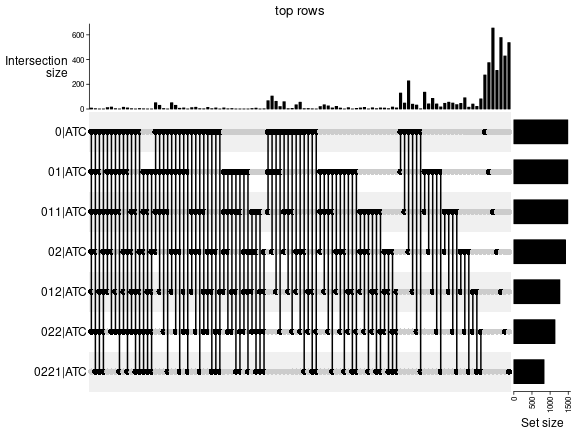


### UMAP plot

UMAP plot which shows how samples are separated.


<script>
$( function() {
	$( '#tabs-dimension-reduction-by-depth' ).tabs();
} );
</script>
<div id='tabs-dimension-reduction-by-depth'>
<ul>
<li><a href='#tab-dimension-reduction-by-depth-1'>n_signatures ≥ 441</a></li>
<li><a href='#tab-dimension-reduction-by-depth-2'>n_signatures ≥ 696</a></li>
<li><a href='#tab-dimension-reduction-by-depth-3'>n_signatures ≥ 2339</a></li>
<li><a href='#tab-dimension-reduction-by-depth-4'>n_signatures ≥ 4525</a></li>
<li><a href='#tab-dimension-reduction-by-depth-5'>n_signatures ≥ 5620</a></li>
<li><a href='#tab-dimension-reduction-by-depth-6'>n_signatures ≥ 6601</a></li>
<li><a href='#tab-dimension-reduction-by-depth-7'>n_signatures ≥ 10267</a></li>
</ul>
<div id='tab-dimension-reduction-by-depth-1'>
<pre><code class="r">par(mfrow = c(1, 2))
dimension_reduction(res_rh, merge_node = merge_node_param(min_n_signatures = 441),
    method = &quot;UMAP&quot;, top_value_method = &quot;SD&quot;, top_n = 2000, scale_rows = FALSE)
dimension_reduction(res_rh, merge_node = merge_node_param(min_n_signatures = 441),
    method = &quot;UMAP&quot;, top_value_method = &quot;ATC&quot;, top_n = 2000, scale_rows = TRUE)
</code></pre>

<p>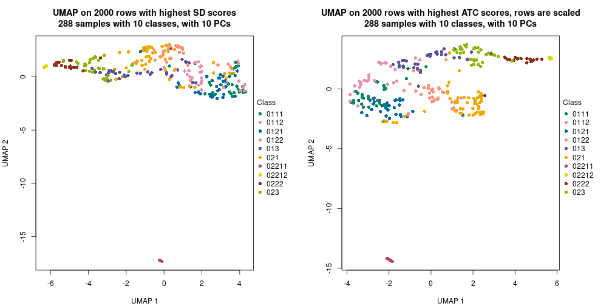</p>

</div>
<div id='tab-dimension-reduction-by-depth-2'>
<pre><code class="r">par(mfrow = c(1, 2))
dimension_reduction(res_rh, merge_node = merge_node_param(min_n_signatures = 696),
    method = &quot;UMAP&quot;, top_value_method = &quot;SD&quot;, top_n = 2000, scale_rows = FALSE)
dimension_reduction(res_rh, merge_node = merge_node_param(min_n_signatures = 696),
    method = &quot;UMAP&quot;, top_value_method = &quot;ATC&quot;, top_n = 2000, scale_rows = TRUE)
</code></pre>

<p>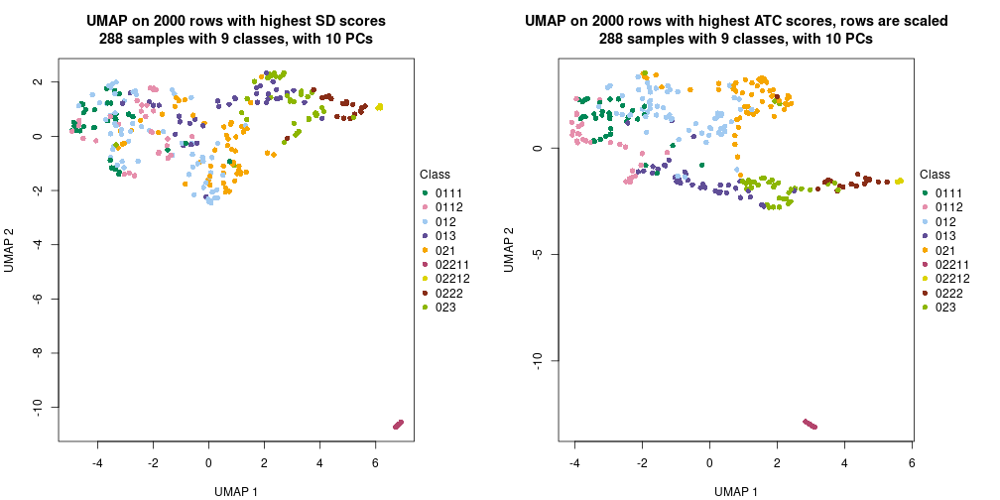</p>

</div>
<div id='tab-dimension-reduction-by-depth-3'>
<pre><code class="r">par(mfrow = c(1, 2))
dimension_reduction(res_rh, merge_node = merge_node_param(min_n_signatures = 2339),
    method = &quot;UMAP&quot;, top_value_method = &quot;SD&quot;, top_n = 2000, scale_rows = FALSE)
dimension_reduction(res_rh, merge_node = merge_node_param(min_n_signatures = 2339),
    method = &quot;UMAP&quot;, top_value_method = &quot;ATC&quot;, top_n = 2000, scale_rows = TRUE)
</code></pre>

<p>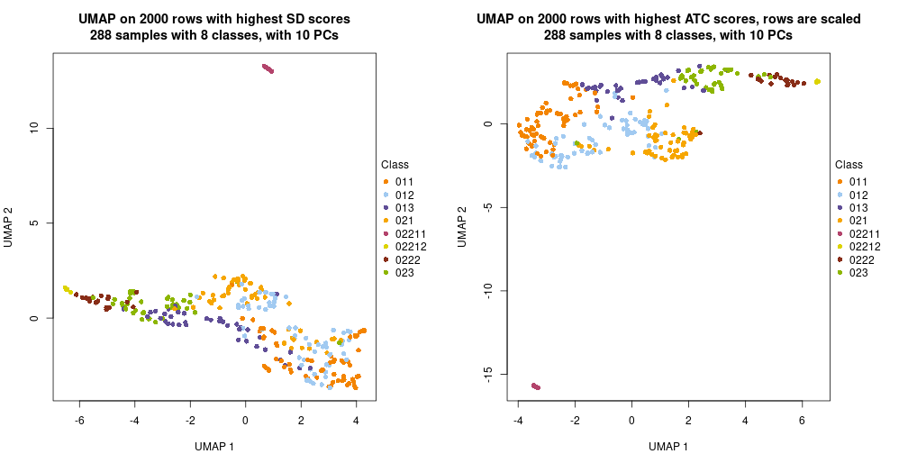</p>

</div>
<div id='tab-dimension-reduction-by-depth-4'>
<pre><code class="r">par(mfrow = c(1, 2))
dimension_reduction(res_rh, merge_node = merge_node_param(min_n_signatures = 4525),
    method = &quot;UMAP&quot;, top_value_method = &quot;SD&quot;, top_n = 2000, scale_rows = FALSE)
dimension_reduction(res_rh, merge_node = merge_node_param(min_n_signatures = 4525),
    method = &quot;UMAP&quot;, top_value_method = &quot;ATC&quot;, top_n = 2000, scale_rows = TRUE)
</code></pre>

<p>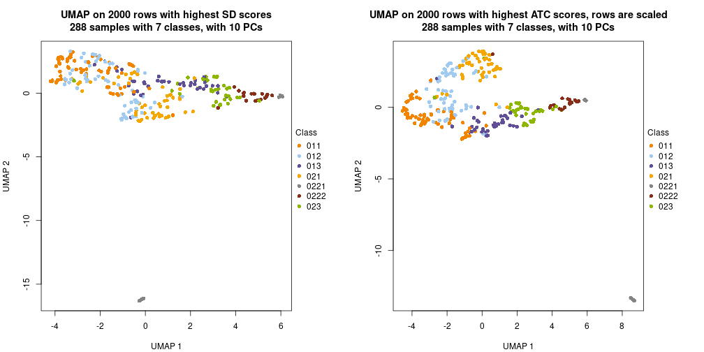</p>

</div>
<div id='tab-dimension-reduction-by-depth-5'>
<pre><code class="r">par(mfrow = c(1, 2))
dimension_reduction(res_rh, merge_node = merge_node_param(min_n_signatures = 5620),
    method = &quot;UMAP&quot;, top_value_method = &quot;SD&quot;, top_n = 2000, scale_rows = FALSE)
dimension_reduction(res_rh, merge_node = merge_node_param(min_n_signatures = 5620),
    method = &quot;UMAP&quot;, top_value_method = &quot;ATC&quot;, top_n = 2000, scale_rows = TRUE)
</code></pre>

<p>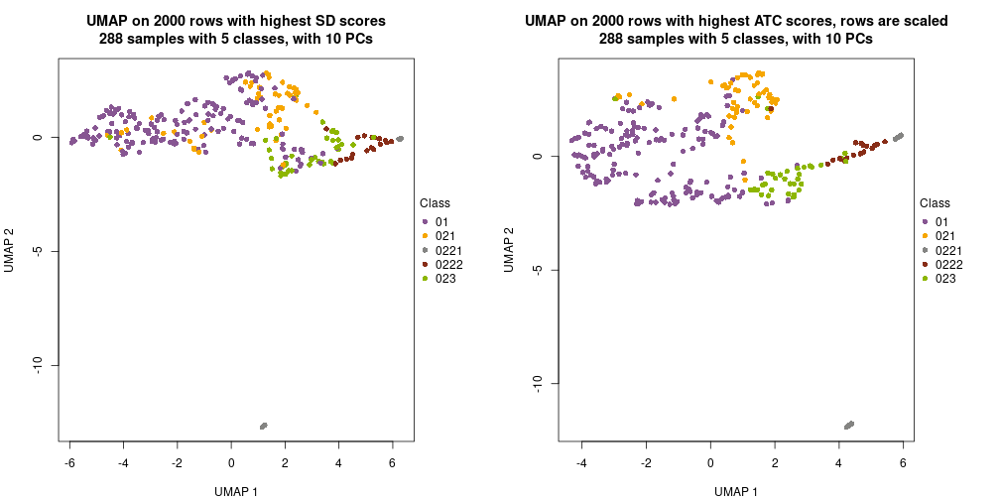</p>

</div>
<div id='tab-dimension-reduction-by-depth-6'>
<pre><code class="r">par(mfrow = c(1, 2))
dimension_reduction(res_rh, merge_node = merge_node_param(min_n_signatures = 6601),
    method = &quot;UMAP&quot;, top_value_method = &quot;SD&quot;, top_n = 2000, scale_rows = FALSE)
dimension_reduction(res_rh, merge_node = merge_node_param(min_n_signatures = 6601),
    method = &quot;UMAP&quot;, top_value_method = &quot;ATC&quot;, top_n = 2000, scale_rows = TRUE)
</code></pre>

<p>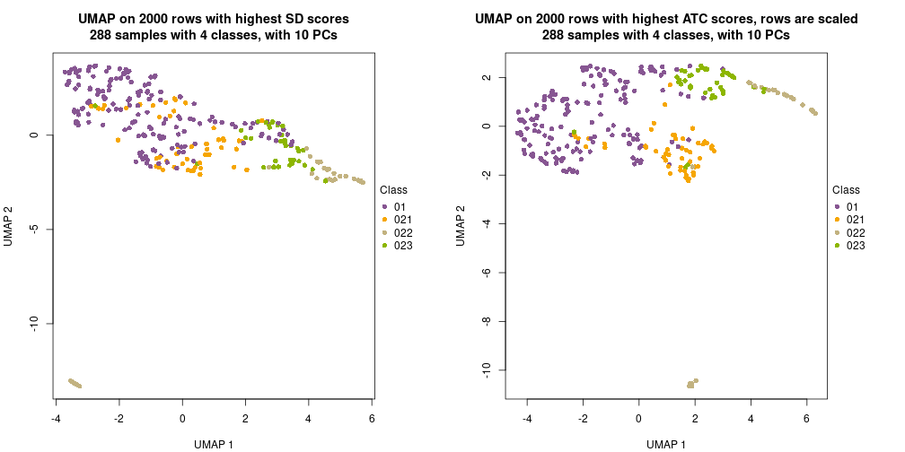</p>

</div>
<div id='tab-dimension-reduction-by-depth-7'>
<pre><code class="r">par(mfrow = c(1, 2))
dimension_reduction(res_rh, merge_node = merge_node_param(min_n_signatures = 10267),
    method = &quot;UMAP&quot;, top_value_method = &quot;SD&quot;, top_n = 2000, scale_rows = FALSE)
dimension_reduction(res_rh, merge_node = merge_node_param(min_n_signatures = 10267),
    method = &quot;UMAP&quot;, top_value_method = &quot;ATC&quot;, top_n = 2000, scale_rows = TRUE)
</code></pre>

<p>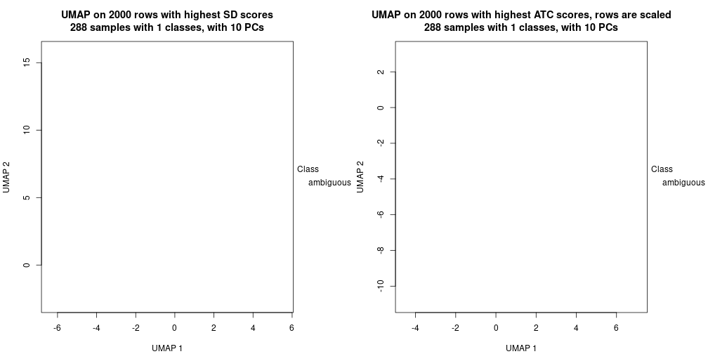</p>

</div>
</div>


### Signature heatmap

Signatures on the heatmap are the union of all signatures found on every node
on the hierarchy. The number of k-means on rows are automatically selected by the function.


<script>
$( function() {
	$( '#tabs-get-signatures-from-hierarchical-partition' ).tabs();
} );
</script>
<div id='tabs-get-signatures-from-hierarchical-partition'>
<ul>
<li><a href='#tab-get-signatures-from-hierarchical-partition-1'>n_signatures ≥ 441</a></li>
<li><a href='#tab-get-signatures-from-hierarchical-partition-2'>n_signatures ≥ 696</a></li>
<li><a href='#tab-get-signatures-from-hierarchical-partition-3'>n_signatures ≥ 2339</a></li>
<li><a href='#tab-get-signatures-from-hierarchical-partition-4'>n_signatures ≥ 4525</a></li>
<li><a href='#tab-get-signatures-from-hierarchical-partition-5'>n_signatures ≥ 5620</a></li>
<li><a href='#tab-get-signatures-from-hierarchical-partition-6'>n_signatures ≥ 6601</a></li>
<li><a href='#tab-get-signatures-from-hierarchical-partition-7'>n_signatures ≥ 10267</a></li>
</ul>
<div id='tab-get-signatures-from-hierarchical-partition-1'>
<pre><code class="r">get_signatures(res_rh, merge_node = merge_node_param(min_n_signatures = 441))
</code></pre>

<p>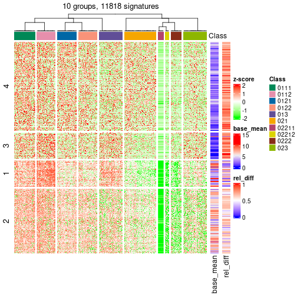</p>

</div>
<div id='tab-get-signatures-from-hierarchical-partition-2'>
<pre><code class="r">get_signatures(res_rh, merge_node = merge_node_param(min_n_signatures = 696))
</code></pre>

<p>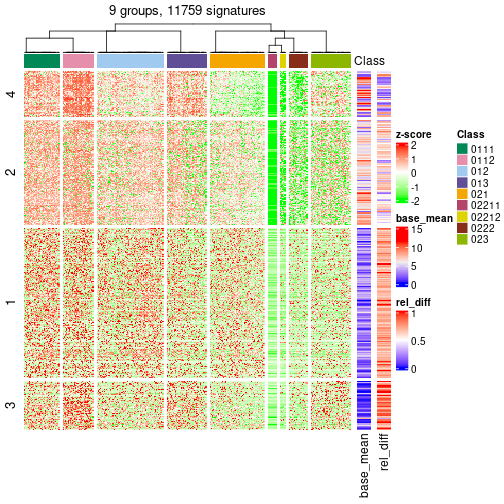</p>

</div>
<div id='tab-get-signatures-from-hierarchical-partition-3'>
<pre><code class="r">get_signatures(res_rh, merge_node = merge_node_param(min_n_signatures = 2339))
</code></pre>

<p>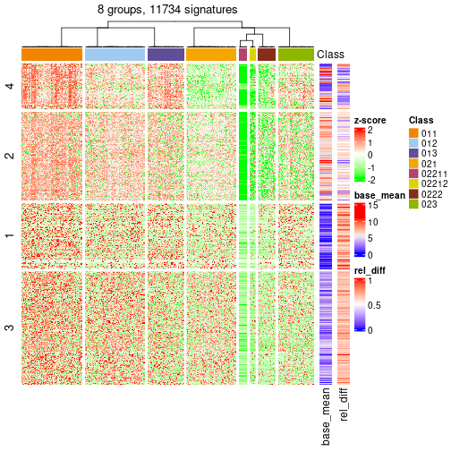</p>

</div>
<div id='tab-get-signatures-from-hierarchical-partition-4'>
<pre><code class="r">get_signatures(res_rh, merge_node = merge_node_param(min_n_signatures = 4525))
</code></pre>

<p>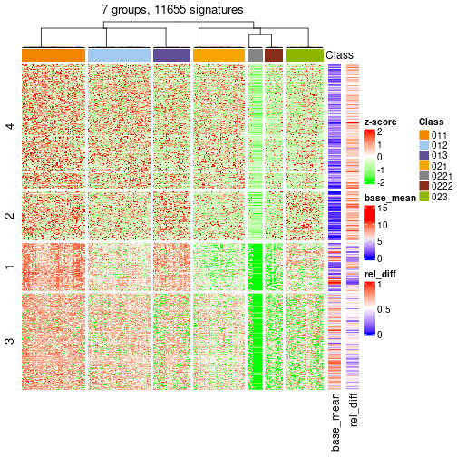</p>

</div>
<div id='tab-get-signatures-from-hierarchical-partition-5'>
<pre><code class="r">get_signatures(res_rh, merge_node = merge_node_param(min_n_signatures = 5620))
</code></pre>

<p>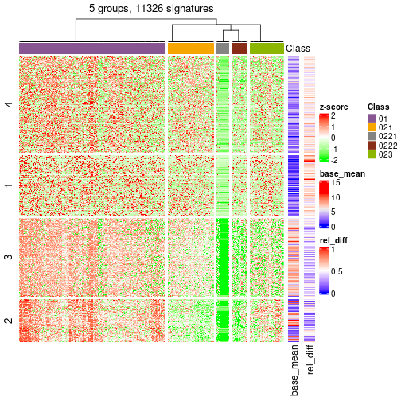</p>

</div>
<div id='tab-get-signatures-from-hierarchical-partition-6'>
<pre><code class="r">get_signatures(res_rh, merge_node = merge_node_param(min_n_signatures = 6601))
</code></pre>

<p>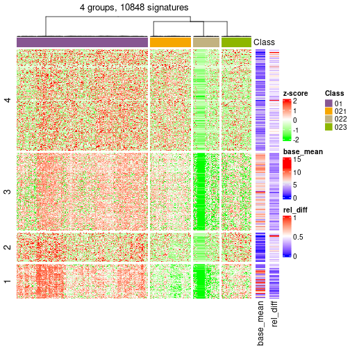</p>

</div>
<div id='tab-get-signatures-from-hierarchical-partition-7'>
<pre><code class="r">get_signatures(res_rh, merge_node = merge_node_param(min_n_signatures = 10267))
</code></pre>

<pre><code>#&gt; Error in names(x) &lt;- value: &#39;names&#39; attribute [1] must be the same length as the vector [0]
</code></pre>

</div>
</div>


Compare signatures from different nodes:


```r
compare_signatures(res_rh, verbose = FALSE)
```

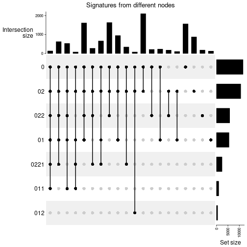

If there are too many signatures, `top_signatures = ...` can be set to only show the 
signatures with the highest FDRs. Note it only works on every node and the final signatures
are the union of all signatures of all nodes.


```r
# code only for demonstration
# e.g. to show the top 500 most significant rows on each node.
tb = get_signature(res_rh, top_signatures = 500)
```


## Results for each node


---------------------------------------------------


### Node0


Child nodes: 
                [Node01](#Node01)
        ,
                [Node02](#Node02)
        .


The object with results only for a single top-value method and a single partitioning method 
can be extracted as:

```r
res = res_rh["0"]
```

A summary of `res` and all the functions that can be applied to it:

```r
res
```

```
#> A 'ConsensusPartition' object with k = 2, 3, 4.
#>   On a matrix with 14880 rows and 288 columns.
#>   Top rows (1488) are extracted by 'ATC' method.
#>   Subgroups are detected by 'skmeans' method.
#>   Performed in total 150 partitions by row resampling.
#>   Best k for subgroups seems to be 2.
#> 
#> Following methods can be applied to this 'ConsensusPartition' object:
#>  [1] "cola_report"             "collect_classes"         "collect_plots"          
#>  [4] "collect_stats"           "colnames"                "compare_partitions"     
#>  [7] "compare_signatures"      "consensus_heatmap"       "dimension_reduction"    
#> [10] "functional_enrichment"   "get_anno_col"            "get_anno"               
#> [13] "get_classes"             "get_consensus"           "get_matrix"             
#> [16] "get_membership"          "get_param"               "get_signatures"         
#> [19] "get_stats"               "is_best_k"               "is_stable_k"            
#> [22] "membership_heatmap"      "ncol"                    "nrow"                   
#> [25] "plot_ecdf"               "predict_classes"         "rownames"               
#> [28] "select_partition_number" "show"                    "suggest_best_k"         
#> [31] "test_to_known_factors"   "top_rows_heatmap"
```

`collect_plots()` function collects all the plots made from `res` for all `k` (number of subgroups)
into one single page to provide an easy and fast comparison between different `k`.

```r
collect_plots(res)
```

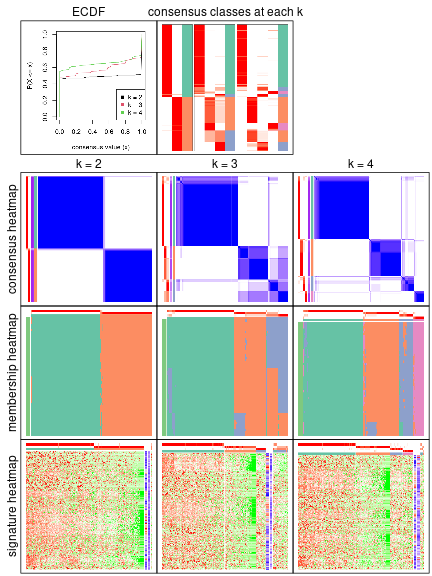

The plots are:

- The first row: a plot of the eCDF (empirical cumulative distribution
  function) curves of the consensus matrix for each `k` and the heatmap of
  predicted classes for each `k`.
- The second row: heatmaps of the consensus matrix for each `k`.
- The third row: heatmaps of the membership matrix for each `k`.
- The fouth row: heatmaps of the signatures for each `k`.

All the plots in panels can be made by individual functions and they are
plotted later in this section.

`select_partition_number()` produces several plots showing different
statistics for choosing "optimized" `k`. There are following statistics:

- eCDF curves of the consensus matrix for each `k`;
- 1-PAC. [The PAC score](https://en.wikipedia.org/wiki/Consensus_clustering#Over-interpretation_potential_of_consensus_clustering)
  measures the proportion of the ambiguous subgrouping.
- Mean silhouette score.
- Concordance. The mean probability of fiting the consensus subgroup labels in all
  partitions.
- Area increased. Denote $A_k$ as the area under the eCDF curve for current
  `k`, the area increased is defined as $A_k - A_{k-1}$.
- Rand index. The percent of pairs of samples that are both in a same cluster
  or both are not in a same cluster in the partition of k and k-1.
- Jaccard index. The ratio of pairs of samples are both in a same cluster in
  the partition of k and k-1 and the pairs of samples are both in a same
  cluster in the partition k or k-1.

The detailed explanations of these statistics can be found in [the _cola_
vignette](https://jokergoo.github.io/cola_vignettes/cola.html#toc_13).

Generally speaking, higher 1-PAC score, higher mean silhouette score or higher
concordance corresponds to better partition. Rand index and Jaccard index
measure how similar the current partition is compared to partition with `k-1`.
If they are too similar, we won't accept `k` is better than `k-1`.

```r
select_partition_number(res)
```

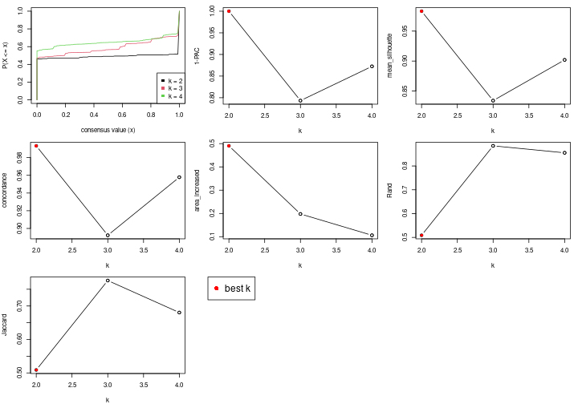

The numeric values for all these statistics can be obtained by `get_stats()`.

```r
get_stats(res)
```

```
#>   k 1-PAC mean_silhouette concordance area_increased  Rand Jaccard
#> 2 2 1.000           0.983       0.993          0.490 0.509   0.509
#> 3 3 0.793           0.834       0.892          0.198 0.885   0.776
#> 4 4 0.872           0.902       0.958          0.106 0.855   0.680
```

`suggest_best_k()` suggests the best $k$ based on these statistics. The rules are as follows:

- All $k$ with Jaccard index larger than 0.95 are removed because increasing
  $k$ does not provide enough extra information. If all $k$ are removed, it is
  marked as no subgroup is detected.
- For all $k$ with 1-PAC score larger than 0.9, the maximal $k$ is taken as
  the best $k$, and other $k$ are marked as optional $k$.
- If it does not fit the second rule. The $k$ with the maximal vote of the
  highest 1-PAC score, highest mean silhouette, and highest concordance is
  taken as the best $k$.

```r
suggest_best_k(res)
```

```
#> [1] 2
```


Following is the table of the partitions (You need to click the **show/hide
code output** link to see it). The membership matrix (columns with name `p*`)
is inferred by
[`clue::cl_consensus()`](https://www.rdocumentation.org/link/cl_consensus?package=clue)
function with the `SE` method. Basically the value in the membership matrix
represents the probability to belong to a certain group. The finall subgroup
label for an item is determined with the group with highest probability it
belongs to.

In `get_classes()` function, the entropy is calculated from the membership
matrix and the silhouette score is calculated from the consensus matrix.


<script>
$( function() {
	$( '#tabs-node-0-get-classes' ).tabs();
} );
</script>
<div id='tabs-node-0-get-classes'>
<ul>
<li><a href='#tab-node-0-get-classes-1'>k = 2</a></li>
<li><a href='#tab-node-0-get-classes-2'>k = 3</a></li>
<li><a href='#tab-node-0-get-classes-3'>k = 4</a></li>
</ul>

<div id='tab-node-0-get-classes-1'>
<p><a id='tab-node-0-get-classes-1-a' style='color:#0366d6' href='#'>show/hide code output</a></p>
<pre><code class="r">cbind(get_classes(res, k = 2), get_membership(res, k = 2))
</code></pre>

<pre><code>#&gt;                  class entropy silhouette   p1   p2
#&gt; G1_cell1_count       2   0.000      0.987 0.00 1.00
#&gt; G1_cell2_count       2   0.000      0.987 0.00 1.00
#&gt; G1_cell3_count       2   0.000      0.987 0.00 1.00
#&gt; G1_cell4_count       2   0.000      0.987 0.00 1.00
#&gt; G1_cell5_count       2   0.000      0.987 0.00 1.00
#&gt; G1_cell6_count       2   0.000      0.987 0.00 1.00
#&gt; G1_cell7_count       1   0.000      0.998 1.00 0.00
#&gt; G1_cell8_count       1   0.000      0.998 1.00 0.00
#&gt; G1_cell9_count       1   0.000      0.998 1.00 0.00
#&gt; G1_cell10_count      2   0.000      0.987 0.00 1.00
#&gt; G1_cell11_count      2   0.000      0.987 0.00 1.00
#&gt; G1_cell12_count      2   0.995      0.161 0.46 0.54
#&gt; G1_cell13_count      1   0.000      0.998 1.00 0.00
#&gt; G1_cell14_count      2   0.000      0.987 0.00 1.00
#&gt; G1_cell15_count      1   0.000      0.998 1.00 0.00
#&gt; G1_cell16_count      1   0.000      0.998 1.00 0.00
#&gt; G1_cell17_count      1   0.000      0.998 1.00 0.00
#&gt; G1_cell18_count      2   0.000      0.987 0.00 1.00
#&gt; G1_cell19_count      2   0.242      0.949 0.04 0.96
#&gt; G1_cell20_count      1   0.000      0.998 1.00 0.00
#&gt; G1_cell21_count      2   0.000      0.987 0.00 1.00
#&gt; G1_cell22_count      1   0.000      0.998 1.00 0.00
#&gt; G1_cell23_count      1   0.000      0.998 1.00 0.00
#&gt; G1_cell24_count      2   0.000      0.987 0.00 1.00
#&gt; G1_cell25_count      1   0.000      0.998 1.00 0.00
#&gt; G1_cell26_count      1   0.000      0.998 1.00 0.00
#&gt; G1_cell27_count      2   0.000      0.987 0.00 1.00
#&gt; G1_cell28_count      2   0.000      0.987 0.00 1.00
#&gt; G1_cell29_count      2   0.000      0.987 0.00 1.00
#&gt; G1_cell30_count      1   0.000      0.998 1.00 0.00
#&gt; G1_cell31_count      2   0.000      0.987 0.00 1.00
#&gt; G1_cell32_count      2   0.000      0.987 0.00 1.00
#&gt; G1_cell33_count      2   0.000      0.987 0.00 1.00
#&gt; G1_cell34_count      2   0.000      0.987 0.00 1.00
#&gt; G1_cell35_count      2   0.000      0.987 0.00 1.00
#&gt; G1_cell36_count      1   0.000      0.998 1.00 0.00
#&gt; G1_cell37_count      2   0.000      0.987 0.00 1.00
#&gt; G1_cell38_count      2   0.000      0.987 0.00 1.00
#&gt; G1_cell39_count      1   0.000      0.998 1.00 0.00
#&gt; G1_cell40_count      2   0.000      0.987 0.00 1.00
#&gt; G1_cell41_count      1   0.000      0.998 1.00 0.00
#&gt; G1_cell42_count      1   0.000      0.998 1.00 0.00
#&gt; G1_cell43_count      1   0.000      0.998 1.00 0.00
#&gt; G1_cell44_count      1   0.000      0.998 1.00 0.00
#&gt; G1_cell45_count      2   0.000      0.987 0.00 1.00
#&gt; G1_cell46_count      2   0.000      0.987 0.00 1.00
#&gt; G1_cell47_count      1   0.000      0.998 1.00 0.00
#&gt; G1_cell48_count      2   0.000      0.987 0.00 1.00
#&gt; G1_cell49_count      1   0.000      0.998 1.00 0.00
#&gt; G1_cell50_count      2   0.000      0.987 0.00 1.00
#&gt; G1_cell51_count      2   0.000      0.987 0.00 1.00
#&gt; G1_cell52_count      2   0.000      0.987 0.00 1.00
#&gt; G1_cell53_count      2   0.000      0.987 0.00 1.00
#&gt; G1_cell54_count      1   0.000      0.998 1.00 0.00
#&gt; G1_cell55_count      1   0.000      0.998 1.00 0.00
#&gt; G1_cell56_count      2   0.000      0.987 0.00 1.00
#&gt; G1_cell57_count      1   0.000      0.998 1.00 0.00
#&gt; G1_cell58_count      2   0.000      0.987 0.00 1.00
#&gt; G1_cell59_count      2   0.000      0.987 0.00 1.00
#&gt; G1_cell60_count      1   0.000      0.998 1.00 0.00
#&gt; G1_cell61_count      1   0.000      0.998 1.00 0.00
#&gt; G1_cell62_count      1   0.000      0.998 1.00 0.00
#&gt; G1_cell63_count      2   0.000      0.987 0.00 1.00
#&gt; G1_cell64_count      1   0.000      0.998 1.00 0.00
#&gt; G1_cell65_count      1   0.000      0.998 1.00 0.00
#&gt; G1_cell66_count      1   0.000      0.998 1.00 0.00
#&gt; G1_cell67_count      2   0.000      0.987 0.00 1.00
#&gt; G1_cell68_count      1   0.000      0.998 1.00 0.00
#&gt; G1_cell69_count      2   0.000      0.987 0.00 1.00
#&gt; G1_cell70_count      1   0.000      0.998 1.00 0.00
#&gt; G1_cell71_count      2   0.000      0.987 0.00 1.00
#&gt; G1_cell72_count      2   0.000      0.987 0.00 1.00
#&gt; G1_cell73_count      1   0.000      0.998 1.00 0.00
#&gt; G1_cell74_count      1   0.000      0.998 1.00 0.00
#&gt; G1_cell75_count      1   0.000      0.998 1.00 0.00
#&gt; G1_cell76_count      2   0.000      0.987 0.00 1.00
#&gt; G1_cell77_count      1   0.000      0.998 1.00 0.00
#&gt; G1_cell78_count      2   0.000      0.987 0.00 1.00
#&gt; G1_cell79_count      1   0.000      0.998 1.00 0.00
#&gt; G1_cell80_count      1   0.000      0.998 1.00 0.00
#&gt; G1_cell81_count      1   0.000      0.998 1.00 0.00
#&gt; G1_cell82_count      2   0.000      0.987 0.00 1.00
#&gt; G1_cell83_count      1   0.000      0.998 1.00 0.00
#&gt; G1_cell84_count      1   0.000      0.998 1.00 0.00
#&gt; G1_cell85_count      2   0.000      0.987 0.00 1.00
#&gt; G1_cell86_count      1   0.000      0.998 1.00 0.00
#&gt; G1_cell87_count      1   0.000      0.998 1.00 0.00
#&gt; G1_cell88_count      2   0.000      0.987 0.00 1.00
#&gt; G1_cell89_count      2   0.000      0.987 0.00 1.00
#&gt; G1_cell90_count      2   0.000      0.987 0.00 1.00
#&gt; G1_cell91_count      1   0.000      0.998 1.00 0.00
#&gt; G1_cell92_count      2   0.000      0.987 0.00 1.00
#&gt; G1_cell93_count      1   0.000      0.998 1.00 0.00
#&gt; G1_cell94_count      1   0.000      0.998 1.00 0.00
#&gt; G1_cell95_count      1   0.000      0.998 1.00 0.00
#&gt; G1_cell96_count      1   0.000      0.998 1.00 0.00
#&gt; S_cell1_count        2   0.000      0.987 0.00 1.00
#&gt; S_cell2_count        1   0.000      0.998 1.00 0.00
#&gt; S_cell3_count        1   0.000      0.998 1.00 0.00
#&gt; S_cell4_count        1   0.000      0.998 1.00 0.00
#&gt; S_cell5_count        2   0.000      0.987 0.00 1.00
#&gt; S_cell6_count        1   0.000      0.998 1.00 0.00
#&gt; S_cell7_count        1   0.000      0.998 1.00 0.00
#&gt; S_cell8_count        1   0.000      0.998 1.00 0.00
#&gt; S_cell9_count        1   0.000      0.998 1.00 0.00
#&gt; S_cell10_count       1   0.000      0.998 1.00 0.00
#&gt; S_cell11_count       1   0.881      0.565 0.70 0.30
#&gt; S_cell12_count       2   0.000      0.987 0.00 1.00
#&gt; S_cell13_count       1   0.000      0.998 1.00 0.00
#&gt; S_cell14_count       1   0.000      0.998 1.00 0.00
#&gt; S_cell15_count       1   0.000      0.998 1.00 0.00
#&gt; S_cell16_count       1   0.000      0.998 1.00 0.00
#&gt; S_cell17_count       1   0.000      0.998 1.00 0.00
#&gt; S_cell18_count       2   0.000      0.987 0.00 1.00
#&gt; S_cell19_count       1   0.000      0.998 1.00 0.00
#&gt; S_cell20_count       1   0.000      0.998 1.00 0.00
#&gt; S_cell21_count       2   0.000      0.987 0.00 1.00
#&gt; S_cell22_count       1   0.000      0.998 1.00 0.00
#&gt; S_cell23_count       2   0.000      0.987 0.00 1.00
#&gt; S_cell24_count       1   0.000      0.998 1.00 0.00
#&gt; S_cell25_count       2   0.000      0.987 0.00 1.00
#&gt; S_cell26_count       1   0.000      0.998 1.00 0.00
#&gt; S_cell27_count       1   0.000      0.998 1.00 0.00
#&gt; S_cell28_count       1   0.000      0.998 1.00 0.00
#&gt; S_cell29_count       1   0.000      0.998 1.00 0.00
#&gt; S_cell30_count       1   0.000      0.998 1.00 0.00
#&gt; S_cell31_count       2   0.000      0.987 0.00 1.00
#&gt; S_cell32_count       1   0.000      0.998 1.00 0.00
#&gt; S_cell33_count       1   0.000      0.998 1.00 0.00
#&gt; S_cell34_count       2   0.000      0.987 0.00 1.00
#&gt; S_cell35_count       1   0.000      0.998 1.00 0.00
#&gt; S_cell36_count       1   0.000      0.998 1.00 0.00
#&gt; S_cell37_count       1   0.000      0.998 1.00 0.00
#&gt; S_cell38_count       2   0.000      0.987 0.00 1.00
#&gt; S_cell39_count       1   0.000      0.998 1.00 0.00
#&gt; S_cell40_count       1   0.000      0.998 1.00 0.00
#&gt; S_cell41_count       1   0.000      0.998 1.00 0.00
#&gt; S_cell42_count       1   0.000      0.998 1.00 0.00
#&gt; S_cell43_count       1   0.000      0.998 1.00 0.00
#&gt; S_cell44_count       2   0.000      0.987 0.00 1.00
#&gt; S_cell45_count       1   0.000      0.998 1.00 0.00
#&gt; S_cell46_count       1   0.000      0.998 1.00 0.00
#&gt; S_cell47_count       1   0.000      0.998 1.00 0.00
#&gt; S_cell48_count       1   0.000      0.998 1.00 0.00
#&gt; S_cell49_count       1   0.000      0.998 1.00 0.00
#&gt; S_cell50_count       1   0.000      0.998 1.00 0.00
#&gt; S_cell51_count       2   0.000      0.987 0.00 1.00
#&gt; S_cell52_count       1   0.000      0.998 1.00 0.00
#&gt; S_cell53_count       1   0.000      0.998 1.00 0.00
#&gt; S_cell54_count       1   0.000      0.998 1.00 0.00
#&gt; S_cell55_count       1   0.000      0.998 1.00 0.00
#&gt; S_cell56_count       2   0.000      0.987 0.00 1.00
#&gt; S_cell57_count       1   0.000      0.998 1.00 0.00
#&gt; S_cell58_count       2   0.000      0.987 0.00 1.00
#&gt; S_cell59_count       1   0.000      0.998 1.00 0.00
#&gt; S_cell60_count       1   0.000      0.998 1.00 0.00
#&gt; S_cell61_count       1   0.000      0.998 1.00 0.00
#&gt; S_cell62_count       1   0.000      0.998 1.00 0.00
#&gt; S_cell63_count       1   0.000      0.998 1.00 0.00
#&gt; S_cell64_count       2   0.000      0.987 0.00 1.00
#&gt; S_cell65_count       2   0.000      0.987 0.00 1.00
#&gt; S_cell66_count       1   0.000      0.998 1.00 0.00
#&gt; S_cell67_count       2   0.000      0.987 0.00 1.00
#&gt; S_cell68_count       1   0.000      0.998 1.00 0.00
#&gt; S_cell69_count       1   0.000      0.998 1.00 0.00
#&gt; S_cell70_count       1   0.000      0.998 1.00 0.00
#&gt; S_cell71_count       2   0.000      0.987 0.00 1.00
#&gt; S_cell72_count       1   0.000      0.998 1.00 0.00
#&gt; S_cell73_count       1   0.000      0.998 1.00 0.00
#&gt; S_cell74_count       2   0.000      0.987 0.00 1.00
#&gt; S_cell75_count       2   0.000      0.987 0.00 1.00
#&gt; S_cell76_count       1   0.000      0.998 1.00 0.00
#&gt; S_cell77_count       2   0.000      0.987 0.00 1.00
#&gt; S_cell78_count       2   0.000      0.987 0.00 1.00
#&gt; S_cell79_count       1   0.000      0.998 1.00 0.00
#&gt; S_cell80_count       1   0.000      0.998 1.00 0.00
#&gt; S_cell81_count       2   0.000      0.987 0.00 1.00
#&gt; S_cell82_count       1   0.000      0.998 1.00 0.00
#&gt; S_cell83_count       1   0.000      0.998 1.00 0.00
#&gt; S_cell84_count       2   0.000      0.987 0.00 1.00
#&gt; S_cell85_count       1   0.000      0.998 1.00 0.00
#&gt; S_cell86_count       1   0.000      0.998 1.00 0.00
#&gt; S_cell87_count       2   0.000      0.987 0.00 1.00
#&gt; S_cell88_count       2   0.000      0.987 0.00 1.00
#&gt; S_cell89_count       1   0.000      0.998 1.00 0.00
#&gt; S_cell90_count       2   0.000      0.987 0.00 1.00
#&gt; S_cell91_count       2   0.000      0.987 0.00 1.00
#&gt; S_cell92_count       1   0.000      0.998 1.00 0.00
#&gt; S_cell93_count       1   0.000      0.998 1.00 0.00
#&gt; S_cell94_count       2   0.000      0.987 0.00 1.00
#&gt; S_cell95_count       2   0.000      0.987 0.00 1.00
#&gt; S_cell96_count       2   0.000      0.987 0.00 1.00
#&gt; G2M_cell1_count      2   0.000      0.987 0.00 1.00
#&gt; G2M_cell2_count      2   0.000      0.987 0.00 1.00
#&gt; G2M_cell3_count      2   0.000      0.987 0.00 1.00
#&gt; G2M_cell4_count      2   0.000      0.987 0.00 1.00
#&gt; G2M_cell5_count      1   0.000      0.998 1.00 0.00
#&gt; G2M_cell6_count      2   0.904      0.538 0.32 0.68
#&gt; G2M_cell7_count      1   0.000      0.998 1.00 0.00
#&gt; G2M_cell8_count      1   0.000      0.998 1.00 0.00
#&gt; G2M_cell9_count      1   0.000      0.998 1.00 0.00
#&gt; G2M_cell10_count     1   0.000      0.998 1.00 0.00
#&gt; G2M_cell11_count     1   0.000      0.998 1.00 0.00
#&gt; G2M_cell12_count     1   0.000      0.998 1.00 0.00
#&gt; G2M_cell13_count     1   0.000      0.998 1.00 0.00
#&gt; G2M_cell14_count     2   0.000      0.987 0.00 1.00
#&gt; G2M_cell15_count     2   0.000      0.987 0.00 1.00
#&gt; G2M_cell16_count     2   0.000      0.987 0.00 1.00
#&gt; G2M_cell17_count     1   0.000      0.998 1.00 0.00
#&gt; G2M_cell18_count     1   0.000      0.998 1.00 0.00
#&gt; G2M_cell19_count     1   0.000      0.998 1.00 0.00
#&gt; G2M_cell20_count     1   0.000      0.998 1.00 0.00
#&gt; G2M_cell21_count     1   0.000      0.998 1.00 0.00
#&gt; G2M_cell22_count     2   0.000      0.987 0.00 1.00
#&gt; G2M_cell23_count     1   0.000      0.998 1.00 0.00
#&gt; G2M_cell24_count     2   0.000      0.987 0.00 1.00
#&gt; G2M_cell25_count     1   0.000      0.998 1.00 0.00
#&gt; G2M_cell26_count     2   0.000      0.987 0.00 1.00
#&gt; G2M_cell27_count     2   0.000      0.987 0.00 1.00
#&gt; G2M_cell28_count     2   0.000      0.987 0.00 1.00
#&gt; G2M_cell29_count     2   0.000      0.987 0.00 1.00
#&gt; G2M_cell30_count     2   0.000      0.987 0.00 1.00
#&gt; G2M_cell31_count     2   0.000      0.987 0.00 1.00
#&gt; G2M_cell32_count     1   0.000      0.998 1.00 0.00
#&gt; G2M_cell33_count     1   0.000      0.998 1.00 0.00
#&gt; G2M_cell34_count     1   0.000      0.998 1.00 0.00
#&gt; G2M_cell35_count     1   0.000      0.998 1.00 0.00
#&gt; G2M_cell36_count     2   0.000      0.987 0.00 1.00
#&gt; G2M_cell37_count     1   0.000      0.998 1.00 0.00
#&gt; G2M_cell38_count     2   0.000      0.987 0.00 1.00
#&gt; G2M_cell39_count     2   0.000      0.987 0.00 1.00
#&gt; G2M_cell40_count     2   0.000      0.987 0.00 1.00
#&gt; G2M_cell41_count     1   0.402      0.911 0.92 0.08
#&gt; G2M_cell42_count     2   0.000      0.987 0.00 1.00
#&gt; G2M_cell43_count     2   0.000      0.987 0.00 1.00
#&gt; G2M_cell44_count     1   0.000      0.998 1.00 0.00
#&gt; G2M_cell45_count     1   0.000      0.998 1.00 0.00
#&gt; G2M_cell46_count     2   0.000      0.987 0.00 1.00
#&gt; G2M_cell47_count     1   0.000      0.998 1.00 0.00
#&gt; G2M_cell48_count     1   0.000      0.998 1.00 0.00
#&gt; G2M_cell49_count     1   0.000      0.998 1.00 0.00
#&gt; G2M_cell50_count     1   0.000      0.998 1.00 0.00
#&gt; G2M_cell51_count     2   0.402      0.906 0.08 0.92
#&gt; G2M_cell52_count     2   0.000      0.987 0.00 1.00
#&gt; G2M_cell53_count     2   0.000      0.987 0.00 1.00
#&gt; G2M_cell54_count     2   0.943      0.447 0.36 0.64
#&gt; G2M_cell55_count     1   0.000      0.998 1.00 0.00
#&gt; G2M_cell56_count     2   0.000      0.987 0.00 1.00
#&gt; G2M_cell57_count     1   0.000      0.998 1.00 0.00
#&gt; G2M_cell58_count     1   0.000      0.998 1.00 0.00
#&gt; G2M_cell59_count     1   0.000      0.998 1.00 0.00
#&gt; G2M_cell60_count     1   0.000      0.998 1.00 0.00
#&gt; G2M_cell61_count     1   0.000      0.998 1.00 0.00
#&gt; G2M_cell62_count     1   0.000      0.998 1.00 0.00
#&gt; G2M_cell63_count     1   0.000      0.998 1.00 0.00
#&gt; G2M_cell64_count     2   0.000      0.987 0.00 1.00
#&gt; G2M_cell65_count     1   0.000      0.998 1.00 0.00
#&gt; G2M_cell66_count     2   0.000      0.987 0.00 1.00
#&gt; G2M_cell67_count     2   0.000      0.987 0.00 1.00
#&gt; G2M_cell68_count     1   0.000      0.998 1.00 0.00
#&gt; G2M_cell69_count     1   0.000      0.998 1.00 0.00
#&gt; G2M_cell70_count     2   0.000      0.987 0.00 1.00
#&gt; G2M_cell71_count     1   0.000      0.998 1.00 0.00
#&gt; G2M_cell72_count     2   0.881      0.579 0.30 0.70
#&gt; G2M_cell73_count     1   0.000      0.998 1.00 0.00
#&gt; G2M_cell74_count     1   0.000      0.998 1.00 0.00
#&gt; G2M_cell75_count     1   0.000      0.998 1.00 0.00
#&gt; G2M_cell76_count     1   0.000      0.998 1.00 0.00
#&gt; G2M_cell77_count     2   0.000      0.987 0.00 1.00
#&gt; G2M_cell78_count     2   0.000      0.987 0.00 1.00
#&gt; G2M_cell79_count     1   0.000      0.998 1.00 0.00
#&gt; G2M_cell80_count     1   0.000      0.998 1.00 0.00
#&gt; G2M_cell81_count     2   0.000      0.987 0.00 1.00
#&gt; G2M_cell82_count     2   0.000      0.987 0.00 1.00
#&gt; G2M_cell83_count     1   0.000      0.998 1.00 0.00
#&gt; G2M_cell84_count     1   0.000      0.998 1.00 0.00
#&gt; G2M_cell85_count     2   0.000      0.987 0.00 1.00
#&gt; G2M_cell86_count     1   0.000      0.998 1.00 0.00
#&gt; G2M_cell87_count     1   0.000      0.998 1.00 0.00
#&gt; G2M_cell88_count     1   0.000      0.998 1.00 0.00
#&gt; G2M_cell89_count     2   0.000      0.987 0.00 1.00
#&gt; G2M_cell90_count     1   0.000      0.998 1.00 0.00
#&gt; G2M_cell91_count     1   0.000      0.998 1.00 0.00
#&gt; G2M_cell92_count     2   0.000      0.987 0.00 1.00
#&gt; G2M_cell93_count     2   0.000      0.987 0.00 1.00
#&gt; G2M_cell94_count     2   0.000      0.987 0.00 1.00
#&gt; G2M_cell95_count     2   0.000      0.987 0.00 1.00
#&gt; G2M_cell96_count     2   0.000      0.987 0.00 1.00
</code></pre>

<script>
$('#tab-node-0-get-classes-1-a').parent().next().next().hide();
$('#tab-node-0-get-classes-1-a').click(function(){
  $('#tab-node-0-get-classes-1-a').parent().next().next().toggle();
  return(false);
});
</script>
</div>

<div id='tab-node-0-get-classes-2'>
<p><a id='tab-node-0-get-classes-2-a' style='color:#0366d6' href='#'>show/hide code output</a></p>
<pre><code class="r">cbind(get_classes(res, k = 3), get_membership(res, k = 3))
</code></pre>

<pre><code>#&gt;                  class entropy silhouette   p1   p2   p3
#&gt; G1_cell1_count       2  0.4555      0.877 0.00 0.80 0.20
#&gt; G1_cell2_count       2  0.0000      0.780 0.00 1.00 0.00
#&gt; G1_cell3_count       2  0.0000      0.780 0.00 1.00 0.00
#&gt; G1_cell4_count       2  0.4555      0.877 0.00 0.80 0.20
#&gt; G1_cell5_count       2  0.0000      0.780 0.00 1.00 0.00
#&gt; G1_cell6_count       2  0.4555      0.877 0.00 0.80 0.20
#&gt; G1_cell7_count       1  0.0000      0.969 1.00 0.00 0.00
#&gt; G1_cell8_count       1  0.0000      0.969 1.00 0.00 0.00
#&gt; G1_cell9_count       1  0.0000      0.969 1.00 0.00 0.00
#&gt; G1_cell10_count      3  0.6045      0.466 0.00 0.38 0.62
#&gt; G1_cell11_count      2  0.0000      0.780 0.00 1.00 0.00
#&gt; G1_cell12_count      2  0.0000      0.780 0.00 1.00 0.00
#&gt; G1_cell13_count      1  0.0000      0.969 1.00 0.00 0.00
#&gt; G1_cell14_count      2  0.0000      0.780 0.00 1.00 0.00
#&gt; G1_cell15_count      1  0.0000      0.969 1.00 0.00 0.00
#&gt; G1_cell16_count      1  0.0000      0.969 1.00 0.00 0.00
#&gt; G1_cell17_count      1  0.0000      0.969 1.00 0.00 0.00
#&gt; G1_cell18_count      2  0.0000      0.780 0.00 1.00 0.00
#&gt; G1_cell19_count      2  0.0000      0.780 0.00 1.00 0.00
#&gt; G1_cell20_count      1  0.4002      0.816 0.84 0.16 0.00
#&gt; G1_cell21_count      3  0.6045      0.466 0.00 0.38 0.62
#&gt; G1_cell22_count      1  0.0000      0.969 1.00 0.00 0.00
#&gt; G1_cell23_count      1  0.0000      0.969 1.00 0.00 0.00
#&gt; G1_cell24_count      3  0.6045      0.466 0.00 0.38 0.62
#&gt; G1_cell25_count      1  0.0000      0.969 1.00 0.00 0.00
#&gt; G1_cell26_count      1  0.0000      0.969 1.00 0.00 0.00
#&gt; G1_cell27_count      2  0.0000      0.780 0.00 1.00 0.00
#&gt; G1_cell28_count      2  0.4555      0.877 0.00 0.80 0.20
#&gt; G1_cell29_count      2  0.0892      0.792 0.00 0.98 0.02
#&gt; G1_cell30_count      1  0.0000      0.969 1.00 0.00 0.00
#&gt; G1_cell31_count      2  0.4555      0.877 0.00 0.80 0.20
#&gt; G1_cell32_count      2  0.5835      0.537 0.00 0.66 0.34
#&gt; G1_cell33_count      2  0.2537      0.824 0.00 0.92 0.08
#&gt; G1_cell34_count      2  0.4555      0.877 0.00 0.80 0.20
#&gt; G1_cell35_count      2  0.4555      0.877 0.00 0.80 0.20
#&gt; G1_cell36_count      1  0.0000      0.969 1.00 0.00 0.00
#&gt; G1_cell37_count      2  0.4555      0.877 0.00 0.80 0.20
#&gt; G1_cell38_count      2  0.0000      0.780 0.00 1.00 0.00
#&gt; G1_cell39_count      1  0.0892      0.952 0.98 0.02 0.00
#&gt; G1_cell40_count      2  0.2537      0.824 0.00 0.92 0.08
#&gt; G1_cell41_count      1  0.0000      0.969 1.00 0.00 0.00
#&gt; G1_cell42_count      1  0.0000      0.969 1.00 0.00 0.00
#&gt; G1_cell43_count      1  0.0000      0.969 1.00 0.00 0.00
#&gt; G1_cell44_count      1  0.0000      0.969 1.00 0.00 0.00
#&gt; G1_cell45_count      2  0.0000      0.780 0.00 1.00 0.00
#&gt; G1_cell46_count      2  0.0000      0.780 0.00 1.00 0.00
#&gt; G1_cell47_count      1  0.4555      0.769 0.80 0.20 0.00
#&gt; G1_cell48_count      2  0.4555      0.877 0.00 0.80 0.20
#&gt; G1_cell49_count      1  0.0000      0.969 1.00 0.00 0.00
#&gt; G1_cell50_count      2  0.4555      0.877 0.00 0.80 0.20
#&gt; G1_cell51_count      2  0.2537      0.824 0.00 0.92 0.08
#&gt; G1_cell52_count      2  0.0000      0.780 0.00 1.00 0.00
#&gt; G1_cell53_count      2  0.0000      0.780 0.00 1.00 0.00
#&gt; G1_cell54_count      1  0.0000      0.969 1.00 0.00 0.00
#&gt; G1_cell55_count      1  0.3686      0.838 0.86 0.14 0.00
#&gt; G1_cell56_count      2  0.4555      0.877 0.00 0.80 0.20
#&gt; G1_cell57_count      1  0.4555      0.769 0.80 0.20 0.00
#&gt; G1_cell58_count      2  0.0000      0.780 0.00 1.00 0.00
#&gt; G1_cell59_count      2  0.2537      0.824 0.00 0.92 0.08
#&gt; G1_cell60_count      1  0.0000      0.969 1.00 0.00 0.00
#&gt; G1_cell61_count      1  0.6244      0.351 0.56 0.44 0.00
#&gt; G1_cell62_count      1  0.0000      0.969 1.00 0.00 0.00
#&gt; G1_cell63_count      3  0.6045      0.466 0.00 0.38 0.62
#&gt; G1_cell64_count      1  0.4291      0.793 0.82 0.18 0.00
#&gt; G1_cell65_count      1  0.4555      0.769 0.80 0.20 0.00
#&gt; G1_cell66_count      1  0.0000      0.969 1.00 0.00 0.00
#&gt; G1_cell67_count      2  0.4555      0.877 0.00 0.80 0.20
#&gt; G1_cell68_count      1  0.0000      0.969 1.00 0.00 0.00
#&gt; G1_cell69_count      2  0.0000      0.780 0.00 1.00 0.00
#&gt; G1_cell70_count      1  0.0000      0.969 1.00 0.00 0.00
#&gt; G1_cell71_count      2  0.0892      0.792 0.00 0.98 0.02
#&gt; G1_cell72_count      3  0.6045      0.466 0.00 0.38 0.62
#&gt; G1_cell73_count      1  0.0000      0.969 1.00 0.00 0.00
#&gt; G1_cell74_count      1  0.6126      0.441 0.60 0.00 0.40
#&gt; G1_cell75_count      1  0.0000      0.969 1.00 0.00 0.00
#&gt; G1_cell76_count      2  0.4555      0.877 0.00 0.80 0.20
#&gt; G1_cell77_count      1  0.0000      0.969 1.00 0.00 0.00
#&gt; G1_cell78_count      2  0.0000      0.780 0.00 1.00 0.00
#&gt; G1_cell79_count      1  0.2959      0.879 0.90 0.10 0.00
#&gt; G1_cell80_count      1  0.0000      0.969 1.00 0.00 0.00
#&gt; G1_cell81_count      1  0.0000      0.969 1.00 0.00 0.00
#&gt; G1_cell82_count      2  0.4555      0.877 0.00 0.80 0.20
#&gt; G1_cell83_count      1  0.0000      0.969 1.00 0.00 0.00
#&gt; G1_cell84_count      1  0.0000      0.969 1.00 0.00 0.00
#&gt; G1_cell85_count      2  0.4555      0.877 0.00 0.80 0.20
#&gt; G1_cell86_count      1  0.0000      0.969 1.00 0.00 0.00
#&gt; G1_cell87_count      1  0.0000      0.969 1.00 0.00 0.00
#&gt; G1_cell88_count      2  0.4555      0.877 0.00 0.80 0.20
#&gt; G1_cell89_count      3  0.0892      0.671 0.00 0.02 0.98
#&gt; G1_cell90_count      3  0.6045      0.466 0.00 0.38 0.62
#&gt; G1_cell91_count      1  0.0000      0.969 1.00 0.00 0.00
#&gt; G1_cell92_count      2  0.0000      0.780 0.00 1.00 0.00
#&gt; G1_cell93_count      1  0.0000      0.969 1.00 0.00 0.00
#&gt; G1_cell94_count      1  0.0000      0.969 1.00 0.00 0.00
#&gt; G1_cell95_count      1  0.0000      0.969 1.00 0.00 0.00
#&gt; G1_cell96_count      1  0.0000      0.969 1.00 0.00 0.00
#&gt; S_cell1_count        2  0.4555      0.877 0.00 0.80 0.20
#&gt; S_cell2_count        1  0.6045      0.483 0.62 0.00 0.38
#&gt; S_cell3_count        1  0.0000      0.969 1.00 0.00 0.00
#&gt; S_cell4_count        1  0.0000      0.969 1.00 0.00 0.00
#&gt; S_cell5_count        2  0.4555      0.877 0.00 0.80 0.20
#&gt; S_cell6_count        1  0.0000      0.969 1.00 0.00 0.00
#&gt; S_cell7_count        1  0.0000      0.969 1.00 0.00 0.00
#&gt; S_cell8_count        1  0.0000      0.969 1.00 0.00 0.00
#&gt; S_cell9_count        1  0.0000      0.969 1.00 0.00 0.00
#&gt; S_cell10_count       1  0.0000      0.969 1.00 0.00 0.00
#&gt; S_cell11_count       3  0.0000      0.676 0.00 0.00 1.00
#&gt; S_cell12_count       3  0.0000      0.676 0.00 0.00 1.00
#&gt; S_cell13_count       1  0.0000      0.969 1.00 0.00 0.00
#&gt; S_cell14_count       1  0.0000      0.969 1.00 0.00 0.00
#&gt; S_cell15_count       1  0.0000      0.969 1.00 0.00 0.00
#&gt; S_cell16_count       1  0.0000      0.969 1.00 0.00 0.00
#&gt; S_cell17_count       1  0.0000      0.969 1.00 0.00 0.00
#&gt; S_cell18_count       2  0.4555      0.877 0.00 0.80 0.20
#&gt; S_cell19_count       1  0.0000      0.969 1.00 0.00 0.00
#&gt; S_cell20_count       1  0.6045      0.483 0.62 0.00 0.38
#&gt; S_cell21_count       3  0.0000      0.676 0.00 0.00 1.00
#&gt; S_cell22_count       1  0.0000      0.969 1.00 0.00 0.00
#&gt; S_cell23_count       3  0.6045      0.466 0.00 0.38 0.62
#&gt; S_cell24_count       1  0.0000      0.969 1.00 0.00 0.00
#&gt; S_cell25_count       3  0.6045      0.466 0.00 0.38 0.62
#&gt; S_cell26_count       1  0.0000      0.969 1.00 0.00 0.00
#&gt; S_cell27_count       1  0.0000      0.969 1.00 0.00 0.00
#&gt; S_cell28_count       1  0.0000      0.969 1.00 0.00 0.00
#&gt; S_cell29_count       1  0.0000      0.969 1.00 0.00 0.00
#&gt; S_cell30_count       1  0.0000      0.969 1.00 0.00 0.00
#&gt; S_cell31_count       2  0.4555      0.877 0.00 0.80 0.20
#&gt; S_cell32_count       1  0.0000      0.969 1.00 0.00 0.00
#&gt; S_cell33_count       1  0.0000      0.969 1.00 0.00 0.00
#&gt; S_cell34_count       2  0.4555      0.877 0.00 0.80 0.20
#&gt; S_cell35_count       1  0.0000      0.969 1.00 0.00 0.00
#&gt; S_cell36_count       1  0.0000      0.969 1.00 0.00 0.00
#&gt; S_cell37_count       1  0.0000      0.969 1.00 0.00 0.00
#&gt; S_cell38_count       3  0.0000      0.676 0.00 0.00 1.00
#&gt; S_cell39_count       1  0.0000      0.969 1.00 0.00 0.00
#&gt; S_cell40_count       1  0.0000      0.969 1.00 0.00 0.00
#&gt; S_cell41_count       1  0.0000      0.969 1.00 0.00 0.00
#&gt; S_cell42_count       1  0.0000      0.969 1.00 0.00 0.00
#&gt; S_cell43_count       1  0.0000      0.969 1.00 0.00 0.00
#&gt; S_cell44_count       2  0.4555      0.877 0.00 0.80 0.20
#&gt; S_cell45_count       1  0.0000      0.969 1.00 0.00 0.00
#&gt; S_cell46_count       1  0.0000      0.969 1.00 0.00 0.00
#&gt; S_cell47_count       1  0.0000      0.969 1.00 0.00 0.00
#&gt; S_cell48_count       1  0.0000      0.969 1.00 0.00 0.00
#&gt; S_cell49_count       1  0.3686      0.835 0.86 0.00 0.14
#&gt; S_cell50_count       1  0.0000      0.969 1.00 0.00 0.00
#&gt; S_cell51_count       3  0.6045      0.466 0.00 0.38 0.62
#&gt; S_cell52_count       1  0.0000      0.969 1.00 0.00 0.00
#&gt; S_cell53_count       1  0.0000      0.969 1.00 0.00 0.00
#&gt; S_cell54_count       3  0.6302     -0.141 0.48 0.00 0.52
#&gt; S_cell55_count       1  0.0000      0.969 1.00 0.00 0.00
#&gt; S_cell56_count       3  0.6045      0.466 0.00 0.38 0.62
#&gt; S_cell57_count       1  0.0000      0.969 1.00 0.00 0.00
#&gt; S_cell58_count       2  0.4555      0.877 0.00 0.80 0.20
#&gt; S_cell59_count       1  0.0000      0.969 1.00 0.00 0.00
#&gt; S_cell60_count       1  0.0000      0.969 1.00 0.00 0.00
#&gt; S_cell61_count       1  0.0000      0.969 1.00 0.00 0.00
#&gt; S_cell62_count       1  0.0000      0.969 1.00 0.00 0.00
#&gt; S_cell63_count       1  0.0000      0.969 1.00 0.00 0.00
#&gt; S_cell64_count       3  0.6045      0.466 0.00 0.38 0.62
#&gt; S_cell65_count       2  0.6045      0.499 0.00 0.62 0.38
#&gt; S_cell66_count       1  0.0000      0.969 1.00 0.00 0.00
#&gt; S_cell67_count       3  0.6045      0.466 0.00 0.38 0.62
#&gt; S_cell68_count       1  0.0000      0.969 1.00 0.00 0.00
#&gt; S_cell69_count       1  0.0000      0.969 1.00 0.00 0.00
#&gt; S_cell70_count       1  0.0000      0.969 1.00 0.00 0.00
#&gt; S_cell71_count       2  0.4555      0.877 0.00 0.80 0.20
#&gt; S_cell72_count       1  0.0000      0.969 1.00 0.00 0.00
#&gt; S_cell73_count       1  0.0000      0.969 1.00 0.00 0.00
#&gt; S_cell74_count       2  0.4555      0.877 0.00 0.80 0.20
#&gt; S_cell75_count       3  0.0892      0.671 0.00 0.02 0.98
#&gt; S_cell76_count       1  0.0000      0.969 1.00 0.00 0.00
#&gt; S_cell77_count       3  0.6045      0.466 0.00 0.38 0.62
#&gt; S_cell78_count       2  0.4555      0.877 0.00 0.80 0.20
#&gt; S_cell79_count       1  0.0000      0.969 1.00 0.00 0.00
#&gt; S_cell80_count       1  0.0000      0.969 1.00 0.00 0.00
#&gt; S_cell81_count       2  0.4555      0.877 0.00 0.80 0.20
#&gt; S_cell82_count       1  0.0000      0.969 1.00 0.00 0.00
#&gt; S_cell83_count       1  0.0000      0.969 1.00 0.00 0.00
#&gt; S_cell84_count       2  0.4555      0.877 0.00 0.80 0.20
#&gt; S_cell85_count       1  0.0000      0.969 1.00 0.00 0.00
#&gt; S_cell86_count       1  0.0000      0.969 1.00 0.00 0.00
#&gt; S_cell87_count       3  0.0000      0.676 0.00 0.00 1.00
#&gt; S_cell88_count       2  0.4555      0.877 0.00 0.80 0.20
#&gt; S_cell89_count       1  0.0000      0.969 1.00 0.00 0.00
#&gt; S_cell90_count       2  0.4555      0.877 0.00 0.80 0.20
#&gt; S_cell91_count       3  0.6045      0.466 0.00 0.38 0.62
#&gt; S_cell92_count       1  0.0000      0.969 1.00 0.00 0.00
#&gt; S_cell93_count       1  0.6045      0.483 0.62 0.00 0.38
#&gt; S_cell94_count       2  0.4555      0.877 0.00 0.80 0.20
#&gt; S_cell95_count       2  0.4555      0.877 0.00 0.80 0.20
#&gt; S_cell96_count       2  0.4555      0.877 0.00 0.80 0.20
#&gt; G2M_cell1_count      2  0.0000      0.780 0.00 1.00 0.00
#&gt; G2M_cell2_count      3  0.0000      0.676 0.00 0.00 1.00
#&gt; G2M_cell3_count      3  0.0000      0.676 0.00 0.00 1.00
#&gt; G2M_cell4_count      2  0.4555      0.877 0.00 0.80 0.20
#&gt; G2M_cell5_count      1  0.0000      0.969 1.00 0.00 0.00
#&gt; G2M_cell6_count      2  0.2066      0.689 0.06 0.94 0.00
#&gt; G2M_cell7_count      1  0.0000      0.969 1.00 0.00 0.00
#&gt; G2M_cell8_count      1  0.0000      0.969 1.00 0.00 0.00
#&gt; G2M_cell9_count      1  0.5216      0.683 0.74 0.00 0.26
#&gt; G2M_cell10_count     1  0.0000      0.969 1.00 0.00 0.00
#&gt; G2M_cell11_count     1  0.0000      0.969 1.00 0.00 0.00
#&gt; G2M_cell12_count     3  0.4796      0.478 0.22 0.00 0.78
#&gt; G2M_cell13_count     3  0.4555      0.494 0.20 0.00 0.80
#&gt; G2M_cell14_count     3  0.0000      0.676 0.00 0.00 1.00
#&gt; G2M_cell15_count     3  0.0000      0.676 0.00 0.00 1.00
#&gt; G2M_cell16_count     2  0.4555      0.877 0.00 0.80 0.20
#&gt; G2M_cell17_count     1  0.6045      0.483 0.62 0.00 0.38
#&gt; G2M_cell18_count     1  0.0000      0.969 1.00 0.00 0.00
#&gt; G2M_cell19_count     1  0.0000      0.969 1.00 0.00 0.00
#&gt; G2M_cell20_count     1  0.0000      0.969 1.00 0.00 0.00
#&gt; G2M_cell21_count     1  0.0000      0.969 1.00 0.00 0.00
#&gt; G2M_cell22_count     2  0.4555      0.877 0.00 0.80 0.20
#&gt; G2M_cell23_count     1  0.0000      0.969 1.00 0.00 0.00
#&gt; G2M_cell24_count     3  0.6045      0.466 0.00 0.38 0.62
#&gt; G2M_cell25_count     1  0.0000      0.969 1.00 0.00 0.00
#&gt; G2M_cell26_count     2  0.4555      0.877 0.00 0.80 0.20
#&gt; G2M_cell27_count     2  0.4555      0.877 0.00 0.80 0.20
#&gt; G2M_cell28_count     3  0.0000      0.676 0.00 0.00 1.00
#&gt; G2M_cell29_count     2  0.4555      0.877 0.00 0.80 0.20
#&gt; G2M_cell30_count     2  0.4555      0.877 0.00 0.80 0.20
#&gt; G2M_cell31_count     2  0.4555      0.877 0.00 0.80 0.20
#&gt; G2M_cell32_count     1  0.0000      0.969 1.00 0.00 0.00
#&gt; G2M_cell33_count     1  0.0000      0.969 1.00 0.00 0.00
#&gt; G2M_cell34_count     1  0.0892      0.953 0.98 0.00 0.02
#&gt; G2M_cell35_count     1  0.0000      0.969 1.00 0.00 0.00
#&gt; G2M_cell36_count     3  0.0000      0.676 0.00 0.00 1.00
#&gt; G2M_cell37_count     1  0.0000      0.969 1.00 0.00 0.00
#&gt; G2M_cell38_count     3  0.6045      0.466 0.00 0.38 0.62
#&gt; G2M_cell39_count     2  0.5397      0.749 0.00 0.72 0.28
#&gt; G2M_cell40_count     3  0.6045      0.466 0.00 0.38 0.62
#&gt; G2M_cell41_count     3  0.3340      0.568 0.12 0.00 0.88
#&gt; G2M_cell42_count     3  0.6045      0.466 0.00 0.38 0.62
#&gt; G2M_cell43_count     3  0.6045      0.466 0.00 0.38 0.62
#&gt; G2M_cell44_count     1  0.0000      0.969 1.00 0.00 0.00
#&gt; G2M_cell45_count     1  0.0000      0.969 1.00 0.00 0.00
#&gt; G2M_cell46_count     2  0.4555      0.877 0.00 0.80 0.20
#&gt; G2M_cell47_count     1  0.0000      0.969 1.00 0.00 0.00
#&gt; G2M_cell48_count     1  0.0000      0.969 1.00 0.00 0.00
#&gt; G2M_cell49_count     1  0.0892      0.953 0.98 0.00 0.02
#&gt; G2M_cell50_count     1  0.0000      0.969 1.00 0.00 0.00
#&gt; G2M_cell51_count     3  0.0000      0.676 0.00 0.00 1.00
#&gt; G2M_cell52_count     3  0.0000      0.676 0.00 0.00 1.00
#&gt; G2M_cell53_count     3  0.6045      0.466 0.00 0.38 0.62
#&gt; G2M_cell54_count     3  0.0892      0.660 0.02 0.00 0.98
#&gt; G2M_cell55_count     1  0.6045      0.483 0.62 0.00 0.38
#&gt; G2M_cell56_count     3  0.0000      0.676 0.00 0.00 1.00
#&gt; G2M_cell57_count     1  0.0000      0.969 1.00 0.00 0.00
#&gt; G2M_cell58_count     1  0.0000      0.969 1.00 0.00 0.00
#&gt; G2M_cell59_count     1  0.0000      0.969 1.00 0.00 0.00
#&gt; G2M_cell60_count     1  0.0000      0.969 1.00 0.00 0.00
#&gt; G2M_cell61_count     1  0.0000      0.969 1.00 0.00 0.00
#&gt; G2M_cell62_count     1  0.0000      0.969 1.00 0.00 0.00
#&gt; G2M_cell63_count     1  0.0000      0.969 1.00 0.00 0.00
#&gt; G2M_cell64_count     2  0.4555      0.877 0.00 0.80 0.20
#&gt; G2M_cell65_count     1  0.0000      0.969 1.00 0.00 0.00
#&gt; G2M_cell66_count     3  0.6045      0.466 0.00 0.38 0.62
#&gt; G2M_cell67_count     2  0.4555      0.877 0.00 0.80 0.20
#&gt; G2M_cell68_count     1  0.0000      0.969 1.00 0.00 0.00
#&gt; G2M_cell69_count     1  0.0000      0.969 1.00 0.00 0.00
#&gt; G2M_cell70_count     2  0.4555      0.877 0.00 0.80 0.20
#&gt; G2M_cell71_count     1  0.0000      0.969 1.00 0.00 0.00
#&gt; G2M_cell72_count     2  0.0000      0.780 0.00 1.00 0.00
#&gt; G2M_cell73_count     1  0.0000      0.969 1.00 0.00 0.00
#&gt; G2M_cell74_count     1  0.0000      0.969 1.00 0.00 0.00
#&gt; G2M_cell75_count     1  0.0000      0.969 1.00 0.00 0.00
#&gt; G2M_cell76_count     1  0.0000      0.969 1.00 0.00 0.00
#&gt; G2M_cell77_count     2  0.4555      0.877 0.00 0.80 0.20
#&gt; G2M_cell78_count     3  0.0000      0.676 0.00 0.00 1.00
#&gt; G2M_cell79_count     1  0.5560      0.622 0.70 0.00 0.30
#&gt; G2M_cell80_count     1  0.4796      0.738 0.78 0.00 0.22
#&gt; G2M_cell81_count     3  0.0000      0.676 0.00 0.00 1.00
#&gt; G2M_cell82_count     2  0.4555      0.877 0.00 0.80 0.20
#&gt; G2M_cell83_count     1  0.0000      0.969 1.00 0.00 0.00
#&gt; G2M_cell84_count     1  0.0000      0.969 1.00 0.00 0.00
#&gt; G2M_cell85_count     3  0.0000      0.676 0.00 0.00 1.00
#&gt; G2M_cell86_count     1  0.0000      0.969 1.00 0.00 0.00
#&gt; G2M_cell87_count     1  0.0000      0.969 1.00 0.00 0.00
#&gt; G2M_cell88_count     1  0.0000      0.969 1.00 0.00 0.00
#&gt; G2M_cell89_count     3  0.6045      0.466 0.00 0.38 0.62
#&gt; G2M_cell90_count     3  0.6302     -0.141 0.48 0.00 0.52
#&gt; G2M_cell91_count     1  0.0000      0.969 1.00 0.00 0.00
#&gt; G2M_cell92_count     3  0.6045      0.466 0.00 0.38 0.62
#&gt; G2M_cell93_count     3  0.6045      0.466 0.00 0.38 0.62
#&gt; G2M_cell94_count     3  0.0000      0.676 0.00 0.00 1.00
#&gt; G2M_cell95_count     3  0.6126      0.406 0.00 0.40 0.60
#&gt; G2M_cell96_count     3  0.0000      0.676 0.00 0.00 1.00
</code></pre>

<script>
$('#tab-node-0-get-classes-2-a').parent().next().next().hide();
$('#tab-node-0-get-classes-2-a').click(function(){
  $('#tab-node-0-get-classes-2-a').parent().next().next().toggle();
  return(false);
});
</script>
</div>

<div id='tab-node-0-get-classes-3'>
<p><a id='tab-node-0-get-classes-3-a' style='color:#0366d6' href='#'>show/hide code output</a></p>
<pre><code class="r">cbind(get_classes(res, k = 4), get_membership(res, k = 4))
</code></pre>

<pre><code>#&gt;                  class entropy silhouette   p1   p2   p3   p4
#&gt; G1_cell1_count       2  0.0000     0.9394 0.00 1.00 0.00 0.00
#&gt; G1_cell2_count       4  0.0000     0.9460 0.00 0.00 0.00 1.00
#&gt; G1_cell3_count       4  0.0000     0.9460 0.00 0.00 0.00 1.00
#&gt; G1_cell4_count       2  0.0000     0.9394 0.00 1.00 0.00 0.00
#&gt; G1_cell5_count       2  0.3610     0.7249 0.00 0.80 0.00 0.20
#&gt; G1_cell6_count       2  0.0000     0.9394 0.00 1.00 0.00 0.00
#&gt; G1_cell7_count       1  0.0000     0.9801 1.00 0.00 0.00 0.00
#&gt; G1_cell8_count       1  0.0000     0.9801 1.00 0.00 0.00 0.00
#&gt; G1_cell9_count       1  0.0000     0.9801 1.00 0.00 0.00 0.00
#&gt; G1_cell10_count      2  0.1211     0.9237 0.00 0.96 0.04 0.00
#&gt; G1_cell11_count      4  0.0000     0.9460 0.00 0.00 0.00 1.00
#&gt; G1_cell12_count      4  0.0000     0.9460 0.00 0.00 0.00 1.00
#&gt; G1_cell13_count      1  0.0000     0.9801 1.00 0.00 0.00 0.00
#&gt; G1_cell14_count      4  0.0000     0.9460 0.00 0.00 0.00 1.00
#&gt; G1_cell15_count      1  0.0000     0.9801 1.00 0.00 0.00 0.00
#&gt; G1_cell16_count      1  0.0000     0.9801 1.00 0.00 0.00 0.00
#&gt; G1_cell17_count      1  0.0000     0.9801 1.00 0.00 0.00 0.00
#&gt; G1_cell18_count      4  0.0000     0.9460 0.00 0.00 0.00 1.00
#&gt; G1_cell19_count      4  0.0000     0.9460 0.00 0.00 0.00 1.00
#&gt; G1_cell20_count      4  0.1211     0.8921 0.04 0.00 0.00 0.96
#&gt; G1_cell21_count      2  0.2011     0.9045 0.00 0.92 0.08 0.00
#&gt; G1_cell22_count      1  0.0000     0.9801 1.00 0.00 0.00 0.00
#&gt; G1_cell23_count      1  0.0000     0.9801 1.00 0.00 0.00 0.00
#&gt; G1_cell24_count      2  0.2647     0.8819 0.00 0.88 0.12 0.00
#&gt; G1_cell25_count      1  0.0000     0.9801 1.00 0.00 0.00 0.00
#&gt; G1_cell26_count      1  0.0000     0.9801 1.00 0.00 0.00 0.00
#&gt; G1_cell27_count      2  0.4134     0.6298 0.00 0.74 0.00 0.26
#&gt; G1_cell28_count      2  0.0000     0.9394 0.00 1.00 0.00 0.00
#&gt; G1_cell29_count      2  0.2921     0.8102 0.00 0.86 0.00 0.14
#&gt; G1_cell30_count      1  0.0000     0.9801 1.00 0.00 0.00 0.00
#&gt; G1_cell31_count      2  0.0000     0.9394 0.00 1.00 0.00 0.00
#&gt; G1_cell32_count      2  0.1913     0.9177 0.00 0.94 0.04 0.02
#&gt; G1_cell33_count      2  0.0000     0.9394 0.00 1.00 0.00 0.00
#&gt; G1_cell34_count      2  0.0000     0.9394 0.00 1.00 0.00 0.00
#&gt; G1_cell35_count      2  0.0000     0.9394 0.00 1.00 0.00 0.00
#&gt; G1_cell36_count      1  0.0000     0.9801 1.00 0.00 0.00 0.00
#&gt; G1_cell37_count      2  0.0000     0.9394 0.00 1.00 0.00 0.00
#&gt; G1_cell38_count      4  0.3610     0.7202 0.00 0.20 0.00 0.80
#&gt; G1_cell39_count      1  0.4855     0.3433 0.60 0.00 0.00 0.40
#&gt; G1_cell40_count      2  0.0707     0.9262 0.00 0.98 0.00 0.02
#&gt; G1_cell41_count      1  0.0000     0.9801 1.00 0.00 0.00 0.00
#&gt; G1_cell42_count      1  0.0000     0.9801 1.00 0.00 0.00 0.00
#&gt; G1_cell43_count      1  0.0000     0.9801 1.00 0.00 0.00 0.00
#&gt; G1_cell44_count      1  0.0000     0.9801 1.00 0.00 0.00 0.00
#&gt; G1_cell45_count      4  0.0000     0.9460 0.00 0.00 0.00 1.00
#&gt; G1_cell46_count      4  0.0000     0.9460 0.00 0.00 0.00 1.00
#&gt; G1_cell47_count      4  0.0000     0.9460 0.00 0.00 0.00 1.00
#&gt; G1_cell48_count      2  0.0000     0.9394 0.00 1.00 0.00 0.00
#&gt; G1_cell49_count      1  0.0000     0.9801 1.00 0.00 0.00 0.00
#&gt; G1_cell50_count      2  0.0000     0.9394 0.00 1.00 0.00 0.00
#&gt; G1_cell51_count      2  0.0000     0.9394 0.00 1.00 0.00 0.00
#&gt; G1_cell52_count      4  0.0000     0.9460 0.00 0.00 0.00 1.00
#&gt; G1_cell53_count      4  0.0000     0.9460 0.00 0.00 0.00 1.00
#&gt; G1_cell54_count      1  0.0000     0.9801 1.00 0.00 0.00 0.00
#&gt; G1_cell55_count      4  0.0000     0.9460 0.00 0.00 0.00 1.00
#&gt; G1_cell56_count      2  0.0000     0.9394 0.00 1.00 0.00 0.00
#&gt; G1_cell57_count      4  0.0000     0.9460 0.00 0.00 0.00 1.00
#&gt; G1_cell58_count      4  0.0000     0.9460 0.00 0.00 0.00 1.00
#&gt; G1_cell59_count      2  0.0000     0.9394 0.00 1.00 0.00 0.00
#&gt; G1_cell60_count      1  0.0000     0.9801 1.00 0.00 0.00 0.00
#&gt; G1_cell61_count      4  0.0000     0.9460 0.00 0.00 0.00 1.00
#&gt; G1_cell62_count      1  0.0000     0.9801 1.00 0.00 0.00 0.00
#&gt; G1_cell63_count      2  0.2647     0.8819 0.00 0.88 0.12 0.00
#&gt; G1_cell64_count      4  0.0000     0.9460 0.00 0.00 0.00 1.00
#&gt; G1_cell65_count      4  0.0000     0.9460 0.00 0.00 0.00 1.00
#&gt; G1_cell66_count      1  0.0000     0.9801 1.00 0.00 0.00 0.00
#&gt; G1_cell67_count      2  0.0000     0.9394 0.00 1.00 0.00 0.00
#&gt; G1_cell68_count      1  0.0000     0.9801 1.00 0.00 0.00 0.00
#&gt; G1_cell69_count      4  0.0707     0.9279 0.00 0.02 0.00 0.98
#&gt; G1_cell70_count      1  0.0000     0.9801 1.00 0.00 0.00 0.00
#&gt; G1_cell71_count      2  0.4134     0.6254 0.00 0.74 0.00 0.26
#&gt; G1_cell72_count      2  0.2345     0.8937 0.00 0.90 0.10 0.00
#&gt; G1_cell73_count      1  0.0000     0.9801 1.00 0.00 0.00 0.00
#&gt; G1_cell74_count      3  0.2647     0.7302 0.12 0.00 0.88 0.00
#&gt; G1_cell75_count      1  0.0000     0.9801 1.00 0.00 0.00 0.00
#&gt; G1_cell76_count      2  0.0000     0.9394 0.00 1.00 0.00 0.00
#&gt; G1_cell77_count      1  0.0000     0.9801 1.00 0.00 0.00 0.00
#&gt; G1_cell78_count      4  0.3172     0.7767 0.00 0.16 0.00 0.84
#&gt; G1_cell79_count      4  0.2647     0.7589 0.12 0.00 0.00 0.88
#&gt; G1_cell80_count      1  0.0000     0.9801 1.00 0.00 0.00 0.00
#&gt; G1_cell81_count      1  0.0000     0.9801 1.00 0.00 0.00 0.00
#&gt; G1_cell82_count      2  0.0000     0.9394 0.00 1.00 0.00 0.00
#&gt; G1_cell83_count      1  0.0000     0.9801 1.00 0.00 0.00 0.00
#&gt; G1_cell84_count      1  0.2921     0.8285 0.86 0.00 0.00 0.14
#&gt; G1_cell85_count      2  0.0000     0.9394 0.00 1.00 0.00 0.00
#&gt; G1_cell86_count      1  0.0000     0.9801 1.00 0.00 0.00 0.00
#&gt; G1_cell87_count      1  0.0000     0.9801 1.00 0.00 0.00 0.00
#&gt; G1_cell88_count      2  0.0000     0.9394 0.00 1.00 0.00 0.00
#&gt; G1_cell89_count      3  0.4134     0.6109 0.00 0.26 0.74 0.00
#&gt; G1_cell90_count      2  0.2647     0.8819 0.00 0.88 0.12 0.00
#&gt; G1_cell91_count      1  0.0000     0.9801 1.00 0.00 0.00 0.00
#&gt; G1_cell92_count      4  0.4790     0.4241 0.00 0.38 0.00 0.62
#&gt; G1_cell93_count      1  0.0000     0.9801 1.00 0.00 0.00 0.00
#&gt; G1_cell94_count      1  0.0000     0.9801 1.00 0.00 0.00 0.00
#&gt; G1_cell95_count      1  0.0000     0.9801 1.00 0.00 0.00 0.00
#&gt; G1_cell96_count      1  0.0000     0.9801 1.00 0.00 0.00 0.00
#&gt; S_cell1_count        2  0.0000     0.9394 0.00 1.00 0.00 0.00
#&gt; S_cell2_count        3  0.2921     0.7077 0.14 0.00 0.86 0.00
#&gt; S_cell3_count        1  0.0000     0.9801 1.00 0.00 0.00 0.00
#&gt; S_cell4_count        1  0.0000     0.9801 1.00 0.00 0.00 0.00
#&gt; S_cell5_count        2  0.0000     0.9394 0.00 1.00 0.00 0.00
#&gt; S_cell6_count        1  0.0000     0.9801 1.00 0.00 0.00 0.00
#&gt; S_cell7_count        1  0.0000     0.9801 1.00 0.00 0.00 0.00
#&gt; S_cell8_count        1  0.0000     0.9801 1.00 0.00 0.00 0.00
#&gt; S_cell9_count        1  0.0000     0.9801 1.00 0.00 0.00 0.00
#&gt; S_cell10_count       1  0.0000     0.9801 1.00 0.00 0.00 0.00
#&gt; S_cell11_count       3  0.0000     0.8062 0.00 0.00 1.00 0.00
#&gt; S_cell12_count       3  0.0000     0.8062 0.00 0.00 1.00 0.00
#&gt; S_cell13_count       1  0.0000     0.9801 1.00 0.00 0.00 0.00
#&gt; S_cell14_count       1  0.0000     0.9801 1.00 0.00 0.00 0.00
#&gt; S_cell15_count       1  0.0000     0.9801 1.00 0.00 0.00 0.00
#&gt; S_cell16_count       1  0.0000     0.9801 1.00 0.00 0.00 0.00
#&gt; S_cell17_count       1  0.0000     0.9801 1.00 0.00 0.00 0.00
#&gt; S_cell18_count       2  0.0000     0.9394 0.00 1.00 0.00 0.00
#&gt; S_cell19_count       1  0.0000     0.9801 1.00 0.00 0.00 0.00
#&gt; S_cell20_count       3  0.2647     0.7302 0.12 0.00 0.88 0.00
#&gt; S_cell21_count       3  0.0000     0.8062 0.00 0.00 1.00 0.00
#&gt; S_cell22_count       1  0.0000     0.9801 1.00 0.00 0.00 0.00
#&gt; S_cell23_count       2  0.2647     0.8819 0.00 0.88 0.12 0.00
#&gt; S_cell24_count       1  0.0000     0.9801 1.00 0.00 0.00 0.00
#&gt; S_cell25_count       2  0.2647     0.8819 0.00 0.88 0.12 0.00
#&gt; S_cell26_count       1  0.0000     0.9801 1.00 0.00 0.00 0.00
#&gt; S_cell27_count       1  0.0000     0.9801 1.00 0.00 0.00 0.00
#&gt; S_cell28_count       1  0.0000     0.9801 1.00 0.00 0.00 0.00
#&gt; S_cell29_count       1  0.0000     0.9801 1.00 0.00 0.00 0.00
#&gt; S_cell30_count       1  0.0000     0.9801 1.00 0.00 0.00 0.00
#&gt; S_cell31_count       2  0.0000     0.9394 0.00 1.00 0.00 0.00
#&gt; S_cell32_count       1  0.0000     0.9801 1.00 0.00 0.00 0.00
#&gt; S_cell33_count       1  0.0000     0.9801 1.00 0.00 0.00 0.00
#&gt; S_cell34_count       2  0.0000     0.9394 0.00 1.00 0.00 0.00
#&gt; S_cell35_count       1  0.0000     0.9801 1.00 0.00 0.00 0.00
#&gt; S_cell36_count       1  0.0707     0.9615 0.98 0.00 0.00 0.02
#&gt; S_cell37_count       1  0.0000     0.9801 1.00 0.00 0.00 0.00
#&gt; S_cell38_count       3  0.3610     0.6717 0.00 0.20 0.80 0.00
#&gt; S_cell39_count       1  0.0000     0.9801 1.00 0.00 0.00 0.00
#&gt; S_cell40_count       1  0.0000     0.9801 1.00 0.00 0.00 0.00
#&gt; S_cell41_count       1  0.0000     0.9801 1.00 0.00 0.00 0.00
#&gt; S_cell42_count       1  0.0000     0.9801 1.00 0.00 0.00 0.00
#&gt; S_cell43_count       1  0.0000     0.9801 1.00 0.00 0.00 0.00
#&gt; S_cell44_count       2  0.0000     0.9394 0.00 1.00 0.00 0.00
#&gt; S_cell45_count       1  0.0000     0.9801 1.00 0.00 0.00 0.00
#&gt; S_cell46_count       1  0.0000     0.9801 1.00 0.00 0.00 0.00
#&gt; S_cell47_count       1  0.0000     0.9801 1.00 0.00 0.00 0.00
#&gt; S_cell48_count       1  0.0000     0.9801 1.00 0.00 0.00 0.00
#&gt; S_cell49_count       1  0.4277     0.5890 0.72 0.00 0.28 0.00
#&gt; S_cell50_count       1  0.0000     0.9801 1.00 0.00 0.00 0.00
#&gt; S_cell51_count       2  0.2647     0.8819 0.00 0.88 0.12 0.00
#&gt; S_cell52_count       1  0.0000     0.9801 1.00 0.00 0.00 0.00
#&gt; S_cell53_count       1  0.0000     0.9801 1.00 0.00 0.00 0.00
#&gt; S_cell54_count       3  0.2647     0.7302 0.12 0.00 0.88 0.00
#&gt; S_cell55_count       1  0.0000     0.9801 1.00 0.00 0.00 0.00
#&gt; S_cell56_count       2  0.2647     0.8819 0.00 0.88 0.12 0.00
#&gt; S_cell57_count       1  0.0000     0.9801 1.00 0.00 0.00 0.00
#&gt; S_cell58_count       2  0.0000     0.9394 0.00 1.00 0.00 0.00
#&gt; S_cell59_count       1  0.0000     0.9801 1.00 0.00 0.00 0.00
#&gt; S_cell60_count       1  0.0000     0.9801 1.00 0.00 0.00 0.00
#&gt; S_cell61_count       1  0.0000     0.9801 1.00 0.00 0.00 0.00
#&gt; S_cell62_count       1  0.0707     0.9614 0.98 0.00 0.00 0.02
#&gt; S_cell63_count       1  0.0000     0.9801 1.00 0.00 0.00 0.00
#&gt; S_cell64_count       2  0.2647     0.8819 0.00 0.88 0.12 0.00
#&gt; S_cell65_count       2  0.0000     0.9394 0.00 1.00 0.00 0.00
#&gt; S_cell66_count       1  0.0000     0.9801 1.00 0.00 0.00 0.00
#&gt; S_cell67_count       2  0.2647     0.8819 0.00 0.88 0.12 0.00
#&gt; S_cell68_count       1  0.3037     0.8528 0.88 0.00 0.10 0.02
#&gt; S_cell69_count       1  0.0000     0.9801 1.00 0.00 0.00 0.00
#&gt; S_cell70_count       1  0.0000     0.9801 1.00 0.00 0.00 0.00
#&gt; S_cell71_count       2  0.0000     0.9394 0.00 1.00 0.00 0.00
#&gt; S_cell72_count       1  0.0000     0.9801 1.00 0.00 0.00 0.00
#&gt; S_cell73_count       1  0.0000     0.9801 1.00 0.00 0.00 0.00
#&gt; S_cell74_count       2  0.0000     0.9394 0.00 1.00 0.00 0.00
#&gt; S_cell75_count       2  0.5000     0.0562 0.00 0.50 0.50 0.00
#&gt; S_cell76_count       1  0.0000     0.9801 1.00 0.00 0.00 0.00
#&gt; S_cell77_count       2  0.2647     0.8819 0.00 0.88 0.12 0.00
#&gt; S_cell78_count       2  0.0000     0.9394 0.00 1.00 0.00 0.00
#&gt; S_cell79_count       1  0.0000     0.9801 1.00 0.00 0.00 0.00
#&gt; S_cell80_count       1  0.0000     0.9801 1.00 0.00 0.00 0.00
#&gt; S_cell81_count       2  0.0000     0.9394 0.00 1.00 0.00 0.00
#&gt; S_cell82_count       1  0.0000     0.9801 1.00 0.00 0.00 0.00
#&gt; S_cell83_count       1  0.0000     0.9801 1.00 0.00 0.00 0.00
#&gt; S_cell84_count       2  0.0000     0.9394 0.00 1.00 0.00 0.00
#&gt; S_cell85_count       1  0.0000     0.9801 1.00 0.00 0.00 0.00
#&gt; S_cell86_count       1  0.0000     0.9801 1.00 0.00 0.00 0.00
#&gt; S_cell87_count       3  0.3975     0.6331 0.00 0.24 0.76 0.00
#&gt; S_cell88_count       2  0.0000     0.9394 0.00 1.00 0.00 0.00
#&gt; S_cell89_count       1  0.0000     0.9801 1.00 0.00 0.00 0.00
#&gt; S_cell90_count       2  0.0000     0.9394 0.00 1.00 0.00 0.00
#&gt; S_cell91_count       2  0.2647     0.8819 0.00 0.88 0.12 0.00
#&gt; S_cell92_count       1  0.0000     0.9801 1.00 0.00 0.00 0.00
#&gt; S_cell93_count       3  0.2921     0.7076 0.14 0.00 0.86 0.00
#&gt; S_cell94_count       2  0.0000     0.9394 0.00 1.00 0.00 0.00
#&gt; S_cell95_count       2  0.0000     0.9394 0.00 1.00 0.00 0.00
#&gt; S_cell96_count       2  0.0000     0.9394 0.00 1.00 0.00 0.00
#&gt; G2M_cell1_count      2  0.4948     0.1663 0.00 0.56 0.00 0.44
#&gt; G2M_cell2_count      3  0.4624     0.4534 0.00 0.34 0.66 0.00
#&gt; G2M_cell3_count      3  0.0000     0.8062 0.00 0.00 1.00 0.00
#&gt; G2M_cell4_count      2  0.0000     0.9394 0.00 1.00 0.00 0.00
#&gt; G2M_cell5_count      1  0.0000     0.9801 1.00 0.00 0.00 0.00
#&gt; G2M_cell6_count      4  0.1211     0.9125 0.00 0.04 0.00 0.96
#&gt; G2M_cell7_count      1  0.0000     0.9801 1.00 0.00 0.00 0.00
#&gt; G2M_cell8_count      1  0.0000     0.9801 1.00 0.00 0.00 0.00
#&gt; G2M_cell9_count      3  0.4948     0.2287 0.44 0.00 0.56 0.00
#&gt; G2M_cell10_count     1  0.0000     0.9801 1.00 0.00 0.00 0.00
#&gt; G2M_cell11_count     1  0.3610     0.7428 0.80 0.00 0.20 0.00
#&gt; G2M_cell12_count     3  0.0000     0.8062 0.00 0.00 1.00 0.00
#&gt; G2M_cell13_count     3  0.0000     0.8062 0.00 0.00 1.00 0.00
#&gt; G2M_cell14_count     3  0.4134     0.6121 0.00 0.26 0.74 0.00
#&gt; G2M_cell15_count     3  0.4713     0.4033 0.00 0.36 0.64 0.00
#&gt; G2M_cell16_count     2  0.0000     0.9394 0.00 1.00 0.00 0.00
#&gt; G2M_cell17_count     3  0.2647     0.7302 0.12 0.00 0.88 0.00
#&gt; G2M_cell18_count     1  0.0000     0.9801 1.00 0.00 0.00 0.00
#&gt; G2M_cell19_count     1  0.0000     0.9801 1.00 0.00 0.00 0.00
#&gt; G2M_cell20_count     1  0.0000     0.9801 1.00 0.00 0.00 0.00
#&gt; G2M_cell21_count     1  0.0000     0.9801 1.00 0.00 0.00 0.00
#&gt; G2M_cell22_count     2  0.0000     0.9394 0.00 1.00 0.00 0.00
#&gt; G2M_cell23_count     1  0.0000     0.9801 1.00 0.00 0.00 0.00
#&gt; G2M_cell24_count     2  0.2647     0.8819 0.00 0.88 0.12 0.00
#&gt; G2M_cell25_count     1  0.0707     0.9614 0.98 0.00 0.02 0.00
#&gt; G2M_cell26_count     2  0.0000     0.9394 0.00 1.00 0.00 0.00
#&gt; G2M_cell27_count     2  0.0000     0.9394 0.00 1.00 0.00 0.00
#&gt; G2M_cell28_count     3  0.0000     0.8062 0.00 0.00 1.00 0.00
#&gt; G2M_cell29_count     2  0.0000     0.9394 0.00 1.00 0.00 0.00
#&gt; G2M_cell30_count     2  0.0000     0.9394 0.00 1.00 0.00 0.00
#&gt; G2M_cell31_count     2  0.0000     0.9394 0.00 1.00 0.00 0.00
#&gt; G2M_cell32_count     1  0.0000     0.9801 1.00 0.00 0.00 0.00
#&gt; G2M_cell33_count     1  0.0000     0.9801 1.00 0.00 0.00 0.00
#&gt; G2M_cell34_count     1  0.4134     0.6425 0.74 0.00 0.26 0.00
#&gt; G2M_cell35_count     1  0.0000     0.9801 1.00 0.00 0.00 0.00
#&gt; G2M_cell36_count     3  0.3610     0.6720 0.00 0.20 0.80 0.00
#&gt; G2M_cell37_count     1  0.0000     0.9801 1.00 0.00 0.00 0.00
#&gt; G2M_cell38_count     2  0.2647     0.8819 0.00 0.88 0.12 0.00
#&gt; G2M_cell39_count     2  0.0000     0.9394 0.00 1.00 0.00 0.00
#&gt; G2M_cell40_count     2  0.2647     0.8819 0.00 0.88 0.12 0.00
#&gt; G2M_cell41_count     3  0.0000     0.8062 0.00 0.00 1.00 0.00
#&gt; G2M_cell42_count     2  0.2647     0.8819 0.00 0.88 0.12 0.00
#&gt; G2M_cell43_count     2  0.2647     0.8819 0.00 0.88 0.12 0.00
#&gt; G2M_cell44_count     1  0.0000     0.9801 1.00 0.00 0.00 0.00
#&gt; G2M_cell45_count     1  0.2345     0.8760 0.90 0.00 0.10 0.00
#&gt; G2M_cell46_count     2  0.0000     0.9394 0.00 1.00 0.00 0.00
#&gt; G2M_cell47_count     1  0.0000     0.9801 1.00 0.00 0.00 0.00
#&gt; G2M_cell48_count     1  0.0000     0.9801 1.00 0.00 0.00 0.00
#&gt; G2M_cell49_count     1  0.3801     0.7110 0.78 0.00 0.22 0.00
#&gt; G2M_cell50_count     1  0.0000     0.9801 1.00 0.00 0.00 0.00
#&gt; G2M_cell51_count     3  0.0000     0.8062 0.00 0.00 1.00 0.00
#&gt; G2M_cell52_count     3  0.0707     0.7969 0.00 0.02 0.98 0.00
#&gt; G2M_cell53_count     2  0.2345     0.8937 0.00 0.90 0.10 0.00
#&gt; G2M_cell54_count     3  0.0000     0.8062 0.00 0.00 1.00 0.00
#&gt; G2M_cell55_count     3  0.2647     0.7302 0.12 0.00 0.88 0.00
#&gt; G2M_cell56_count     3  0.0000     0.8062 0.00 0.00 1.00 0.00
#&gt; G2M_cell57_count     1  0.0000     0.9801 1.00 0.00 0.00 0.00
#&gt; G2M_cell58_count     1  0.0000     0.9801 1.00 0.00 0.00 0.00
#&gt; G2M_cell59_count     1  0.0000     0.9801 1.00 0.00 0.00 0.00
#&gt; G2M_cell60_count     1  0.0000     0.9801 1.00 0.00 0.00 0.00
#&gt; G2M_cell61_count     1  0.0000     0.9801 1.00 0.00 0.00 0.00
#&gt; G2M_cell62_count     1  0.0000     0.9801 1.00 0.00 0.00 0.00
#&gt; G2M_cell63_count     1  0.0000     0.9801 1.00 0.00 0.00 0.00
#&gt; G2M_cell64_count     2  0.0000     0.9394 0.00 1.00 0.00 0.00
#&gt; G2M_cell65_count     1  0.3610     0.7428 0.80 0.00 0.20 0.00
#&gt; G2M_cell66_count     2  0.2647     0.8819 0.00 0.88 0.12 0.00
#&gt; G2M_cell67_count     2  0.0000     0.9394 0.00 1.00 0.00 0.00
#&gt; G2M_cell68_count     1  0.0000     0.9801 1.00 0.00 0.00 0.00
#&gt; G2M_cell69_count     1  0.0000     0.9801 1.00 0.00 0.00 0.00
#&gt; G2M_cell70_count     2  0.0000     0.9394 0.00 1.00 0.00 0.00
#&gt; G2M_cell71_count     1  0.0000     0.9801 1.00 0.00 0.00 0.00
#&gt; G2M_cell72_count     4  0.0000     0.9460 0.00 0.00 0.00 1.00
#&gt; G2M_cell73_count     1  0.0000     0.9801 1.00 0.00 0.00 0.00
#&gt; G2M_cell74_count     1  0.0000     0.9801 1.00 0.00 0.00 0.00
#&gt; G2M_cell75_count     1  0.0000     0.9801 1.00 0.00 0.00 0.00
#&gt; G2M_cell76_count     1  0.0000     0.9801 1.00 0.00 0.00 0.00
#&gt; G2M_cell77_count     2  0.0000     0.9394 0.00 1.00 0.00 0.00
#&gt; G2M_cell78_count     3  0.0000     0.8062 0.00 0.00 1.00 0.00
#&gt; G2M_cell79_count     3  0.4907     0.2935 0.42 0.00 0.58 0.00
#&gt; G2M_cell80_count     1  0.4948     0.1849 0.56 0.00 0.44 0.00
#&gt; G2M_cell81_count     3  0.0000     0.8062 0.00 0.00 1.00 0.00
#&gt; G2M_cell82_count     2  0.0000     0.9394 0.00 1.00 0.00 0.00
#&gt; G2M_cell83_count     1  0.0000     0.9801 1.00 0.00 0.00 0.00
#&gt; G2M_cell84_count     1  0.0000     0.9801 1.00 0.00 0.00 0.00
#&gt; G2M_cell85_count     3  0.0000     0.8062 0.00 0.00 1.00 0.00
#&gt; G2M_cell86_count     1  0.0000     0.9801 1.00 0.00 0.00 0.00
#&gt; G2M_cell87_count     1  0.0000     0.9801 1.00 0.00 0.00 0.00
#&gt; G2M_cell88_count     1  0.3975     0.6780 0.76 0.00 0.24 0.00
#&gt; G2M_cell89_count     2  0.2647     0.8819 0.00 0.88 0.12 0.00
#&gt; G2M_cell90_count     3  0.2011     0.7600 0.08 0.00 0.92 0.00
#&gt; G2M_cell91_count     1  0.0000     0.9801 1.00 0.00 0.00 0.00
#&gt; G2M_cell92_count     2  0.2647     0.8819 0.00 0.88 0.12 0.00
#&gt; G2M_cell93_count     2  0.2647     0.8819 0.00 0.88 0.12 0.00
#&gt; G2M_cell94_count     3  0.0000     0.8062 0.00 0.00 1.00 0.00
#&gt; G2M_cell95_count     2  0.1637     0.9149 0.00 0.94 0.06 0.00
#&gt; G2M_cell96_count     3  0.3172     0.7035 0.00 0.16 0.84 0.00
</code></pre>

<script>
$('#tab-node-0-get-classes-3-a').parent().next().next().hide();
$('#tab-node-0-get-classes-3-a').click(function(){
  $('#tab-node-0-get-classes-3-a').parent().next().next().toggle();
  return(false);
});
</script>
</div>
</div>

Heatmaps for the consensus matrix. It visualizes the probability of two
samples to be in a same group.


<script>
$( function() {
	$( '#tabs-node-0-consensus-heatmap' ).tabs();
} );
</script>
<div id='tabs-node-0-consensus-heatmap'>
<ul>
<li><a href='#tab-node-0-consensus-heatmap-1'>k = 2</a></li>
<li><a href='#tab-node-0-consensus-heatmap-2'>k = 3</a></li>
<li><a href='#tab-node-0-consensus-heatmap-3'>k = 4</a></li>
</ul>
<div id='tab-node-0-consensus-heatmap-1'>
<pre><code class="r">consensus_heatmap(res, k = 2)
</code></pre>

<p>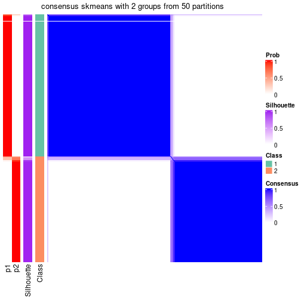</p>

</div>
<div id='tab-node-0-consensus-heatmap-2'>
<pre><code class="r">consensus_heatmap(res, k = 3)
</code></pre>

<p>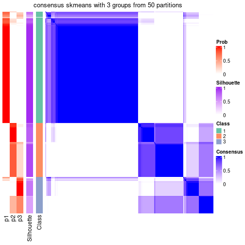</p>

</div>
<div id='tab-node-0-consensus-heatmap-3'>
<pre><code class="r">consensus_heatmap(res, k = 4)
</code></pre>

<p>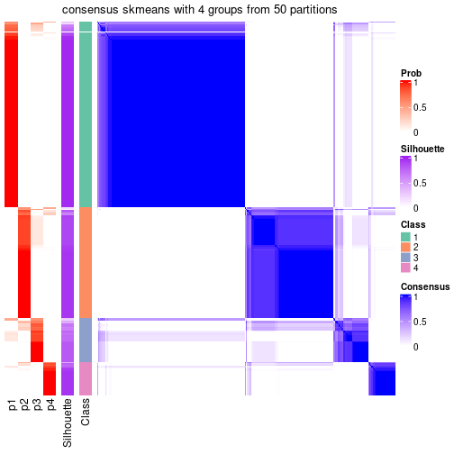</p>

</div>
</div>

Heatmaps for the membership of samples in all partitions to see how consistent they are:


<script>
$( function() {
	$( '#tabs-node-0-membership-heatmap' ).tabs();
} );
</script>
<div id='tabs-node-0-membership-heatmap'>
<ul>
<li><a href='#tab-node-0-membership-heatmap-1'>k = 2</a></li>
<li><a href='#tab-node-0-membership-heatmap-2'>k = 3</a></li>
<li><a href='#tab-node-0-membership-heatmap-3'>k = 4</a></li>
</ul>
<div id='tab-node-0-membership-heatmap-1'>
<pre><code class="r">membership_heatmap(res, k = 2)
</code></pre>

<p>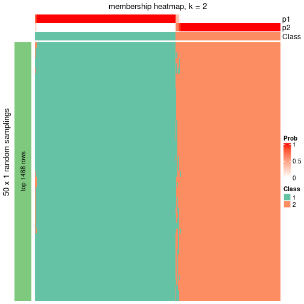</p>

</div>
<div id='tab-node-0-membership-heatmap-2'>
<pre><code class="r">membership_heatmap(res, k = 3)
</code></pre>

<p>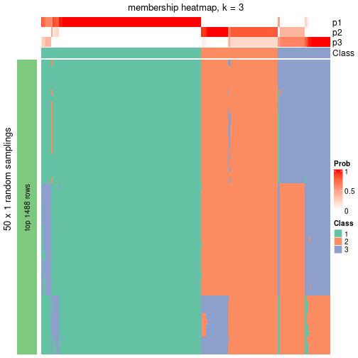</p>

</div>
<div id='tab-node-0-membership-heatmap-3'>
<pre><code class="r">membership_heatmap(res, k = 4)
</code></pre>

<p>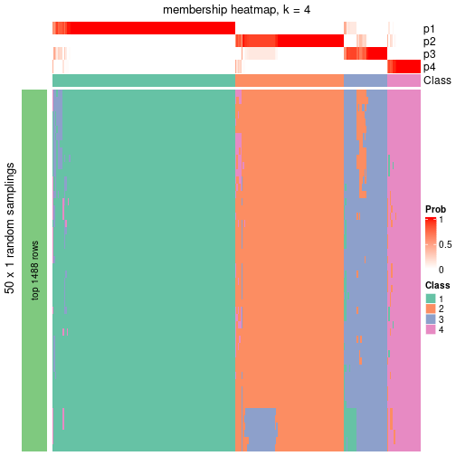</p>

</div>
</div>

As soon as the classes for columns are determined, the signatures
that are significantly different between subgroups can be looked for. 
Following are the heatmaps for signatures.


Signature heatmaps where rows are scaled:


<script>
$( function() {
	$( '#tabs-node-0-get-signatures' ).tabs();
} );
</script>
<div id='tabs-node-0-get-signatures'>
<ul>
<li><a href='#tab-node-0-get-signatures-1'>k = 2</a></li>
<li><a href='#tab-node-0-get-signatures-2'>k = 3</a></li>
<li><a href='#tab-node-0-get-signatures-3'>k = 4</a></li>
</ul>
<div id='tab-node-0-get-signatures-1'>
<pre><code class="r">get_signatures(res, k = 2)
</code></pre>

<p>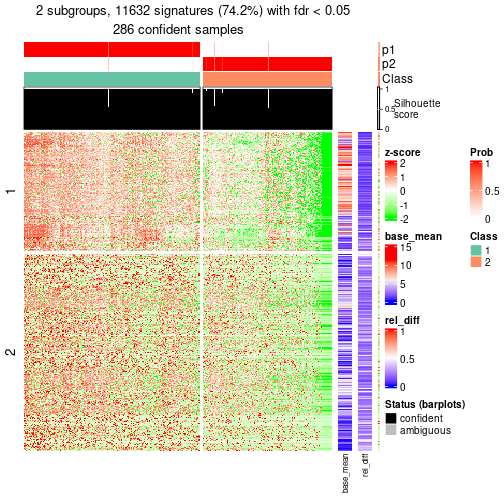</p>

</div>
<div id='tab-node-0-get-signatures-2'>
<pre><code class="r">get_signatures(res, k = 3)
</code></pre>

<p>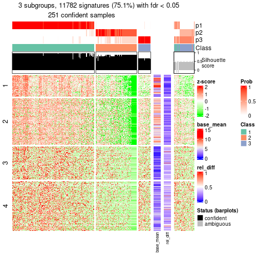</p>

</div>
<div id='tab-node-0-get-signatures-3'>
<pre><code class="r">get_signatures(res, k = 4)
</code></pre>

<p>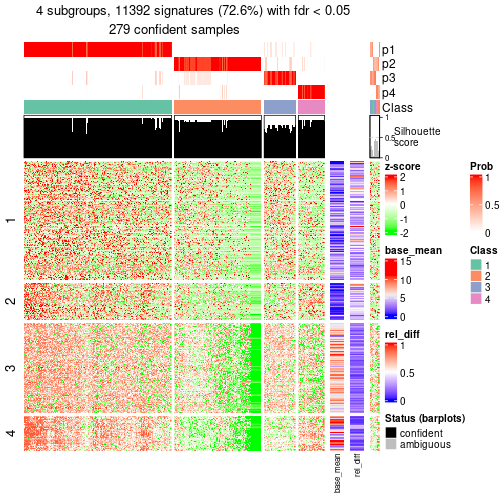</p>

</div>
</div>


Signature heatmaps where rows are not scaled:


<script>
$( function() {
	$( '#tabs-node-0-get-signatures-no-scale' ).tabs();
} );
</script>
<div id='tabs-node-0-get-signatures-no-scale'>
<ul>
<li><a href='#tab-node-0-get-signatures-no-scale-1'>k = 2</a></li>
<li><a href='#tab-node-0-get-signatures-no-scale-2'>k = 3</a></li>
<li><a href='#tab-node-0-get-signatures-no-scale-3'>k = 4</a></li>
</ul>
<div id='tab-node-0-get-signatures-no-scale-1'>
<pre><code class="r">get_signatures(res, k = 2, scale_rows = FALSE)
</code></pre>

<p>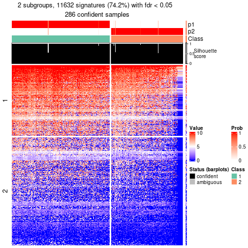</p>

</div>
<div id='tab-node-0-get-signatures-no-scale-2'>
<pre><code class="r">get_signatures(res, k = 3, scale_rows = FALSE)
</code></pre>

<p>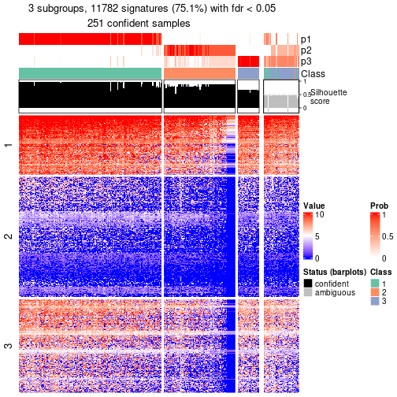</p>

</div>
<div id='tab-node-0-get-signatures-no-scale-3'>
<pre><code class="r">get_signatures(res, k = 4, scale_rows = FALSE)
</code></pre>

<p>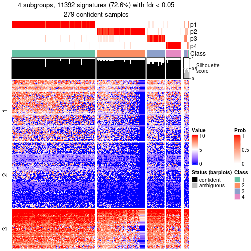</p>

</div>
</div>


Compare the overlap of signatures from different k:

```r
compare_signatures(res)
```

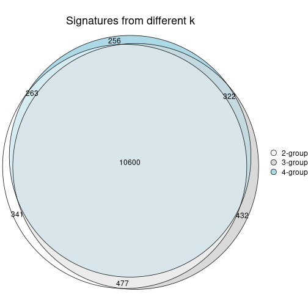

`get_signature()` returns a data frame invisibly. To get the list of signatures, the function
call should be assigned to a variable explicitly. In following code, if `plot` argument is set
to `FALSE`, no heatmap is plotted while only the differential analysis is performed.

```r
# code only for demonstration
tb = get_signature(res, k = ..., plot = FALSE)
```

An example of the output of `tb` is:

```
#>   which_row         fdr    mean_1    mean_2 scaled_mean_1 scaled_mean_2 km
#> 1        38 0.042760348  8.373488  9.131774    -0.5533452     0.5164555  1
#> 2        40 0.018707592  7.106213  8.469186    -0.6173731     0.5762149  1
#> 3        55 0.019134737 10.221463 11.207825    -0.6159697     0.5749050  1
#> 4        59 0.006059896  5.921854  7.869574    -0.6899429     0.6439467  1
#> 5        60 0.018055526  8.928898 10.211722    -0.6204761     0.5791110  1
#> 6        98 0.009384629 15.714769 14.887706     0.6635654    -0.6193277  2
...
```

The columns in `tb` are:

1. `which_row`: row indices corresponding to the input matrix.
2. `fdr`: FDR for the differential test. 
3. `mean_x`: The mean value in group x.
4. `scaled_mean_x`: The mean value in group x after rows are scaled.
5. `km`: Row groups if k-means clustering is applied to rows (which is done by automatically selecting number of clusters).

If there are too many signatures, `top_signatures = ...` can be set to only show the 
signatures with the highest FDRs:

```r
# code only for demonstration
# e.g. to show the top 500 most significant rows
tb = get_signature(res, k = ..., top_signatures = 500)
```

If the signatures are defined as these which are uniquely high in current group, `diff_method` argument
can be set to `"uniquely_high_in_one_group"`:

```r
# code only for demonstration
tb = get_signature(res, k = ..., diff_method = "uniquely_high_in_one_group")
```


UMAP plot which shows how samples are separated.


<script>
$( function() {
	$( '#tabs-node-0-dimension-reduction' ).tabs();
} );
</script>
<div id='tabs-node-0-dimension-reduction'>
<ul>
<li><a href='#tab-node-0-dimension-reduction-1'>k = 2</a></li>
<li><a href='#tab-node-0-dimension-reduction-2'>k = 3</a></li>
<li><a href='#tab-node-0-dimension-reduction-3'>k = 4</a></li>
</ul>
<div id='tab-node-0-dimension-reduction-1'>
<pre><code class="r">dimension_reduction(res, k = 2, method = &quot;UMAP&quot;)
</code></pre>

<p>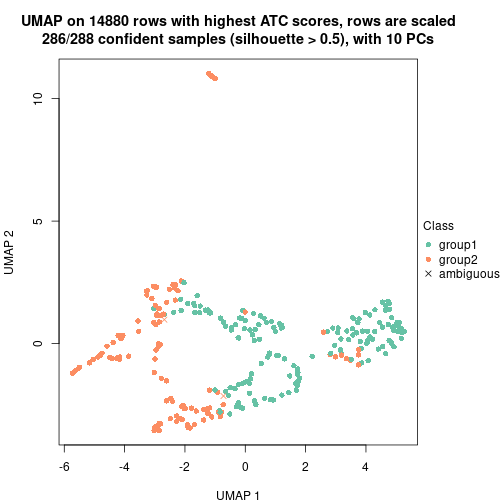</p>

</div>
<div id='tab-node-0-dimension-reduction-2'>
<pre><code class="r">dimension_reduction(res, k = 3, method = &quot;UMAP&quot;)
</code></pre>

<p>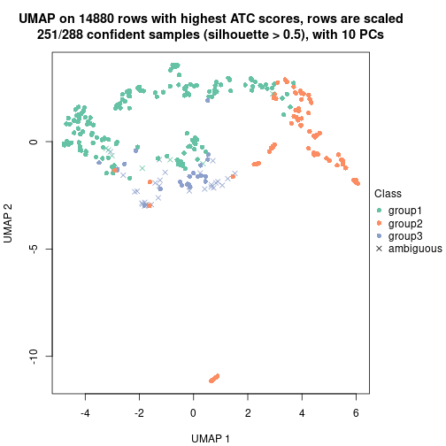</p>

</div>
<div id='tab-node-0-dimension-reduction-3'>
<pre><code class="r">dimension_reduction(res, k = 4, method = &quot;UMAP&quot;)
</code></pre>

<p>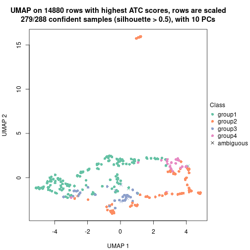</p>

</div>
</div>


Following heatmap shows how subgroups are split when increasing `k`:

```r
collect_classes(res)
```

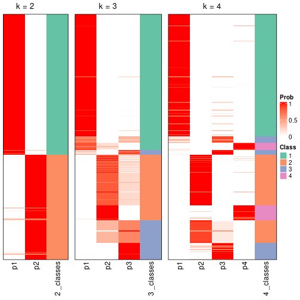


If matrix rows can be associated to genes, consider to use `functional_enrichment(res,
...)` to perform function enrichment for the signature genes. See [this vignette](https://jokergoo.github.io/cola_vignettes/functional_enrichment.html) for more detailed explanations.


 

---------------------------------------------------


### Node01


Parent node: [Node0](#Node0).
Child nodes: 
                [Node011](#Node011)
        ,
                [Node012](#Node012)
        ,
                Node013-leaf
        ,
                Node021-leaf
        ,
                [Node022](#Node022)
        ,
                Node023-leaf
        .


The object with results only for a single top-value method and a single partitioning method 
can be extracted as:

```r
res = res_rh["01"]
```

A summary of `res` and all the functions that can be applied to it:

```r
res
```

```
#> A 'ConsensusPartition' object with k = 2, 3, 4.
#>   On a matrix with 14878 rows and 165 columns.
#>   Top rows (1488) are extracted by 'ATC' method.
#>   Subgroups are detected by 'skmeans' method.
#>   Performed in total 150 partitions by row resampling.
#>   Best k for subgroups seems to be 4.
#> 
#> Following methods can be applied to this 'ConsensusPartition' object:
#>  [1] "cola_report"             "collect_classes"         "collect_plots"          
#>  [4] "collect_stats"           "colnames"                "compare_partitions"     
#>  [7] "compare_signatures"      "consensus_heatmap"       "dimension_reduction"    
#> [10] "functional_enrichment"   "get_anno_col"            "get_anno"               
#> [13] "get_classes"             "get_consensus"           "get_matrix"             
#> [16] "get_membership"          "get_param"               "get_signatures"         
#> [19] "get_stats"               "is_best_k"               "is_stable_k"            
#> [22] "membership_heatmap"      "ncol"                    "nrow"                   
#> [25] "plot_ecdf"               "predict_classes"         "rownames"               
#> [28] "select_partition_number" "show"                    "suggest_best_k"         
#> [31] "test_to_known_factors"   "top_rows_heatmap"
```

`collect_plots()` function collects all the plots made from `res` for all `k` (number of subgroups)
into one single page to provide an easy and fast comparison between different `k`.

```r
collect_plots(res)
```

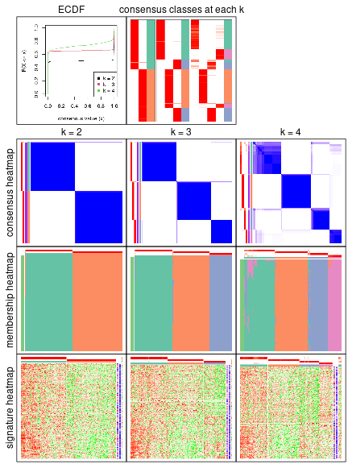

The plots are:

- The first row: a plot of the eCDF (empirical cumulative distribution
  function) curves of the consensus matrix for each `k` and the heatmap of
  predicted classes for each `k`.
- The second row: heatmaps of the consensus matrix for each `k`.
- The third row: heatmaps of the membership matrix for each `k`.
- The fouth row: heatmaps of the signatures for each `k`.

All the plots in panels can be made by individual functions and they are
plotted later in this section.

`select_partition_number()` produces several plots showing different
statistics for choosing "optimized" `k`. There are following statistics:

- eCDF curves of the consensus matrix for each `k`;
- 1-PAC. [The PAC score](https://en.wikipedia.org/wiki/Consensus_clustering#Over-interpretation_potential_of_consensus_clustering)
  measures the proportion of the ambiguous subgrouping.
- Mean silhouette score.
- Concordance. The mean probability of fiting the consensus subgroup labels in all
  partitions.
- Area increased. Denote $A_k$ as the area under the eCDF curve for current
  `k`, the area increased is defined as $A_k - A_{k-1}$.
- Rand index. The percent of pairs of samples that are both in a same cluster
  or both are not in a same cluster in the partition of k and k-1.
- Jaccard index. The ratio of pairs of samples are both in a same cluster in
  the partition of k and k-1 and the pairs of samples are both in a same
  cluster in the partition k or k-1.

The detailed explanations of these statistics can be found in [the _cola_
vignette](https://jokergoo.github.io/cola_vignettes/cola.html#toc_13).

Generally speaking, higher 1-PAC score, higher mean silhouette score or higher
concordance corresponds to better partition. Rand index and Jaccard index
measure how similar the current partition is compared to partition with `k-1`.
If they are too similar, we won't accept `k` is better than `k-1`.

```r
select_partition_number(res)
```

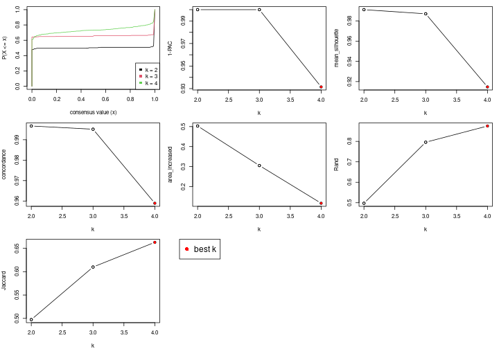

The numeric values for all these statistics can be obtained by `get_stats()`.

```r
get_stats(res)
```

```
#>   k 1-PAC mean_silhouette concordance area_increased  Rand Jaccard
#> 2 2 1.000           0.991       0.997          0.503 0.497   0.497
#> 3 3 1.000           0.987       0.995          0.305 0.796   0.610
#> 4 4 0.932           0.915       0.959          0.117 0.875   0.663
```

`suggest_best_k()` suggests the best $k$ based on these statistics. The rules are as follows:

- All $k$ with Jaccard index larger than 0.95 are removed because increasing
  $k$ does not provide enough extra information. If all $k$ are removed, it is
  marked as no subgroup is detected.
- For all $k$ with 1-PAC score larger than 0.9, the maximal $k$ is taken as
  the best $k$, and other $k$ are marked as optional $k$.
- If it does not fit the second rule. The $k$ with the maximal vote of the
  highest 1-PAC score, highest mean silhouette, and highest concordance is
  taken as the best $k$.

```r
suggest_best_k(res)
```

```
#> [1] 4
#> attr(,"optional")
#> [1] 2 3
```

There is also optional best $k$ = 2 3 that is worth to check.

Following is the table of the partitions (You need to click the **show/hide
code output** link to see it). The membership matrix (columns with name `p*`)
is inferred by
[`clue::cl_consensus()`](https://www.rdocumentation.org/link/cl_consensus?package=clue)
function with the `SE` method. Basically the value in the membership matrix
represents the probability to belong to a certain group. The finall subgroup
label for an item is determined with the group with highest probability it
belongs to.

In `get_classes()` function, the entropy is calculated from the membership
matrix and the silhouette score is calculated from the consensus matrix.


<script>
$( function() {
	$( '#tabs-node-01-get-classes' ).tabs();
} );
</script>
<div id='tabs-node-01-get-classes'>
<ul>
<li><a href='#tab-node-01-get-classes-1'>k = 2</a></li>
<li><a href='#tab-node-01-get-classes-2'>k = 3</a></li>
<li><a href='#tab-node-01-get-classes-3'>k = 4</a></li>
</ul>

<div id='tab-node-01-get-classes-1'>
<p><a id='tab-node-01-get-classes-1-a' style='color:#0366d6' href='#'>show/hide code output</a></p>
<pre><code class="r">cbind(get_classes(res, k = 2), get_membership(res, k = 2))
</code></pre>

<pre><code>#&gt;                  class entropy silhouette   p1   p2
#&gt; G1_cell7_count       1   0.000      0.994 1.00 0.00
#&gt; G1_cell8_count       2   0.000      0.999 0.00 1.00
#&gt; G1_cell9_count       1   0.000      0.994 1.00 0.00
#&gt; G1_cell13_count      1   0.000      0.994 1.00 0.00
#&gt; G1_cell15_count      2   0.000      0.999 0.00 1.00
#&gt; G1_cell16_count      2   0.000      0.999 0.00 1.00
#&gt; G1_cell17_count      2   0.000      0.999 0.00 1.00
#&gt; G1_cell20_count      2   0.000      0.999 0.00 1.00
#&gt; G1_cell22_count      1   0.000      0.994 1.00 0.00
#&gt; G1_cell23_count      1   0.995      0.148 0.54 0.46
#&gt; G1_cell25_count      1   0.141      0.974 0.98 0.02
#&gt; G1_cell26_count      2   0.000      0.999 0.00 1.00
#&gt; G1_cell30_count      2   0.000      0.999 0.00 1.00
#&gt; G1_cell36_count      1   0.000      0.994 1.00 0.00
#&gt; G1_cell39_count      2   0.000      0.999 0.00 1.00
#&gt; G1_cell41_count      2   0.000      0.999 0.00 1.00
#&gt; G1_cell42_count      1   0.000      0.994 1.00 0.00
#&gt; G1_cell43_count      1   0.000      0.994 1.00 0.00
#&gt; G1_cell44_count      1   0.000      0.994 1.00 0.00
#&gt; G1_cell47_count      2   0.000      0.999 0.00 1.00
#&gt; G1_cell49_count      1   0.000      0.994 1.00 0.00
#&gt; G1_cell54_count      2   0.000      0.999 0.00 1.00
#&gt; G1_cell55_count      2   0.000      0.999 0.00 1.00
#&gt; G1_cell57_count      2   0.000      0.999 0.00 1.00
#&gt; G1_cell60_count      1   0.000      0.994 1.00 0.00
#&gt; G1_cell61_count      2   0.000      0.999 0.00 1.00
#&gt; G1_cell62_count      1   0.000      0.994 1.00 0.00
#&gt; G1_cell64_count      2   0.000      0.999 0.00 1.00
#&gt; G1_cell65_count      2   0.000      0.999 0.00 1.00
#&gt; G1_cell66_count      2   0.000      0.999 0.00 1.00
#&gt; G1_cell68_count      1   0.000      0.994 1.00 0.00
#&gt; G1_cell70_count      1   0.000      0.994 1.00 0.00
#&gt; G1_cell73_count      1   0.000      0.994 1.00 0.00
#&gt; G1_cell74_count      2   0.000      0.999 0.00 1.00
#&gt; G1_cell75_count      1   0.000      0.994 1.00 0.00
#&gt; G1_cell77_count      2   0.242      0.958 0.04 0.96
#&gt; G1_cell79_count      2   0.000      0.999 0.00 1.00
#&gt; G1_cell80_count      2   0.000      0.999 0.00 1.00
#&gt; G1_cell81_count      1   0.000      0.994 1.00 0.00
#&gt; G1_cell83_count      1   0.000      0.994 1.00 0.00
#&gt; G1_cell84_count      2   0.000      0.999 0.00 1.00
#&gt; G1_cell86_count      1   0.000      0.994 1.00 0.00
#&gt; G1_cell87_count      1   0.000      0.994 1.00 0.00
#&gt; G1_cell91_count      1   0.000      0.994 1.00 0.00
#&gt; G1_cell93_count      1   0.000      0.994 1.00 0.00
#&gt; G1_cell94_count      2   0.000      0.999 0.00 1.00
#&gt; G1_cell95_count      1   0.000      0.994 1.00 0.00
#&gt; G1_cell96_count      1   0.000      0.994 1.00 0.00
#&gt; S_cell2_count        2   0.000      0.999 0.00 1.00
#&gt; S_cell3_count        1   0.000      0.994 1.00 0.00
#&gt; S_cell4_count        2   0.000      0.999 0.00 1.00
#&gt; S_cell6_count        2   0.000      0.999 0.00 1.00
#&gt; S_cell7_count        2   0.000      0.999 0.00 1.00
#&gt; S_cell8_count        1   0.000      0.994 1.00 0.00
#&gt; S_cell9_count        1   0.000      0.994 1.00 0.00
#&gt; S_cell10_count       1   0.000      0.994 1.00 0.00
#&gt; S_cell11_count       2   0.000      0.999 0.00 1.00
#&gt; S_cell13_count       1   0.000      0.994 1.00 0.00
#&gt; S_cell14_count       2   0.000      0.999 0.00 1.00
#&gt; S_cell15_count       1   0.000      0.994 1.00 0.00
#&gt; S_cell16_count       1   0.000      0.994 1.00 0.00
#&gt; S_cell17_count       1   0.000      0.994 1.00 0.00
#&gt; S_cell19_count       2   0.000      0.999 0.00 1.00
#&gt; S_cell20_count       2   0.000      0.999 0.00 1.00
#&gt; S_cell22_count       1   0.000      0.994 1.00 0.00
#&gt; S_cell24_count       1   0.000      0.994 1.00 0.00
#&gt; S_cell26_count       1   0.000      0.994 1.00 0.00
#&gt; S_cell27_count       1   0.000      0.994 1.00 0.00
#&gt; S_cell28_count       1   0.000      0.994 1.00 0.00
#&gt; S_cell29_count       1   0.000      0.994 1.00 0.00
#&gt; S_cell30_count       1   0.000      0.994 1.00 0.00
#&gt; S_cell32_count       2   0.000      0.999 0.00 1.00
#&gt; S_cell33_count       2   0.000      0.999 0.00 1.00
#&gt; S_cell35_count       2   0.000      0.999 0.00 1.00
#&gt; S_cell36_count       2   0.000      0.999 0.00 1.00
#&gt; S_cell37_count       1   0.000      0.994 1.00 0.00
#&gt; S_cell39_count       2   0.000      0.999 0.00 1.00
#&gt; S_cell40_count       1   0.000      0.994 1.00 0.00
#&gt; S_cell41_count       2   0.000      0.999 0.00 1.00
#&gt; S_cell42_count       1   0.000      0.994 1.00 0.00
#&gt; S_cell43_count       1   0.000      0.994 1.00 0.00
#&gt; S_cell45_count       2   0.000      0.999 0.00 1.00
#&gt; S_cell46_count       2   0.000      0.999 0.00 1.00
#&gt; S_cell47_count       2   0.000      0.999 0.00 1.00
#&gt; S_cell48_count       2   0.000      0.999 0.00 1.00
#&gt; S_cell49_count       2   0.000      0.999 0.00 1.00
#&gt; S_cell50_count       1   0.000      0.994 1.00 0.00
#&gt; S_cell52_count       1   0.000      0.994 1.00 0.00
#&gt; S_cell53_count       1   0.000      0.994 1.00 0.00
#&gt; S_cell54_count       2   0.000      0.999 0.00 1.00
#&gt; S_cell55_count       1   0.000      0.994 1.00 0.00
#&gt; S_cell57_count       1   0.000      0.994 1.00 0.00
#&gt; S_cell59_count       2   0.000      0.999 0.00 1.00
#&gt; S_cell60_count       2   0.000      0.999 0.00 1.00
#&gt; S_cell61_count       2   0.000      0.999 0.00 1.00
#&gt; S_cell62_count       2   0.000      0.999 0.00 1.00
#&gt; S_cell63_count       1   0.000      0.994 1.00 0.00
#&gt; S_cell66_count       2   0.000      0.999 0.00 1.00
#&gt; S_cell68_count       2   0.000      0.999 0.00 1.00
#&gt; S_cell69_count       2   0.000      0.999 0.00 1.00
#&gt; S_cell70_count       1   0.000      0.994 1.00 0.00
#&gt; S_cell72_count       2   0.000      0.999 0.00 1.00
#&gt; S_cell73_count       2   0.000      0.999 0.00 1.00
#&gt; S_cell76_count       2   0.000      0.999 0.00 1.00
#&gt; S_cell79_count       1   0.000      0.994 1.00 0.00
#&gt; S_cell80_count       2   0.000      0.999 0.00 1.00
#&gt; S_cell82_count       2   0.000      0.999 0.00 1.00
#&gt; S_cell83_count       1   0.000      0.994 1.00 0.00
#&gt; S_cell85_count       1   0.000      0.994 1.00 0.00
#&gt; S_cell86_count       2   0.141      0.979 0.02 0.98
#&gt; S_cell89_count       2   0.000      0.999 0.00 1.00
#&gt; S_cell92_count       1   0.000      0.994 1.00 0.00
#&gt; S_cell93_count       2   0.000      0.999 0.00 1.00
#&gt; G2M_cell5_count      1   0.000      0.994 1.00 0.00
#&gt; G2M_cell7_count      1   0.000      0.994 1.00 0.00
#&gt; G2M_cell8_count      1   0.000      0.994 1.00 0.00
#&gt; G2M_cell9_count      2   0.000      0.999 0.00 1.00
#&gt; G2M_cell10_count     2   0.000      0.999 0.00 1.00
#&gt; G2M_cell11_count     2   0.000      0.999 0.00 1.00
#&gt; G2M_cell12_count     2   0.000      0.999 0.00 1.00
#&gt; G2M_cell13_count     2   0.000      0.999 0.00 1.00
#&gt; G2M_cell17_count     2   0.000      0.999 0.00 1.00
#&gt; G2M_cell18_count     1   0.000      0.994 1.00 0.00
#&gt; G2M_cell19_count     1   0.000      0.994 1.00 0.00
#&gt; G2M_cell20_count     1   0.000      0.994 1.00 0.00
#&gt; G2M_cell21_count     2   0.000      0.999 0.00 1.00
#&gt; G2M_cell23_count     1   0.000      0.994 1.00 0.00
#&gt; G2M_cell25_count     2   0.000      0.999 0.00 1.00
#&gt; G2M_cell32_count     1   0.000      0.994 1.00 0.00
#&gt; G2M_cell33_count     1   0.000      0.994 1.00 0.00
#&gt; G2M_cell34_count     2   0.000      0.999 0.00 1.00
#&gt; G2M_cell35_count     1   0.000      0.994 1.00 0.00
#&gt; G2M_cell37_count     2   0.000      0.999 0.00 1.00
#&gt; G2M_cell41_count     2   0.000      0.999 0.00 1.00
#&gt; G2M_cell44_count     1   0.000      0.994 1.00 0.00
#&gt; G2M_cell45_count     2   0.000      0.999 0.00 1.00
#&gt; G2M_cell47_count     1   0.000      0.994 1.00 0.00
#&gt; G2M_cell48_count     1   0.000      0.994 1.00 0.00
#&gt; G2M_cell49_count     2   0.000      0.999 0.00 1.00
#&gt; G2M_cell50_count     2   0.000      0.999 0.00 1.00
#&gt; G2M_cell55_count     2   0.000      0.999 0.00 1.00
#&gt; G2M_cell57_count     2   0.000      0.999 0.00 1.00
#&gt; G2M_cell58_count     1   0.000      0.994 1.00 0.00
#&gt; G2M_cell59_count     1   0.000      0.994 1.00 0.00
#&gt; G2M_cell60_count     1   0.000      0.994 1.00 0.00
#&gt; G2M_cell61_count     1   0.000      0.994 1.00 0.00
#&gt; G2M_cell62_count     2   0.000      0.999 0.00 1.00
#&gt; G2M_cell63_count     2   0.000      0.999 0.00 1.00
#&gt; G2M_cell65_count     2   0.000      0.999 0.00 1.00
#&gt; G2M_cell68_count     1   0.000      0.994 1.00 0.00
#&gt; G2M_cell69_count     1   0.000      0.994 1.00 0.00
#&gt; G2M_cell71_count     1   0.000      0.994 1.00 0.00
#&gt; G2M_cell73_count     1   0.000      0.994 1.00 0.00
#&gt; G2M_cell74_count     1   0.000      0.994 1.00 0.00
#&gt; G2M_cell75_count     2   0.000      0.999 0.00 1.00
#&gt; G2M_cell76_count     2   0.000      0.999 0.00 1.00
#&gt; G2M_cell79_count     2   0.000      0.999 0.00 1.00
#&gt; G2M_cell80_count     2   0.000      0.999 0.00 1.00
#&gt; G2M_cell83_count     2   0.000      0.999 0.00 1.00
#&gt; G2M_cell84_count     1   0.000      0.994 1.00 0.00
#&gt; G2M_cell86_count     1   0.000      0.994 1.00 0.00
#&gt; G2M_cell87_count     2   0.000      0.999 0.00 1.00
#&gt; G2M_cell88_count     2   0.000      0.999 0.00 1.00
#&gt; G2M_cell90_count     2   0.000      0.999 0.00 1.00
#&gt; G2M_cell91_count     1   0.000      0.994 1.00 0.00
</code></pre>

<script>
$('#tab-node-01-get-classes-1-a').parent().next().next().hide();
$('#tab-node-01-get-classes-1-a').click(function(){
  $('#tab-node-01-get-classes-1-a').parent().next().next().toggle();
  return(false);
});
</script>
</div>

<div id='tab-node-01-get-classes-2'>
<p><a id='tab-node-01-get-classes-2-a' style='color:#0366d6' href='#'>show/hide code output</a></p>
<pre><code class="r">cbind(get_classes(res, k = 3), get_membership(res, k = 3))
</code></pre>

<pre><code>#&gt;                  class entropy silhouette   p1   p2   p3
#&gt; G1_cell7_count       3   0.000     1.0000 0.00 0.00 1.00
#&gt; G1_cell8_count       3   0.000     1.0000 0.00 0.00 1.00
#&gt; G1_cell9_count       1   0.000     0.9962 1.00 0.00 0.00
#&gt; G1_cell13_count      1   0.000     0.9962 1.00 0.00 0.00
#&gt; G1_cell15_count      3   0.000     1.0000 0.00 0.00 1.00
#&gt; G1_cell16_count      3   0.000     1.0000 0.00 0.00 1.00
#&gt; G1_cell17_count      3   0.000     1.0000 0.00 0.00 1.00
#&gt; G1_cell20_count      3   0.000     1.0000 0.00 0.00 1.00
#&gt; G1_cell22_count      1   0.000     0.9962 1.00 0.00 0.00
#&gt; G1_cell23_count      3   0.000     1.0000 0.00 0.00 1.00
#&gt; G1_cell25_count      3   0.000     1.0000 0.00 0.00 1.00
#&gt; G1_cell26_count      3   0.000     1.0000 0.00 0.00 1.00
#&gt; G1_cell30_count      3   0.000     1.0000 0.00 0.00 1.00
#&gt; G1_cell36_count      1   0.000     0.9962 1.00 0.00 0.00
#&gt; G1_cell39_count      3   0.000     1.0000 0.00 0.00 1.00
#&gt; G1_cell41_count      3   0.000     1.0000 0.00 0.00 1.00
#&gt; G1_cell42_count      1   0.153     0.9562 0.96 0.00 0.04
#&gt; G1_cell43_count      3   0.000     1.0000 0.00 0.00 1.00
#&gt; G1_cell44_count      3   0.000     1.0000 0.00 0.00 1.00
#&gt; G1_cell47_count      3   0.000     1.0000 0.00 0.00 1.00
#&gt; G1_cell49_count      3   0.000     1.0000 0.00 0.00 1.00
#&gt; G1_cell54_count      3   0.000     1.0000 0.00 0.00 1.00
#&gt; G1_cell55_count      3   0.000     1.0000 0.00 0.00 1.00
#&gt; G1_cell57_count      3   0.000     1.0000 0.00 0.00 1.00
#&gt; G1_cell60_count      3   0.000     1.0000 0.00 0.00 1.00
#&gt; G1_cell61_count      3   0.000     1.0000 0.00 0.00 1.00
#&gt; G1_cell62_count      1   0.000     0.9962 1.00 0.00 0.00
#&gt; G1_cell64_count      3   0.000     1.0000 0.00 0.00 1.00
#&gt; G1_cell65_count      3   0.000     1.0000 0.00 0.00 1.00
#&gt; G1_cell66_count      3   0.000     1.0000 0.00 0.00 1.00
#&gt; G1_cell68_count      3   0.000     1.0000 0.00 0.00 1.00
#&gt; G1_cell70_count      1   0.000     0.9962 1.00 0.00 0.00
#&gt; G1_cell73_count      3   0.000     1.0000 0.00 0.00 1.00
#&gt; G1_cell74_count      2   0.000     0.9909 0.00 1.00 0.00
#&gt; G1_cell75_count      1   0.000     0.9962 1.00 0.00 0.00
#&gt; G1_cell77_count      3   0.000     1.0000 0.00 0.00 1.00
#&gt; G1_cell79_count      3   0.000     1.0000 0.00 0.00 1.00
#&gt; G1_cell80_count      2   0.000     0.9909 0.00 1.00 0.00
#&gt; G1_cell81_count      3   0.000     1.0000 0.00 0.00 1.00
#&gt; G1_cell83_count      3   0.000     1.0000 0.00 0.00 1.00
#&gt; G1_cell84_count      3   0.000     1.0000 0.00 0.00 1.00
#&gt; G1_cell86_count      3   0.000     1.0000 0.00 0.00 1.00
#&gt; G1_cell87_count      1   0.000     0.9962 1.00 0.00 0.00
#&gt; G1_cell91_count      1   0.000     0.9962 1.00 0.00 0.00
#&gt; G1_cell93_count      3   0.000     1.0000 0.00 0.00 1.00
#&gt; G1_cell94_count      2   0.631     0.0045 0.00 0.50 0.50
#&gt; G1_cell95_count      3   0.000     1.0000 0.00 0.00 1.00
#&gt; G1_cell96_count      1   0.000     0.9962 1.00 0.00 0.00
#&gt; S_cell2_count        2   0.000     0.9909 0.00 1.00 0.00
#&gt; S_cell3_count        1   0.000     0.9962 1.00 0.00 0.00
#&gt; S_cell4_count        2   0.000     0.9909 0.00 1.00 0.00
#&gt; S_cell6_count        2   0.000     0.9909 0.00 1.00 0.00
#&gt; S_cell7_count        2   0.000     0.9909 0.00 1.00 0.00
#&gt; S_cell8_count        1   0.000     0.9962 1.00 0.00 0.00
#&gt; S_cell9_count        1   0.000     0.9962 1.00 0.00 0.00
#&gt; S_cell10_count       1   0.000     0.9962 1.00 0.00 0.00
#&gt; S_cell11_count       2   0.000     0.9909 0.00 1.00 0.00
#&gt; S_cell13_count       1   0.000     0.9962 1.00 0.00 0.00
#&gt; S_cell14_count       3   0.000     1.0000 0.00 0.00 1.00
#&gt; S_cell15_count       1   0.000     0.9962 1.00 0.00 0.00
#&gt; S_cell16_count       1   0.000     0.9962 1.00 0.00 0.00
#&gt; S_cell17_count       1   0.000     0.9962 1.00 0.00 0.00
#&gt; S_cell19_count       2   0.000     0.9909 0.00 1.00 0.00
#&gt; S_cell20_count       2   0.000     0.9909 0.00 1.00 0.00
#&gt; S_cell22_count       1   0.000     0.9962 1.00 0.00 0.00
#&gt; S_cell24_count       1   0.000     0.9962 1.00 0.00 0.00
#&gt; S_cell26_count       1   0.000     0.9962 1.00 0.00 0.00
#&gt; S_cell27_count       1   0.000     0.9962 1.00 0.00 0.00
#&gt; S_cell28_count       1   0.000     0.9962 1.00 0.00 0.00
#&gt; S_cell29_count       1   0.000     0.9962 1.00 0.00 0.00
#&gt; S_cell30_count       1   0.000     0.9962 1.00 0.00 0.00
#&gt; S_cell32_count       2   0.000     0.9909 0.00 1.00 0.00
#&gt; S_cell33_count       2   0.000     0.9909 0.00 1.00 0.00
#&gt; S_cell35_count       2   0.000     0.9909 0.00 1.00 0.00
#&gt; S_cell36_count       2   0.207     0.9293 0.00 0.94 0.06
#&gt; S_cell37_count       1   0.000     0.9962 1.00 0.00 0.00
#&gt; S_cell39_count       2   0.000     0.9909 0.00 1.00 0.00
#&gt; S_cell40_count       1   0.000     0.9962 1.00 0.00 0.00
#&gt; S_cell41_count       2   0.000     0.9909 0.00 1.00 0.00
#&gt; S_cell42_count       1   0.000     0.9962 1.00 0.00 0.00
#&gt; S_cell43_count       1   0.000     0.9962 1.00 0.00 0.00
#&gt; S_cell45_count       2   0.000     0.9909 0.00 1.00 0.00
#&gt; S_cell46_count       3   0.000     1.0000 0.00 0.00 1.00
#&gt; S_cell47_count       2   0.000     0.9909 0.00 1.00 0.00
#&gt; S_cell48_count       2   0.000     0.9909 0.00 1.00 0.00
#&gt; S_cell49_count       2   0.000     0.9909 0.00 1.00 0.00
#&gt; S_cell50_count       1   0.000     0.9962 1.00 0.00 0.00
#&gt; S_cell52_count       1   0.000     0.9962 1.00 0.00 0.00
#&gt; S_cell53_count       1   0.000     0.9962 1.00 0.00 0.00
#&gt; S_cell54_count       2   0.000     0.9909 0.00 1.00 0.00
#&gt; S_cell55_count       1   0.000     0.9962 1.00 0.00 0.00
#&gt; S_cell57_count       1   0.000     0.9962 1.00 0.00 0.00
#&gt; S_cell59_count       2   0.000     0.9909 0.00 1.00 0.00
#&gt; S_cell60_count       2   0.000     0.9909 0.00 1.00 0.00
#&gt; S_cell61_count       2   0.000     0.9909 0.00 1.00 0.00
#&gt; S_cell62_count       2   0.000     0.9909 0.00 1.00 0.00
#&gt; S_cell63_count       1   0.000     0.9962 1.00 0.00 0.00
#&gt; S_cell66_count       2   0.000     0.9909 0.00 1.00 0.00
#&gt; S_cell68_count       2   0.000     0.9909 0.00 1.00 0.00
#&gt; S_cell69_count       2   0.000     0.9909 0.00 1.00 0.00
#&gt; S_cell70_count       1   0.000     0.9962 1.00 0.00 0.00
#&gt; S_cell72_count       2   0.000     0.9909 0.00 1.00 0.00
#&gt; S_cell73_count       2   0.000     0.9909 0.00 1.00 0.00
#&gt; S_cell76_count       2   0.000     0.9909 0.00 1.00 0.00
#&gt; S_cell79_count       1   0.000     0.9962 1.00 0.00 0.00
#&gt; S_cell80_count       2   0.000     0.9909 0.00 1.00 0.00
#&gt; S_cell82_count       2   0.000     0.9909 0.00 1.00 0.00
#&gt; S_cell83_count       1   0.000     0.9962 1.00 0.00 0.00
#&gt; S_cell85_count       3   0.000     1.0000 0.00 0.00 1.00
#&gt; S_cell86_count       2   0.000     0.9909 0.00 1.00 0.00
#&gt; S_cell89_count       2   0.000     0.9909 0.00 1.00 0.00
#&gt; S_cell92_count       1   0.000     0.9962 1.00 0.00 0.00
#&gt; S_cell93_count       2   0.000     0.9909 0.00 1.00 0.00
#&gt; G2M_cell5_count      1   0.000     0.9962 1.00 0.00 0.00
#&gt; G2M_cell7_count      1   0.000     0.9962 1.00 0.00 0.00
#&gt; G2M_cell8_count      1   0.000     0.9962 1.00 0.00 0.00
#&gt; G2M_cell9_count      2   0.000     0.9909 0.00 1.00 0.00
#&gt; G2M_cell10_count     2   0.000     0.9909 0.00 1.00 0.00
#&gt; G2M_cell11_count     2   0.000     0.9909 0.00 1.00 0.00
#&gt; G2M_cell12_count     2   0.000     0.9909 0.00 1.00 0.00
#&gt; G2M_cell13_count     2   0.000     0.9909 0.00 1.00 0.00
#&gt; G2M_cell17_count     2   0.000     0.9909 0.00 1.00 0.00
#&gt; G2M_cell18_count     1   0.000     0.9962 1.00 0.00 0.00
#&gt; G2M_cell19_count     1   0.000     0.9962 1.00 0.00 0.00
#&gt; G2M_cell20_count     1   0.000     0.9962 1.00 0.00 0.00
#&gt; G2M_cell21_count     2   0.000     0.9909 0.00 1.00 0.00
#&gt; G2M_cell23_count     1   0.000     0.9962 1.00 0.00 0.00
#&gt; G2M_cell25_count     2   0.000     0.9909 0.00 1.00 0.00
#&gt; G2M_cell32_count     1   0.000     0.9962 1.00 0.00 0.00
#&gt; G2M_cell33_count     1   0.000     0.9962 1.00 0.00 0.00
#&gt; G2M_cell34_count     2   0.000     0.9909 0.00 1.00 0.00
#&gt; G2M_cell35_count     3   0.000     1.0000 0.00 0.00 1.00
#&gt; G2M_cell37_count     2   0.000     0.9909 0.00 1.00 0.00
#&gt; G2M_cell41_count     2   0.000     0.9909 0.00 1.00 0.00
#&gt; G2M_cell44_count     1   0.000     0.9962 1.00 0.00 0.00
#&gt; G2M_cell45_count     2   0.000     0.9909 0.00 1.00 0.00
#&gt; G2M_cell47_count     1   0.455     0.7509 0.80 0.00 0.20
#&gt; G2M_cell48_count     1   0.000     0.9962 1.00 0.00 0.00
#&gt; G2M_cell49_count     2   0.000     0.9909 0.00 1.00 0.00
#&gt; G2M_cell50_count     2   0.000     0.9909 0.00 1.00 0.00
#&gt; G2M_cell55_count     2   0.000     0.9909 0.00 1.00 0.00
#&gt; G2M_cell57_count     2   0.000     0.9909 0.00 1.00 0.00
#&gt; G2M_cell58_count     1   0.000     0.9962 1.00 0.00 0.00
#&gt; G2M_cell59_count     1   0.000     0.9962 1.00 0.00 0.00
#&gt; G2M_cell60_count     1   0.000     0.9962 1.00 0.00 0.00
#&gt; G2M_cell61_count     1   0.000     0.9962 1.00 0.00 0.00
#&gt; G2M_cell62_count     2   0.000     0.9909 0.00 1.00 0.00
#&gt; G2M_cell63_count     2   0.000     0.9909 0.00 1.00 0.00
#&gt; G2M_cell65_count     2   0.000     0.9909 0.00 1.00 0.00
#&gt; G2M_cell68_count     1   0.000     0.9962 1.00 0.00 0.00
#&gt; G2M_cell69_count     1   0.000     0.9962 1.00 0.00 0.00
#&gt; G2M_cell71_count     1   0.000     0.9962 1.00 0.00 0.00
#&gt; G2M_cell73_count     1   0.000     0.9962 1.00 0.00 0.00
#&gt; G2M_cell74_count     1   0.000     0.9962 1.00 0.00 0.00
#&gt; G2M_cell75_count     2   0.000     0.9909 0.00 1.00 0.00
#&gt; G2M_cell76_count     2   0.000     0.9909 0.00 1.00 0.00
#&gt; G2M_cell79_count     2   0.000     0.9909 0.00 1.00 0.00
#&gt; G2M_cell80_count     2   0.000     0.9909 0.00 1.00 0.00
#&gt; G2M_cell83_count     2   0.000     0.9909 0.00 1.00 0.00
#&gt; G2M_cell84_count     1   0.000     0.9962 1.00 0.00 0.00
#&gt; G2M_cell86_count     1   0.000     0.9962 1.00 0.00 0.00
#&gt; G2M_cell87_count     2   0.000     0.9909 0.00 1.00 0.00
#&gt; G2M_cell88_count     2   0.000     0.9909 0.00 1.00 0.00
#&gt; G2M_cell90_count     2   0.000     0.9909 0.00 1.00 0.00
#&gt; G2M_cell91_count     1   0.000     0.9962 1.00 0.00 0.00
</code></pre>

<script>
$('#tab-node-01-get-classes-2-a').parent().next().next().hide();
$('#tab-node-01-get-classes-2-a').click(function(){
  $('#tab-node-01-get-classes-2-a').parent().next().next().toggle();
  return(false);
});
</script>
</div>

<div id='tab-node-01-get-classes-3'>
<p><a id='tab-node-01-get-classes-3-a' style='color:#0366d6' href='#'>show/hide code output</a></p>
<pre><code class="r">cbind(get_classes(res, k = 4), get_membership(res, k = 4))
</code></pre>

<pre><code>#&gt;                  class entropy silhouette   p1   p2   p3   p4
#&gt; G1_cell7_count       3  0.0000      0.948 0.00 0.00 1.00 0.00
#&gt; G1_cell8_count       3  0.0000      0.948 0.00 0.00 1.00 0.00
#&gt; G1_cell9_count       1  0.0000      0.907 1.00 0.00 0.00 0.00
#&gt; G1_cell13_count      1  0.0000      0.907 1.00 0.00 0.00 0.00
#&gt; G1_cell15_count      3  0.0000      0.948 0.00 0.00 1.00 0.00
#&gt; G1_cell16_count      3  0.0000      0.948 0.00 0.00 1.00 0.00
#&gt; G1_cell17_count      3  0.0000      0.948 0.00 0.00 1.00 0.00
#&gt; G1_cell20_count      3  0.0000      0.948 0.00 0.00 1.00 0.00
#&gt; G1_cell22_count      1  0.0000      0.907 1.00 0.00 0.00 0.00
#&gt; G1_cell23_count      3  0.0000      0.948 0.00 0.00 1.00 0.00
#&gt; G1_cell25_count      3  0.0000      0.948 0.00 0.00 1.00 0.00
#&gt; G1_cell26_count      3  0.0000      0.948 0.00 0.00 1.00 0.00
#&gt; G1_cell30_count      3  0.0000      0.948 0.00 0.00 1.00 0.00
#&gt; G1_cell36_count      1  0.0000      0.907 1.00 0.00 0.00 0.00
#&gt; G1_cell39_count      3  0.0000      0.948 0.00 0.00 1.00 0.00
#&gt; G1_cell41_count      3  0.0000      0.948 0.00 0.00 1.00 0.00
#&gt; G1_cell42_count      1  0.3037      0.850 0.88 0.00 0.02 0.10
#&gt; G1_cell43_count      3  0.2011      0.878 0.08 0.00 0.92 0.00
#&gt; G1_cell44_count      3  0.0000      0.948 0.00 0.00 1.00 0.00
#&gt; G1_cell47_count      3  0.0000      0.948 0.00 0.00 1.00 0.00
#&gt; G1_cell49_count      3  0.0000      0.948 0.00 0.00 1.00 0.00
#&gt; G1_cell54_count      3  0.0000      0.948 0.00 0.00 1.00 0.00
#&gt; G1_cell55_count      3  0.0000      0.948 0.00 0.00 1.00 0.00
#&gt; G1_cell57_count      3  0.0000      0.948 0.00 0.00 1.00 0.00
#&gt; G1_cell60_count      3  0.4406      0.586 0.30 0.00 0.70 0.00
#&gt; G1_cell61_count      3  0.0000      0.948 0.00 0.00 1.00 0.00
#&gt; G1_cell62_count      1  0.0000      0.907 1.00 0.00 0.00 0.00
#&gt; G1_cell64_count      3  0.0000      0.948 0.00 0.00 1.00 0.00
#&gt; G1_cell65_count      3  0.0000      0.948 0.00 0.00 1.00 0.00
#&gt; G1_cell66_count      3  0.0000      0.948 0.00 0.00 1.00 0.00
#&gt; G1_cell68_count      1  0.4713      0.407 0.64 0.00 0.36 0.00
#&gt; G1_cell70_count      1  0.0000      0.907 1.00 0.00 0.00 0.00
#&gt; G1_cell73_count      3  0.4948      0.240 0.44 0.00 0.56 0.00
#&gt; G1_cell74_count      2  0.0000      0.994 0.00 1.00 0.00 0.00
#&gt; G1_cell75_count      1  0.0000      0.907 1.00 0.00 0.00 0.00
#&gt; G1_cell77_count      3  0.0000      0.948 0.00 0.00 1.00 0.00
#&gt; G1_cell79_count      3  0.0000      0.948 0.00 0.00 1.00 0.00
#&gt; G1_cell80_count      2  0.0000      0.994 0.00 1.00 0.00 0.00
#&gt; G1_cell81_count      3  0.0000      0.948 0.00 0.00 1.00 0.00
#&gt; G1_cell83_count      1  0.4522      0.497 0.68 0.00 0.32 0.00
#&gt; G1_cell84_count      3  0.0000      0.948 0.00 0.00 1.00 0.00
#&gt; G1_cell86_count      1  0.4855      0.295 0.60 0.00 0.40 0.00
#&gt; G1_cell87_count      1  0.0000      0.907 1.00 0.00 0.00 0.00
#&gt; G1_cell91_count      1  0.4624      0.482 0.66 0.00 0.00 0.34
#&gt; G1_cell93_count      3  0.0707      0.932 0.02 0.00 0.98 0.00
#&gt; G1_cell94_count      3  0.4855      0.315 0.00 0.40 0.60 0.00
#&gt; G1_cell95_count      3  0.4277      0.622 0.28 0.00 0.72 0.00
#&gt; G1_cell96_count      1  0.0000      0.907 1.00 0.00 0.00 0.00
#&gt; S_cell2_count        2  0.0000      0.994 0.00 1.00 0.00 0.00
#&gt; S_cell3_count        4  0.0000      0.976 0.00 0.00 0.00 1.00
#&gt; S_cell4_count        4  0.0707      0.964 0.00 0.02 0.00 0.98
#&gt; S_cell6_count        4  0.1211      0.948 0.00 0.04 0.00 0.96
#&gt; S_cell7_count        2  0.0000      0.994 0.00 1.00 0.00 0.00
#&gt; S_cell8_count        4  0.0000      0.976 0.00 0.00 0.00 1.00
#&gt; S_cell9_count        4  0.0000      0.976 0.00 0.00 0.00 1.00
#&gt; S_cell10_count       4  0.0000      0.976 0.00 0.00 0.00 1.00
#&gt; S_cell11_count       2  0.0000      0.994 0.00 1.00 0.00 0.00
#&gt; S_cell13_count       4  0.0000      0.976 0.00 0.00 0.00 1.00
#&gt; S_cell14_count       3  0.0000      0.948 0.00 0.00 1.00 0.00
#&gt; S_cell15_count       4  0.0000      0.976 0.00 0.00 0.00 1.00
#&gt; S_cell16_count       1  0.2921      0.846 0.86 0.00 0.00 0.14
#&gt; S_cell17_count       1  0.0707      0.911 0.98 0.00 0.00 0.02
#&gt; S_cell19_count       2  0.0000      0.994 0.00 1.00 0.00 0.00
#&gt; S_cell20_count       2  0.0000      0.994 0.00 1.00 0.00 0.00
#&gt; S_cell22_count       4  0.0000      0.976 0.00 0.00 0.00 1.00
#&gt; S_cell24_count       4  0.0000      0.976 0.00 0.00 0.00 1.00
#&gt; S_cell26_count       1  0.0707      0.911 0.98 0.00 0.00 0.02
#&gt; S_cell27_count       1  0.3610      0.790 0.80 0.00 0.00 0.20
#&gt; S_cell28_count       4  0.0000      0.976 0.00 0.00 0.00 1.00
#&gt; S_cell29_count       1  0.3610      0.790 0.80 0.00 0.00 0.20
#&gt; S_cell30_count       1  0.0000      0.907 1.00 0.00 0.00 0.00
#&gt; S_cell32_count       2  0.0000      0.994 0.00 1.00 0.00 0.00
#&gt; S_cell33_count       2  0.0000      0.994 0.00 1.00 0.00 0.00
#&gt; S_cell35_count       2  0.0000      0.994 0.00 1.00 0.00 0.00
#&gt; S_cell36_count       2  0.3975      0.681 0.00 0.76 0.24 0.00
#&gt; S_cell37_count       4  0.1211      0.939 0.04 0.00 0.00 0.96
#&gt; S_cell39_count       2  0.0000      0.994 0.00 1.00 0.00 0.00
#&gt; S_cell40_count       1  0.3400      0.811 0.82 0.00 0.00 0.18
#&gt; S_cell41_count       2  0.0000      0.994 0.00 1.00 0.00 0.00
#&gt; S_cell42_count       4  0.0000      0.976 0.00 0.00 0.00 1.00
#&gt; S_cell43_count       1  0.2011      0.886 0.92 0.00 0.00 0.08
#&gt; S_cell45_count       2  0.0000      0.994 0.00 1.00 0.00 0.00
#&gt; S_cell46_count       3  0.0000      0.948 0.00 0.00 1.00 0.00
#&gt; S_cell47_count       2  0.0000      0.994 0.00 1.00 0.00 0.00
#&gt; S_cell48_count       2  0.0000      0.994 0.00 1.00 0.00 0.00
#&gt; S_cell49_count       2  0.0000      0.994 0.00 1.00 0.00 0.00
#&gt; S_cell50_count       1  0.4522      0.623 0.68 0.00 0.00 0.32
#&gt; S_cell52_count       1  0.3610      0.790 0.80 0.00 0.00 0.20
#&gt; S_cell53_count       1  0.3400      0.811 0.82 0.00 0.00 0.18
#&gt; S_cell54_count       2  0.0000      0.994 0.00 1.00 0.00 0.00
#&gt; S_cell55_count       1  0.2647      0.861 0.88 0.00 0.00 0.12
#&gt; S_cell57_count       1  0.0707      0.911 0.98 0.00 0.00 0.02
#&gt; S_cell59_count       2  0.0000      0.994 0.00 1.00 0.00 0.00
#&gt; S_cell60_count       2  0.0000      0.994 0.00 1.00 0.00 0.00
#&gt; S_cell61_count       4  0.0707      0.964 0.00 0.02 0.00 0.98
#&gt; S_cell62_count       2  0.0000      0.994 0.00 1.00 0.00 0.00
#&gt; S_cell63_count       1  0.2921      0.846 0.86 0.00 0.00 0.14
#&gt; S_cell66_count       2  0.1211      0.954 0.00 0.96 0.00 0.04
#&gt; S_cell68_count       2  0.0000      0.994 0.00 1.00 0.00 0.00
#&gt; S_cell69_count       2  0.0000      0.994 0.00 1.00 0.00 0.00
#&gt; S_cell70_count       1  0.2011      0.886 0.92 0.00 0.00 0.08
#&gt; S_cell72_count       2  0.0000      0.994 0.00 1.00 0.00 0.00
#&gt; S_cell73_count       2  0.0000      0.994 0.00 1.00 0.00 0.00
#&gt; S_cell76_count       2  0.0000      0.994 0.00 1.00 0.00 0.00
#&gt; S_cell79_count       4  0.0000      0.976 0.00 0.00 0.00 1.00
#&gt; S_cell80_count       4  0.1211      0.948 0.00 0.04 0.00 0.96
#&gt; S_cell82_count       4  0.2011      0.904 0.00 0.08 0.00 0.92
#&gt; S_cell83_count       1  0.1637      0.896 0.94 0.00 0.00 0.06
#&gt; S_cell85_count       1  0.4134      0.614 0.74 0.00 0.26 0.00
#&gt; S_cell86_count       4  0.0707      0.964 0.00 0.02 0.00 0.98
#&gt; S_cell89_count       4  0.2921      0.831 0.00 0.14 0.00 0.86
#&gt; S_cell92_count       4  0.0000      0.976 0.00 0.00 0.00 1.00
#&gt; S_cell93_count       2  0.0000      0.994 0.00 1.00 0.00 0.00
#&gt; G2M_cell5_count      1  0.1637      0.896 0.94 0.00 0.00 0.06
#&gt; G2M_cell7_count      1  0.0707      0.911 0.98 0.00 0.00 0.02
#&gt; G2M_cell8_count      4  0.0000      0.976 0.00 0.00 0.00 1.00
#&gt; G2M_cell9_count      2  0.0000      0.994 0.00 1.00 0.00 0.00
#&gt; G2M_cell10_count     2  0.0000      0.994 0.00 1.00 0.00 0.00
#&gt; G2M_cell11_count     2  0.0000      0.994 0.00 1.00 0.00 0.00
#&gt; G2M_cell12_count     2  0.0000      0.994 0.00 1.00 0.00 0.00
#&gt; G2M_cell13_count     2  0.0000      0.994 0.00 1.00 0.00 0.00
#&gt; G2M_cell17_count     2  0.0000      0.994 0.00 1.00 0.00 0.00
#&gt; G2M_cell18_count     1  0.0707      0.911 0.98 0.00 0.00 0.02
#&gt; G2M_cell19_count     1  0.4624      0.583 0.66 0.00 0.00 0.34
#&gt; G2M_cell20_count     1  0.0707      0.911 0.98 0.00 0.00 0.02
#&gt; G2M_cell21_count     2  0.0000      0.994 0.00 1.00 0.00 0.00
#&gt; G2M_cell23_count     1  0.0707      0.911 0.98 0.00 0.00 0.02
#&gt; G2M_cell25_count     2  0.0000      0.994 0.00 1.00 0.00 0.00
#&gt; G2M_cell32_count     4  0.0707      0.960 0.02 0.00 0.00 0.98
#&gt; G2M_cell33_count     1  0.0707      0.911 0.98 0.00 0.00 0.02
#&gt; G2M_cell34_count     2  0.0000      0.994 0.00 1.00 0.00 0.00
#&gt; G2M_cell35_count     3  0.0000      0.948 0.00 0.00 1.00 0.00
#&gt; G2M_cell37_count     2  0.0000      0.994 0.00 1.00 0.00 0.00
#&gt; G2M_cell41_count     2  0.0000      0.994 0.00 1.00 0.00 0.00
#&gt; G2M_cell44_count     1  0.0707      0.911 0.98 0.00 0.00 0.02
#&gt; G2M_cell45_count     2  0.0000      0.994 0.00 1.00 0.00 0.00
#&gt; G2M_cell47_count     1  0.0000      0.907 1.00 0.00 0.00 0.00
#&gt; G2M_cell48_count     1  0.0707      0.911 0.98 0.00 0.00 0.02
#&gt; G2M_cell49_count     2  0.0000      0.994 0.00 1.00 0.00 0.00
#&gt; G2M_cell50_count     2  0.0000      0.994 0.00 1.00 0.00 0.00
#&gt; G2M_cell55_count     2  0.0000      0.994 0.00 1.00 0.00 0.00
#&gt; G2M_cell57_count     2  0.0000      0.994 0.00 1.00 0.00 0.00
#&gt; G2M_cell58_count     1  0.0000      0.907 1.00 0.00 0.00 0.00
#&gt; G2M_cell59_count     1  0.0707      0.911 0.98 0.00 0.00 0.02
#&gt; G2M_cell60_count     1  0.0707      0.911 0.98 0.00 0.00 0.02
#&gt; G2M_cell61_count     1  0.0707      0.911 0.98 0.00 0.00 0.02
#&gt; G2M_cell62_count     2  0.0000      0.994 0.00 1.00 0.00 0.00
#&gt; G2M_cell63_count     2  0.0000      0.994 0.00 1.00 0.00 0.00
#&gt; G2M_cell65_count     2  0.0000      0.994 0.00 1.00 0.00 0.00
#&gt; G2M_cell68_count     1  0.0000      0.907 1.00 0.00 0.00 0.00
#&gt; G2M_cell69_count     1  0.0707      0.911 0.98 0.00 0.00 0.02
#&gt; G2M_cell71_count     1  0.0707      0.911 0.98 0.00 0.00 0.02
#&gt; G2M_cell73_count     1  0.2011      0.886 0.92 0.00 0.00 0.08
#&gt; G2M_cell74_count     1  0.0707      0.911 0.98 0.00 0.00 0.02
#&gt; G2M_cell75_count     2  0.0000      0.994 0.00 1.00 0.00 0.00
#&gt; G2M_cell76_count     2  0.0000      0.994 0.00 1.00 0.00 0.00
#&gt; G2M_cell79_count     2  0.0000      0.994 0.00 1.00 0.00 0.00
#&gt; G2M_cell80_count     2  0.0000      0.994 0.00 1.00 0.00 0.00
#&gt; G2M_cell83_count     2  0.0000      0.994 0.00 1.00 0.00 0.00
#&gt; G2M_cell84_count     4  0.0000      0.976 0.00 0.00 0.00 1.00
#&gt; G2M_cell86_count     1  0.0000      0.907 1.00 0.00 0.00 0.00
#&gt; G2M_cell87_count     2  0.1211      0.954 0.00 0.96 0.00 0.04
#&gt; G2M_cell88_count     2  0.0000      0.994 0.00 1.00 0.00 0.00
#&gt; G2M_cell90_count     2  0.0000      0.994 0.00 1.00 0.00 0.00
#&gt; G2M_cell91_count     1  0.0707      0.911 0.98 0.00 0.00 0.02
</code></pre>

<script>
$('#tab-node-01-get-classes-3-a').parent().next().next().hide();
$('#tab-node-01-get-classes-3-a').click(function(){
  $('#tab-node-01-get-classes-3-a').parent().next().next().toggle();
  return(false);
});
</script>
</div>
</div>

Heatmaps for the consensus matrix. It visualizes the probability of two
samples to be in a same group.


<script>
$( function() {
	$( '#tabs-node-01-consensus-heatmap' ).tabs();
} );
</script>
<div id='tabs-node-01-consensus-heatmap'>
<ul>
<li><a href='#tab-node-01-consensus-heatmap-1'>k = 2</a></li>
<li><a href='#tab-node-01-consensus-heatmap-2'>k = 3</a></li>
<li><a href='#tab-node-01-consensus-heatmap-3'>k = 4</a></li>
</ul>
<div id='tab-node-01-consensus-heatmap-1'>
<pre><code class="r">consensus_heatmap(res, k = 2)
</code></pre>

<p></p>

</div>
<div id='tab-node-01-consensus-heatmap-2'>
<pre><code class="r">consensus_heatmap(res, k = 3)
</code></pre>

<p>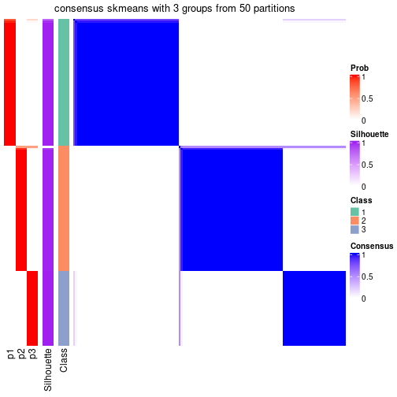</p>

</div>
<div id='tab-node-01-consensus-heatmap-3'>
<pre><code class="r">consensus_heatmap(res, k = 4)
</code></pre>

<p>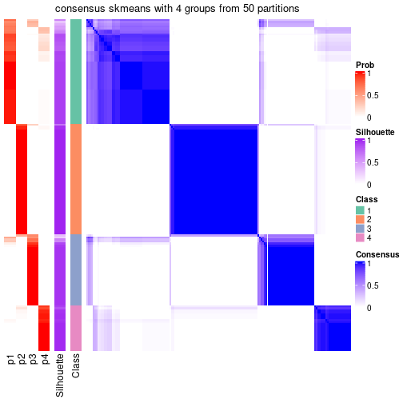</p>

</div>
</div>

Heatmaps for the membership of samples in all partitions to see how consistent they are:


<script>
$( function() {
	$( '#tabs-node-01-membership-heatmap' ).tabs();
} );
</script>
<div id='tabs-node-01-membership-heatmap'>
<ul>
<li><a href='#tab-node-01-membership-heatmap-1'>k = 2</a></li>
<li><a href='#tab-node-01-membership-heatmap-2'>k = 3</a></li>
<li><a href='#tab-node-01-membership-heatmap-3'>k = 4</a></li>
</ul>
<div id='tab-node-01-membership-heatmap-1'>
<pre><code class="r">membership_heatmap(res, k = 2)
</code></pre>

<p>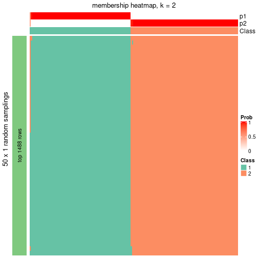</p>

</div>
<div id='tab-node-01-membership-heatmap-2'>
<pre><code class="r">membership_heatmap(res, k = 3)
</code></pre>

<p>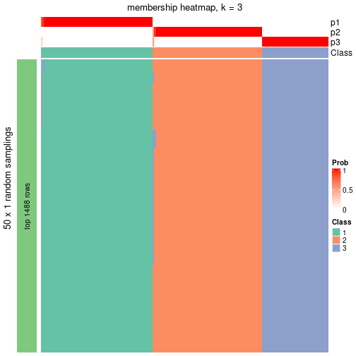</p>

</div>
<div id='tab-node-01-membership-heatmap-3'>
<pre><code class="r">membership_heatmap(res, k = 4)
</code></pre>

<p>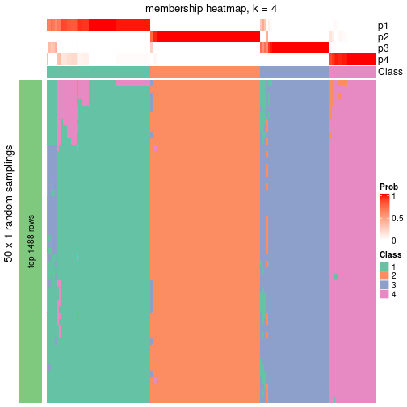</p>

</div>
</div>

As soon as the classes for columns are determined, the signatures
that are significantly different between subgroups can be looked for. 
Following are the heatmaps for signatures.


Signature heatmaps where rows are scaled:


<script>
$( function() {
	$( '#tabs-node-01-get-signatures' ).tabs();
} );
</script>
<div id='tabs-node-01-get-signatures'>
<ul>
<li><a href='#tab-node-01-get-signatures-1'>k = 2</a></li>
<li><a href='#tab-node-01-get-signatures-2'>k = 3</a></li>
<li><a href='#tab-node-01-get-signatures-3'>k = 4</a></li>
</ul>
<div id='tab-node-01-get-signatures-1'>
<pre><code class="r">get_signatures(res, k = 2)
</code></pre>

<p></p>

</div>
<div id='tab-node-01-get-signatures-2'>
<pre><code class="r">get_signatures(res, k = 3)
</code></pre>

<p>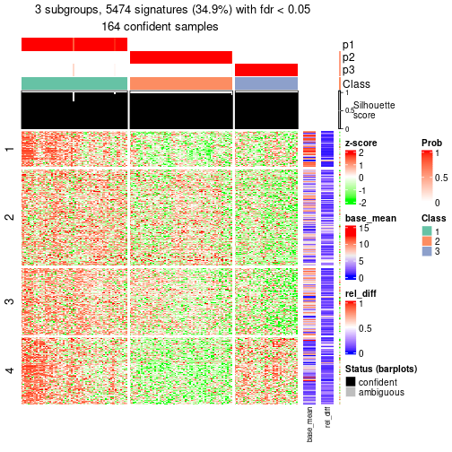</p>

</div>
<div id='tab-node-01-get-signatures-3'>
<pre><code class="r">get_signatures(res, k = 4)
</code></pre>

<p>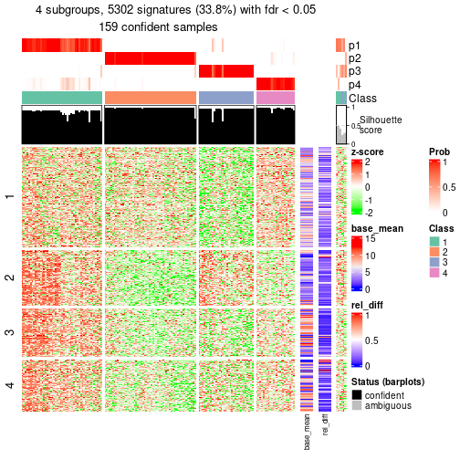</p>

</div>
</div>


Signature heatmaps where rows are not scaled:


<script>
$( function() {
	$( '#tabs-node-01-get-signatures-no-scale' ).tabs();
} );
</script>
<div id='tabs-node-01-get-signatures-no-scale'>
<ul>
<li><a href='#tab-node-01-get-signatures-no-scale-1'>k = 2</a></li>
<li><a href='#tab-node-01-get-signatures-no-scale-2'>k = 3</a></li>
<li><a href='#tab-node-01-get-signatures-no-scale-3'>k = 4</a></li>
</ul>
<div id='tab-node-01-get-signatures-no-scale-1'>
<pre><code class="r">get_signatures(res, k = 2, scale_rows = FALSE)
</code></pre>

<p>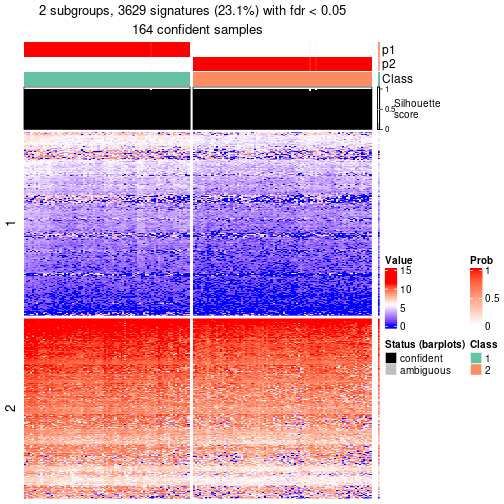</p>

</div>
<div id='tab-node-01-get-signatures-no-scale-2'>
<pre><code class="r">get_signatures(res, k = 3, scale_rows = FALSE)
</code></pre>

<p>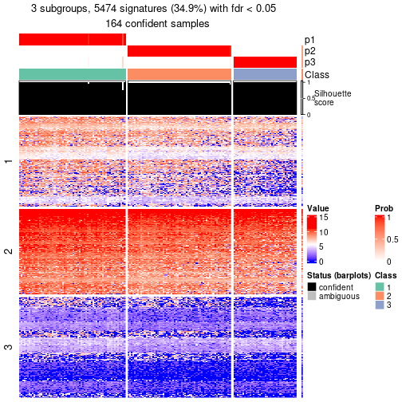</p>

</div>
<div id='tab-node-01-get-signatures-no-scale-3'>
<pre><code class="r">get_signatures(res, k = 4, scale_rows = FALSE)
</code></pre>

<p></p>

</div>
</div>


Compare the overlap of signatures from different k:

```r
compare_signatures(res)
```

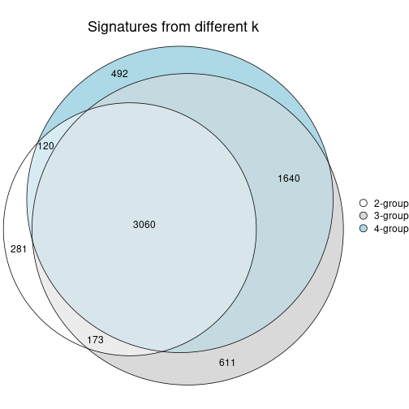

`get_signature()` returns a data frame invisibly. To get the list of signatures, the function
call should be assigned to a variable explicitly. In following code, if `plot` argument is set
to `FALSE`, no heatmap is plotted while only the differential analysis is performed.

```r
# code only for demonstration
tb = get_signature(res, k = ..., plot = FALSE)
```

An example of the output of `tb` is:

```
#>   which_row         fdr    mean_1    mean_2 scaled_mean_1 scaled_mean_2 km
#> 1        38 0.042760348  8.373488  9.131774    -0.5533452     0.5164555  1
#> 2        40 0.018707592  7.106213  8.469186    -0.6173731     0.5762149  1
#> 3        55 0.019134737 10.221463 11.207825    -0.6159697     0.5749050  1
#> 4        59 0.006059896  5.921854  7.869574    -0.6899429     0.6439467  1
#> 5        60 0.018055526  8.928898 10.211722    -0.6204761     0.5791110  1
#> 6        98 0.009384629 15.714769 14.887706     0.6635654    -0.6193277  2
...
```

The columns in `tb` are:

1. `which_row`: row indices corresponding to the input matrix.
2. `fdr`: FDR for the differential test. 
3. `mean_x`: The mean value in group x.
4. `scaled_mean_x`: The mean value in group x after rows are scaled.
5. `km`: Row groups if k-means clustering is applied to rows (which is done by automatically selecting number of clusters).

If there are too many signatures, `top_signatures = ...` can be set to only show the 
signatures with the highest FDRs:

```r
# code only for demonstration
# e.g. to show the top 500 most significant rows
tb = get_signature(res, k = ..., top_signatures = 500)
```

If the signatures are defined as these which are uniquely high in current group, `diff_method` argument
can be set to `"uniquely_high_in_one_group"`:

```r
# code only for demonstration
tb = get_signature(res, k = ..., diff_method = "uniquely_high_in_one_group")
```


UMAP plot which shows how samples are separated.


<script>
$( function() {
	$( '#tabs-node-01-dimension-reduction' ).tabs();
} );
</script>
<div id='tabs-node-01-dimension-reduction'>
<ul>
<li><a href='#tab-node-01-dimension-reduction-1'>k = 2</a></li>
<li><a href='#tab-node-01-dimension-reduction-2'>k = 3</a></li>
<li><a href='#tab-node-01-dimension-reduction-3'>k = 4</a></li>
</ul>
<div id='tab-node-01-dimension-reduction-1'>
<pre><code class="r">dimension_reduction(res, k = 2, method = &quot;UMAP&quot;)
</code></pre>

<p>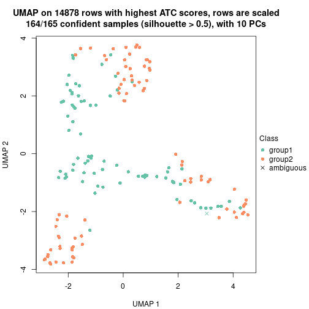</p>

</div>
<div id='tab-node-01-dimension-reduction-2'>
<pre><code class="r">dimension_reduction(res, k = 3, method = &quot;UMAP&quot;)
</code></pre>

<p>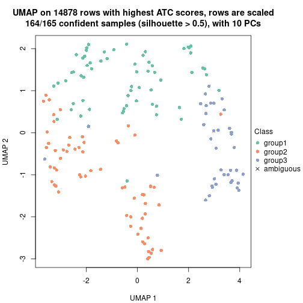</p>

</div>
<div id='tab-node-01-dimension-reduction-3'>
<pre><code class="r">dimension_reduction(res, k = 4, method = &quot;UMAP&quot;)
</code></pre>

<p>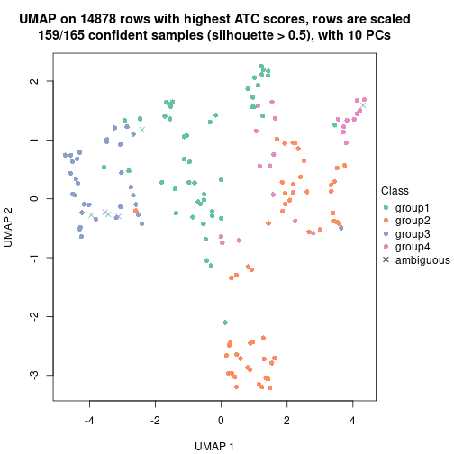</p>

</div>
</div>


Following heatmap shows how subgroups are split when increasing `k`:

```r
collect_classes(res)
```

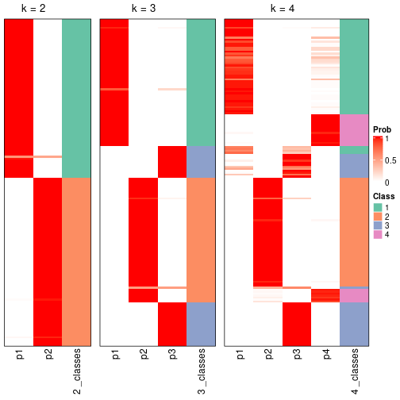


If matrix rows can be associated to genes, consider to use `functional_enrichment(res,
...)` to perform function enrichment for the signature genes. See [this vignette](https://jokergoo.github.io/cola_vignettes/functional_enrichment.html) for more detailed explanations.


 

---------------------------------------------------


### Node011


Parent node: [Node01](#Node01).
Child nodes: 
                Node0111-leaf
        ,
                Node0112-leaf
        ,
                Node0121-leaf
        ,
                Node0122-leaf
        ,
                [Node0221](#Node0221)
        ,
                Node0222-leaf
        .


The object with results only for a single top-value method and a single partitioning method 
can be extracted as:

```r
res = res_rh["011"]
```

A summary of `res` and all the functions that can be applied to it:

```r
res
```

```
#> A 'ConsensusPartition' object with k = 2, 3, 4.
#>   On a matrix with 14875 rows and 64 columns.
#>   Top rows (1488) are extracted by 'ATC' method.
#>   Subgroups are detected by 'skmeans' method.
#>   Performed in total 150 partitions by row resampling.
#>   Best k for subgroups seems to be 3.
#> 
#> Following methods can be applied to this 'ConsensusPartition' object:
#>  [1] "cola_report"             "collect_classes"         "collect_plots"          
#>  [4] "collect_stats"           "colnames"                "compare_partitions"     
#>  [7] "compare_signatures"      "consensus_heatmap"       "dimension_reduction"    
#> [10] "functional_enrichment"   "get_anno_col"            "get_anno"               
#> [13] "get_classes"             "get_consensus"           "get_matrix"             
#> [16] "get_membership"          "get_param"               "get_signatures"         
#> [19] "get_stats"               "is_best_k"               "is_stable_k"            
#> [22] "membership_heatmap"      "ncol"                    "nrow"                   
#> [25] "plot_ecdf"               "predict_classes"         "rownames"               
#> [28] "select_partition_number" "show"                    "suggest_best_k"         
#> [31] "test_to_known_factors"   "top_rows_heatmap"
```

`collect_plots()` function collects all the plots made from `res` for all `k` (number of subgroups)
into one single page to provide an easy and fast comparison between different `k`.

```r
collect_plots(res)
```

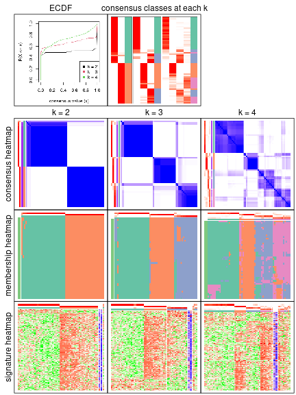

The plots are:

- The first row: a plot of the eCDF (empirical cumulative distribution
  function) curves of the consensus matrix for each `k` and the heatmap of
  predicted classes for each `k`.
- The second row: heatmaps of the consensus matrix for each `k`.
- The third row: heatmaps of the membership matrix for each `k`.
- The fouth row: heatmaps of the signatures for each `k`.

All the plots in panels can be made by individual functions and they are
plotted later in this section.

`select_partition_number()` produces several plots showing different
statistics for choosing "optimized" `k`. There are following statistics:

- eCDF curves of the consensus matrix for each `k`;
- 1-PAC. [The PAC score](https://en.wikipedia.org/wiki/Consensus_clustering#Over-interpretation_potential_of_consensus_clustering)
  measures the proportion of the ambiguous subgrouping.
- Mean silhouette score.
- Concordance. The mean probability of fiting the consensus subgroup labels in all
  partitions.
- Area increased. Denote $A_k$ as the area under the eCDF curve for current
  `k`, the area increased is defined as $A_k - A_{k-1}$.
- Rand index. The percent of pairs of samples that are both in a same cluster
  or both are not in a same cluster in the partition of k and k-1.
- Jaccard index. The ratio of pairs of samples are both in a same cluster in
  the partition of k and k-1 and the pairs of samples are both in a same
  cluster in the partition k or k-1.

The detailed explanations of these statistics can be found in [the _cola_
vignette](https://jokergoo.github.io/cola_vignettes/cola.html#toc_13).

Generally speaking, higher 1-PAC score, higher mean silhouette score or higher
concordance corresponds to better partition. Rand index and Jaccard index
measure how similar the current partition is compared to partition with `k-1`.
If they are too similar, we won't accept `k` is better than `k-1`.

```r
select_partition_number(res)
```

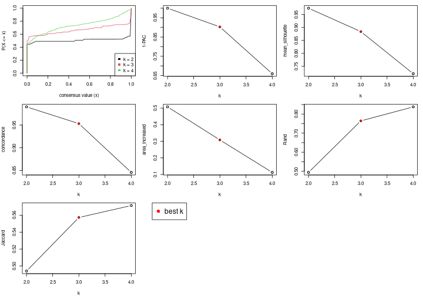

The numeric values for all these statistics can be obtained by `get_stats()`.

```r
get_stats(res)
```

```
#>   k 1-PAC mean_silhouette concordance area_increased  Rand Jaccard
#> 2 2 1.000           0.974       0.990          0.507 0.494   0.494
#> 3 3 0.903           0.884       0.953          0.308 0.764   0.557
#> 4 4 0.659           0.722       0.846          0.112 0.838   0.571
```

`suggest_best_k()` suggests the best $k$ based on these statistics. The rules are as follows:

- All $k$ with Jaccard index larger than 0.95 are removed because increasing
  $k$ does not provide enough extra information. If all $k$ are removed, it is
  marked as no subgroup is detected.
- For all $k$ with 1-PAC score larger than 0.9, the maximal $k$ is taken as
  the best $k$, and other $k$ are marked as optional $k$.
- If it does not fit the second rule. The $k$ with the maximal vote of the
  highest 1-PAC score, highest mean silhouette, and highest concordance is
  taken as the best $k$.

```r
suggest_best_k(res)
```

```
#> [1] 3
#> attr(,"optional")
#> [1] 2
```

There is also optional best $k$ = 2 that is worth to check.

Following is the table of the partitions (You need to click the **show/hide
code output** link to see it). The membership matrix (columns with name `p*`)
is inferred by
[`clue::cl_consensus()`](https://www.rdocumentation.org/link/cl_consensus?package=clue)
function with the `SE` method. Basically the value in the membership matrix
represents the probability to belong to a certain group. The finall subgroup
label for an item is determined with the group with highest probability it
belongs to.

In `get_classes()` function, the entropy is calculated from the membership
matrix and the silhouette score is calculated from the consensus matrix.


<script>
$( function() {
	$( '#tabs-node-011-get-classes' ).tabs();
} );
</script>
<div id='tabs-node-011-get-classes'>
<ul>
<li><a href='#tab-node-011-get-classes-1'>k = 2</a></li>
<li><a href='#tab-node-011-get-classes-2'>k = 3</a></li>
<li><a href='#tab-node-011-get-classes-3'>k = 4</a></li>
</ul>

<div id='tab-node-011-get-classes-1'>
<p><a id='tab-node-011-get-classes-1-a' style='color:#0366d6' href='#'>show/hide code output</a></p>
<pre><code class="r">cbind(get_classes(res, k = 2), get_membership(res, k = 2))
</code></pre>

<pre><code>#&gt;                  class entropy silhouette   p1   p2
#&gt; G1_cell9_count       2   0.000      1.000 0.00 1.00
#&gt; G1_cell13_count      2   0.000      1.000 0.00 1.00
#&gt; G1_cell22_count      2   0.000      1.000 0.00 1.00
#&gt; G1_cell36_count      2   0.000      1.000 0.00 1.00
#&gt; G1_cell42_count      1   0.000      0.980 1.00 0.00
#&gt; G1_cell62_count      2   0.000      1.000 0.00 1.00
#&gt; G1_cell70_count      1   0.402      0.905 0.92 0.08
#&gt; G1_cell75_count      2   0.000      1.000 0.00 1.00
#&gt; G1_cell87_count      2   0.000      1.000 0.00 1.00
#&gt; G1_cell91_count      1   0.000      0.980 1.00 0.00
#&gt; G1_cell96_count      2   0.000      1.000 0.00 1.00
#&gt; S_cell3_count        1   0.000      0.980 1.00 0.00
#&gt; S_cell8_count        1   0.000      0.980 1.00 0.00
#&gt; S_cell9_count        1   0.000      0.980 1.00 0.00
#&gt; S_cell10_count       1   0.000      0.980 1.00 0.00
#&gt; S_cell13_count       1   0.000      0.980 1.00 0.00
#&gt; S_cell15_count       1   0.000      0.980 1.00 0.00
#&gt; S_cell16_count       1   0.000      0.980 1.00 0.00
#&gt; S_cell17_count       2   0.000      1.000 0.00 1.00
#&gt; S_cell22_count       1   0.000      0.980 1.00 0.00
#&gt; S_cell24_count       1   0.000      0.980 1.00 0.00
#&gt; S_cell26_count       2   0.000      1.000 0.00 1.00
#&gt; S_cell27_count       1   0.000      0.980 1.00 0.00
#&gt; S_cell28_count       1   0.000      0.980 1.00 0.00
#&gt; S_cell29_count       1   0.000      0.980 1.00 0.00
#&gt; S_cell30_count       2   0.000      1.000 0.00 1.00
#&gt; S_cell37_count       1   0.000      0.980 1.00 0.00
#&gt; S_cell40_count       1   0.000      0.980 1.00 0.00
#&gt; S_cell42_count       1   0.000      0.980 1.00 0.00
#&gt; S_cell43_count       1   0.327      0.926 0.94 0.06
#&gt; S_cell50_count       1   0.000      0.980 1.00 0.00
#&gt; S_cell52_count       1   0.000      0.980 1.00 0.00
#&gt; S_cell53_count       1   0.000      0.980 1.00 0.00
#&gt; S_cell55_count       1   0.000      0.980 1.00 0.00
#&gt; S_cell57_count       2   0.000      1.000 0.00 1.00
#&gt; S_cell63_count       1   0.000      0.980 1.00 0.00
#&gt; S_cell70_count       2   0.000      1.000 0.00 1.00
#&gt; S_cell79_count       1   0.000      0.980 1.00 0.00
#&gt; S_cell83_count       2   0.000      1.000 0.00 1.00
#&gt; S_cell92_count       1   0.000      0.980 1.00 0.00
#&gt; G2M_cell5_count      1   0.995      0.163 0.54 0.46
#&gt; G2M_cell7_count      2   0.000      1.000 0.00 1.00
#&gt; G2M_cell8_count      1   0.000      0.980 1.00 0.00
#&gt; G2M_cell18_count     2   0.000      1.000 0.00 1.00
#&gt; G2M_cell19_count     1   0.000      0.980 1.00 0.00
#&gt; G2M_cell20_count     2   0.000      1.000 0.00 1.00
#&gt; G2M_cell23_count     2   0.000      1.000 0.00 1.00
#&gt; G2M_cell32_count     1   0.000      0.980 1.00 0.00
#&gt; G2M_cell33_count     2   0.000      1.000 0.00 1.00
#&gt; G2M_cell44_count     2   0.000      1.000 0.00 1.00
#&gt; G2M_cell47_count     2   0.000      1.000 0.00 1.00
#&gt; G2M_cell48_count     2   0.000      1.000 0.00 1.00
#&gt; G2M_cell58_count     2   0.000      1.000 0.00 1.00
#&gt; G2M_cell59_count     1   0.000      0.980 1.00 0.00
#&gt; G2M_cell60_count     2   0.000      1.000 0.00 1.00
#&gt; G2M_cell61_count     2   0.000      1.000 0.00 1.00
#&gt; G2M_cell68_count     2   0.000      1.000 0.00 1.00
#&gt; G2M_cell69_count     1   0.000      0.980 1.00 0.00
#&gt; G2M_cell71_count     2   0.000      1.000 0.00 1.00
#&gt; G2M_cell73_count     1   0.242      0.946 0.96 0.04
#&gt; G2M_cell74_count     2   0.000      1.000 0.00 1.00
#&gt; G2M_cell84_count     1   0.000      0.980 1.00 0.00
#&gt; G2M_cell86_count     2   0.000      1.000 0.00 1.00
#&gt; G2M_cell91_count     2   0.000      1.000 0.00 1.00
</code></pre>

<script>
$('#tab-node-011-get-classes-1-a').parent().next().next().hide();
$('#tab-node-011-get-classes-1-a').click(function(){
  $('#tab-node-011-get-classes-1-a').parent().next().next().toggle();
  return(false);
});
</script>
</div>

<div id='tab-node-011-get-classes-2'>
<p><a id='tab-node-011-get-classes-2-a' style='color:#0366d6' href='#'>show/hide code output</a></p>
<pre><code class="r">cbind(get_classes(res, k = 3), get_membership(res, k = 3))
</code></pre>

<pre><code>#&gt;                  class entropy silhouette   p1   p2   p3
#&gt; G1_cell9_count       2  0.0000      0.970 0.00 1.00 0.00
#&gt; G1_cell13_count      2  0.0000      0.970 0.00 1.00 0.00
#&gt; G1_cell22_count      2  0.0000      0.970 0.00 1.00 0.00
#&gt; G1_cell36_count      2  0.0000      0.970 0.00 1.00 0.00
#&gt; G1_cell42_count      1  0.0000      0.961 1.00 0.00 0.00
#&gt; G1_cell62_count      2  0.0000      0.970 0.00 1.00 0.00
#&gt; G1_cell70_count      3  0.1781      0.876 0.02 0.02 0.96
#&gt; G1_cell75_count      2  0.0000      0.970 0.00 1.00 0.00
#&gt; G1_cell87_count      2  0.0000      0.970 0.00 1.00 0.00
#&gt; G1_cell91_count      1  0.0000      0.961 1.00 0.00 0.00
#&gt; G1_cell96_count      2  0.0000      0.970 0.00 1.00 0.00
#&gt; S_cell3_count        1  0.0000      0.961 1.00 0.00 0.00
#&gt; S_cell8_count        1  0.0000      0.961 1.00 0.00 0.00
#&gt; S_cell9_count        1  0.0000      0.961 1.00 0.00 0.00
#&gt; S_cell10_count       1  0.0000      0.961 1.00 0.00 0.00
#&gt; S_cell13_count       1  0.0000      0.961 1.00 0.00 0.00
#&gt; S_cell15_count       1  0.0000      0.961 1.00 0.00 0.00
#&gt; S_cell16_count       1  0.0000      0.961 1.00 0.00 0.00
#&gt; S_cell17_count       2  0.0000      0.970 0.00 1.00 0.00
#&gt; S_cell22_count       1  0.0000      0.961 1.00 0.00 0.00
#&gt; S_cell24_count       1  0.0000      0.961 1.00 0.00 0.00
#&gt; S_cell26_count       2  0.0000      0.970 0.00 1.00 0.00
#&gt; S_cell27_count       1  0.0000      0.961 1.00 0.00 0.00
#&gt; S_cell28_count       1  0.0000      0.961 1.00 0.00 0.00
#&gt; S_cell29_count       1  0.0000      0.961 1.00 0.00 0.00
#&gt; S_cell30_count       2  0.0000      0.970 0.00 1.00 0.00
#&gt; S_cell37_count       1  0.0000      0.961 1.00 0.00 0.00
#&gt; S_cell40_count       1  0.0000      0.961 1.00 0.00 0.00
#&gt; S_cell42_count       1  0.0000      0.961 1.00 0.00 0.00
#&gt; S_cell43_count       1  0.6651      0.449 0.64 0.34 0.02
#&gt; S_cell50_count       1  0.0000      0.961 1.00 0.00 0.00
#&gt; S_cell52_count       1  0.0000      0.961 1.00 0.00 0.00
#&gt; S_cell53_count       1  0.0000      0.961 1.00 0.00 0.00
#&gt; S_cell55_count       1  0.0000      0.961 1.00 0.00 0.00
#&gt; S_cell57_count       2  0.0000      0.970 0.00 1.00 0.00
#&gt; S_cell63_count       1  0.0000      0.961 1.00 0.00 0.00
#&gt; S_cell70_count       2  0.0000      0.970 0.00 1.00 0.00
#&gt; S_cell79_count       1  0.0000      0.961 1.00 0.00 0.00
#&gt; S_cell83_count       2  0.0892      0.961 0.00 0.98 0.02
#&gt; S_cell92_count       1  0.0000      0.961 1.00 0.00 0.00
#&gt; G2M_cell5_count      3  0.0000      0.893 0.00 0.00 1.00
#&gt; G2M_cell7_count      2  0.0892      0.961 0.00 0.98 0.02
#&gt; G2M_cell8_count      3  0.6192      0.245 0.42 0.00 0.58
#&gt; G2M_cell18_count     3  0.4291      0.747 0.00 0.18 0.82
#&gt; G2M_cell19_count     3  0.6280      0.121 0.46 0.00 0.54
#&gt; G2M_cell20_count     3  0.0892      0.886 0.00 0.02 0.98
#&gt; G2M_cell23_count     3  0.4555      0.720 0.00 0.20 0.80
#&gt; G2M_cell32_count     1  0.5397      0.599 0.72 0.00 0.28
#&gt; G2M_cell33_count     3  0.0892      0.886 0.00 0.02 0.98
#&gt; G2M_cell44_count     3  0.0000      0.893 0.00 0.00 1.00
#&gt; G2M_cell47_count     3  0.0000      0.893 0.00 0.00 1.00
#&gt; G2M_cell48_count     2  0.6126      0.306 0.00 0.60 0.40
#&gt; G2M_cell58_count     2  0.0892      0.961 0.00 0.98 0.02
#&gt; G2M_cell59_count     3  0.0000      0.893 0.00 0.00 1.00
#&gt; G2M_cell60_count     3  0.0000      0.893 0.00 0.00 1.00
#&gt; G2M_cell61_count     2  0.0892      0.961 0.00 0.98 0.02
#&gt; G2M_cell68_count     3  0.0000      0.893 0.00 0.00 1.00
#&gt; G2M_cell69_count     3  0.0000      0.893 0.00 0.00 1.00
#&gt; G2M_cell71_count     3  0.4291      0.747 0.00 0.18 0.82
#&gt; G2M_cell73_count     3  0.0000      0.893 0.00 0.00 1.00
#&gt; G2M_cell74_count     3  0.0000      0.893 0.00 0.00 1.00
#&gt; G2M_cell84_count     1  0.5397      0.599 0.72 0.00 0.28
#&gt; G2M_cell86_count     2  0.0892      0.961 0.00 0.98 0.02
#&gt; G2M_cell91_count     3  0.2066      0.864 0.00 0.06 0.94
</code></pre>

<script>
$('#tab-node-011-get-classes-2-a').parent().next().next().hide();
$('#tab-node-011-get-classes-2-a').click(function(){
  $('#tab-node-011-get-classes-2-a').parent().next().next().toggle();
  return(false);
});
</script>
</div>

<div id='tab-node-011-get-classes-3'>
<p><a id='tab-node-011-get-classes-3-a' style='color:#0366d6' href='#'>show/hide code output</a></p>
<pre><code class="r">cbind(get_classes(res, k = 4), get_membership(res, k = 4))
</code></pre>

<pre><code>#&gt;                  class entropy silhouette   p1   p2   p3   p4
#&gt; G1_cell9_count       2  0.0000     0.8425 0.00 1.00 0.00 0.00
#&gt; G1_cell13_count      2  0.0000     0.8425 0.00 1.00 0.00 0.00
#&gt; G1_cell22_count      2  0.0000     0.8425 0.00 1.00 0.00 0.00
#&gt; G1_cell36_count      2  0.0000     0.8425 0.00 1.00 0.00 0.00
#&gt; G1_cell42_count      1  0.0707     0.9163 0.98 0.02 0.00 0.00
#&gt; G1_cell62_count      2  0.0000     0.8425 0.00 1.00 0.00 0.00
#&gt; G1_cell70_count      3  0.6835     0.2928 0.06 0.38 0.54 0.02
#&gt; G1_cell75_count      2  0.0000     0.8425 0.00 1.00 0.00 0.00
#&gt; G1_cell87_count      2  0.0000     0.8425 0.00 1.00 0.00 0.00
#&gt; G1_cell91_count      1  0.2647     0.8362 0.88 0.12 0.00 0.00
#&gt; G1_cell96_count      2  0.0000     0.8425 0.00 1.00 0.00 0.00
#&gt; S_cell3_count        1  0.0000     0.9207 1.00 0.00 0.00 0.00
#&gt; S_cell8_count        1  0.0000     0.9207 1.00 0.00 0.00 0.00
#&gt; S_cell9_count        1  0.2706     0.8671 0.90 0.00 0.08 0.02
#&gt; S_cell10_count       1  0.1411     0.9101 0.96 0.00 0.02 0.02
#&gt; S_cell13_count       1  0.0000     0.9207 1.00 0.00 0.00 0.00
#&gt; S_cell15_count       1  0.1913     0.8986 0.94 0.00 0.04 0.02
#&gt; S_cell16_count       1  0.3400     0.8556 0.82 0.00 0.00 0.18
#&gt; S_cell17_count       2  0.4855     0.2182 0.00 0.60 0.00 0.40
#&gt; S_cell22_count       1  0.1411     0.9098 0.96 0.00 0.02 0.02
#&gt; S_cell24_count       1  0.0000     0.9207 1.00 0.00 0.00 0.00
#&gt; S_cell26_count       4  0.6049     0.4556 0.12 0.20 0.00 0.68
#&gt; S_cell27_count       1  0.2647     0.9035 0.88 0.00 0.00 0.12
#&gt; S_cell28_count       1  0.0000     0.9207 1.00 0.00 0.00 0.00
#&gt; S_cell29_count       1  0.3400     0.8556 0.82 0.00 0.00 0.18
#&gt; S_cell30_count       2  0.2345     0.7584 0.00 0.90 0.00 0.10
#&gt; S_cell37_count       1  0.2011     0.9157 0.92 0.00 0.00 0.08
#&gt; S_cell40_count       1  0.2647     0.8938 0.88 0.00 0.00 0.12
#&gt; S_cell42_count       1  0.0000     0.9207 1.00 0.00 0.00 0.00
#&gt; S_cell43_count       4  0.5810     0.4424 0.20 0.06 0.02 0.72
#&gt; S_cell50_count       1  0.3172     0.8699 0.84 0.00 0.00 0.16
#&gt; S_cell52_count       1  0.2011     0.9100 0.92 0.00 0.00 0.08
#&gt; S_cell53_count       1  0.2011     0.9100 0.92 0.00 0.00 0.08
#&gt; S_cell55_count       1  0.3400     0.8556 0.82 0.00 0.00 0.18
#&gt; S_cell57_count       2  0.4994    -0.0647 0.00 0.52 0.00 0.48
#&gt; S_cell63_count       1  0.2647     0.8944 0.88 0.00 0.00 0.12
#&gt; S_cell70_count       4  0.5489     0.4627 0.06 0.24 0.00 0.70
#&gt; S_cell79_count       1  0.1211     0.9070 0.96 0.00 0.04 0.00
#&gt; S_cell83_count       4  0.2011     0.6690 0.00 0.08 0.00 0.92
#&gt; S_cell92_count       1  0.2335     0.8837 0.92 0.00 0.06 0.02
#&gt; G2M_cell5_count      3  0.2011     0.7233 0.00 0.00 0.92 0.08
#&gt; G2M_cell7_count      4  0.4755     0.6667 0.00 0.20 0.04 0.76
#&gt; G2M_cell8_count      3  0.4755     0.6552 0.20 0.00 0.76 0.04
#&gt; G2M_cell18_count     4  0.4134     0.6380 0.00 0.00 0.26 0.74
#&gt; G2M_cell19_count     3  0.4332     0.6785 0.16 0.00 0.80 0.04
#&gt; G2M_cell20_count     4  0.4406     0.5945 0.00 0.00 0.30 0.70
#&gt; G2M_cell23_count     4  0.4642     0.6593 0.00 0.02 0.24 0.74
#&gt; G2M_cell32_count     3  0.5392     0.5905 0.28 0.00 0.68 0.04
#&gt; G2M_cell33_count     2  0.6723     0.3364 0.00 0.60 0.26 0.14
#&gt; G2M_cell44_count     4  0.4948     0.3254 0.00 0.00 0.44 0.56
#&gt; G2M_cell47_count     3  0.3198     0.7063 0.00 0.04 0.88 0.08
#&gt; G2M_cell48_count     4  0.4731     0.6999 0.00 0.06 0.16 0.78
#&gt; G2M_cell58_count     4  0.5106     0.6421 0.00 0.24 0.04 0.72
#&gt; G2M_cell59_count     3  0.2830     0.7304 0.04 0.00 0.90 0.06
#&gt; G2M_cell60_count     3  0.4277     0.4861 0.00 0.00 0.72 0.28
#&gt; G2M_cell61_count     4  0.5392     0.5955 0.00 0.28 0.04 0.68
#&gt; G2M_cell68_count     3  0.2706     0.7148 0.00 0.02 0.90 0.08
#&gt; G2M_cell69_count     3  0.1211     0.7291 0.00 0.00 0.96 0.04
#&gt; G2M_cell71_count     4  0.3975     0.6433 0.00 0.00 0.24 0.76
#&gt; G2M_cell73_count     3  0.1637     0.7262 0.00 0.00 0.94 0.06
#&gt; G2M_cell74_count     3  0.2921     0.6774 0.00 0.00 0.86 0.14
#&gt; G2M_cell84_count     3  0.5392     0.5905 0.28 0.00 0.68 0.04
#&gt; G2M_cell86_count     4  0.4939     0.6580 0.00 0.22 0.04 0.74
#&gt; G2M_cell91_count     3  0.6150     0.2239 0.00 0.06 0.58 0.36
</code></pre>

<script>
$('#tab-node-011-get-classes-3-a').parent().next().next().hide();
$('#tab-node-011-get-classes-3-a').click(function(){
  $('#tab-node-011-get-classes-3-a').parent().next().next().toggle();
  return(false);
});
</script>
</div>
</div>

Heatmaps for the consensus matrix. It visualizes the probability of two
samples to be in a same group.


<script>
$( function() {
	$( '#tabs-node-011-consensus-heatmap' ).tabs();
} );
</script>
<div id='tabs-node-011-consensus-heatmap'>
<ul>
<li><a href='#tab-node-011-consensus-heatmap-1'>k = 2</a></li>
<li><a href='#tab-node-011-consensus-heatmap-2'>k = 3</a></li>
<li><a href='#tab-node-011-consensus-heatmap-3'>k = 4</a></li>
</ul>
<div id='tab-node-011-consensus-heatmap-1'>
<pre><code class="r">consensus_heatmap(res, k = 2)
</code></pre>

<p>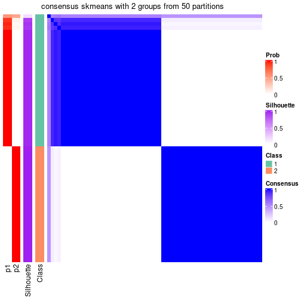</p>

</div>
<div id='tab-node-011-consensus-heatmap-2'>
<pre><code class="r">consensus_heatmap(res, k = 3)
</code></pre>

<p>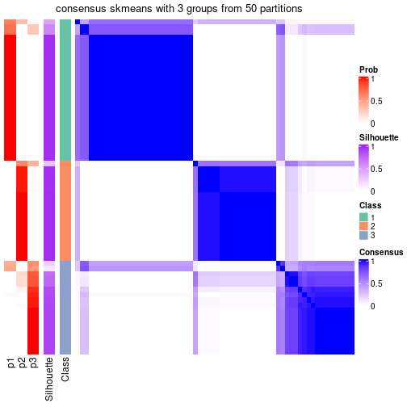</p>

</div>
<div id='tab-node-011-consensus-heatmap-3'>
<pre><code class="r">consensus_heatmap(res, k = 4)
</code></pre>

<p>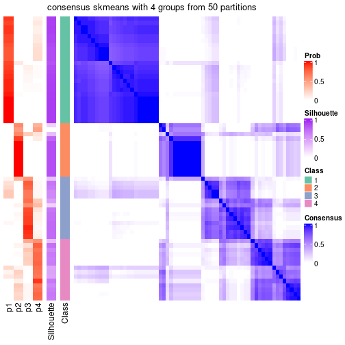</p>

</div>
</div>

Heatmaps for the membership of samples in all partitions to see how consistent they are:


<script>
$( function() {
	$( '#tabs-node-011-membership-heatmap' ).tabs();
} );
</script>
<div id='tabs-node-011-membership-heatmap'>
<ul>
<li><a href='#tab-node-011-membership-heatmap-1'>k = 2</a></li>
<li><a href='#tab-node-011-membership-heatmap-2'>k = 3</a></li>
<li><a href='#tab-node-011-membership-heatmap-3'>k = 4</a></li>
</ul>
<div id='tab-node-011-membership-heatmap-1'>
<pre><code class="r">membership_heatmap(res, k = 2)
</code></pre>

<p>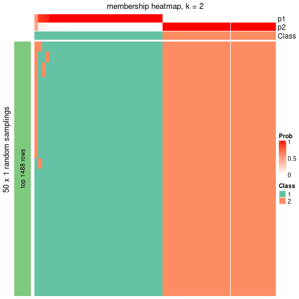</p>

</div>
<div id='tab-node-011-membership-heatmap-2'>
<pre><code class="r">membership_heatmap(res, k = 3)
</code></pre>

<p>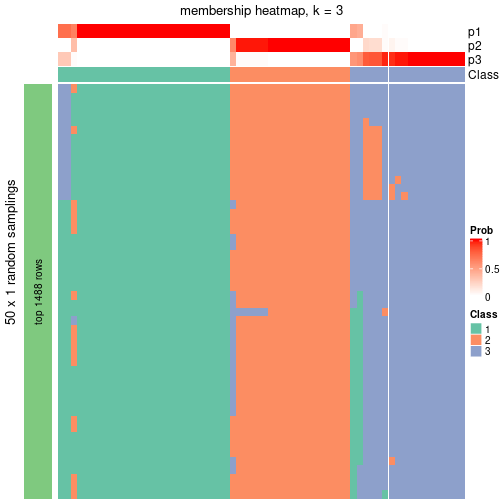</p>

</div>
<div id='tab-node-011-membership-heatmap-3'>
<pre><code class="r">membership_heatmap(res, k = 4)
</code></pre>

<p>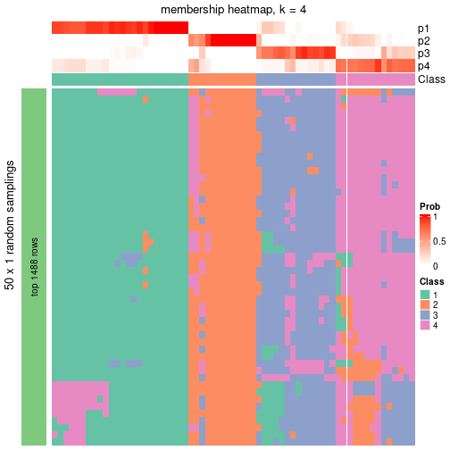</p>

</div>
</div>

As soon as the classes for columns are determined, the signatures
that are significantly different between subgroups can be looked for. 
Following are the heatmaps for signatures.


Signature heatmaps where rows are scaled:


<script>
$( function() {
	$( '#tabs-node-011-get-signatures' ).tabs();
} );
</script>
<div id='tabs-node-011-get-signatures'>
<ul>
<li><a href='#tab-node-011-get-signatures-1'>k = 2</a></li>
<li><a href='#tab-node-011-get-signatures-2'>k = 3</a></li>
<li><a href='#tab-node-011-get-signatures-3'>k = 4</a></li>
</ul>
<div id='tab-node-011-get-signatures-1'>
<pre><code class="r">get_signatures(res, k = 2)
</code></pre>

<p>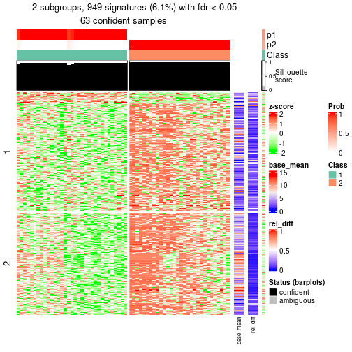</p>

</div>
<div id='tab-node-011-get-signatures-2'>
<pre><code class="r">get_signatures(res, k = 3)
</code></pre>

<p>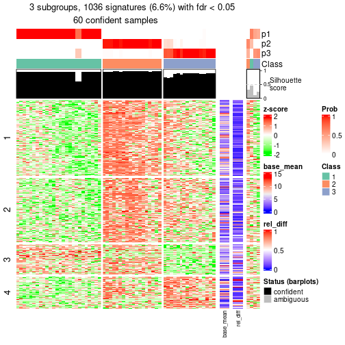</p>

</div>
<div id='tab-node-011-get-signatures-3'>
<pre><code class="r">get_signatures(res, k = 4)
</code></pre>

<p>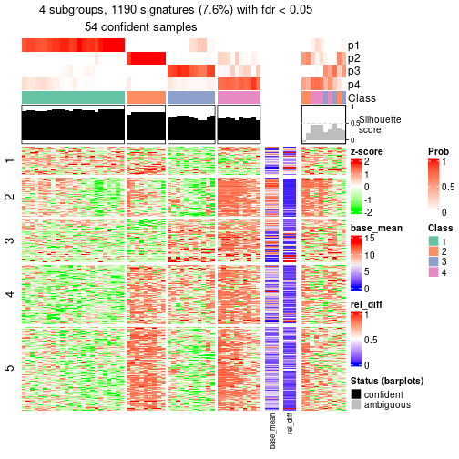</p>

</div>
</div>


Signature heatmaps where rows are not scaled:


<script>
$( function() {
	$( '#tabs-node-011-get-signatures-no-scale' ).tabs();
} );
</script>
<div id='tabs-node-011-get-signatures-no-scale'>
<ul>
<li><a href='#tab-node-011-get-signatures-no-scale-1'>k = 2</a></li>
<li><a href='#tab-node-011-get-signatures-no-scale-2'>k = 3</a></li>
<li><a href='#tab-node-011-get-signatures-no-scale-3'>k = 4</a></li>
</ul>
<div id='tab-node-011-get-signatures-no-scale-1'>
<pre><code class="r">get_signatures(res, k = 2, scale_rows = FALSE)
</code></pre>

<p>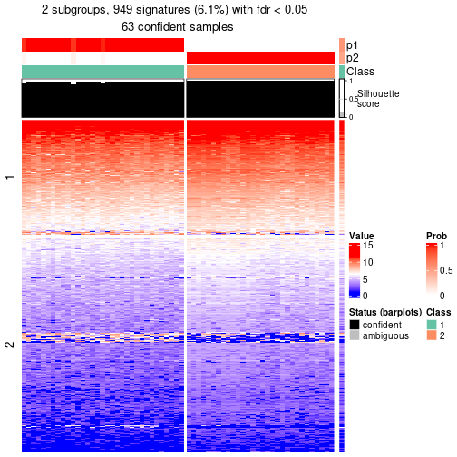</p>

</div>
<div id='tab-node-011-get-signatures-no-scale-2'>
<pre><code class="r">get_signatures(res, k = 3, scale_rows = FALSE)
</code></pre>

<p>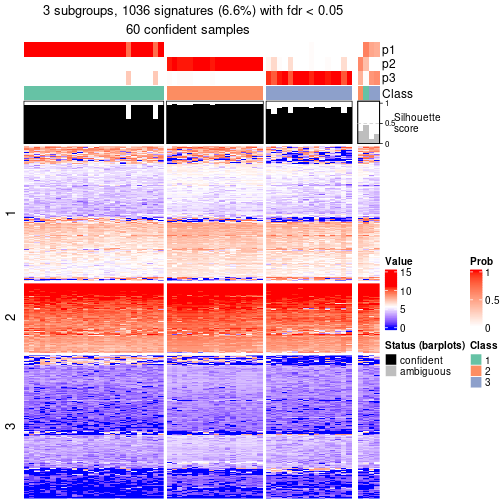</p>

</div>
<div id='tab-node-011-get-signatures-no-scale-3'>
<pre><code class="r">get_signatures(res, k = 4, scale_rows = FALSE)
</code></pre>

<p>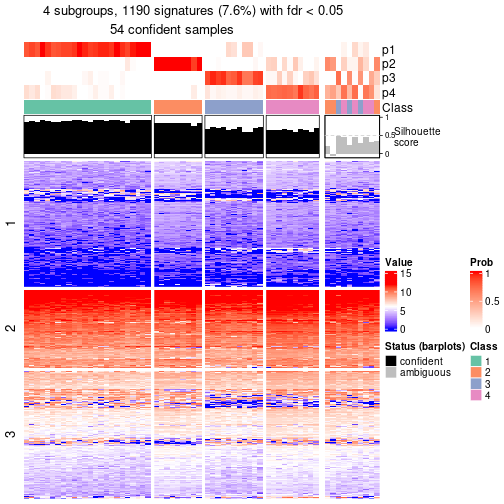</p>

</div>
</div>


Compare the overlap of signatures from different k:

```r
compare_signatures(res)
```

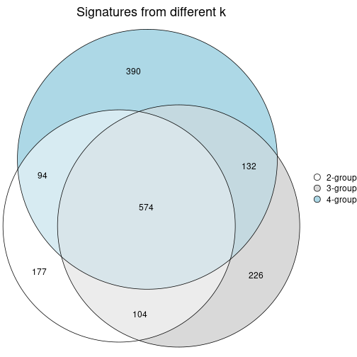

`get_signature()` returns a data frame invisibly. To get the list of signatures, the function
call should be assigned to a variable explicitly. In following code, if `plot` argument is set
to `FALSE`, no heatmap is plotted while only the differential analysis is performed.

```r
# code only for demonstration
tb = get_signature(res, k = ..., plot = FALSE)
```

An example of the output of `tb` is:

```
#>   which_row         fdr    mean_1    mean_2 scaled_mean_1 scaled_mean_2 km
#> 1        38 0.042760348  8.373488  9.131774    -0.5533452     0.5164555  1
#> 2        40 0.018707592  7.106213  8.469186    -0.6173731     0.5762149  1
#> 3        55 0.019134737 10.221463 11.207825    -0.6159697     0.5749050  1
#> 4        59 0.006059896  5.921854  7.869574    -0.6899429     0.6439467  1
#> 5        60 0.018055526  8.928898 10.211722    -0.6204761     0.5791110  1
#> 6        98 0.009384629 15.714769 14.887706     0.6635654    -0.6193277  2
...
```

The columns in `tb` are:

1. `which_row`: row indices corresponding to the input matrix.
2. `fdr`: FDR for the differential test. 
3. `mean_x`: The mean value in group x.
4. `scaled_mean_x`: The mean value in group x after rows are scaled.
5. `km`: Row groups if k-means clustering is applied to rows (which is done by automatically selecting number of clusters).

If there are too many signatures, `top_signatures = ...` can be set to only show the 
signatures with the highest FDRs:

```r
# code only for demonstration
# e.g. to show the top 500 most significant rows
tb = get_signature(res, k = ..., top_signatures = 500)
```

If the signatures are defined as these which are uniquely high in current group, `diff_method` argument
can be set to `"uniquely_high_in_one_group"`:

```r
# code only for demonstration
tb = get_signature(res, k = ..., diff_method = "uniquely_high_in_one_group")
```


UMAP plot which shows how samples are separated.


<script>
$( function() {
	$( '#tabs-node-011-dimension-reduction' ).tabs();
} );
</script>
<div id='tabs-node-011-dimension-reduction'>
<ul>
<li><a href='#tab-node-011-dimension-reduction-1'>k = 2</a></li>
<li><a href='#tab-node-011-dimension-reduction-2'>k = 3</a></li>
<li><a href='#tab-node-011-dimension-reduction-3'>k = 4</a></li>
</ul>
<div id='tab-node-011-dimension-reduction-1'>
<pre><code class="r">dimension_reduction(res, k = 2, method = &quot;UMAP&quot;)
</code></pre>

<p>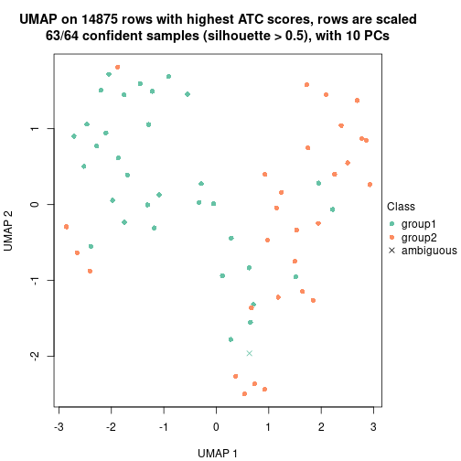</p>

</div>
<div id='tab-node-011-dimension-reduction-2'>
<pre><code class="r">dimension_reduction(res, k = 3, method = &quot;UMAP&quot;)
</code></pre>

<p>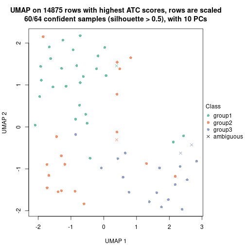</p>

</div>
<div id='tab-node-011-dimension-reduction-3'>
<pre><code class="r">dimension_reduction(res, k = 4, method = &quot;UMAP&quot;)
</code></pre>

<p>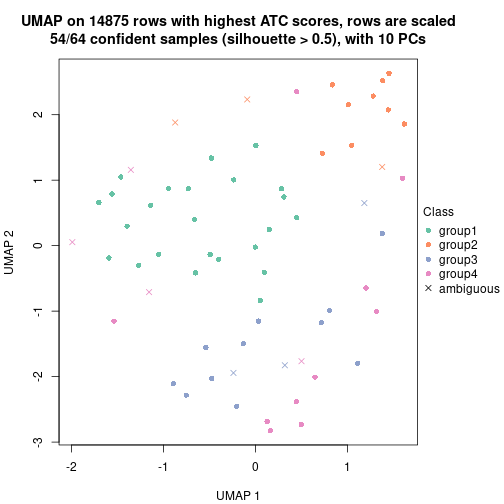</p>

</div>
</div>


Following heatmap shows how subgroups are split when increasing `k`:

```r
collect_classes(res)
```

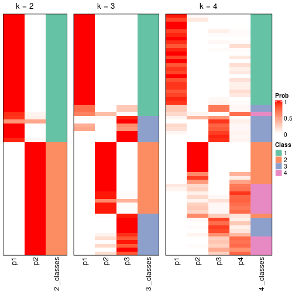


If matrix rows can be associated to genes, consider to use `functional_enrichment(res,
...)` to perform function enrichment for the signature genes. See [this vignette](https://jokergoo.github.io/cola_vignettes/functional_enrichment.html) for more detailed explanations.


 

---------------------------------------------------


### Node012


Parent node: [Node01](#Node01).
Child nodes: 
                Node0111-leaf
        ,
                Node0112-leaf
        ,
                Node0121-leaf
        ,
                Node0122-leaf
        ,
                [Node0221](#Node0221)
        ,
                Node0222-leaf
        .


The object with results only for a single top-value method and a single partitioning method 
can be extracted as:

```r
res = res_rh["012"]
```

A summary of `res` and all the functions that can be applied to it:

```r
res
```

```
#> A 'ConsensusPartition' object with k = 2, 3, 4.
#>   On a matrix with 14797 rows and 63 columns.
#>   Top rows (1270) are extracted by 'ATC' method.
#>   Subgroups are detected by 'skmeans' method.
#>   Performed in total 150 partitions by row resampling.
#>   Best k for subgroups seems to be 2.
#> 
#> Following methods can be applied to this 'ConsensusPartition' object:
#>  [1] "cola_report"             "collect_classes"         "collect_plots"          
#>  [4] "collect_stats"           "colnames"                "compare_partitions"     
#>  [7] "compare_signatures"      "consensus_heatmap"       "dimension_reduction"    
#> [10] "functional_enrichment"   "get_anno_col"            "get_anno"               
#> [13] "get_classes"             "get_consensus"           "get_matrix"             
#> [16] "get_membership"          "get_param"               "get_signatures"         
#> [19] "get_stats"               "is_best_k"               "is_stable_k"            
#> [22] "membership_heatmap"      "ncol"                    "nrow"                   
#> [25] "plot_ecdf"               "predict_classes"         "rownames"               
#> [28] "select_partition_number" "show"                    "suggest_best_k"         
#> [31] "test_to_known_factors"   "top_rows_heatmap"
```

`collect_plots()` function collects all the plots made from `res` for all `k` (number of subgroups)
into one single page to provide an easy and fast comparison between different `k`.

```r
collect_plots(res)
```


The plots are:

- The first row: a plot of the eCDF (empirical cumulative distribution
  function) curves of the consensus matrix for each `k` and the heatmap of
  predicted classes for each `k`.
- The second row: heatmaps of the consensus matrix for each `k`.
- The third row: heatmaps of the membership matrix for each `k`.
- The fouth row: heatmaps of the signatures for each `k`.

All the plots in panels can be made by individual functions and they are
plotted later in this section.

`select_partition_number()` produces several plots showing different
statistics for choosing "optimized" `k`. There are following statistics:

- eCDF curves of the consensus matrix for each `k`;
- 1-PAC. [The PAC score](https://en.wikipedia.org/wiki/Consensus_clustering#Over-interpretation_potential_of_consensus_clustering)
  measures the proportion of the ambiguous subgrouping.
- Mean silhouette score.
- Concordance. The mean probability of fiting the consensus subgroup labels in all
  partitions.
- Area increased. Denote $A_k$ as the area under the eCDF curve for current
  `k`, the area increased is defined as $A_k - A_{k-1}$.
- Rand index. The percent of pairs of samples that are both in a same cluster
  or both are not in a same cluster in the partition of k and k-1.
- Jaccard index. The ratio of pairs of samples are both in a same cluster in
  the partition of k and k-1 and the pairs of samples are both in a same
  cluster in the partition k or k-1.

The detailed explanations of these statistics can be found in [the _cola_
vignette](https://jokergoo.github.io/cola_vignettes/cola.html#toc_13).

Generally speaking, higher 1-PAC score, higher mean silhouette score or higher
concordance corresponds to better partition. Rand index and Jaccard index
measure how similar the current partition is compared to partition with `k-1`.
If they are too similar, we won't accept `k` is better than `k-1`.

```r
select_partition_number(res)
```

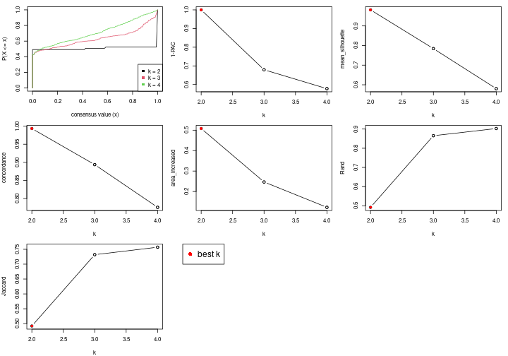

The numeric values for all these statistics can be obtained by `get_stats()`.

```r
get_stats(res)
```

```
#>   k 1-PAC mean_silhouette concordance area_increased  Rand Jaccard
#> 2 2 1.000           0.982       0.993          0.508 0.492   0.492
#> 3 3 0.679           0.784       0.894          0.247 0.865   0.732
#> 4 4 0.578           0.580       0.776          0.123 0.903   0.757
```

`suggest_best_k()` suggests the best $k$ based on these statistics. The rules are as follows:

- All $k$ with Jaccard index larger than 0.95 are removed because increasing
  $k$ does not provide enough extra information. If all $k$ are removed, it is
  marked as no subgroup is detected.
- For all $k$ with 1-PAC score larger than 0.9, the maximal $k$ is taken as
  the best $k$, and other $k$ are marked as optional $k$.
- If it does not fit the second rule. The $k$ with the maximal vote of the
  highest 1-PAC score, highest mean silhouette, and highest concordance is
  taken as the best $k$.

```r
suggest_best_k(res)
```

```
#> [1] 2
```


Following is the table of the partitions (You need to click the **show/hide
code output** link to see it). The membership matrix (columns with name `p*`)
is inferred by
[`clue::cl_consensus()`](https://www.rdocumentation.org/link/cl_consensus?package=clue)
function with the `SE` method. Basically the value in the membership matrix
represents the probability to belong to a certain group. The finall subgroup
label for an item is determined with the group with highest probability it
belongs to.

In `get_classes()` function, the entropy is calculated from the membership
matrix and the silhouette score is calculated from the consensus matrix.


<script>
$( function() {
	$( '#tabs-node-012-get-classes' ).tabs();
} );
</script>
<div id='tabs-node-012-get-classes'>
<ul>
<li><a href='#tab-node-012-get-classes-1'>k = 2</a></li>
<li><a href='#tab-node-012-get-classes-2'>k = 3</a></li>
<li><a href='#tab-node-012-get-classes-3'>k = 4</a></li>
</ul>

<div id='tab-node-012-get-classes-1'>
<p><a id='tab-node-012-get-classes-1-a' style='color:#0366d6' href='#'>show/hide code output</a></p>
<pre><code class="r">cbind(get_classes(res, k = 2), get_membership(res, k = 2))
</code></pre>

<pre><code>#&gt;                  class entropy silhouette   p1   p2
#&gt; G1_cell74_count      1   0.000      1.000 1.00 0.00
#&gt; G1_cell80_count      2   0.000      0.986 0.00 1.00
#&gt; G1_cell94_count      2   0.000      0.986 0.00 1.00
#&gt; S_cell2_count        1   0.000      1.000 1.00 0.00
#&gt; S_cell4_count        1   0.000      1.000 1.00 0.00
#&gt; S_cell6_count        1   0.000      1.000 1.00 0.00
#&gt; S_cell7_count        1   0.000      1.000 1.00 0.00
#&gt; S_cell11_count       1   0.000      1.000 1.00 0.00
#&gt; S_cell19_count       1   0.000      1.000 1.00 0.00
#&gt; S_cell20_count       1   0.000      1.000 1.00 0.00
#&gt; S_cell32_count       1   0.000      1.000 1.00 0.00
#&gt; S_cell33_count       1   0.000      1.000 1.00 0.00
#&gt; S_cell35_count       1   0.000      1.000 1.00 0.00
#&gt; S_cell36_count       2   0.000      0.986 0.00 1.00
#&gt; S_cell39_count       1   0.000      1.000 1.00 0.00
#&gt; S_cell41_count       1   0.000      1.000 1.00 0.00
#&gt; S_cell45_count       1   0.000      1.000 1.00 0.00
#&gt; S_cell47_count       1   0.000      1.000 1.00 0.00
#&gt; S_cell48_count       1   0.000      1.000 1.00 0.00
#&gt; S_cell49_count       1   0.000      1.000 1.00 0.00
#&gt; S_cell54_count       1   0.000      1.000 1.00 0.00
#&gt; S_cell59_count       1   0.000      1.000 1.00 0.00
#&gt; S_cell60_count       1   0.000      1.000 1.00 0.00
#&gt; S_cell61_count       1   0.000      1.000 1.00 0.00
#&gt; S_cell62_count       1   0.000      1.000 1.00 0.00
#&gt; S_cell66_count       1   0.000      1.000 1.00 0.00
#&gt; S_cell68_count       1   0.000      1.000 1.00 0.00
#&gt; S_cell69_count       1   0.000      1.000 1.00 0.00
#&gt; S_cell72_count       1   0.000      1.000 1.00 0.00
#&gt; S_cell73_count       1   0.000      1.000 1.00 0.00
#&gt; S_cell76_count       2   0.000      0.986 0.00 1.00
#&gt; S_cell80_count       1   0.000      1.000 1.00 0.00
#&gt; S_cell82_count       1   0.000      1.000 1.00 0.00
#&gt; S_cell86_count       1   0.000      1.000 1.00 0.00
#&gt; S_cell89_count       1   0.000      1.000 1.00 0.00
#&gt; S_cell93_count       1   0.000      1.000 1.00 0.00
#&gt; G2M_cell9_count      2   0.000      0.986 0.00 1.00
#&gt; G2M_cell10_count     2   0.000      0.986 0.00 1.00
#&gt; G2M_cell11_count     2   0.000      0.986 0.00 1.00
#&gt; G2M_cell12_count     2   0.000      0.986 0.00 1.00
#&gt; G2M_cell13_count     2   0.000      0.986 0.00 1.00
#&gt; G2M_cell17_count     2   0.000      0.986 0.00 1.00
#&gt; G2M_cell21_count     2   0.000      0.986 0.00 1.00
#&gt; G2M_cell25_count     2   0.000      0.986 0.00 1.00
#&gt; G2M_cell34_count     2   0.981      0.276 0.42 0.58
#&gt; G2M_cell37_count     2   0.000      0.986 0.00 1.00
#&gt; G2M_cell41_count     2   0.000      0.986 0.00 1.00
#&gt; G2M_cell45_count     2   0.000      0.986 0.00 1.00
#&gt; G2M_cell49_count     2   0.000      0.986 0.00 1.00
#&gt; G2M_cell50_count     2   0.000      0.986 0.00 1.00
#&gt; G2M_cell55_count     2   0.000      0.986 0.00 1.00
#&gt; G2M_cell57_count     2   0.000      0.986 0.00 1.00
#&gt; G2M_cell62_count     2   0.000      0.986 0.00 1.00
#&gt; G2M_cell63_count     2   0.000      0.986 0.00 1.00
#&gt; G2M_cell65_count     2   0.000      0.986 0.00 1.00
#&gt; G2M_cell75_count     2   0.000      0.986 0.00 1.00
#&gt; G2M_cell76_count     2   0.000      0.986 0.00 1.00
#&gt; G2M_cell79_count     2   0.000      0.986 0.00 1.00
#&gt; G2M_cell80_count     2   0.000      0.986 0.00 1.00
#&gt; G2M_cell83_count     2   0.000      0.986 0.00 1.00
#&gt; G2M_cell87_count     2   0.000      0.986 0.00 1.00
#&gt; G2M_cell88_count     2   0.000      0.986 0.00 1.00
#&gt; G2M_cell90_count     2   0.000      0.986 0.00 1.00
</code></pre>

<script>
$('#tab-node-012-get-classes-1-a').parent().next().next().hide();
$('#tab-node-012-get-classes-1-a').click(function(){
  $('#tab-node-012-get-classes-1-a').parent().next().next().toggle();
  return(false);
});
</script>
</div>

<div id='tab-node-012-get-classes-2'>
<p><a id='tab-node-012-get-classes-2-a' style='color:#0366d6' href='#'>show/hide code output</a></p>
<pre><code class="r">cbind(get_classes(res, k = 3), get_membership(res, k = 3))
</code></pre>

<pre><code>#&gt;                  class entropy silhouette   p1   p2   p3
#&gt; G1_cell74_count      3  0.5706      0.494 0.32 0.00 0.68
#&gt; G1_cell80_count      2  0.6280      0.305 0.00 0.54 0.46
#&gt; G1_cell94_count      2  0.2537      0.883 0.00 0.92 0.08
#&gt; S_cell2_count        1  0.4555      0.761 0.80 0.00 0.20
#&gt; S_cell4_count        1  0.3686      0.808 0.86 0.00 0.14
#&gt; S_cell6_count        1  0.0892      0.899 0.98 0.00 0.02
#&gt; S_cell7_count        1  0.1529      0.885 0.96 0.00 0.04
#&gt; S_cell11_count       1  0.0000      0.898 1.00 0.00 0.00
#&gt; S_cell19_count       1  0.0892      0.899 0.98 0.00 0.02
#&gt; S_cell20_count       1  0.3686      0.829 0.86 0.00 0.14
#&gt; S_cell32_count       1  0.2537      0.877 0.92 0.00 0.08
#&gt; S_cell33_count       1  0.6280      0.146 0.54 0.00 0.46
#&gt; S_cell35_count       1  0.2537      0.876 0.92 0.00 0.08
#&gt; S_cell36_count       2  0.5016      0.704 0.00 0.76 0.24
#&gt; S_cell39_count       1  0.0000      0.898 1.00 0.00 0.00
#&gt; S_cell41_count       3  0.5560      0.507 0.30 0.00 0.70
#&gt; S_cell45_count       1  0.3686      0.809 0.86 0.00 0.14
#&gt; S_cell47_count       1  0.3340      0.824 0.88 0.00 0.12
#&gt; S_cell48_count       1  0.6280      0.144 0.54 0.00 0.46
#&gt; S_cell49_count       1  0.0892      0.894 0.98 0.00 0.02
#&gt; S_cell54_count       3  0.4002      0.646 0.16 0.00 0.84
#&gt; S_cell59_count       1  0.0000      0.898 1.00 0.00 0.00
#&gt; S_cell60_count       1  0.2959      0.840 0.90 0.00 0.10
#&gt; S_cell61_count       1  0.0892      0.899 0.98 0.00 0.02
#&gt; S_cell62_count       1  0.0000      0.898 1.00 0.00 0.00
#&gt; S_cell66_count       1  0.0892      0.899 0.98 0.00 0.02
#&gt; S_cell68_count       1  0.0000      0.898 1.00 0.00 0.00
#&gt; S_cell69_count       1  0.4291      0.767 0.82 0.00 0.18
#&gt; S_cell72_count       1  0.0000      0.898 1.00 0.00 0.00
#&gt; S_cell73_count       3  0.5835      0.421 0.34 0.00 0.66
#&gt; S_cell76_count       3  0.5706      0.334 0.00 0.32 0.68
#&gt; S_cell80_count       1  0.0892      0.899 0.98 0.00 0.02
#&gt; S_cell82_count       1  0.0892      0.899 0.98 0.00 0.02
#&gt; S_cell86_count       1  0.0892      0.899 0.98 0.00 0.02
#&gt; S_cell89_count       1  0.0892      0.899 0.98 0.00 0.02
#&gt; S_cell93_count       3  0.4555      0.616 0.20 0.00 0.80
#&gt; G2M_cell9_count      2  0.4002      0.847 0.00 0.84 0.16
#&gt; G2M_cell10_count     2  0.5216      0.723 0.00 0.74 0.26
#&gt; G2M_cell11_count     2  0.0892      0.914 0.00 0.98 0.02
#&gt; G2M_cell12_count     3  0.3686      0.609 0.00 0.14 0.86
#&gt; G2M_cell13_count     2  0.2537      0.878 0.00 0.92 0.08
#&gt; G2M_cell17_count     2  0.3340      0.875 0.00 0.88 0.12
#&gt; G2M_cell21_count     2  0.3686      0.861 0.00 0.86 0.14
#&gt; G2M_cell25_count     2  0.0000      0.916 0.00 1.00 0.00
#&gt; G2M_cell34_count     3  0.1781      0.669 0.02 0.02 0.96
#&gt; G2M_cell37_count     2  0.0000      0.916 0.00 1.00 0.00
#&gt; G2M_cell41_count     2  0.0000      0.916 0.00 1.00 0.00
#&gt; G2M_cell45_count     2  0.2537      0.896 0.00 0.92 0.08
#&gt; G2M_cell49_count     2  0.0000      0.916 0.00 1.00 0.00
#&gt; G2M_cell50_count     2  0.1529      0.894 0.00 0.96 0.04
#&gt; G2M_cell55_count     2  0.0000      0.916 0.00 1.00 0.00
#&gt; G2M_cell57_count     2  0.0000      0.916 0.00 1.00 0.00
#&gt; G2M_cell62_count     2  0.3340      0.875 0.00 0.88 0.12
#&gt; G2M_cell63_count     2  0.3340      0.876 0.00 0.88 0.12
#&gt; G2M_cell65_count     2  0.0000      0.916 0.00 1.00 0.00
#&gt; G2M_cell75_count     2  0.2959      0.887 0.00 0.90 0.10
#&gt; G2M_cell76_count     2  0.0892      0.914 0.00 0.98 0.02
#&gt; G2M_cell79_count     2  0.0000      0.916 0.00 1.00 0.00
#&gt; G2M_cell80_count     2  0.0000      0.916 0.00 1.00 0.00
#&gt; G2M_cell83_count     2  0.0892      0.914 0.00 0.98 0.02
#&gt; G2M_cell87_count     3  0.6309     -0.250 0.00 0.50 0.50
#&gt; G2M_cell88_count     2  0.0000      0.916 0.00 1.00 0.00
#&gt; G2M_cell90_count     2  0.0000      0.916 0.00 1.00 0.00
</code></pre>

<script>
$('#tab-node-012-get-classes-2-a').parent().next().next().hide();
$('#tab-node-012-get-classes-2-a').click(function(){
  $('#tab-node-012-get-classes-2-a').parent().next().next().toggle();
  return(false);
});
</script>
</div>

<div id='tab-node-012-get-classes-3'>
<p><a id='tab-node-012-get-classes-3-a' style='color:#0366d6' href='#'>show/hide code output</a></p>
<pre><code class="r">cbind(get_classes(res, k = 4), get_membership(res, k = 4))
</code></pre>

<pre><code>#&gt;                  class entropy silhouette   p1   p2   p3   p4
#&gt; G1_cell74_count      1  0.7699   -0.39888 0.40 0.00 0.38 0.22
#&gt; G1_cell80_count      3  0.5863    0.52958 0.00 0.18 0.70 0.12
#&gt; G1_cell94_count      2  0.6104    0.56289 0.00 0.68 0.18 0.14
#&gt; S_cell2_count        1  0.5902    0.37339 0.70 0.00 0.14 0.16
#&gt; S_cell4_count        1  0.4642    0.66515 0.74 0.00 0.02 0.24
#&gt; S_cell6_count        1  0.0000    0.79366 1.00 0.00 0.00 0.00
#&gt; S_cell7_count        1  0.3610    0.74295 0.80 0.00 0.00 0.20
#&gt; S_cell11_count       1  0.2345    0.78509 0.90 0.00 0.00 0.10
#&gt; S_cell19_count       1  0.1211    0.79522 0.96 0.00 0.00 0.04
#&gt; S_cell20_count       1  0.5962    0.39619 0.66 0.00 0.08 0.26
#&gt; S_cell32_count       1  0.4134    0.60545 0.74 0.00 0.00 0.26
#&gt; S_cell33_count       4  0.7736    0.52675 0.20 0.06 0.14 0.60
#&gt; S_cell35_count       1  0.1211    0.77728 0.96 0.00 0.00 0.04
#&gt; S_cell36_count       2  0.7414    0.10253 0.00 0.48 0.18 0.34
#&gt; S_cell39_count       1  0.2647    0.78118 0.88 0.00 0.00 0.12
#&gt; S_cell41_count       4  0.4894    0.44771 0.10 0.00 0.12 0.78
#&gt; S_cell45_count       1  0.4472    0.63250 0.76 0.00 0.02 0.22
#&gt; S_cell47_count       4  0.4790    0.18556 0.38 0.00 0.00 0.62
#&gt; S_cell48_count       4  0.5570    0.16121 0.44 0.00 0.02 0.54
#&gt; S_cell49_count       1  0.3172    0.77089 0.84 0.00 0.00 0.16
#&gt; S_cell54_count       4  0.5062    0.34155 0.02 0.00 0.30 0.68
#&gt; S_cell59_count       1  0.2647    0.78031 0.88 0.00 0.00 0.12
#&gt; S_cell60_count       1  0.4948    0.28818 0.56 0.00 0.00 0.44
#&gt; S_cell61_count       1  0.0000    0.79366 1.00 0.00 0.00 0.00
#&gt; S_cell62_count       1  0.3400    0.76306 0.82 0.00 0.00 0.18
#&gt; S_cell66_count       1  0.0707    0.79256 0.98 0.00 0.00 0.02
#&gt; S_cell68_count       1  0.3172    0.76700 0.84 0.00 0.00 0.16
#&gt; S_cell69_count       1  0.3610    0.65440 0.80 0.00 0.00 0.20
#&gt; S_cell72_count       1  0.3172    0.77089 0.84 0.00 0.00 0.16
#&gt; S_cell73_count       4  0.7768    0.45846 0.36 0.00 0.24 0.40
#&gt; S_cell76_count       3  0.7346    0.47967 0.00 0.20 0.52 0.28
#&gt; S_cell80_count       1  0.0000    0.79366 1.00 0.00 0.00 0.00
#&gt; S_cell82_count       1  0.0000    0.79366 1.00 0.00 0.00 0.00
#&gt; S_cell86_count       1  0.0000    0.79366 1.00 0.00 0.00 0.00
#&gt; S_cell89_count       1  0.0000    0.79366 1.00 0.00 0.00 0.00
#&gt; S_cell93_count       4  0.7135    0.48030 0.20 0.00 0.24 0.56
#&gt; G2M_cell9_count      2  0.4790    0.53506 0.00 0.62 0.38 0.00
#&gt; G2M_cell10_count     3  0.5428    0.00831 0.00 0.38 0.60 0.02
#&gt; G2M_cell11_count     2  0.2647    0.73767 0.00 0.88 0.12 0.00
#&gt; G2M_cell12_count     3  0.5489    0.28331 0.00 0.06 0.70 0.24
#&gt; G2M_cell13_count     2  0.2921    0.69492 0.00 0.86 0.14 0.00
#&gt; G2M_cell17_count     2  0.4855    0.38413 0.00 0.60 0.40 0.00
#&gt; G2M_cell21_count     2  0.4907    0.41334 0.00 0.58 0.42 0.00
#&gt; G2M_cell25_count     2  0.0707    0.74766 0.00 0.98 0.02 0.00
#&gt; G2M_cell34_count     3  0.5428    0.01657 0.02 0.00 0.60 0.38
#&gt; G2M_cell37_count     2  0.1211    0.75277 0.00 0.96 0.04 0.00
#&gt; G2M_cell41_count     2  0.0707    0.74766 0.00 0.98 0.02 0.00
#&gt; G2M_cell45_count     2  0.4522    0.59008 0.00 0.68 0.32 0.00
#&gt; G2M_cell49_count     2  0.1211    0.75334 0.00 0.96 0.04 0.00
#&gt; G2M_cell50_count     2  0.2411    0.72536 0.00 0.92 0.04 0.04
#&gt; G2M_cell55_count     2  0.2011    0.74742 0.00 0.92 0.08 0.00
#&gt; G2M_cell57_count     2  0.1211    0.75033 0.00 0.96 0.04 0.00
#&gt; G2M_cell62_count     2  0.4948    0.39616 0.00 0.56 0.44 0.00
#&gt; G2M_cell63_count     2  0.4855    0.45778 0.00 0.60 0.40 0.00
#&gt; G2M_cell65_count     2  0.0000    0.75215 0.00 1.00 0.00 0.00
#&gt; G2M_cell75_count     2  0.4948    0.36933 0.00 0.56 0.44 0.00
#&gt; G2M_cell76_count     2  0.3610    0.68708 0.00 0.80 0.20 0.00
#&gt; G2M_cell79_count     2  0.2345    0.72938 0.00 0.90 0.10 0.00
#&gt; G2M_cell80_count     2  0.2921    0.73220 0.00 0.86 0.14 0.00
#&gt; G2M_cell83_count     2  0.3400    0.72260 0.00 0.82 0.18 0.00
#&gt; G2M_cell87_count     3  0.5594    0.54152 0.00 0.18 0.72 0.10
#&gt; G2M_cell88_count     2  0.0707    0.74766 0.00 0.98 0.02 0.00
#&gt; G2M_cell90_count     2  0.1637    0.74610 0.00 0.94 0.06 0.00
</code></pre>

<script>
$('#tab-node-012-get-classes-3-a').parent().next().next().hide();
$('#tab-node-012-get-classes-3-a').click(function(){
  $('#tab-node-012-get-classes-3-a').parent().next().next().toggle();
  return(false);
});
</script>
</div>
</div>

Heatmaps for the consensus matrix. It visualizes the probability of two
samples to be in a same group.


<script>
$( function() {
	$( '#tabs-node-012-consensus-heatmap' ).tabs();
} );
</script>
<div id='tabs-node-012-consensus-heatmap'>
<ul>
<li><a href='#tab-node-012-consensus-heatmap-1'>k = 2</a></li>
<li><a href='#tab-node-012-consensus-heatmap-2'>k = 3</a></li>
<li><a href='#tab-node-012-consensus-heatmap-3'>k = 4</a></li>
</ul>
<div id='tab-node-012-consensus-heatmap-1'>
<pre><code class="r">consensus_heatmap(res, k = 2)
</code></pre>

<p>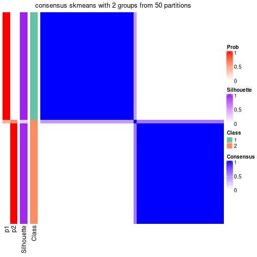</p>

</div>
<div id='tab-node-012-consensus-heatmap-2'>
<pre><code class="r">consensus_heatmap(res, k = 3)
</code></pre>

<p>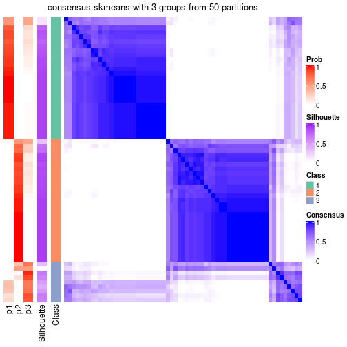</p>

</div>
<div id='tab-node-012-consensus-heatmap-3'>
<pre><code class="r">consensus_heatmap(res, k = 4)
</code></pre>

<p>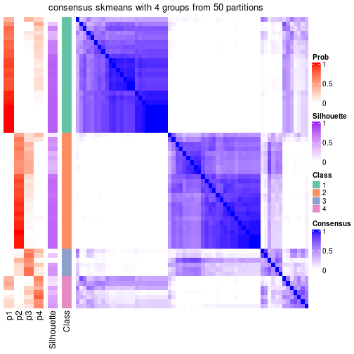</p>

</div>
</div>

Heatmaps for the membership of samples in all partitions to see how consistent they are:


<script>
$( function() {
	$( '#tabs-node-012-membership-heatmap' ).tabs();
} );
</script>
<div id='tabs-node-012-membership-heatmap'>
<ul>
<li><a href='#tab-node-012-membership-heatmap-1'>k = 2</a></li>
<li><a href='#tab-node-012-membership-heatmap-2'>k = 3</a></li>
<li><a href='#tab-node-012-membership-heatmap-3'>k = 4</a></li>
</ul>
<div id='tab-node-012-membership-heatmap-1'>
<pre><code class="r">membership_heatmap(res, k = 2)
</code></pre>

<p>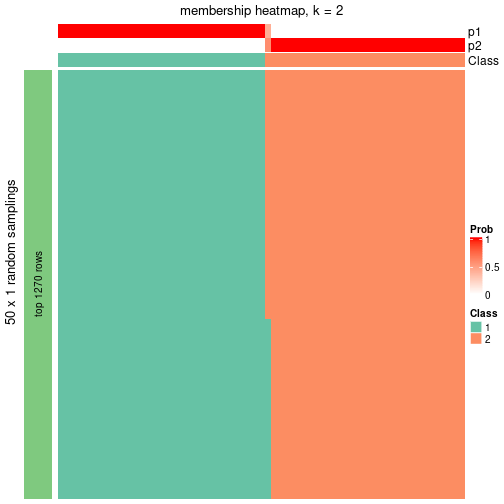</p>

</div>
<div id='tab-node-012-membership-heatmap-2'>
<pre><code class="r">membership_heatmap(res, k = 3)
</code></pre>

<p>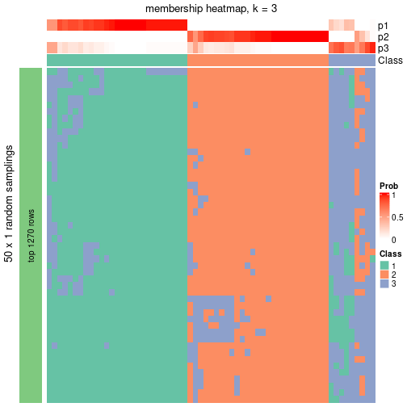</p>

</div>
<div id='tab-node-012-membership-heatmap-3'>
<pre><code class="r">membership_heatmap(res, k = 4)
</code></pre>

<p>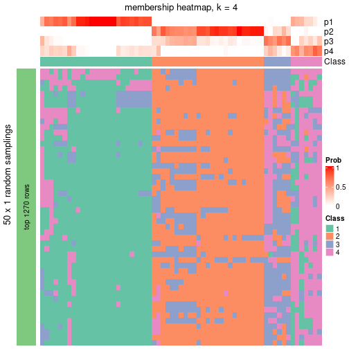</p>

</div>
</div>

As soon as the classes for columns are determined, the signatures
that are significantly different between subgroups can be looked for. 
Following are the heatmaps for signatures.


Signature heatmaps where rows are scaled:


<script>
$( function() {
	$( '#tabs-node-012-get-signatures' ).tabs();
} );
</script>
<div id='tabs-node-012-get-signatures'>
<ul>
<li><a href='#tab-node-012-get-signatures-1'>k = 2</a></li>
<li><a href='#tab-node-012-get-signatures-2'>k = 3</a></li>
<li><a href='#tab-node-012-get-signatures-3'>k = 4</a></li>
</ul>
<div id='tab-node-012-get-signatures-1'>
<pre><code class="r">get_signatures(res, k = 2)
</code></pre>

<p>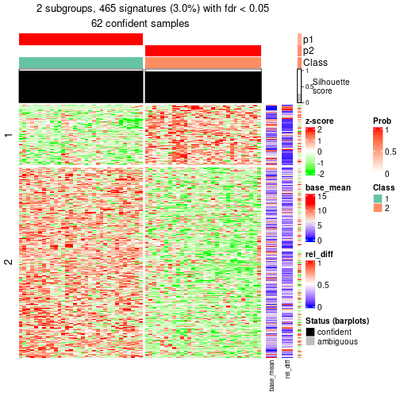</p>

</div>
<div id='tab-node-012-get-signatures-2'>
<pre><code class="r">get_signatures(res, k = 3)
</code></pre>

<p></p>

</div>
<div id='tab-node-012-get-signatures-3'>
<pre><code class="r">get_signatures(res, k = 4)
</code></pre>

<p>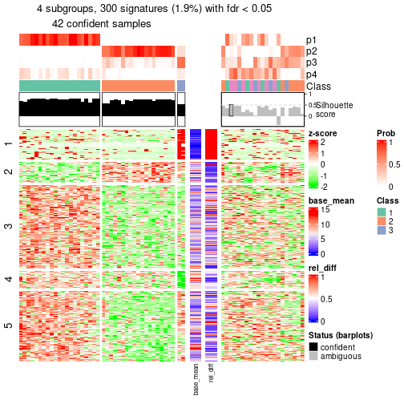</p>

</div>
</div>


Signature heatmaps where rows are not scaled:


<script>
$( function() {
	$( '#tabs-node-012-get-signatures-no-scale' ).tabs();
} );
</script>
<div id='tabs-node-012-get-signatures-no-scale'>
<ul>
<li><a href='#tab-node-012-get-signatures-no-scale-1'>k = 2</a></li>
<li><a href='#tab-node-012-get-signatures-no-scale-2'>k = 3</a></li>
<li><a href='#tab-node-012-get-signatures-no-scale-3'>k = 4</a></li>
</ul>
<div id='tab-node-012-get-signatures-no-scale-1'>
<pre><code class="r">get_signatures(res, k = 2, scale_rows = FALSE)
</code></pre>

<p>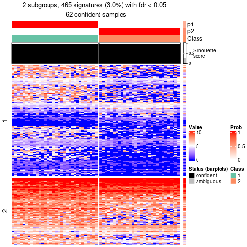</p>

</div>
<div id='tab-node-012-get-signatures-no-scale-2'>
<pre><code class="r">get_signatures(res, k = 3, scale_rows = FALSE)
</code></pre>

<p>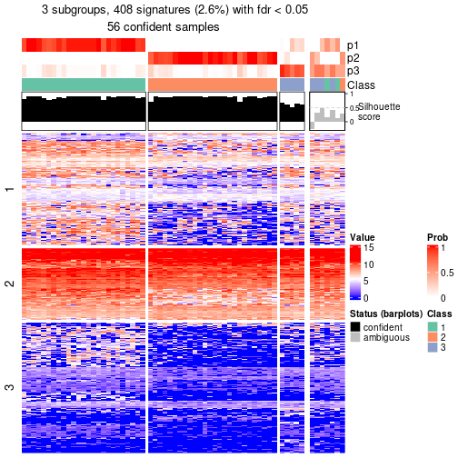</p>

</div>
<div id='tab-node-012-get-signatures-no-scale-3'>
<pre><code class="r">get_signatures(res, k = 4, scale_rows = FALSE)
</code></pre>

<p>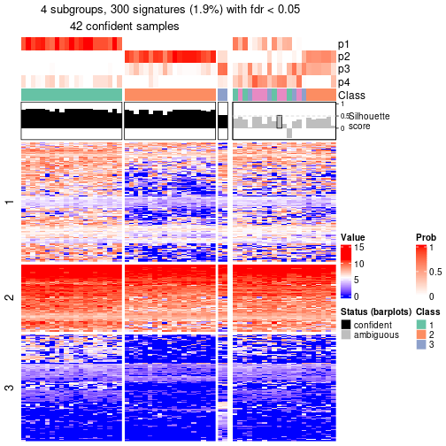</p>

</div>
</div>


Compare the overlap of signatures from different k:

```r
compare_signatures(res)
```

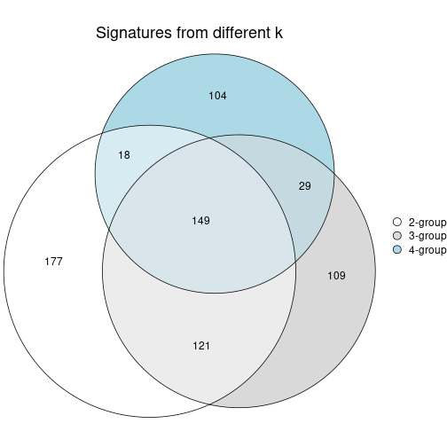

`get_signature()` returns a data frame invisibly. To get the list of signatures, the function
call should be assigned to a variable explicitly. In following code, if `plot` argument is set
to `FALSE`, no heatmap is plotted while only the differential analysis is performed.

```r
# code only for demonstration
tb = get_signature(res, k = ..., plot = FALSE)
```

An example of the output of `tb` is:

```
#>   which_row         fdr    mean_1    mean_2 scaled_mean_1 scaled_mean_2 km
#> 1        38 0.042760348  8.373488  9.131774    -0.5533452     0.5164555  1
#> 2        40 0.018707592  7.106213  8.469186    -0.6173731     0.5762149  1
#> 3        55 0.019134737 10.221463 11.207825    -0.6159697     0.5749050  1
#> 4        59 0.006059896  5.921854  7.869574    -0.6899429     0.6439467  1
#> 5        60 0.018055526  8.928898 10.211722    -0.6204761     0.5791110  1
#> 6        98 0.009384629 15.714769 14.887706     0.6635654    -0.6193277  2
...
```

The columns in `tb` are:

1. `which_row`: row indices corresponding to the input matrix.
2. `fdr`: FDR for the differential test. 
3. `mean_x`: The mean value in group x.
4. `scaled_mean_x`: The mean value in group x after rows are scaled.
5. `km`: Row groups if k-means clustering is applied to rows (which is done by automatically selecting number of clusters).

If there are too many signatures, `top_signatures = ...` can be set to only show the 
signatures with the highest FDRs:

```r
# code only for demonstration
# e.g. to show the top 500 most significant rows
tb = get_signature(res, k = ..., top_signatures = 500)
```

If the signatures are defined as these which are uniquely high in current group, `diff_method` argument
can be set to `"uniquely_high_in_one_group"`:

```r
# code only for demonstration
tb = get_signature(res, k = ..., diff_method = "uniquely_high_in_one_group")
```


UMAP plot which shows how samples are separated.


<script>
$( function() {
	$( '#tabs-node-012-dimension-reduction' ).tabs();
} );
</script>
<div id='tabs-node-012-dimension-reduction'>
<ul>
<li><a href='#tab-node-012-dimension-reduction-1'>k = 2</a></li>
<li><a href='#tab-node-012-dimension-reduction-2'>k = 3</a></li>
<li><a href='#tab-node-012-dimension-reduction-3'>k = 4</a></li>
</ul>
<div id='tab-node-012-dimension-reduction-1'>
<pre><code class="r">dimension_reduction(res, k = 2, method = &quot;UMAP&quot;)
</code></pre>

<p>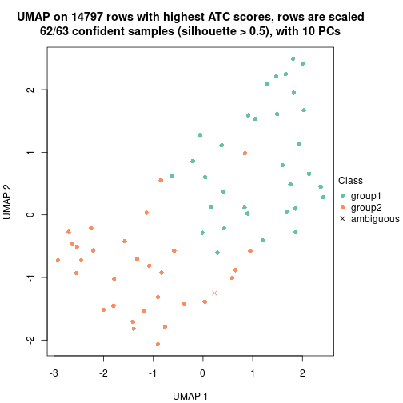</p>

</div>
<div id='tab-node-012-dimension-reduction-2'>
<pre><code class="r">dimension_reduction(res, k = 3, method = &quot;UMAP&quot;)
</code></pre>

<p>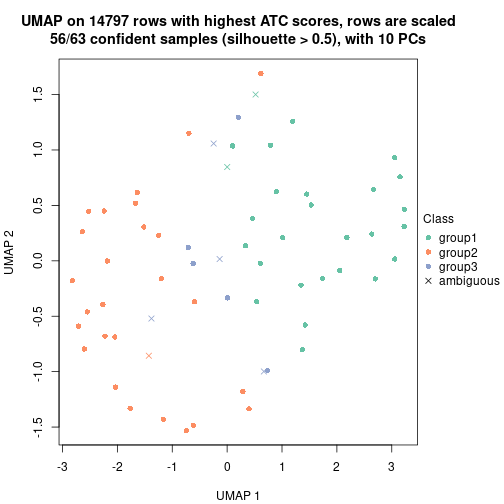</p>

</div>
<div id='tab-node-012-dimension-reduction-3'>
<pre><code class="r">dimension_reduction(res, k = 4, method = &quot;UMAP&quot;)
</code></pre>

<p>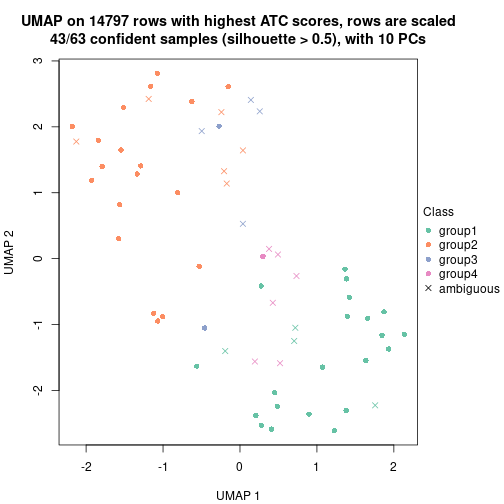</p>

</div>
</div>


Following heatmap shows how subgroups are split when increasing `k`:

```r
collect_classes(res)
```

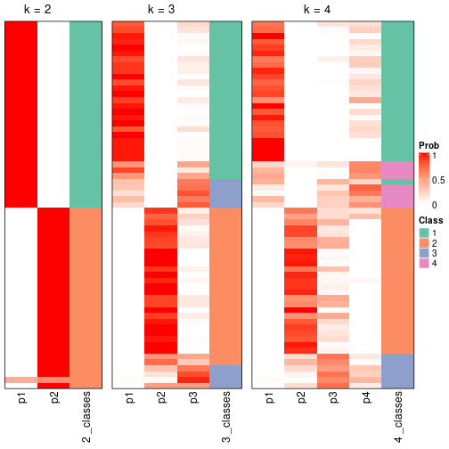


If matrix rows can be associated to genes, consider to use `functional_enrichment(res,
...)` to perform function enrichment for the signature genes. See [this vignette](https://jokergoo.github.io/cola_vignettes/functional_enrichment.html) for more detailed explanations.


 

---------------------------------------------------


### Node02


Parent node: [Node0](#Node0).
Child nodes: 
                [Node011](#Node011)
        ,
                [Node012](#Node012)
        ,
                Node013-leaf
        ,
                Node021-leaf
        ,
                [Node022](#Node022)
        ,
                Node023-leaf
        .


The object with results only for a single top-value method and a single partitioning method 
can be extracted as:

```r
res = res_rh["02"]
```

A summary of `res` and all the functions that can be applied to it:

```r
res
```

```
#> A 'ConsensusPartition' object with k = 2, 3, 4.
#>   On a matrix with 14830 rows and 123 columns.
#>   Top rows (1425) are extracted by 'ATC' method.
#>   Subgroups are detected by 'skmeans' method.
#>   Performed in total 150 partitions by row resampling.
#>   Best k for subgroups seems to be 3.
#> 
#> Following methods can be applied to this 'ConsensusPartition' object:
#>  [1] "cola_report"             "collect_classes"         "collect_plots"          
#>  [4] "collect_stats"           "colnames"                "compare_partitions"     
#>  [7] "compare_signatures"      "consensus_heatmap"       "dimension_reduction"    
#> [10] "functional_enrichment"   "get_anno_col"            "get_anno"               
#> [13] "get_classes"             "get_consensus"           "get_matrix"             
#> [16] "get_membership"          "get_param"               "get_signatures"         
#> [19] "get_stats"               "is_best_k"               "is_stable_k"            
#> [22] "membership_heatmap"      "ncol"                    "nrow"                   
#> [25] "plot_ecdf"               "predict_classes"         "rownames"               
#> [28] "select_partition_number" "show"                    "suggest_best_k"         
#> [31] "test_to_known_factors"   "top_rows_heatmap"
```

`collect_plots()` function collects all the plots made from `res` for all `k` (number of subgroups)
into one single page to provide an easy and fast comparison between different `k`.

```r
collect_plots(res)
```

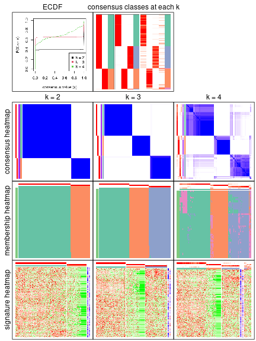

The plots are:

- The first row: a plot of the eCDF (empirical cumulative distribution
  function) curves of the consensus matrix for each `k` and the heatmap of
  predicted classes for each `k`.
- The second row: heatmaps of the consensus matrix for each `k`.
- The third row: heatmaps of the membership matrix for each `k`.
- The fouth row: heatmaps of the signatures for each `k`.

All the plots in panels can be made by individual functions and they are
plotted later in this section.

`select_partition_number()` produces several plots showing different
statistics for choosing "optimized" `k`. There are following statistics:

- eCDF curves of the consensus matrix for each `k`;
- 1-PAC. [The PAC score](https://en.wikipedia.org/wiki/Consensus_clustering#Over-interpretation_potential_of_consensus_clustering)
  measures the proportion of the ambiguous subgrouping.
- Mean silhouette score.
- Concordance. The mean probability of fiting the consensus subgroup labels in all
  partitions.
- Area increased. Denote $A_k$ as the area under the eCDF curve for current
  `k`, the area increased is defined as $A_k - A_{k-1}$.
- Rand index. The percent of pairs of samples that are both in a same cluster
  or both are not in a same cluster in the partition of k and k-1.
- Jaccard index. The ratio of pairs of samples are both in a same cluster in
  the partition of k and k-1 and the pairs of samples are both in a same
  cluster in the partition k or k-1.

The detailed explanations of these statistics can be found in [the _cola_
vignette](https://jokergoo.github.io/cola_vignettes/cola.html#toc_13).

Generally speaking, higher 1-PAC score, higher mean silhouette score or higher
concordance corresponds to better partition. Rand index and Jaccard index
measure how similar the current partition is compared to partition with `k-1`.
If they are too similar, we won't accept `k` is better than `k-1`.

```r
select_partition_number(res)
```

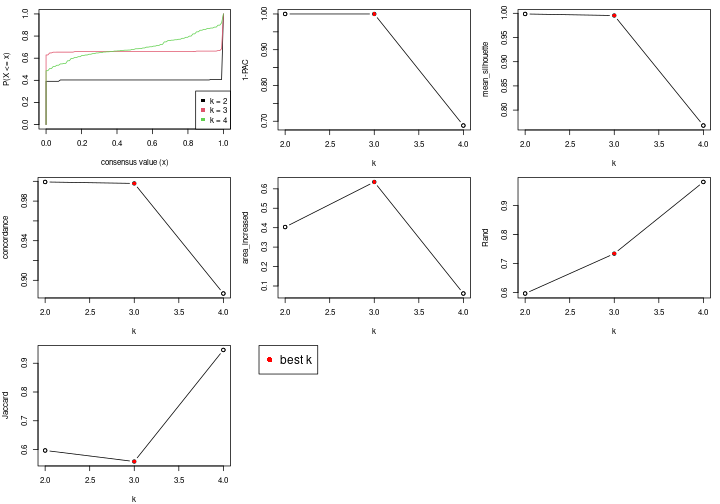

The numeric values for all these statistics can be obtained by `get_stats()`.

```r
get_stats(res)
```

```
#>   k 1-PAC mean_silhouette concordance area_increased  Rand Jaccard
#> 2 2 1.000           0.999       0.999         0.4033 0.597   0.597
#> 3 3 1.000           0.995       0.998         0.6352 0.734   0.558
#> 4 4 0.688           0.768       0.887         0.0613 0.982   0.946
```

`suggest_best_k()` suggests the best $k$ based on these statistics. The rules are as follows:

- All $k$ with Jaccard index larger than 0.95 are removed because increasing
  $k$ does not provide enough extra information. If all $k$ are removed, it is
  marked as no subgroup is detected.
- For all $k$ with 1-PAC score larger than 0.9, the maximal $k$ is taken as
  the best $k$, and other $k$ are marked as optional $k$.
- If it does not fit the second rule. The $k$ with the maximal vote of the
  highest 1-PAC score, highest mean silhouette, and highest concordance is
  taken as the best $k$.

```r
suggest_best_k(res)
```

```
#> [1] 3
#> attr(,"optional")
#> [1] 2
```

There is also optional best $k$ = 2 that is worth to check.

Following is the table of the partitions (You need to click the **show/hide
code output** link to see it). The membership matrix (columns with name `p*`)
is inferred by
[`clue::cl_consensus()`](https://www.rdocumentation.org/link/cl_consensus?package=clue)
function with the `SE` method. Basically the value in the membership matrix
represents the probability to belong to a certain group. The finall subgroup
label for an item is determined with the group with highest probability it
belongs to.

In `get_classes()` function, the entropy is calculated from the membership
matrix and the silhouette score is calculated from the consensus matrix.


<script>
$( function() {
	$( '#tabs-node-02-get-classes' ).tabs();
} );
</script>
<div id='tabs-node-02-get-classes'>
<ul>
<li><a href='#tab-node-02-get-classes-1'>k = 2</a></li>
<li><a href='#tab-node-02-get-classes-2'>k = 3</a></li>
<li><a href='#tab-node-02-get-classes-3'>k = 4</a></li>
</ul>

<div id='tab-node-02-get-classes-1'>
<p><a id='tab-node-02-get-classes-1-a' style='color:#0366d6' href='#'>show/hide code output</a></p>
<pre><code class="r">cbind(get_classes(res, k = 2), get_membership(res, k = 2))
</code></pre>

<pre><code>#&gt;                  class entropy silhouette   p1   p2
#&gt; G1_cell1_count       1   0.000      1.000 1.00 0.00
#&gt; G1_cell2_count       1   0.000      1.000 1.00 0.00
#&gt; G1_cell3_count       1   0.000      1.000 1.00 0.00
#&gt; G1_cell4_count       2   0.000      0.998 0.00 1.00
#&gt; G1_cell5_count       1   0.000      1.000 1.00 0.00
#&gt; G1_cell6_count       1   0.000      1.000 1.00 0.00
#&gt; G1_cell10_count      1   0.000      1.000 1.00 0.00
#&gt; G1_cell11_count      1   0.000      1.000 1.00 0.00
#&gt; G1_cell12_count      1   0.000      1.000 1.00 0.00
#&gt; G1_cell14_count      1   0.000      1.000 1.00 0.00
#&gt; G1_cell18_count      1   0.000      1.000 1.00 0.00
#&gt; G1_cell19_count      1   0.000      1.000 1.00 0.00
#&gt; G1_cell21_count      1   0.000      1.000 1.00 0.00
#&gt; G1_cell24_count      1   0.000      1.000 1.00 0.00
#&gt; G1_cell27_count      1   0.000      1.000 1.00 0.00
#&gt; G1_cell28_count      2   0.000      0.998 0.00 1.00
#&gt; G1_cell29_count      1   0.000      1.000 1.00 0.00
#&gt; G1_cell31_count      2   0.000      0.998 0.00 1.00
#&gt; G1_cell32_count      1   0.000      1.000 1.00 0.00
#&gt; G1_cell33_count      1   0.000      1.000 1.00 0.00
#&gt; G1_cell34_count      1   0.000      1.000 1.00 0.00
#&gt; G1_cell35_count      2   0.000      0.998 0.00 1.00
#&gt; G1_cell37_count      1   0.000      1.000 1.00 0.00
#&gt; G1_cell38_count      1   0.000      1.000 1.00 0.00
#&gt; G1_cell40_count      1   0.000      1.000 1.00 0.00
#&gt; G1_cell45_count      1   0.000      1.000 1.00 0.00
#&gt; G1_cell46_count      1   0.000      1.000 1.00 0.00
#&gt; G1_cell48_count      2   0.000      0.998 0.00 1.00
#&gt; G1_cell50_count      2   0.000      0.998 0.00 1.00
#&gt; G1_cell51_count      1   0.000      1.000 1.00 0.00
#&gt; G1_cell52_count      1   0.000      1.000 1.00 0.00
#&gt; G1_cell53_count      1   0.000      1.000 1.00 0.00
#&gt; G1_cell56_count      2   0.000      0.998 0.00 1.00
#&gt; G1_cell58_count      1   0.000      1.000 1.00 0.00
#&gt; G1_cell59_count      1   0.000      1.000 1.00 0.00
#&gt; G1_cell63_count      1   0.000      1.000 1.00 0.00
#&gt; G1_cell67_count      1   0.000      1.000 1.00 0.00
#&gt; G1_cell69_count      1   0.000      1.000 1.00 0.00
#&gt; G1_cell71_count      1   0.000      1.000 1.00 0.00
#&gt; G1_cell72_count      1   0.000      1.000 1.00 0.00
#&gt; G1_cell76_count      2   0.000      0.998 0.00 1.00
#&gt; G1_cell78_count      1   0.000      1.000 1.00 0.00
#&gt; G1_cell82_count      1   0.000      1.000 1.00 0.00
#&gt; G1_cell85_count      1   0.000      1.000 1.00 0.00
#&gt; G1_cell88_count      2   0.000      0.998 0.00 1.00
#&gt; G1_cell89_count      1   0.000      1.000 1.00 0.00
#&gt; G1_cell90_count      1   0.000      1.000 1.00 0.00
#&gt; G1_cell92_count      1   0.000      1.000 1.00 0.00
#&gt; S_cell1_count        2   0.000      0.998 0.00 1.00
#&gt; S_cell5_count        2   0.000      0.998 0.00 1.00
#&gt; S_cell12_count       1   0.000      1.000 1.00 0.00
#&gt; S_cell18_count       2   0.000      0.998 0.00 1.00
#&gt; S_cell21_count       1   0.000      1.000 1.00 0.00
#&gt; S_cell23_count       1   0.000      1.000 1.00 0.00
#&gt; S_cell25_count       1   0.000      1.000 1.00 0.00
#&gt; S_cell31_count       2   0.000      0.998 0.00 1.00
#&gt; S_cell34_count       2   0.000      0.998 0.00 1.00
#&gt; S_cell38_count       1   0.000      1.000 1.00 0.00
#&gt; S_cell44_count       2   0.000      0.998 0.00 1.00
#&gt; S_cell51_count       1   0.000      1.000 1.00 0.00
#&gt; S_cell56_count       1   0.000      1.000 1.00 0.00
#&gt; S_cell58_count       2   0.000      0.998 0.00 1.00
#&gt; S_cell64_count       1   0.000      1.000 1.00 0.00
#&gt; S_cell65_count       1   0.000      1.000 1.00 0.00
#&gt; S_cell67_count       1   0.000      1.000 1.00 0.00
#&gt; S_cell71_count       2   0.000      0.998 0.00 1.00
#&gt; S_cell74_count       2   0.000      0.998 0.00 1.00
#&gt; S_cell75_count       1   0.000      1.000 1.00 0.00
#&gt; S_cell77_count       1   0.000      1.000 1.00 0.00
#&gt; S_cell78_count       2   0.000      0.998 0.00 1.00
#&gt; S_cell81_count       2   0.000      0.998 0.00 1.00
#&gt; S_cell84_count       2   0.000      0.998 0.00 1.00
#&gt; S_cell87_count       1   0.000      1.000 1.00 0.00
#&gt; S_cell88_count       2   0.000      0.998 0.00 1.00
#&gt; S_cell90_count       2   0.000      0.998 0.00 1.00
#&gt; S_cell91_count       1   0.000      1.000 1.00 0.00
#&gt; S_cell94_count       2   0.000      0.998 0.00 1.00
#&gt; S_cell95_count       2   0.000      0.998 0.00 1.00
#&gt; S_cell96_count       2   0.000      0.998 0.00 1.00
#&gt; G2M_cell1_count      1   0.000      1.000 1.00 0.00
#&gt; G2M_cell2_count      1   0.000      1.000 1.00 0.00
#&gt; G2M_cell3_count      1   0.000      1.000 1.00 0.00
#&gt; G2M_cell4_count      2   0.000      0.998 0.00 1.00
#&gt; G2M_cell6_count      1   0.000      1.000 1.00 0.00
#&gt; G2M_cell14_count     1   0.000      1.000 1.00 0.00
#&gt; G2M_cell15_count     1   0.000      1.000 1.00 0.00
#&gt; G2M_cell16_count     1   0.000      1.000 1.00 0.00
#&gt; G2M_cell22_count     2   0.000      0.998 0.00 1.00
#&gt; G2M_cell24_count     1   0.000      1.000 1.00 0.00
#&gt; G2M_cell26_count     2   0.000      0.998 0.00 1.00
#&gt; G2M_cell27_count     1   0.000      1.000 1.00 0.00
#&gt; G2M_cell28_count     1   0.000      1.000 1.00 0.00
#&gt; G2M_cell29_count     1   0.000      1.000 1.00 0.00
#&gt; G2M_cell30_count     2   0.000      0.998 0.00 1.00
#&gt; G2M_cell31_count     1   0.000      1.000 1.00 0.00
#&gt; G2M_cell36_count     1   0.000      1.000 1.00 0.00
#&gt; G2M_cell38_count     1   0.000      1.000 1.00 0.00
#&gt; G2M_cell39_count     1   0.000      1.000 1.00 0.00
#&gt; G2M_cell40_count     1   0.000      1.000 1.00 0.00
#&gt; G2M_cell42_count     1   0.000      1.000 1.00 0.00
#&gt; G2M_cell43_count     1   0.000      1.000 1.00 0.00
#&gt; G2M_cell46_count     1   0.000      1.000 1.00 0.00
#&gt; G2M_cell51_count     1   0.000      1.000 1.00 0.00
#&gt; G2M_cell52_count     1   0.000      1.000 1.00 0.00
#&gt; G2M_cell53_count     1   0.000      1.000 1.00 0.00
#&gt; G2M_cell54_count     1   0.000      1.000 1.00 0.00
#&gt; G2M_cell56_count     1   0.000      1.000 1.00 0.00
#&gt; G2M_cell64_count     1   0.000      1.000 1.00 0.00
#&gt; G2M_cell66_count     1   0.000      1.000 1.00 0.00
#&gt; G2M_cell67_count     2   0.000      0.998 0.00 1.00
#&gt; G2M_cell70_count     2   0.402      0.913 0.08 0.92
#&gt; G2M_cell72_count     1   0.000      1.000 1.00 0.00
#&gt; G2M_cell77_count     2   0.000      0.998 0.00 1.00
#&gt; G2M_cell78_count     1   0.000      1.000 1.00 0.00
#&gt; G2M_cell81_count     1   0.000      1.000 1.00 0.00
#&gt; G2M_cell82_count     2   0.000      0.998 0.00 1.00
#&gt; G2M_cell85_count     1   0.000      1.000 1.00 0.00
#&gt; G2M_cell89_count     1   0.000      1.000 1.00 0.00
#&gt; G2M_cell92_count     1   0.000      1.000 1.00 0.00
#&gt; G2M_cell93_count     1   0.000      1.000 1.00 0.00
#&gt; G2M_cell94_count     1   0.000      1.000 1.00 0.00
#&gt; G2M_cell95_count     1   0.000      1.000 1.00 0.00
#&gt; G2M_cell96_count     1   0.000      1.000 1.00 0.00
</code></pre>

<script>
$('#tab-node-02-get-classes-1-a').parent().next().next().hide();
$('#tab-node-02-get-classes-1-a').click(function(){
  $('#tab-node-02-get-classes-1-a').parent().next().next().toggle();
  return(false);
});
</script>
</div>

<div id='tab-node-02-get-classes-2'>
<p><a id='tab-node-02-get-classes-2-a' style='color:#0366d6' href='#'>show/hide code output</a></p>
<pre><code class="r">cbind(get_classes(res, k = 3), get_membership(res, k = 3))
</code></pre>

<pre><code>#&gt;                  class entropy silhouette   p1   p2   p3
#&gt; G1_cell1_count       3  0.0000      0.993 0.00 0.00 1.00
#&gt; G1_cell2_count       3  0.0000      0.993 0.00 0.00 1.00
#&gt; G1_cell3_count       3  0.0000      0.993 0.00 0.00 1.00
#&gt; G1_cell4_count       2  0.0000      1.000 0.00 1.00 0.00
#&gt; G1_cell5_count       3  0.0000      0.993 0.00 0.00 1.00
#&gt; G1_cell6_count       3  0.0000      0.993 0.00 0.00 1.00
#&gt; G1_cell10_count      1  0.0000      1.000 1.00 0.00 0.00
#&gt; G1_cell11_count      3  0.0000      0.993 0.00 0.00 1.00
#&gt; G1_cell12_count      3  0.0000      0.993 0.00 0.00 1.00
#&gt; G1_cell14_count      3  0.0000      0.993 0.00 0.00 1.00
#&gt; G1_cell18_count      3  0.0000      0.993 0.00 0.00 1.00
#&gt; G1_cell19_count      3  0.0000      0.993 0.00 0.00 1.00
#&gt; G1_cell21_count      1  0.0000      1.000 1.00 0.00 0.00
#&gt; G1_cell24_count      1  0.0000      1.000 1.00 0.00 0.00
#&gt; G1_cell27_count      3  0.0000      0.993 0.00 0.00 1.00
#&gt; G1_cell28_count      2  0.0000      1.000 0.00 1.00 0.00
#&gt; G1_cell29_count      3  0.0000      0.993 0.00 0.00 1.00
#&gt; G1_cell31_count      2  0.0000      1.000 0.00 1.00 0.00
#&gt; G1_cell32_count      1  0.0000      1.000 1.00 0.00 0.00
#&gt; G1_cell33_count      3  0.0000      0.993 0.00 0.00 1.00
#&gt; G1_cell34_count      1  0.0000      1.000 1.00 0.00 0.00
#&gt; G1_cell35_count      2  0.0000      1.000 0.00 1.00 0.00
#&gt; G1_cell37_count      1  0.0000      1.000 1.00 0.00 0.00
#&gt; G1_cell38_count      3  0.0000      0.993 0.00 0.00 1.00
#&gt; G1_cell40_count      3  0.0000      0.993 0.00 0.00 1.00
#&gt; G1_cell45_count      3  0.0000      0.993 0.00 0.00 1.00
#&gt; G1_cell46_count      3  0.0000      0.993 0.00 0.00 1.00
#&gt; G1_cell48_count      2  0.0000      1.000 0.00 1.00 0.00
#&gt; G1_cell50_count      2  0.0000      1.000 0.00 1.00 0.00
#&gt; G1_cell51_count      3  0.0892      0.974 0.02 0.00 0.98
#&gt; G1_cell52_count      3  0.0000      0.993 0.00 0.00 1.00
#&gt; G1_cell53_count      3  0.0000      0.993 0.00 0.00 1.00
#&gt; G1_cell56_count      2  0.0000      1.000 0.00 1.00 0.00
#&gt; G1_cell58_count      3  0.0000      0.993 0.00 0.00 1.00
#&gt; G1_cell59_count      3  0.0000      0.993 0.00 0.00 1.00
#&gt; G1_cell63_count      1  0.0000      1.000 1.00 0.00 0.00
#&gt; G1_cell67_count      3  0.0000      0.993 0.00 0.00 1.00
#&gt; G1_cell69_count      3  0.0000      0.993 0.00 0.00 1.00
#&gt; G1_cell71_count      3  0.0000      0.993 0.00 0.00 1.00
#&gt; G1_cell72_count      1  0.0000      1.000 1.00 0.00 0.00
#&gt; G1_cell76_count      2  0.0000      1.000 0.00 1.00 0.00
#&gt; G1_cell78_count      3  0.0000      0.993 0.00 0.00 1.00
#&gt; G1_cell82_count      3  0.0000      0.993 0.00 0.00 1.00
#&gt; G1_cell85_count      3  0.0000      0.993 0.00 0.00 1.00
#&gt; G1_cell88_count      2  0.0000      1.000 0.00 1.00 0.00
#&gt; G1_cell89_count      1  0.0000      1.000 1.00 0.00 0.00
#&gt; G1_cell90_count      1  0.0000      1.000 1.00 0.00 0.00
#&gt; G1_cell92_count      3  0.0000      0.993 0.00 0.00 1.00
#&gt; S_cell1_count        2  0.0000      1.000 0.00 1.00 0.00
#&gt; S_cell5_count        2  0.0000      1.000 0.00 1.00 0.00
#&gt; S_cell12_count       1  0.0000      1.000 1.00 0.00 0.00
#&gt; S_cell18_count       2  0.0000      1.000 0.00 1.00 0.00
#&gt; S_cell21_count       1  0.0000      1.000 1.00 0.00 0.00
#&gt; S_cell23_count       1  0.0000      1.000 1.00 0.00 0.00
#&gt; S_cell25_count       1  0.0000      1.000 1.00 0.00 0.00
#&gt; S_cell31_count       2  0.0000      1.000 0.00 1.00 0.00
#&gt; S_cell34_count       2  0.0000      1.000 0.00 1.00 0.00
#&gt; S_cell38_count       1  0.0000      1.000 1.00 0.00 0.00
#&gt; S_cell44_count       2  0.0000      1.000 0.00 1.00 0.00
#&gt; S_cell51_count       1  0.0000      1.000 1.00 0.00 0.00
#&gt; S_cell56_count       1  0.0892      0.979 0.98 0.00 0.02
#&gt; S_cell58_count       2  0.0000      1.000 0.00 1.00 0.00
#&gt; S_cell64_count       1  0.0000      1.000 1.00 0.00 0.00
#&gt; S_cell65_count       1  0.0000      1.000 1.00 0.00 0.00
#&gt; S_cell67_count       1  0.0000      1.000 1.00 0.00 0.00
#&gt; S_cell71_count       2  0.0000      1.000 0.00 1.00 0.00
#&gt; S_cell74_count       2  0.0000      1.000 0.00 1.00 0.00
#&gt; S_cell75_count       1  0.0000      1.000 1.00 0.00 0.00
#&gt; S_cell77_count       1  0.0000      1.000 1.00 0.00 0.00
#&gt; S_cell78_count       2  0.0000      1.000 0.00 1.00 0.00
#&gt; S_cell81_count       2  0.0000      1.000 0.00 1.00 0.00
#&gt; S_cell84_count       2  0.0000      1.000 0.00 1.00 0.00
#&gt; S_cell87_count       1  0.0000      1.000 1.00 0.00 0.00
#&gt; S_cell88_count       2  0.0000      1.000 0.00 1.00 0.00
#&gt; S_cell90_count       2  0.0000      1.000 0.00 1.00 0.00
#&gt; S_cell91_count       1  0.0000      1.000 1.00 0.00 0.00
#&gt; S_cell94_count       2  0.0000      1.000 0.00 1.00 0.00
#&gt; S_cell95_count       2  0.0000      1.000 0.00 1.00 0.00
#&gt; S_cell96_count       2  0.0000      1.000 0.00 1.00 0.00
#&gt; G2M_cell1_count      3  0.0000      0.993 0.00 0.00 1.00
#&gt; G2M_cell2_count      1  0.0000      1.000 1.00 0.00 0.00
#&gt; G2M_cell3_count      1  0.0000      1.000 1.00 0.00 0.00
#&gt; G2M_cell4_count      2  0.0000      1.000 0.00 1.00 0.00
#&gt; G2M_cell6_count      3  0.0000      0.993 0.00 0.00 1.00
#&gt; G2M_cell14_count     1  0.0000      1.000 1.00 0.00 0.00
#&gt; G2M_cell15_count     1  0.0000      1.000 1.00 0.00 0.00
#&gt; G2M_cell16_count     3  0.1529      0.953 0.04 0.00 0.96
#&gt; G2M_cell22_count     2  0.0000      1.000 0.00 1.00 0.00
#&gt; G2M_cell24_count     1  0.0000      1.000 1.00 0.00 0.00
#&gt; G2M_cell26_count     2  0.0000      1.000 0.00 1.00 0.00
#&gt; G2M_cell27_count     3  0.0000      0.993 0.00 0.00 1.00
#&gt; G2M_cell28_count     1  0.0000      1.000 1.00 0.00 0.00
#&gt; G2M_cell29_count     3  0.0892      0.974 0.02 0.00 0.98
#&gt; G2M_cell30_count     2  0.0000      1.000 0.00 1.00 0.00
#&gt; G2M_cell31_count     3  0.0000      0.993 0.00 0.00 1.00
#&gt; G2M_cell36_count     1  0.0000      1.000 1.00 0.00 0.00
#&gt; G2M_cell38_count     1  0.0000      1.000 1.00 0.00 0.00
#&gt; G2M_cell39_count     1  0.0000      1.000 1.00 0.00 0.00
#&gt; G2M_cell40_count     1  0.0000      1.000 1.00 0.00 0.00
#&gt; G2M_cell42_count     1  0.0000      1.000 1.00 0.00 0.00
#&gt; G2M_cell43_count     1  0.0000      1.000 1.00 0.00 0.00
#&gt; G2M_cell46_count     1  0.0000      1.000 1.00 0.00 0.00
#&gt; G2M_cell51_count     1  0.0000      1.000 1.00 0.00 0.00
#&gt; G2M_cell52_count     1  0.0000      1.000 1.00 0.00 0.00
#&gt; G2M_cell53_count     1  0.0000      1.000 1.00 0.00 0.00
#&gt; G2M_cell54_count     1  0.0000      1.000 1.00 0.00 0.00
#&gt; G2M_cell56_count     1  0.0000      1.000 1.00 0.00 0.00
#&gt; G2M_cell64_count     3  0.0000      0.993 0.00 0.00 1.00
#&gt; G2M_cell66_count     1  0.0000      1.000 1.00 0.00 0.00
#&gt; G2M_cell67_count     2  0.0000      1.000 0.00 1.00 0.00
#&gt; G2M_cell70_count     3  0.4002      0.811 0.00 0.16 0.84
#&gt; G2M_cell72_count     3  0.0000      0.993 0.00 0.00 1.00
#&gt; G2M_cell77_count     2  0.0000      1.000 0.00 1.00 0.00
#&gt; G2M_cell78_count     1  0.0000      1.000 1.00 0.00 0.00
#&gt; G2M_cell81_count     1  0.0000      1.000 1.00 0.00 0.00
#&gt; G2M_cell82_count     2  0.0000      1.000 0.00 1.00 0.00
#&gt; G2M_cell85_count     1  0.0000      1.000 1.00 0.00 0.00
#&gt; G2M_cell89_count     1  0.0000      1.000 1.00 0.00 0.00
#&gt; G2M_cell92_count     1  0.0000      1.000 1.00 0.00 0.00
#&gt; G2M_cell93_count     1  0.0000      1.000 1.00 0.00 0.00
#&gt; G2M_cell94_count     1  0.0000      1.000 1.00 0.00 0.00
#&gt; G2M_cell95_count     1  0.0000      1.000 1.00 0.00 0.00
#&gt; G2M_cell96_count     1  0.0000      1.000 1.00 0.00 0.00
</code></pre>

<script>
$('#tab-node-02-get-classes-2-a').parent().next().next().hide();
$('#tab-node-02-get-classes-2-a').click(function(){
  $('#tab-node-02-get-classes-2-a').parent().next().next().toggle();
  return(false);
});
</script>
</div>

<div id='tab-node-02-get-classes-3'>
<p><a id='tab-node-02-get-classes-3-a' style='color:#0366d6' href='#'>show/hide code output</a></p>
<pre><code class="r">cbind(get_classes(res, k = 4), get_membership(res, k = 4))
</code></pre>

<pre><code>#&gt;                  class entropy silhouette   p1   p2   p3   p4
#&gt; G1_cell1_count       3  0.0707     0.7804 0.00 0.00 0.98 0.02
#&gt; G1_cell2_count       3  0.0707     0.7937 0.02 0.00 0.98 0.00
#&gt; G1_cell3_count       3  0.3606     0.7772 0.14 0.00 0.84 0.02
#&gt; G1_cell4_count       2  0.0000     0.9016 0.00 1.00 0.00 0.00
#&gt; G1_cell5_count       3  0.3400     0.6457 0.00 0.00 0.82 0.18
#&gt; G1_cell6_count       4  0.2647     0.5182 0.00 0.00 0.12 0.88
#&gt; G1_cell10_count      1  0.3610     0.7934 0.80 0.00 0.00 0.20
#&gt; G1_cell11_count      3  0.3335     0.7886 0.12 0.00 0.86 0.02
#&gt; G1_cell12_count      3  0.0000     0.7864 0.00 0.00 1.00 0.00
#&gt; G1_cell14_count      3  0.3335     0.7886 0.12 0.00 0.86 0.02
#&gt; G1_cell18_count      3  0.0000     0.7864 0.00 0.00 1.00 0.00
#&gt; G1_cell19_count      3  0.3606     0.7772 0.14 0.00 0.84 0.02
#&gt; G1_cell21_count      1  0.1211     0.8887 0.96 0.00 0.00 0.04
#&gt; G1_cell24_count      1  0.0000     0.9015 1.00 0.00 0.00 0.00
#&gt; G1_cell27_count      3  0.4642     0.6846 0.24 0.00 0.74 0.02
#&gt; G1_cell28_count      2  0.4977     0.0648 0.00 0.54 0.00 0.46
#&gt; G1_cell29_count      3  0.3610     0.6164 0.00 0.00 0.80 0.20
#&gt; G1_cell31_count      2  0.0707     0.8825 0.00 0.98 0.00 0.02
#&gt; G1_cell32_count      1  0.1411     0.8802 0.96 0.00 0.02 0.02
#&gt; G1_cell33_count      3  0.1637     0.7674 0.00 0.00 0.94 0.06
#&gt; G1_cell34_count      1  0.2345     0.8681 0.90 0.00 0.00 0.10
#&gt; G1_cell35_count      2  0.5000    -0.1282 0.00 0.50 0.00 0.50
#&gt; G1_cell37_count      1  0.3935     0.8280 0.84 0.00 0.06 0.10
#&gt; G1_cell38_count      3  0.3821     0.7851 0.12 0.00 0.84 0.04
#&gt; G1_cell40_count      3  0.3853     0.7276 0.02 0.00 0.82 0.16
#&gt; G1_cell45_count      3  0.0000     0.7864 0.00 0.00 1.00 0.00
#&gt; G1_cell46_count      3  0.2706     0.7964 0.08 0.00 0.90 0.02
#&gt; G1_cell48_count      4  0.4907     0.1174 0.00 0.42 0.00 0.58
#&gt; G1_cell50_count      2  0.0000     0.9016 0.00 1.00 0.00 0.00
#&gt; G1_cell51_count      3  0.5606     0.2833 0.48 0.00 0.50 0.02
#&gt; G1_cell52_count      3  0.0707     0.7876 0.00 0.00 0.98 0.02
#&gt; G1_cell53_count      3  0.1211     0.7724 0.00 0.00 0.96 0.04
#&gt; G1_cell56_count      2  0.0000     0.9016 0.00 1.00 0.00 0.00
#&gt; G1_cell58_count      3  0.0000     0.7864 0.00 0.00 1.00 0.00
#&gt; G1_cell59_count      3  0.3821     0.7554 0.04 0.00 0.84 0.12
#&gt; G1_cell63_count      1  0.0707     0.8946 0.98 0.00 0.00 0.02
#&gt; G1_cell67_count      3  0.7004     0.5422 0.20 0.00 0.58 0.22
#&gt; G1_cell69_count      3  0.3335     0.7886 0.12 0.00 0.86 0.02
#&gt; G1_cell71_count      3  0.0707     0.7804 0.00 0.00 0.98 0.02
#&gt; G1_cell72_count      1  0.0000     0.9015 1.00 0.00 0.00 0.00
#&gt; G1_cell76_count      2  0.3801     0.6299 0.00 0.78 0.00 0.22
#&gt; G1_cell78_count      3  0.0000     0.7864 0.00 0.00 1.00 0.00
#&gt; G1_cell82_count      3  0.5077     0.7396 0.16 0.00 0.76 0.08
#&gt; G1_cell85_count      3  0.7028     0.4792 0.28 0.00 0.56 0.16
#&gt; G1_cell88_count      2  0.0000     0.9016 0.00 1.00 0.00 0.00
#&gt; G1_cell89_count      1  0.0000     0.9015 1.00 0.00 0.00 0.00
#&gt; G1_cell90_count      1  0.3975     0.7499 0.76 0.00 0.00 0.24
#&gt; G1_cell92_count      3  0.3335     0.7886 0.12 0.00 0.86 0.02
#&gt; S_cell1_count        2  0.0000     0.9016 0.00 1.00 0.00 0.00
#&gt; S_cell5_count        2  0.0000     0.9016 0.00 1.00 0.00 0.00
#&gt; S_cell12_count       1  0.0000     0.9015 1.00 0.00 0.00 0.00
#&gt; S_cell18_count       2  0.0000     0.9016 0.00 1.00 0.00 0.00
#&gt; S_cell21_count       1  0.0000     0.9015 1.00 0.00 0.00 0.00
#&gt; S_cell23_count       1  0.1211     0.8866 0.96 0.00 0.00 0.04
#&gt; S_cell25_count       1  0.0000     0.9015 1.00 0.00 0.00 0.00
#&gt; S_cell31_count       2  0.0000     0.9016 0.00 1.00 0.00 0.00
#&gt; S_cell34_count       2  0.0000     0.9016 0.00 1.00 0.00 0.00
#&gt; S_cell38_count       1  0.0000     0.9015 1.00 0.00 0.00 0.00
#&gt; S_cell44_count       2  0.0000     0.9016 0.00 1.00 0.00 0.00
#&gt; S_cell51_count       1  0.0000     0.9015 1.00 0.00 0.00 0.00
#&gt; S_cell56_count       1  0.2647     0.8047 0.88 0.00 0.12 0.00
#&gt; S_cell58_count       2  0.0000     0.9016 0.00 1.00 0.00 0.00
#&gt; S_cell64_count       1  0.4522     0.6754 0.68 0.00 0.00 0.32
#&gt; S_cell65_count       1  0.4855     0.5692 0.60 0.00 0.00 0.40
#&gt; S_cell67_count       1  0.2921     0.8356 0.86 0.00 0.00 0.14
#&gt; S_cell71_count       2  0.0000     0.9016 0.00 1.00 0.00 0.00
#&gt; S_cell74_count       2  0.0000     0.9016 0.00 1.00 0.00 0.00
#&gt; S_cell75_count       1  0.0000     0.9015 1.00 0.00 0.00 0.00
#&gt; S_cell77_count       1  0.3400     0.8078 0.82 0.00 0.00 0.18
#&gt; S_cell78_count       2  0.0000     0.9016 0.00 1.00 0.00 0.00
#&gt; S_cell81_count       2  0.0000     0.9016 0.00 1.00 0.00 0.00
#&gt; S_cell84_count       2  0.0000     0.9016 0.00 1.00 0.00 0.00
#&gt; S_cell87_count       1  0.1637     0.8610 0.94 0.00 0.06 0.00
#&gt; S_cell88_count       2  0.0000     0.9016 0.00 1.00 0.00 0.00
#&gt; S_cell90_count       2  0.0000     0.9016 0.00 1.00 0.00 0.00
#&gt; S_cell91_count       1  0.1211     0.8889 0.96 0.00 0.00 0.04
#&gt; S_cell94_count       2  0.0000     0.9016 0.00 1.00 0.00 0.00
#&gt; S_cell95_count       2  0.0000     0.9016 0.00 1.00 0.00 0.00
#&gt; S_cell96_count       2  0.0000     0.9016 0.00 1.00 0.00 0.00
#&gt; G2M_cell1_count      3  0.1211     0.7966 0.04 0.00 0.96 0.00
#&gt; G2M_cell2_count      1  0.0000     0.9015 1.00 0.00 0.00 0.00
#&gt; G2M_cell3_count      1  0.0000     0.9015 1.00 0.00 0.00 0.00
#&gt; G2M_cell4_count      2  0.0000     0.9016 0.00 1.00 0.00 0.00
#&gt; G2M_cell6_count      3  0.0707     0.7804 0.00 0.00 0.98 0.02
#&gt; G2M_cell14_count     1  0.0000     0.9015 1.00 0.00 0.00 0.00
#&gt; G2M_cell15_count     1  0.0000     0.9015 1.00 0.00 0.00 0.00
#&gt; G2M_cell16_count     3  0.5428     0.4895 0.38 0.00 0.60 0.02
#&gt; G2M_cell22_count     2  0.5355     0.3152 0.00 0.62 0.02 0.36
#&gt; G2M_cell24_count     1  0.0000     0.9015 1.00 0.00 0.00 0.00
#&gt; G2M_cell26_count     2  0.0000     0.9016 0.00 1.00 0.00 0.00
#&gt; G2M_cell27_count     3  0.4713     0.2943 0.00 0.00 0.64 0.36
#&gt; G2M_cell28_count     1  0.0000     0.9015 1.00 0.00 0.00 0.00
#&gt; G2M_cell29_count     3  0.5173     0.5830 0.32 0.00 0.66 0.02
#&gt; G2M_cell30_count     2  0.5619     0.3630 0.00 0.64 0.04 0.32
#&gt; G2M_cell31_count     3  0.2411     0.7688 0.04 0.00 0.92 0.04
#&gt; G2M_cell36_count     1  0.0000     0.9015 1.00 0.00 0.00 0.00
#&gt; G2M_cell38_count     1  0.4624     0.6531 0.66 0.00 0.00 0.34
#&gt; G2M_cell39_count     1  0.2921     0.7972 0.86 0.00 0.14 0.00
#&gt; G2M_cell40_count     1  0.3400     0.8054 0.82 0.00 0.00 0.18
#&gt; G2M_cell42_count     1  0.0000     0.9015 1.00 0.00 0.00 0.00
#&gt; G2M_cell43_count     1  0.0707     0.8905 0.98 0.00 0.02 0.00
#&gt; G2M_cell46_count     1  0.0707     0.8920 0.98 0.00 0.00 0.02
#&gt; G2M_cell51_count     1  0.0000     0.9015 1.00 0.00 0.00 0.00
#&gt; G2M_cell52_count     1  0.0000     0.9015 1.00 0.00 0.00 0.00
#&gt; G2M_cell53_count     1  0.4522     0.6714 0.68 0.00 0.00 0.32
#&gt; G2M_cell54_count     1  0.3400     0.7228 0.82 0.00 0.18 0.00
#&gt; G2M_cell56_count     1  0.0000     0.9015 1.00 0.00 0.00 0.00
#&gt; G2M_cell64_count     3  0.3606     0.7610 0.14 0.00 0.84 0.02
#&gt; G2M_cell66_count     1  0.4624     0.6531 0.66 0.00 0.00 0.34
#&gt; G2M_cell67_count     2  0.0000     0.9016 0.00 1.00 0.00 0.00
#&gt; G2M_cell70_count     4  0.6510     0.3053 0.00 0.08 0.38 0.54
#&gt; G2M_cell72_count     3  0.4284     0.7274 0.20 0.00 0.78 0.02
#&gt; G2M_cell77_count     4  0.4134     0.4776 0.00 0.26 0.00 0.74
#&gt; G2M_cell78_count     1  0.0000     0.9015 1.00 0.00 0.00 0.00
#&gt; G2M_cell81_count     1  0.0000     0.9015 1.00 0.00 0.00 0.00
#&gt; G2M_cell82_count     2  0.4948     0.1266 0.00 0.56 0.00 0.44
#&gt; G2M_cell85_count     1  0.0000     0.9015 1.00 0.00 0.00 0.00
#&gt; G2M_cell89_count     1  0.4624     0.6531 0.66 0.00 0.00 0.34
#&gt; G2M_cell92_count     1  0.4624     0.6531 0.66 0.00 0.00 0.34
#&gt; G2M_cell93_count     1  0.4624     0.6531 0.66 0.00 0.00 0.34
#&gt; G2M_cell94_count     1  0.0000     0.9015 1.00 0.00 0.00 0.00
#&gt; G2M_cell95_count     1  0.3606     0.7803 0.84 0.00 0.14 0.02
#&gt; G2M_cell96_count     1  0.0000     0.9015 1.00 0.00 0.00 0.00
</code></pre>

<script>
$('#tab-node-02-get-classes-3-a').parent().next().next().hide();
$('#tab-node-02-get-classes-3-a').click(function(){
  $('#tab-node-02-get-classes-3-a').parent().next().next().toggle();
  return(false);
});
</script>
</div>
</div>

Heatmaps for the consensus matrix. It visualizes the probability of two
samples to be in a same group.


<script>
$( function() {
	$( '#tabs-node-02-consensus-heatmap' ).tabs();
} );
</script>
<div id='tabs-node-02-consensus-heatmap'>
<ul>
<li><a href='#tab-node-02-consensus-heatmap-1'>k = 2</a></li>
<li><a href='#tab-node-02-consensus-heatmap-2'>k = 3</a></li>
<li><a href='#tab-node-02-consensus-heatmap-3'>k = 4</a></li>
</ul>
<div id='tab-node-02-consensus-heatmap-1'>
<pre><code class="r">consensus_heatmap(res, k = 2)
</code></pre>

<p>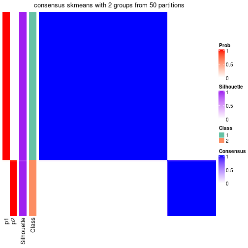</p>

</div>
<div id='tab-node-02-consensus-heatmap-2'>
<pre><code class="r">consensus_heatmap(res, k = 3)
</code></pre>

<p></p>

</div>
<div id='tab-node-02-consensus-heatmap-3'>
<pre><code class="r">consensus_heatmap(res, k = 4)
</code></pre>

<p>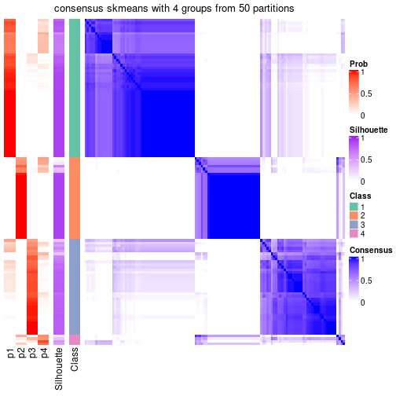</p>

</div>
</div>

Heatmaps for the membership of samples in all partitions to see how consistent they are:


<script>
$( function() {
	$( '#tabs-node-02-membership-heatmap' ).tabs();
} );
</script>
<div id='tabs-node-02-membership-heatmap'>
<ul>
<li><a href='#tab-node-02-membership-heatmap-1'>k = 2</a></li>
<li><a href='#tab-node-02-membership-heatmap-2'>k = 3</a></li>
<li><a href='#tab-node-02-membership-heatmap-3'>k = 4</a></li>
</ul>
<div id='tab-node-02-membership-heatmap-1'>
<pre><code class="r">membership_heatmap(res, k = 2)
</code></pre>

<p>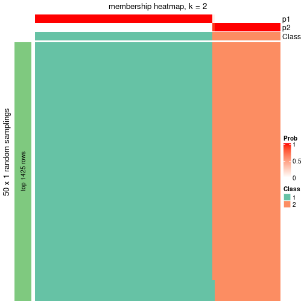</p>

</div>
<div id='tab-node-02-membership-heatmap-2'>
<pre><code class="r">membership_heatmap(res, k = 3)
</code></pre>

<p>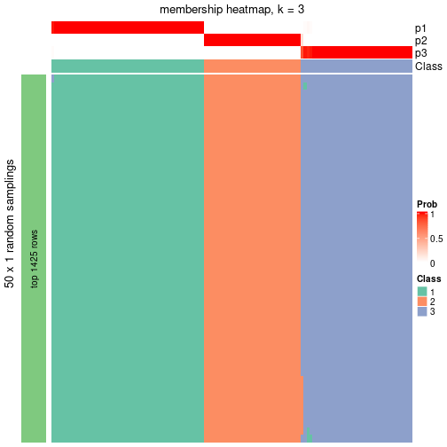</p>

</div>
<div id='tab-node-02-membership-heatmap-3'>
<pre><code class="r">membership_heatmap(res, k = 4)
</code></pre>

<p>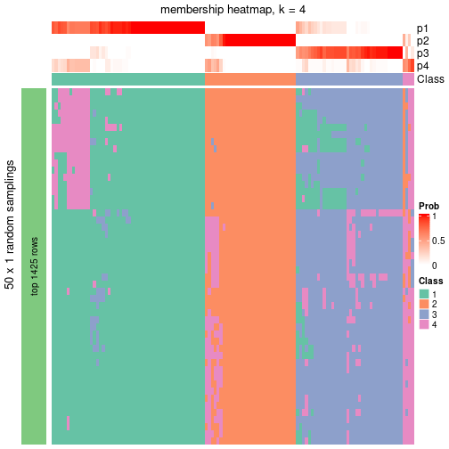</p>

</div>
</div>

As soon as the classes for columns are determined, the signatures
that are significantly different between subgroups can be looked for. 
Following are the heatmaps for signatures.


Signature heatmaps where rows are scaled:


<script>
$( function() {
	$( '#tabs-node-02-get-signatures' ).tabs();
} );
</script>
<div id='tabs-node-02-get-signatures'>
<ul>
<li><a href='#tab-node-02-get-signatures-1'>k = 2</a></li>
<li><a href='#tab-node-02-get-signatures-2'>k = 3</a></li>
<li><a href='#tab-node-02-get-signatures-3'>k = 4</a></li>
</ul>
<div id='tab-node-02-get-signatures-1'>
<pre><code class="r">get_signatures(res, k = 2)
</code></pre>

<p>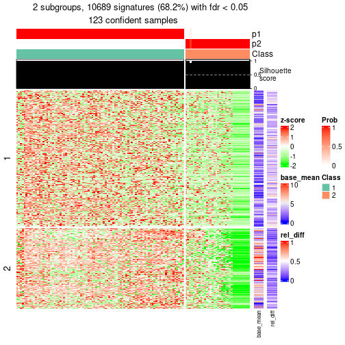</p>

</div>
<div id='tab-node-02-get-signatures-2'>
<pre><code class="r">get_signatures(res, k = 3)
</code></pre>

<p>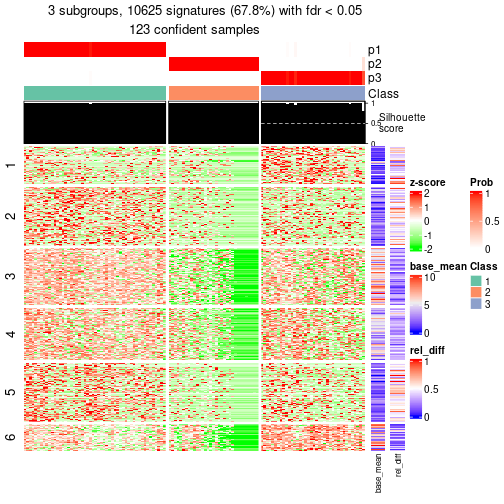</p>

</div>
<div id='tab-node-02-get-signatures-3'>
<pre><code class="r">get_signatures(res, k = 4)
</code></pre>

<p>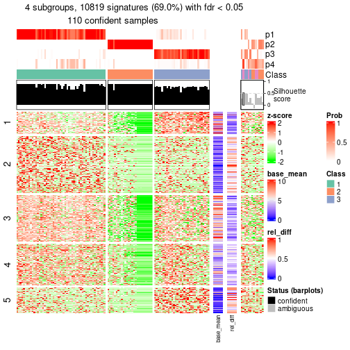</p>

</div>
</div>


Signature heatmaps where rows are not scaled:


<script>
$( function() {
	$( '#tabs-node-02-get-signatures-no-scale' ).tabs();
} );
</script>
<div id='tabs-node-02-get-signatures-no-scale'>
<ul>
<li><a href='#tab-node-02-get-signatures-no-scale-1'>k = 2</a></li>
<li><a href='#tab-node-02-get-signatures-no-scale-2'>k = 3</a></li>
<li><a href='#tab-node-02-get-signatures-no-scale-3'>k = 4</a></li>
</ul>
<div id='tab-node-02-get-signatures-no-scale-1'>
<pre><code class="r">get_signatures(res, k = 2, scale_rows = FALSE)
</code></pre>

<p>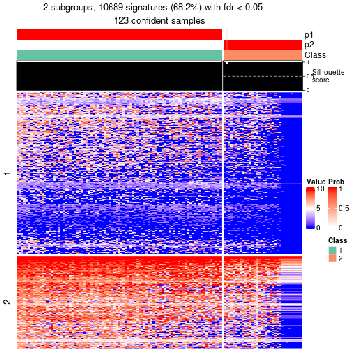</p>

</div>
<div id='tab-node-02-get-signatures-no-scale-2'>
<pre><code class="r">get_signatures(res, k = 3, scale_rows = FALSE)
</code></pre>

<p></p>

</div>
<div id='tab-node-02-get-signatures-no-scale-3'>
<pre><code class="r">get_signatures(res, k = 4, scale_rows = FALSE)
</code></pre>

<p>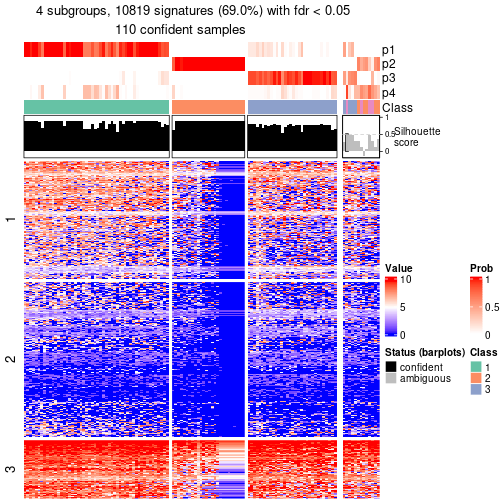</p>

</div>
</div>


Compare the overlap of signatures from different k:

```r
compare_signatures(res)
```

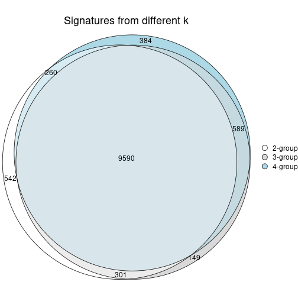

`get_signature()` returns a data frame invisibly. To get the list of signatures, the function
call should be assigned to a variable explicitly. In following code, if `plot` argument is set
to `FALSE`, no heatmap is plotted while only the differential analysis is performed.

```r
# code only for demonstration
tb = get_signature(res, k = ..., plot = FALSE)
```

An example of the output of `tb` is:

```
#>   which_row         fdr    mean_1    mean_2 scaled_mean_1 scaled_mean_2 km
#> 1        38 0.042760348  8.373488  9.131774    -0.5533452     0.5164555  1
#> 2        40 0.018707592  7.106213  8.469186    -0.6173731     0.5762149  1
#> 3        55 0.019134737 10.221463 11.207825    -0.6159697     0.5749050  1
#> 4        59 0.006059896  5.921854  7.869574    -0.6899429     0.6439467  1
#> 5        60 0.018055526  8.928898 10.211722    -0.6204761     0.5791110  1
#> 6        98 0.009384629 15.714769 14.887706     0.6635654    -0.6193277  2
...
```

The columns in `tb` are:

1. `which_row`: row indices corresponding to the input matrix.
2. `fdr`: FDR for the differential test. 
3. `mean_x`: The mean value in group x.
4. `scaled_mean_x`: The mean value in group x after rows are scaled.
5. `km`: Row groups if k-means clustering is applied to rows (which is done by automatically selecting number of clusters).

If there are too many signatures, `top_signatures = ...` can be set to only show the 
signatures with the highest FDRs:

```r
# code only for demonstration
# e.g. to show the top 500 most significant rows
tb = get_signature(res, k = ..., top_signatures = 500)
```

If the signatures are defined as these which are uniquely high in current group, `diff_method` argument
can be set to `"uniquely_high_in_one_group"`:

```r
# code only for demonstration
tb = get_signature(res, k = ..., diff_method = "uniquely_high_in_one_group")
```


UMAP plot which shows how samples are separated.


<script>
$( function() {
	$( '#tabs-node-02-dimension-reduction' ).tabs();
} );
</script>
<div id='tabs-node-02-dimension-reduction'>
<ul>
<li><a href='#tab-node-02-dimension-reduction-1'>k = 2</a></li>
<li><a href='#tab-node-02-dimension-reduction-2'>k = 3</a></li>
<li><a href='#tab-node-02-dimension-reduction-3'>k = 4</a></li>
</ul>
<div id='tab-node-02-dimension-reduction-1'>
<pre><code class="r">dimension_reduction(res, k = 2, method = &quot;UMAP&quot;)
</code></pre>

<p>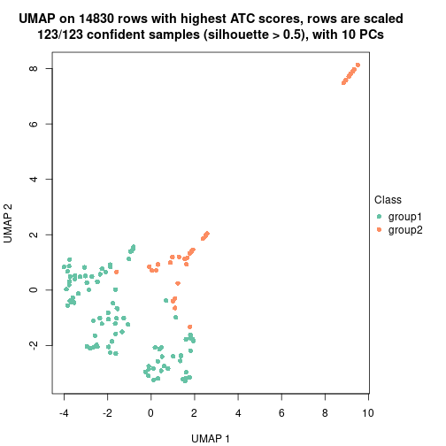</p>

</div>
<div id='tab-node-02-dimension-reduction-2'>
<pre><code class="r">dimension_reduction(res, k = 3, method = &quot;UMAP&quot;)
</code></pre>

<p>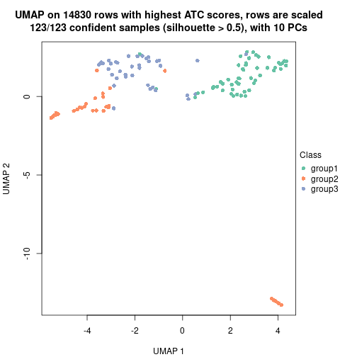</p>

</div>
<div id='tab-node-02-dimension-reduction-3'>
<pre><code class="r">dimension_reduction(res, k = 4, method = &quot;UMAP&quot;)
</code></pre>

<p>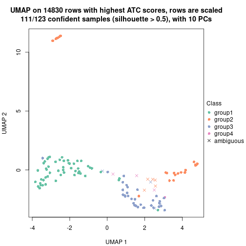</p>

</div>
</div>


Following heatmap shows how subgroups are split when increasing `k`:

```r
collect_classes(res)
```

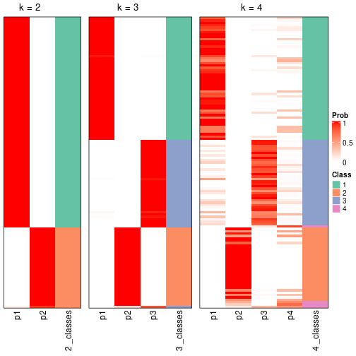


If matrix rows can be associated to genes, consider to use `functional_enrichment(res,
...)` to perform function enrichment for the signature genes. See [this vignette](https://jokergoo.github.io/cola_vignettes/functional_enrichment.html) for more detailed explanations.


 

---------------------------------------------------


### Node022


Parent node: [Node02](#Node02).
Child nodes: 
                Node0111-leaf
        ,
                Node0112-leaf
        ,
                Node0121-leaf
        ,
                Node0122-leaf
        ,
                [Node0221](#Node0221)
        ,
                Node0222-leaf
        .


The object with results only for a single top-value method and a single partitioning method 
can be extracted as:

```r
res = res_rh["022"]
```

A summary of `res` and all the functions that can be applied to it:

```r
res
```

```
#> A 'ConsensusPartition' object with k = 2, 3, 4.
#>   On a matrix with 12745 rows and 33 columns.
#>   Top rows (1135) are extracted by 'ATC' method.
#>   Subgroups are detected by 'skmeans' method.
#>   Performed in total 150 partitions by row resampling.
#>   Best k for subgroups seems to be 3.
#> 
#> Following methods can be applied to this 'ConsensusPartition' object:
#>  [1] "cola_report"             "collect_classes"         "collect_plots"          
#>  [4] "collect_stats"           "colnames"                "compare_partitions"     
#>  [7] "compare_signatures"      "consensus_heatmap"       "dimension_reduction"    
#> [10] "functional_enrichment"   "get_anno_col"            "get_anno"               
#> [13] "get_classes"             "get_consensus"           "get_matrix"             
#> [16] "get_membership"          "get_param"               "get_signatures"         
#> [19] "get_stats"               "is_best_k"               "is_stable_k"            
#> [22] "membership_heatmap"      "ncol"                    "nrow"                   
#> [25] "plot_ecdf"               "predict_classes"         "rownames"               
#> [28] "select_partition_number" "show"                    "suggest_best_k"         
#> [31] "test_to_known_factors"   "top_rows_heatmap"
```

`collect_plots()` function collects all the plots made from `res` for all `k` (number of subgroups)
into one single page to provide an easy and fast comparison between different `k`.

```r
collect_plots(res)
```

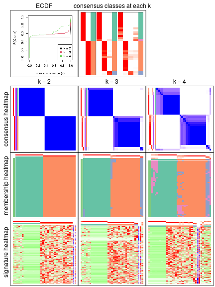

The plots are:

- The first row: a plot of the eCDF (empirical cumulative distribution
  function) curves of the consensus matrix for each `k` and the heatmap of
  predicted classes for each `k`.
- The second row: heatmaps of the consensus matrix for each `k`.
- The third row: heatmaps of the membership matrix for each `k`.
- The fouth row: heatmaps of the signatures for each `k`.

All the plots in panels can be made by individual functions and they are
plotted later in this section.

`select_partition_number()` produces several plots showing different
statistics for choosing "optimized" `k`. There are following statistics:

- eCDF curves of the consensus matrix for each `k`;
- 1-PAC. [The PAC score](https://en.wikipedia.org/wiki/Consensus_clustering#Over-interpretation_potential_of_consensus_clustering)
  measures the proportion of the ambiguous subgrouping.
- Mean silhouette score.
- Concordance. The mean probability of fiting the consensus subgroup labels in all
  partitions.
- Area increased. Denote $A_k$ as the area under the eCDF curve for current
  `k`, the area increased is defined as $A_k - A_{k-1}$.
- Rand index. The percent of pairs of samples that are both in a same cluster
  or both are not in a same cluster in the partition of k and k-1.
- Jaccard index. The ratio of pairs of samples are both in a same cluster in
  the partition of k and k-1 and the pairs of samples are both in a same
  cluster in the partition k or k-1.

The detailed explanations of these statistics can be found in [the _cola_
vignette](https://jokergoo.github.io/cola_vignettes/cola.html#toc_13).

Generally speaking, higher 1-PAC score, higher mean silhouette score or higher
concordance corresponds to better partition. Rand index and Jaccard index
measure how similar the current partition is compared to partition with `k-1`.
If they are too similar, we won't accept `k` is better than `k-1`.

```r
select_partition_number(res)
```

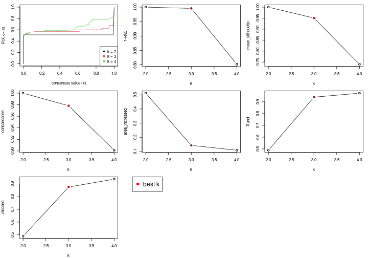

The numeric values for all these statistics can be obtained by `get_stats()`.

```r
get_stats(res)
```

```
#>   k 1-PAC mean_silhouette concordance area_increased  Rand Jaccard
#> 2 2 1.000            1.00       1.000          0.512 0.489   0.489
#> 3 3 0.996            0.95       0.978          0.143 0.939   0.876
#> 4 4 0.802            0.74       0.901          0.109 0.973   0.938
```

`suggest_best_k()` suggests the best $k$ based on these statistics. The rules are as follows:

- All $k$ with Jaccard index larger than 0.95 are removed because increasing
  $k$ does not provide enough extra information. If all $k$ are removed, it is
  marked as no subgroup is detected.
- For all $k$ with 1-PAC score larger than 0.9, the maximal $k$ is taken as
  the best $k$, and other $k$ are marked as optional $k$.
- If it does not fit the second rule. The $k$ with the maximal vote of the
  highest 1-PAC score, highest mean silhouette, and highest concordance is
  taken as the best $k$.

```r
suggest_best_k(res)
```

```
#> [1] 3
#> attr(,"optional")
#> [1] 2
```

There is also optional best $k$ = 2 that is worth to check.

Following is the table of the partitions (You need to click the **show/hide
code output** link to see it). The membership matrix (columns with name `p*`)
is inferred by
[`clue::cl_consensus()`](https://www.rdocumentation.org/link/cl_consensus?package=clue)
function with the `SE` method. Basically the value in the membership matrix
represents the probability to belong to a certain group. The finall subgroup
label for an item is determined with the group with highest probability it
belongs to.

In `get_classes()` function, the entropy is calculated from the membership
matrix and the silhouette score is calculated from the consensus matrix.


<script>
$( function() {
	$( '#tabs-node-022-get-classes' ).tabs();
} );
</script>
<div id='tabs-node-022-get-classes'>
<ul>
<li><a href='#tab-node-022-get-classes-1'>k = 2</a></li>
<li><a href='#tab-node-022-get-classes-2'>k = 3</a></li>
<li><a href='#tab-node-022-get-classes-3'>k = 4</a></li>
</ul>

<div id='tab-node-022-get-classes-1'>
<p><a id='tab-node-022-get-classes-1-a' style='color:#0366d6' href='#'>show/hide code output</a></p>
<pre><code class="r">cbind(get_classes(res, k = 2), get_membership(res, k = 2))
</code></pre>

<pre><code>#&gt;                  class entropy silhouette p1 p2
#&gt; G1_cell4_count       2       0          1  0  1
#&gt; G1_cell28_count      2       0          1  0  1
#&gt; G1_cell31_count      2       0          1  0  1
#&gt; G1_cell35_count      2       0          1  0  1
#&gt; G1_cell48_count      2       0          1  0  1
#&gt; G1_cell50_count      2       0          1  0  1
#&gt; G1_cell56_count      2       0          1  0  1
#&gt; G1_cell76_count      2       0          1  0  1
#&gt; G1_cell88_count      1       0          1  1  0
#&gt; S_cell1_count        1       0          1  1  0
#&gt; S_cell5_count        1       0          1  1  0
#&gt; S_cell18_count       1       0          1  1  0
#&gt; S_cell31_count       1       0          1  1  0
#&gt; S_cell34_count       2       0          1  0  1
#&gt; S_cell44_count       1       0          1  1  0
#&gt; S_cell58_count       1       0          1  1  0
#&gt; S_cell71_count       1       0          1  1  0
#&gt; S_cell74_count       2       0          1  0  1
#&gt; S_cell78_count       2       0          1  0  1
#&gt; S_cell81_count       1       0          1  1  0
#&gt; S_cell84_count       1       0          1  1  0
#&gt; S_cell88_count       1       0          1  1  0
#&gt; S_cell90_count       1       0          1  1  0
#&gt; S_cell94_count       1       0          1  1  0
#&gt; S_cell95_count       1       0          1  1  0
#&gt; S_cell96_count       1       0          1  1  0
#&gt; G2M_cell4_count      2       0          1  0  1
#&gt; G2M_cell22_count     2       0          1  0  1
#&gt; G2M_cell26_count     2       0          1  0  1
#&gt; G2M_cell30_count     2       0          1  0  1
#&gt; G2M_cell67_count     2       0          1  0  1
#&gt; G2M_cell77_count     2       0          1  0  1
#&gt; G2M_cell82_count     2       0          1  0  1
</code></pre>

<script>
$('#tab-node-022-get-classes-1-a').parent().next().next().hide();
$('#tab-node-022-get-classes-1-a').click(function(){
  $('#tab-node-022-get-classes-1-a').parent().next().next().toggle();
  return(false);
});
</script>
</div>

<div id='tab-node-022-get-classes-2'>
<p><a id='tab-node-022-get-classes-2-a' style='color:#0366d6' href='#'>show/hide code output</a></p>
<pre><code class="r">cbind(get_classes(res, k = 3), get_membership(res, k = 3))
</code></pre>

<pre><code>#&gt;                  class entropy silhouette   p1   p2   p3
#&gt; G1_cell4_count       3  0.0892      0.949 0.00 0.02 0.98
#&gt; G1_cell28_count      2  0.0000      0.965 0.00 1.00 0.00
#&gt; G1_cell31_count      2  0.0000      0.965 0.00 1.00 0.00
#&gt; G1_cell35_count      2  0.0000      0.965 0.00 1.00 0.00
#&gt; G1_cell48_count      2  0.0000      0.965 0.00 1.00 0.00
#&gt; G1_cell50_count      2  0.0000      0.965 0.00 1.00 0.00
#&gt; G1_cell56_count      2  0.2066      0.916 0.00 0.94 0.06
#&gt; G1_cell76_count      2  0.0000      0.965 0.00 1.00 0.00
#&gt; G1_cell88_count      1  0.0000      0.990 1.00 0.00 0.00
#&gt; S_cell1_count        1  0.0000      0.990 1.00 0.00 0.00
#&gt; S_cell5_count        1  0.0000      0.990 1.00 0.00 0.00
#&gt; S_cell18_count       1  0.0000      0.990 1.00 0.00 0.00
#&gt; S_cell31_count       1  0.0000      0.990 1.00 0.00 0.00
#&gt; S_cell34_count       2  0.2066      0.916 0.00 0.94 0.06
#&gt; S_cell44_count       1  0.0000      0.990 1.00 0.00 0.00
#&gt; S_cell58_count       1  0.0000      0.990 1.00 0.00 0.00
#&gt; S_cell71_count       1  0.0000      0.990 1.00 0.00 0.00
#&gt; S_cell74_count       2  0.6045      0.386 0.00 0.62 0.38
#&gt; S_cell78_count       3  0.2066      0.947 0.00 0.06 0.94
#&gt; S_cell81_count       1  0.0000      0.990 1.00 0.00 0.00
#&gt; S_cell84_count       1  0.0000      0.990 1.00 0.00 0.00
#&gt; S_cell88_count       1  0.0000      0.990 1.00 0.00 0.00
#&gt; S_cell90_count       1  0.0000      0.990 1.00 0.00 0.00
#&gt; S_cell94_count       1  0.0000      0.990 1.00 0.00 0.00
#&gt; S_cell95_count       1  0.0000      0.990 1.00 0.00 0.00
#&gt; S_cell96_count       1  0.3686      0.841 0.86 0.00 0.14
#&gt; G2M_cell4_count      2  0.0000      0.965 0.00 1.00 0.00
#&gt; G2M_cell22_count     2  0.0000      0.965 0.00 1.00 0.00
#&gt; G2M_cell26_count     2  0.0000      0.965 0.00 1.00 0.00
#&gt; G2M_cell30_count     2  0.0000      0.965 0.00 1.00 0.00
#&gt; G2M_cell67_count     2  0.0000      0.965 0.00 1.00 0.00
#&gt; G2M_cell77_count     2  0.0000      0.965 0.00 1.00 0.00
#&gt; G2M_cell82_count     2  0.0000      0.965 0.00 1.00 0.00
</code></pre>

<script>
$('#tab-node-022-get-classes-2-a').parent().next().next().hide();
$('#tab-node-022-get-classes-2-a').click(function(){
  $('#tab-node-022-get-classes-2-a').parent().next().next().toggle();
  return(false);
});
</script>
</div>

<div id='tab-node-022-get-classes-3'>
<p><a id='tab-node-022-get-classes-3-a' style='color:#0366d6' href='#'>show/hide code output</a></p>
<pre><code class="r">cbind(get_classes(res, k = 4), get_membership(res, k = 4))
</code></pre>

<pre><code>#&gt;                  class entropy silhouette   p1   p2   p3   p4
#&gt; G1_cell4_count       3  0.3606     0.7640 0.00 0.02 0.84 0.14
#&gt; G1_cell28_count      2  0.0000     0.9116 0.00 1.00 0.00 0.00
#&gt; G1_cell31_count      2  0.0000     0.9116 0.00 1.00 0.00 0.00
#&gt; G1_cell35_count      2  0.0000     0.9116 0.00 1.00 0.00 0.00
#&gt; G1_cell48_count      2  0.0000     0.9116 0.00 1.00 0.00 0.00
#&gt; G1_cell50_count      2  0.0000     0.9116 0.00 1.00 0.00 0.00
#&gt; G1_cell56_count      2  0.5383     0.7153 0.00 0.74 0.10 0.16
#&gt; G1_cell76_count      2  0.1913     0.8814 0.00 0.94 0.02 0.04
#&gt; G1_cell88_count      1  0.0000     0.8522 1.00 0.00 0.00 0.00
#&gt; S_cell1_count        1  0.0000     0.8522 1.00 0.00 0.00 0.00
#&gt; S_cell5_count        1  0.0000     0.8522 1.00 0.00 0.00 0.00
#&gt; S_cell18_count       1  0.0000     0.8522 1.00 0.00 0.00 0.00
#&gt; S_cell31_count       1  0.0000     0.8522 1.00 0.00 0.00 0.00
#&gt; S_cell34_count       2  0.6122     0.6404 0.00 0.68 0.16 0.16
#&gt; S_cell44_count       1  0.0000     0.8522 1.00 0.00 0.00 0.00
#&gt; S_cell58_count       1  0.0000     0.8522 1.00 0.00 0.00 0.00
#&gt; S_cell71_count       1  0.0000     0.8522 1.00 0.00 0.00 0.00
#&gt; S_cell74_count       2  0.7028     0.4029 0.00 0.56 0.28 0.16
#&gt; S_cell78_count       3  0.3247     0.7694 0.00 0.06 0.88 0.06
#&gt; S_cell81_count       1  0.4277     0.4850 0.72 0.00 0.00 0.28
#&gt; S_cell84_count       1  0.0000     0.8522 1.00 0.00 0.00 0.00
#&gt; S_cell88_count       1  0.4277     0.4932 0.72 0.00 0.00 0.28
#&gt; S_cell90_count       1  0.4907     0.0125 0.58 0.00 0.00 0.42
#&gt; S_cell94_count       1  0.0000     0.8522 1.00 0.00 0.00 0.00
#&gt; S_cell95_count       1  0.4907    -0.0111 0.58 0.00 0.00 0.42
#&gt; S_cell96_count       4  0.3975     0.0000 0.24 0.00 0.00 0.76
#&gt; G2M_cell4_count      2  0.4949     0.7221 0.00 0.76 0.18 0.06
#&gt; G2M_cell22_count     2  0.0000     0.9116 0.00 1.00 0.00 0.00
#&gt; G2M_cell26_count     2  0.0000     0.9116 0.00 1.00 0.00 0.00
#&gt; G2M_cell30_count     2  0.0000     0.9116 0.00 1.00 0.00 0.00
#&gt; G2M_cell67_count     2  0.0000     0.9116 0.00 1.00 0.00 0.00
#&gt; G2M_cell77_count     2  0.0707     0.9027 0.00 0.98 0.00 0.02
#&gt; G2M_cell82_count     2  0.0000     0.9116 0.00 1.00 0.00 0.00
</code></pre>

<script>
$('#tab-node-022-get-classes-3-a').parent().next().next().hide();
$('#tab-node-022-get-classes-3-a').click(function(){
  $('#tab-node-022-get-classes-3-a').parent().next().next().toggle();
  return(false);
});
</script>
</div>
</div>

Heatmaps for the consensus matrix. It visualizes the probability of two
samples to be in a same group.


<script>
$( function() {
	$( '#tabs-node-022-consensus-heatmap' ).tabs();
} );
</script>
<div id='tabs-node-022-consensus-heatmap'>
<ul>
<li><a href='#tab-node-022-consensus-heatmap-1'>k = 2</a></li>
<li><a href='#tab-node-022-consensus-heatmap-2'>k = 3</a></li>
<li><a href='#tab-node-022-consensus-heatmap-3'>k = 4</a></li>
</ul>
<div id='tab-node-022-consensus-heatmap-1'>
<pre><code class="r">consensus_heatmap(res, k = 2)
</code></pre>

<p></p>

</div>
<div id='tab-node-022-consensus-heatmap-2'>
<pre><code class="r">consensus_heatmap(res, k = 3)
</code></pre>

<p>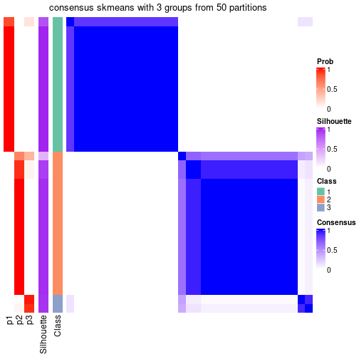</p>

</div>
<div id='tab-node-022-consensus-heatmap-3'>
<pre><code class="r">consensus_heatmap(res, k = 4)
</code></pre>

<p>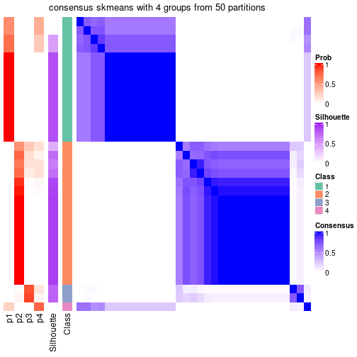</p>

</div>
</div>

Heatmaps for the membership of samples in all partitions to see how consistent they are:


<script>
$( function() {
	$( '#tabs-node-022-membership-heatmap' ).tabs();
} );
</script>
<div id='tabs-node-022-membership-heatmap'>
<ul>
<li><a href='#tab-node-022-membership-heatmap-1'>k = 2</a></li>
<li><a href='#tab-node-022-membership-heatmap-2'>k = 3</a></li>
<li><a href='#tab-node-022-membership-heatmap-3'>k = 4</a></li>
</ul>
<div id='tab-node-022-membership-heatmap-1'>
<pre><code class="r">membership_heatmap(res, k = 2)
</code></pre>

<p></p>

</div>
<div id='tab-node-022-membership-heatmap-2'>
<pre><code class="r">membership_heatmap(res, k = 3)
</code></pre>

<p>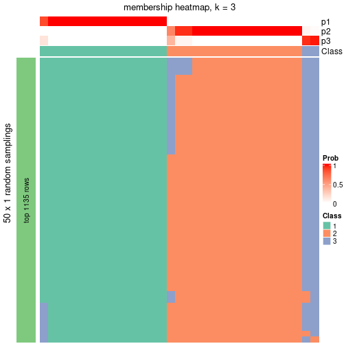</p>

</div>
<div id='tab-node-022-membership-heatmap-3'>
<pre><code class="r">membership_heatmap(res, k = 4)
</code></pre>

<p>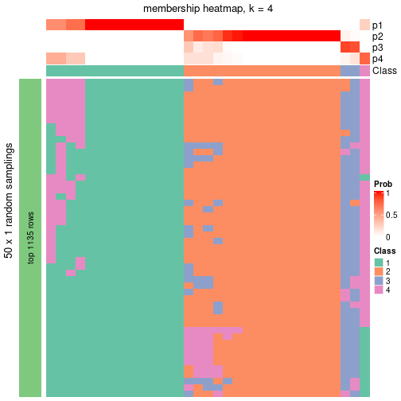</p>

</div>
</div>

As soon as the classes for columns are determined, the signatures
that are significantly different between subgroups can be looked for. 
Following are the heatmaps for signatures.


Signature heatmaps where rows are scaled:


<script>
$( function() {
	$( '#tabs-node-022-get-signatures' ).tabs();
} );
</script>
<div id='tabs-node-022-get-signatures'>
<ul>
<li><a href='#tab-node-022-get-signatures-1'>k = 2</a></li>
<li><a href='#tab-node-022-get-signatures-2'>k = 3</a></li>
<li><a href='#tab-node-022-get-signatures-3'>k = 4</a></li>
</ul>
<div id='tab-node-022-get-signatures-1'>
<pre><code class="r">get_signatures(res, k = 2)
</code></pre>

<p>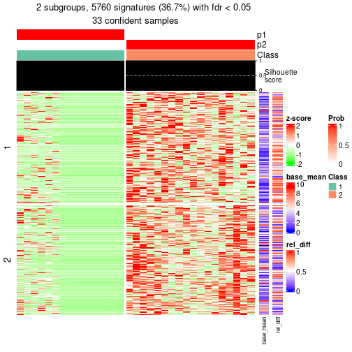</p>

</div>
<div id='tab-node-022-get-signatures-2'>
<pre><code class="r">get_signatures(res, k = 3)
</code></pre>

<p></p>

</div>
<div id='tab-node-022-get-signatures-3'>
<pre><code class="r">get_signatures(res, k = 4)
</code></pre>

<p>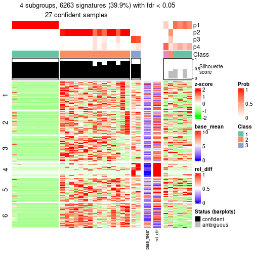</p>

</div>
</div>


Signature heatmaps where rows are not scaled:


<script>
$( function() {
	$( '#tabs-node-022-get-signatures-no-scale' ).tabs();
} );
</script>
<div id='tabs-node-022-get-signatures-no-scale'>
<ul>
<li><a href='#tab-node-022-get-signatures-no-scale-1'>k = 2</a></li>
<li><a href='#tab-node-022-get-signatures-no-scale-2'>k = 3</a></li>
<li><a href='#tab-node-022-get-signatures-no-scale-3'>k = 4</a></li>
</ul>
<div id='tab-node-022-get-signatures-no-scale-1'>
<pre><code class="r">get_signatures(res, k = 2, scale_rows = FALSE)
</code></pre>

<p></p>

</div>
<div id='tab-node-022-get-signatures-no-scale-2'>
<pre><code class="r">get_signatures(res, k = 3, scale_rows = FALSE)
</code></pre>

<p>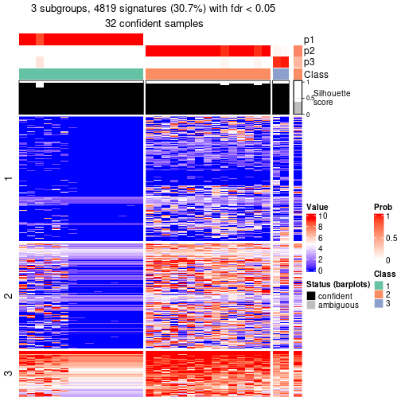</p>

</div>
<div id='tab-node-022-get-signatures-no-scale-3'>
<pre><code class="r">get_signatures(res, k = 4, scale_rows = FALSE)
</code></pre>

<p>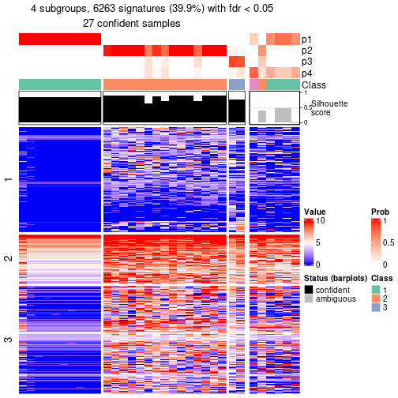</p>

</div>
</div>


Compare the overlap of signatures from different k:

```r
compare_signatures(res)
```

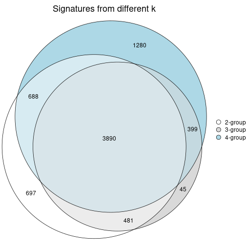

`get_signature()` returns a data frame invisibly. To get the list of signatures, the function
call should be assigned to a variable explicitly. In following code, if `plot` argument is set
to `FALSE`, no heatmap is plotted while only the differential analysis is performed.

```r
# code only for demonstration
tb = get_signature(res, k = ..., plot = FALSE)
```

An example of the output of `tb` is:

```
#>   which_row         fdr    mean_1    mean_2 scaled_mean_1 scaled_mean_2 km
#> 1        38 0.042760348  8.373488  9.131774    -0.5533452     0.5164555  1
#> 2        40 0.018707592  7.106213  8.469186    -0.6173731     0.5762149  1
#> 3        55 0.019134737 10.221463 11.207825    -0.6159697     0.5749050  1
#> 4        59 0.006059896  5.921854  7.869574    -0.6899429     0.6439467  1
#> 5        60 0.018055526  8.928898 10.211722    -0.6204761     0.5791110  1
#> 6        98 0.009384629 15.714769 14.887706     0.6635654    -0.6193277  2
...
```

The columns in `tb` are:

1. `which_row`: row indices corresponding to the input matrix.
2. `fdr`: FDR for the differential test. 
3. `mean_x`: The mean value in group x.
4. `scaled_mean_x`: The mean value in group x after rows are scaled.
5. `km`: Row groups if k-means clustering is applied to rows (which is done by automatically selecting number of clusters).

If there are too many signatures, `top_signatures = ...` can be set to only show the 
signatures with the highest FDRs:

```r
# code only for demonstration
# e.g. to show the top 500 most significant rows
tb = get_signature(res, k = ..., top_signatures = 500)
```

If the signatures are defined as these which are uniquely high in current group, `diff_method` argument
can be set to `"uniquely_high_in_one_group"`:

```r
# code only for demonstration
tb = get_signature(res, k = ..., diff_method = "uniquely_high_in_one_group")
```


UMAP plot which shows how samples are separated.


<script>
$( function() {
	$( '#tabs-node-022-dimension-reduction' ).tabs();
} );
</script>
<div id='tabs-node-022-dimension-reduction'>
<ul>
<li><a href='#tab-node-022-dimension-reduction-1'>k = 2</a></li>
<li><a href='#tab-node-022-dimension-reduction-2'>k = 3</a></li>
<li><a href='#tab-node-022-dimension-reduction-3'>k = 4</a></li>
</ul>
<div id='tab-node-022-dimension-reduction-1'>
<pre><code class="r">dimension_reduction(res, k = 2, method = &quot;UMAP&quot;)
</code></pre>

<p>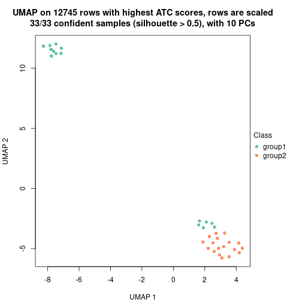</p>

</div>
<div id='tab-node-022-dimension-reduction-2'>
<pre><code class="r">dimension_reduction(res, k = 3, method = &quot;UMAP&quot;)
</code></pre>

<p>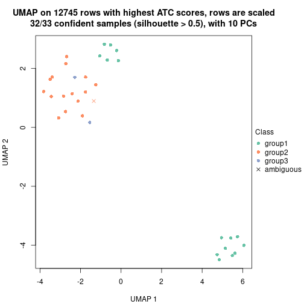</p>

</div>
<div id='tab-node-022-dimension-reduction-3'>
<pre><code class="r">dimension_reduction(res, k = 4, method = &quot;UMAP&quot;)
</code></pre>

<p>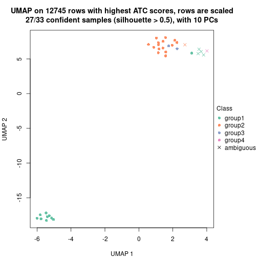</p>

</div>
</div>


Following heatmap shows how subgroups are split when increasing `k`:

```r
collect_classes(res)
```

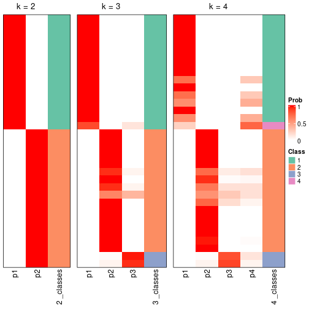


If matrix rows can be associated to genes, consider to use `functional_enrichment(res,
...)` to perform function enrichment for the signature genes. See [this vignette](https://jokergoo.github.io/cola_vignettes/functional_enrichment.html) for more detailed explanations.


 

---------------------------------------------------


### Node0221


Parent node: [Node022](#Node022).
Child nodes: 
                Node02211-leaf
        ,
                Node02212-leaf
        .


The object with results only for a single top-value method and a single partitioning method 
can be extracted as:

```r
res = res_rh["0221"]
```

A summary of `res` and all the functions that can be applied to it:

```r
res
```

```
#> A 'ConsensusPartition' object with k = 2, 3, 4.
#>   On a matrix with 8340 rows and 15 columns.
#>   Top rows (834) are extracted by 'ATC' method.
#>   Subgroups are detected by 'skmeans' method.
#>   Performed in total 150 partitions by row resampling.
#>   Best k for subgroups seems to be 2.
#> 
#> Following methods can be applied to this 'ConsensusPartition' object:
#>  [1] "cola_report"             "collect_classes"         "collect_plots"          
#>  [4] "collect_stats"           "colnames"                "compare_partitions"     
#>  [7] "compare_signatures"      "consensus_heatmap"       "dimension_reduction"    
#> [10] "functional_enrichment"   "get_anno_col"            "get_anno"               
#> [13] "get_classes"             "get_consensus"           "get_matrix"             
#> [16] "get_membership"          "get_param"               "get_signatures"         
#> [19] "get_stats"               "is_best_k"               "is_stable_k"            
#> [22] "membership_heatmap"      "ncol"                    "nrow"                   
#> [25] "plot_ecdf"               "predict_classes"         "rownames"               
#> [28] "select_partition_number" "show"                    "suggest_best_k"         
#> [31] "test_to_known_factors"   "top_rows_heatmap"
```

`collect_plots()` function collects all the plots made from `res` for all `k` (number of subgroups)
into one single page to provide an easy and fast comparison between different `k`.

```r
collect_plots(res)
```

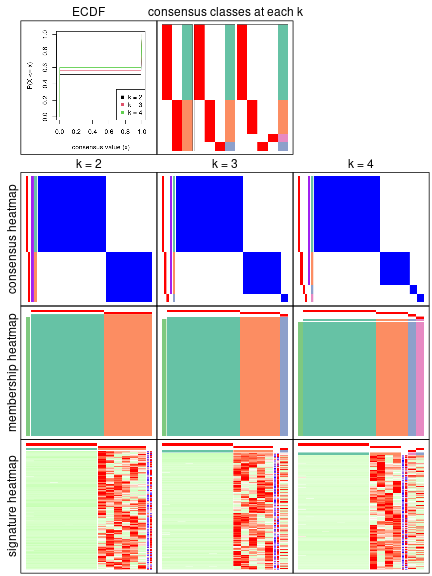

The plots are:

- The first row: a plot of the eCDF (empirical cumulative distribution
  function) curves of the consensus matrix for each `k` and the heatmap of
  predicted classes for each `k`.
- The second row: heatmaps of the consensus matrix for each `k`.
- The third row: heatmaps of the membership matrix for each `k`.
- The fouth row: heatmaps of the signatures for each `k`.

All the plots in panels can be made by individual functions and they are
plotted later in this section.

`select_partition_number()` produces several plots showing different
statistics for choosing "optimized" `k`. There are following statistics:

- eCDF curves of the consensus matrix for each `k`;
- 1-PAC. [The PAC score](https://en.wikipedia.org/wiki/Consensus_clustering#Over-interpretation_potential_of_consensus_clustering)
  measures the proportion of the ambiguous subgrouping.
- Mean silhouette score.
- Concordance. The mean probability of fiting the consensus subgroup labels in all
  partitions.
- Area increased. Denote $A_k$ as the area under the eCDF curve for current
  `k`, the area increased is defined as $A_k - A_{k-1}$.
- Rand index. The percent of pairs of samples that are both in a same cluster
  or both are not in a same cluster in the partition of k and k-1.
- Jaccard index. The ratio of pairs of samples are both in a same cluster in
  the partition of k and k-1 and the pairs of samples are both in a same
  cluster in the partition k or k-1.

The detailed explanations of these statistics can be found in [the _cola_
vignette](https://jokergoo.github.io/cola_vignettes/cola.html#toc_13).

Generally speaking, higher 1-PAC score, higher mean silhouette score or higher
concordance corresponds to better partition. Rand index and Jaccard index
measure how similar the current partition is compared to partition with `k-1`.
If they are too similar, we won't accept `k` is better than `k-1`.

```r
select_partition_number(res)
```

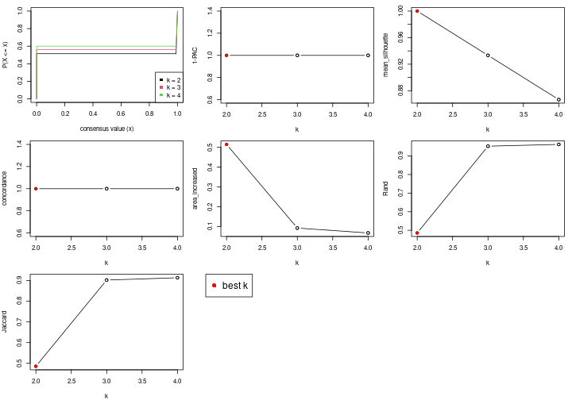

The numeric values for all these statistics can be obtained by `get_stats()`.

```r
get_stats(res)
```

```
#>   k 1-PAC mean_silhouette concordance area_increased  Rand Jaccard
#> 2 2     1           1.000           1         0.5148 0.486   0.486
#> 3 3     1           0.933           1         0.0924 0.952   0.902
#> 4 4     1           0.867           1         0.0677 0.962   0.913
```

`suggest_best_k()` suggests the best $k$ based on these statistics. The rules are as follows:

- All $k$ with Jaccard index larger than 0.95 are removed because increasing
  $k$ does not provide enough extra information. If all $k$ are removed, it is
  marked as no subgroup is detected.
- For all $k$ with 1-PAC score larger than 0.9, the maximal $k$ is taken as
  the best $k$, and other $k$ are marked as optional $k$.
- If it does not fit the second rule. The $k$ with the maximal vote of the
  highest 1-PAC score, highest mean silhouette, and highest concordance is
  taken as the best $k$.

```r
suggest_best_k(res)
```

```
#> [1] 2
```


Following is the table of the partitions (You need to click the **show/hide
code output** link to see it). The membership matrix (columns with name `p*`)
is inferred by
[`clue::cl_consensus()`](https://www.rdocumentation.org/link/cl_consensus?package=clue)
function with the `SE` method. Basically the value in the membership matrix
represents the probability to belong to a certain group. The finall subgroup
label for an item is determined with the group with highest probability it
belongs to.

In `get_classes()` function, the entropy is calculated from the membership
matrix and the silhouette score is calculated from the consensus matrix.


<script>
$( function() {
	$( '#tabs-node-0221-get-classes' ).tabs();
} );
</script>
<div id='tabs-node-0221-get-classes'>
<ul>
<li><a href='#tab-node-0221-get-classes-1'>k = 2</a></li>
<li><a href='#tab-node-0221-get-classes-2'>k = 3</a></li>
<li><a href='#tab-node-0221-get-classes-3'>k = 4</a></li>
</ul>

<div id='tab-node-0221-get-classes-1'>
<p><a id='tab-node-0221-get-classes-1-a' style='color:#0366d6' href='#'>show/hide code output</a></p>
<pre><code class="r">cbind(get_classes(res, k = 2), get_membership(res, k = 2))
</code></pre>

<pre><code>#&gt;                 class entropy silhouette p1 p2
#&gt; G1_cell88_count     1       0          1  1  0
#&gt; S_cell1_count       1       0          1  1  0
#&gt; S_cell5_count       1       0          1  1  0
#&gt; S_cell18_count      1       0          1  1  0
#&gt; S_cell31_count      1       0          1  1  0
#&gt; S_cell44_count      1       0          1  1  0
#&gt; S_cell58_count      1       0          1  1  0
#&gt; S_cell71_count      1       0          1  1  0
#&gt; S_cell81_count      2       0          1  0  1
#&gt; S_cell84_count      1       0          1  1  0
#&gt; S_cell88_count      2       0          1  0  1
#&gt; S_cell90_count      2       0          1  0  1
#&gt; S_cell94_count      2       0          1  0  1
#&gt; S_cell95_count      2       0          1  0  1
#&gt; S_cell96_count      2       0          1  0  1
</code></pre>

<script>
$('#tab-node-0221-get-classes-1-a').parent().next().next().hide();
$('#tab-node-0221-get-classes-1-a').click(function(){
  $('#tab-node-0221-get-classes-1-a').parent().next().next().toggle();
  return(false);
});
</script>
</div>

<div id='tab-node-0221-get-classes-2'>
<p><a id='tab-node-0221-get-classes-2-a' style='color:#0366d6' href='#'>show/hide code output</a></p>
<pre><code class="r">cbind(get_classes(res, k = 3), get_membership(res, k = 3))
</code></pre>

<pre><code>#&gt;                 class entropy silhouette p1 p2 p3
#&gt; G1_cell88_count     1       0          1  1  0  0
#&gt; S_cell1_count       1       0          1  1  0  0
#&gt; S_cell5_count       1       0          1  1  0  0
#&gt; S_cell18_count      1       0          1  1  0  0
#&gt; S_cell31_count      1       0          1  1  0  0
#&gt; S_cell44_count      1       0          1  1  0  0
#&gt; S_cell58_count      1       0          1  1  0  0
#&gt; S_cell71_count      1       0          1  1  0  0
#&gt; S_cell81_count      2       0          1  0  1  0
#&gt; S_cell84_count      1       0          1  1  0  0
#&gt; S_cell88_count      2       0          1  0  1  0
#&gt; S_cell90_count      2       0          1  0  1  0
#&gt; S_cell94_count      3       0          0  0  0  1
#&gt; S_cell95_count      2       0          1  0  1  0
#&gt; S_cell96_count      2       0          1  0  1  0
</code></pre>

<script>
$('#tab-node-0221-get-classes-2-a').parent().next().next().hide();
$('#tab-node-0221-get-classes-2-a').click(function(){
  $('#tab-node-0221-get-classes-2-a').parent().next().next().toggle();
  return(false);
});
</script>
</div>

<div id='tab-node-0221-get-classes-3'>
<p><a id='tab-node-0221-get-classes-3-a' style='color:#0366d6' href='#'>show/hide code output</a></p>
<pre><code class="r">cbind(get_classes(res, k = 4), get_membership(res, k = 4))
</code></pre>

<pre><code>#&gt;                 class entropy silhouette p1 p2 p3 p4
#&gt; G1_cell88_count     1       0          1  1  0  0  0
#&gt; S_cell1_count       1       0          1  1  0  0  0
#&gt; S_cell5_count       1       0          1  1  0  0  0
#&gt; S_cell18_count      1       0          1  1  0  0  0
#&gt; S_cell31_count      1       0          1  1  0  0  0
#&gt; S_cell44_count      1       0          1  1  0  0  0
#&gt; S_cell58_count      1       0          1  1  0  0  0
#&gt; S_cell71_count      1       0          1  1  0  0  0
#&gt; S_cell81_count      4       0          0  0  0  0  1
#&gt; S_cell84_count      1       0          1  1  0  0  0
#&gt; S_cell88_count      2       0          1  0  1  0  0
#&gt; S_cell90_count      2       0          1  0  1  0  0
#&gt; S_cell94_count      3       0          0  0  0  1  0
#&gt; S_cell95_count      2       0          1  0  1  0  0
#&gt; S_cell96_count      2       0          1  0  1  0  0
</code></pre>

<script>
$('#tab-node-0221-get-classes-3-a').parent().next().next().hide();
$('#tab-node-0221-get-classes-3-a').click(function(){
  $('#tab-node-0221-get-classes-3-a').parent().next().next().toggle();
  return(false);
});
</script>
</div>
</div>

Heatmaps for the consensus matrix. It visualizes the probability of two
samples to be in a same group.


<script>
$( function() {
	$( '#tabs-node-0221-consensus-heatmap' ).tabs();
} );
</script>
<div id='tabs-node-0221-consensus-heatmap'>
<ul>
<li><a href='#tab-node-0221-consensus-heatmap-1'>k = 2</a></li>
<li><a href='#tab-node-0221-consensus-heatmap-2'>k = 3</a></li>
<li><a href='#tab-node-0221-consensus-heatmap-3'>k = 4</a></li>
</ul>
<div id='tab-node-0221-consensus-heatmap-1'>
<pre><code class="r">consensus_heatmap(res, k = 2)
</code></pre>

<p></p>

</div>
<div id='tab-node-0221-consensus-heatmap-2'>
<pre><code class="r">consensus_heatmap(res, k = 3)
</code></pre>

<p>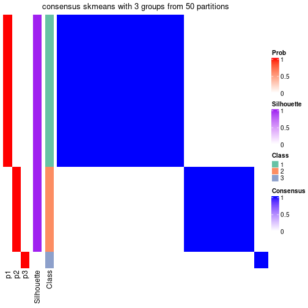</p>

</div>
<div id='tab-node-0221-consensus-heatmap-3'>
<pre><code class="r">consensus_heatmap(res, k = 4)
</code></pre>

<p>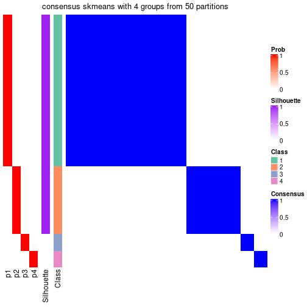</p>

</div>
</div>

Heatmaps for the membership of samples in all partitions to see how consistent they are:


<script>
$( function() {
	$( '#tabs-node-0221-membership-heatmap' ).tabs();
} );
</script>
<div id='tabs-node-0221-membership-heatmap'>
<ul>
<li><a href='#tab-node-0221-membership-heatmap-1'>k = 2</a></li>
<li><a href='#tab-node-0221-membership-heatmap-2'>k = 3</a></li>
<li><a href='#tab-node-0221-membership-heatmap-3'>k = 4</a></li>
</ul>
<div id='tab-node-0221-membership-heatmap-1'>
<pre><code class="r">membership_heatmap(res, k = 2)
</code></pre>

<p></p>

</div>
<div id='tab-node-0221-membership-heatmap-2'>
<pre><code class="r">membership_heatmap(res, k = 3)
</code></pre>

<p>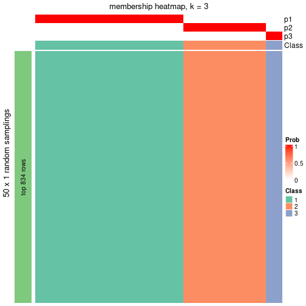</p>

</div>
<div id='tab-node-0221-membership-heatmap-3'>
<pre><code class="r">membership_heatmap(res, k = 4)
</code></pre>

<p>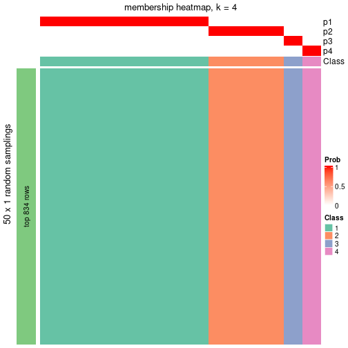</p>

</div>
</div>

As soon as the classes for columns are determined, the signatures
that are significantly different between subgroups can be looked for. 
Following are the heatmaps for signatures.


Signature heatmaps where rows are scaled:


<script>
$( function() {
	$( '#tabs-node-0221-get-signatures' ).tabs();
} );
</script>
<div id='tabs-node-0221-get-signatures'>
<ul>
<li><a href='#tab-node-0221-get-signatures-1'>k = 2</a></li>
<li><a href='#tab-node-0221-get-signatures-2'>k = 3</a></li>
<li><a href='#tab-node-0221-get-signatures-3'>k = 4</a></li>
</ul>
<div id='tab-node-0221-get-signatures-1'>
<pre><code class="r">get_signatures(res, k = 2)
</code></pre>

<p>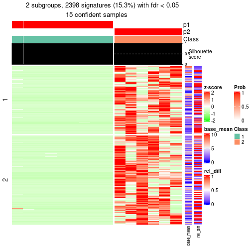</p>

</div>
<div id='tab-node-0221-get-signatures-2'>
<pre><code class="r">get_signatures(res, k = 3)
</code></pre>

<p>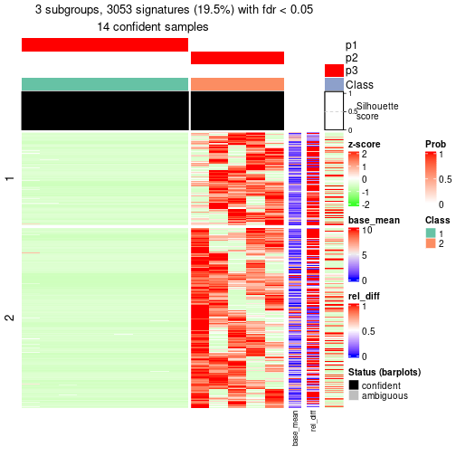</p>

</div>
<div id='tab-node-0221-get-signatures-3'>
<pre><code class="r">get_signatures(res, k = 4)
</code></pre>

<p>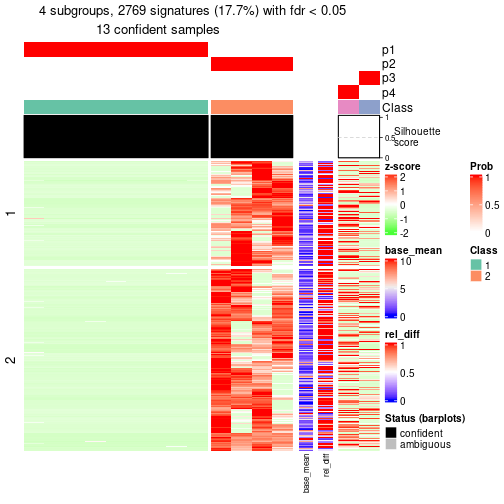</p>

</div>
</div>


Signature heatmaps where rows are not scaled:


<script>
$( function() {
	$( '#tabs-node-0221-get-signatures-no-scale' ).tabs();
} );
</script>
<div id='tabs-node-0221-get-signatures-no-scale'>
<ul>
<li><a href='#tab-node-0221-get-signatures-no-scale-1'>k = 2</a></li>
<li><a href='#tab-node-0221-get-signatures-no-scale-2'>k = 3</a></li>
<li><a href='#tab-node-0221-get-signatures-no-scale-3'>k = 4</a></li>
</ul>
<div id='tab-node-0221-get-signatures-no-scale-1'>
<pre><code class="r">get_signatures(res, k = 2, scale_rows = FALSE)
</code></pre>

<p>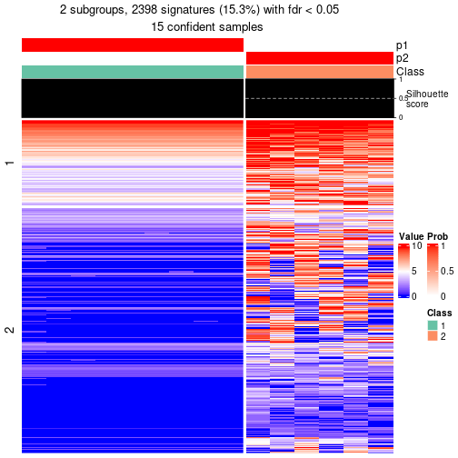</p>

</div>
<div id='tab-node-0221-get-signatures-no-scale-2'>
<pre><code class="r">get_signatures(res, k = 3, scale_rows = FALSE)
</code></pre>

<p>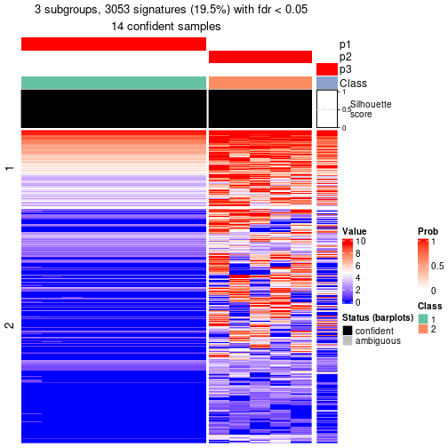</p>

</div>
<div id='tab-node-0221-get-signatures-no-scale-3'>
<pre><code class="r">get_signatures(res, k = 4, scale_rows = FALSE)
</code></pre>

<p>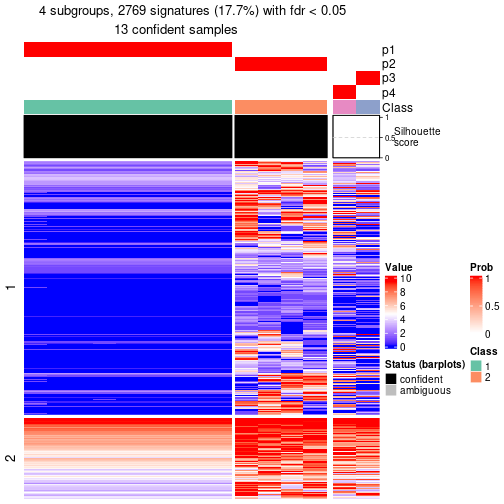</p>

</div>
</div>


Compare the overlap of signatures from different k:

```r
compare_signatures(res)
```

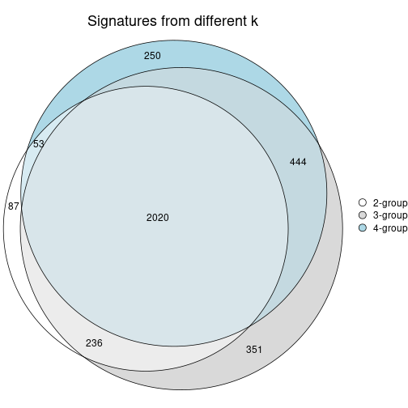

`get_signature()` returns a data frame invisibly. To get the list of signatures, the function
call should be assigned to a variable explicitly. In following code, if `plot` argument is set
to `FALSE`, no heatmap is plotted while only the differential analysis is performed.

```r
# code only for demonstration
tb = get_signature(res, k = ..., plot = FALSE)
```

An example of the output of `tb` is:

```
#>   which_row         fdr    mean_1    mean_2 scaled_mean_1 scaled_mean_2 km
#> 1        38 0.042760348  8.373488  9.131774    -0.5533452     0.5164555  1
#> 2        40 0.018707592  7.106213  8.469186    -0.6173731     0.5762149  1
#> 3        55 0.019134737 10.221463 11.207825    -0.6159697     0.5749050  1
#> 4        59 0.006059896  5.921854  7.869574    -0.6899429     0.6439467  1
#> 5        60 0.018055526  8.928898 10.211722    -0.6204761     0.5791110  1
#> 6        98 0.009384629 15.714769 14.887706     0.6635654    -0.6193277  2
...
```

The columns in `tb` are:

1. `which_row`: row indices corresponding to the input matrix.
2. `fdr`: FDR for the differential test. 
3. `mean_x`: The mean value in group x.
4. `scaled_mean_x`: The mean value in group x after rows are scaled.
5. `km`: Row groups if k-means clustering is applied to rows (which is done by automatically selecting number of clusters).

If there are too many signatures, `top_signatures = ...` can be set to only show the 
signatures with the highest FDRs:

```r
# code only for demonstration
# e.g. to show the top 500 most significant rows
tb = get_signature(res, k = ..., top_signatures = 500)
```

If the signatures are defined as these which are uniquely high in current group, `diff_method` argument
can be set to `"uniquely_high_in_one_group"`:

```r
# code only for demonstration
tb = get_signature(res, k = ..., diff_method = "uniquely_high_in_one_group")
```


UMAP plot which shows how samples are separated.


<script>
$( function() {
	$( '#tabs-node-0221-dimension-reduction' ).tabs();
} );
</script>
<div id='tabs-node-0221-dimension-reduction'>
<ul>
<li><a href='#tab-node-0221-dimension-reduction-1'>k = 2</a></li>
<li><a href='#tab-node-0221-dimension-reduction-2'>k = 3</a></li>
<li><a href='#tab-node-0221-dimension-reduction-3'>k = 4</a></li>
</ul>
<div id='tab-node-0221-dimension-reduction-1'>
<pre><code class="r">dimension_reduction(res, k = 2, method = &quot;UMAP&quot;)
</code></pre>

<p>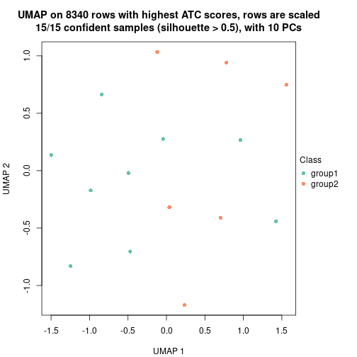</p>

</div>
<div id='tab-node-0221-dimension-reduction-2'>
<pre><code class="r">dimension_reduction(res, k = 3, method = &quot;UMAP&quot;)
</code></pre>

<p>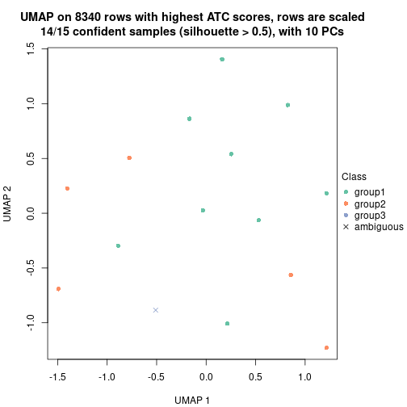</p>

</div>
<div id='tab-node-0221-dimension-reduction-3'>
<pre><code class="r">dimension_reduction(res, k = 4, method = &quot;UMAP&quot;)
</code></pre>

<p>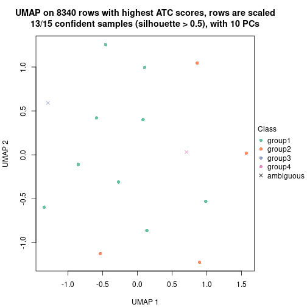</p>

</div>
</div>


Following heatmap shows how subgroups are split when increasing `k`:

```r
collect_classes(res)
```


If matrix rows can be associated to genes, consider to use `functional_enrichment(res,
...)` to perform function enrichment for the signature genes. See [this vignette](https://jokergoo.github.io/cola_vignettes/functional_enrichment.html) for more detailed explanations.


 

## Session info


```r
sessionInfo()
```

```
#> R version 4.1.0 (2021-05-18)
#> Platform: x86_64-pc-linux-gnu (64-bit)
#> Running under: CentOS Linux 7 (Core)
#> 
#> Matrix products: default
#> BLAS/LAPACK: /usr/lib64/libopenblas-r0.3.3.so
#> 
#> locale:
#>  [1] LC_CTYPE=en_US.UTF-8       LC_NUMERIC=C               LC_TIME=en_US.UTF-8       
#>  [4] LC_COLLATE=en_US.UTF-8     LC_MONETARY=en_US.UTF-8    LC_MESSAGES=en_US.UTF-8   
#>  [7] LC_PAPER=en_US.UTF-8       LC_NAME=C                  LC_ADDRESS=C              
#> [10] LC_TELEPHONE=C             LC_MEASUREMENT=en_US.UTF-8 LC_IDENTIFICATION=C       
#> 
#> attached base packages:
#>  [1] grid      parallel  stats4    stats     graphics  grDevices utils     datasets  methods  
#> [10] base     
#> 
#> other attached packages:
#>  [1] genefilter_1.74.0           ComplexHeatmap_2.8.0        markdown_1.1               
#>  [4] knitr_1.33                  scRNAseq_2.6.1              SingleCellExperiment_1.14.1
#>  [7] SummarizedExperiment_1.22.0 Biobase_2.52.0              GenomicRanges_1.44.0       
#> [10] GenomeInfoDb_1.28.1         IRanges_2.26.0              S4Vectors_0.30.0           
#> [13] BiocGenerics_0.38.0         MatrixGenerics_1.4.0        matrixStats_0.59.0         
#> [16] cola_1.9.4                 
#> 
#> loaded via a namespace (and not attached):
#>   [1] circlize_0.4.13               AnnotationHub_3.0.1           BiocFileCache_2.0.0          
#>   [4] lazyeval_0.2.2                polylabelr_0.2.0              splines_4.1.0                
#>   [7] Polychrome_1.3.1              BiocParallel_1.26.1           ggplot2_3.3.5                
#>  [10] digest_0.6.27                 foreach_1.5.1                 ensembldb_2.16.3             
#>  [13] htmltools_0.5.1.1             viridis_0.6.1                 fansi_0.5.0                  
#>  [16] magrittr_2.0.1                memoise_2.0.0                 cluster_2.1.2                
#>  [19] doParallel_1.0.16             Biostrings_2.60.1             annotate_1.70.0              
#>  [22] askpass_1.1                   prettyunits_1.1.1             colorspace_2.0-2             
#>  [25] blob_1.2.1                    rappdirs_0.3.3                xfun_0.24                    
#>  [28] dplyr_1.0.7                   crayon_1.4.1                  RCurl_1.98-1.3               
#>  [31] microbenchmark_1.4-7          jsonlite_1.7.2                impute_1.66.0                
#>  [34] brew_1.0-6                    survival_3.2-11               iterators_1.0.13             
#>  [37] glue_1.4.2                    polyclip_1.10-0               gtable_0.3.0                 
#>  [40] zlibbioc_1.38.0               XVector_0.32.0                GetoptLong_1.0.5             
#>  [43] DelayedArray_0.18.0           shape_1.4.6                   scales_1.1.1                 
#>  [46] data.tree_1.0.0               DBI_1.1.1                     Rcpp_1.0.7                   
#>  [49] viridisLite_0.4.0             xtable_1.8-4                  progress_1.2.2               
#>  [52] clue_0.3-59                   reticulate_1.20               bit_4.0.4                    
#>  [55] mclust_5.4.7                  umap_0.2.7.0                  httr_1.4.2                   
#>  [58] RColorBrewer_1.1-2            ellipsis_0.3.2                pkgconfig_2.0.3              
#>  [61] XML_3.99-0.6                  dbplyr_2.1.1                  utf8_1.2.1                   
#>  [64] tidyselect_1.1.1              rlang_0.4.11                  later_1.2.0                  
#>  [67] AnnotationDbi_1.54.1          munsell_0.5.0                 BiocVersion_3.13.1           
#>  [70] tools_4.1.0                   cachem_1.0.5                  generics_0.1.0               
#>  [73] RSQLite_2.2.7                 ExperimentHub_2.0.0           evaluate_0.14                
#>  [76] stringr_1.4.0                 fastmap_1.1.0                 yaml_2.2.1                   
#>  [79] bit64_4.0.5                   purrr_0.3.4                   dendextend_1.15.1            
#>  [82] KEGGREST_1.32.0               AnnotationFilter_1.16.0       mime_0.11                    
#>  [85] slam_0.1-48                   xml2_1.3.2                    biomaRt_2.48.2               
#>  [88] compiler_4.1.0                rstudioapi_0.13               filelock_1.0.2               
#>  [91] curl_4.3.2                    png_0.1-7                     interactiveDisplayBase_1.30.0
#>  [94] tibble_3.1.2                  stringi_1.7.3                 highr_0.9                    
#>  [97] GenomicFeatures_1.44.0        RSpectra_0.16-0               lattice_0.20-44              
#> [100] ProtGenerics_1.24.0           Matrix_1.3-4                  vctrs_0.3.8                  
#> [103] pillar_1.6.1                  lifecycle_1.0.0               BiocManager_1.30.16          
#> [106] eulerr_6.1.0                  GlobalOptions_0.1.2           bitops_1.0-7                 
#> [109] irlba_2.3.3                   httpuv_1.6.1                  rtracklayer_1.52.0           
#> [112] R6_2.5.0                      BiocIO_1.2.0                  promises_1.2.0.1             
#> [115] gridExtra_2.3                 codetools_0.2-18              assertthat_0.2.1             
#> [118] openssl_1.4.4                 rjson_0.2.20                  GenomicAlignments_1.28.0     
#> [121] Rsamtools_2.8.0               GenomeInfoDbData_1.2.6        hms_1.1.0                    
#> [124] skmeans_0.2-13                Cairo_1.5-12.2                scatterplot3d_0.3-41         
#> [127] shiny_1.6.0                   restfulr_0.0.13
```


